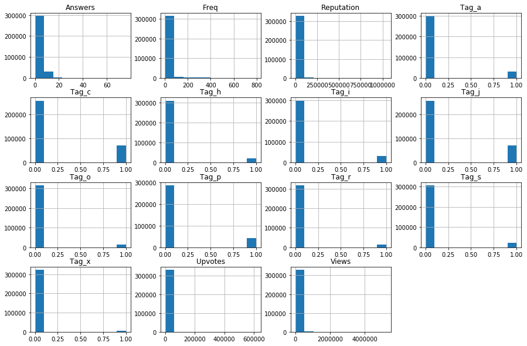
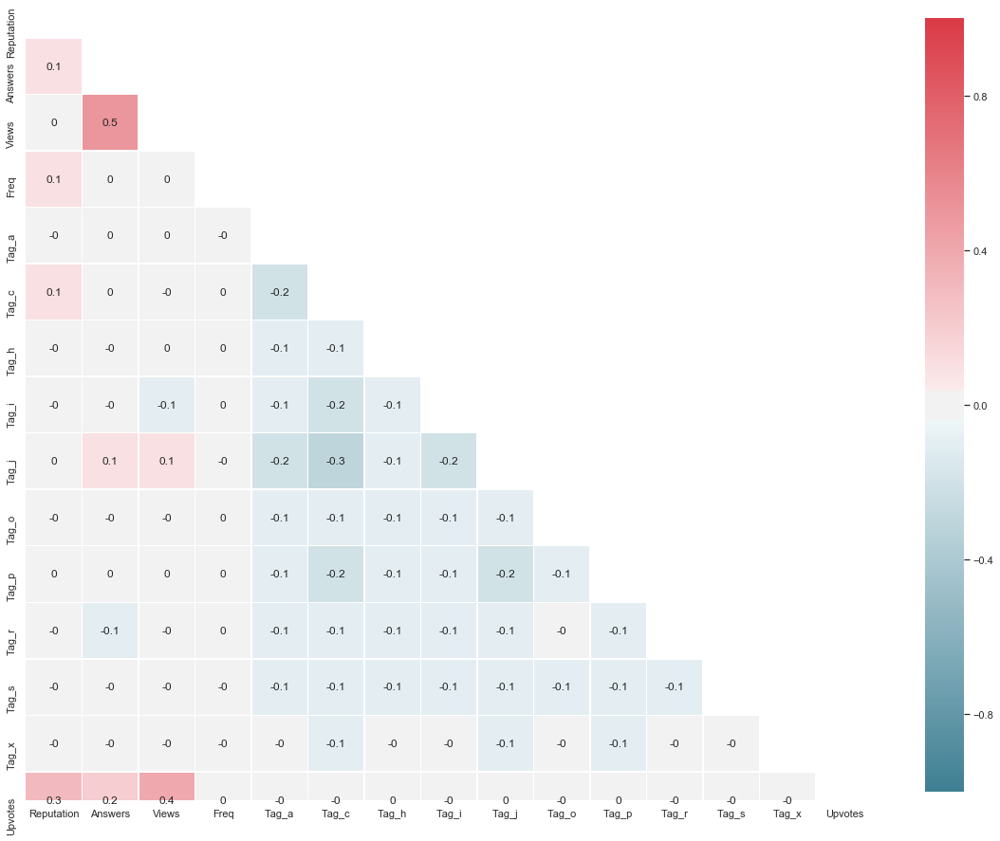
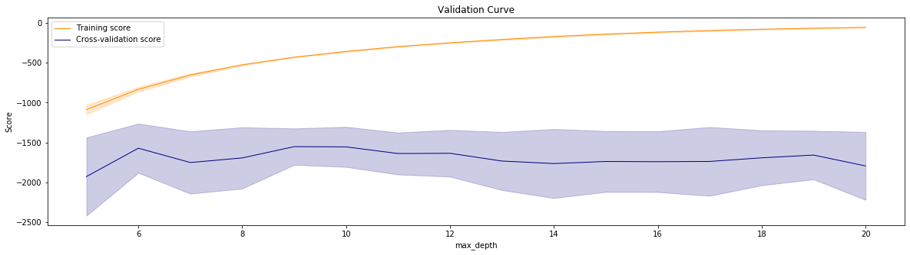
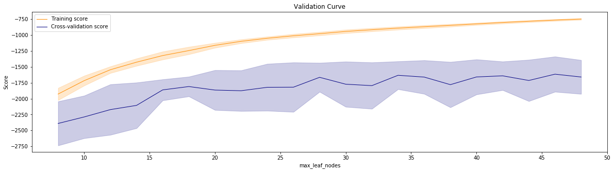
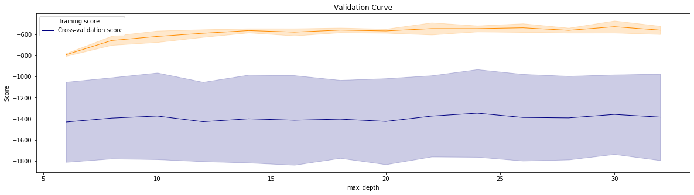
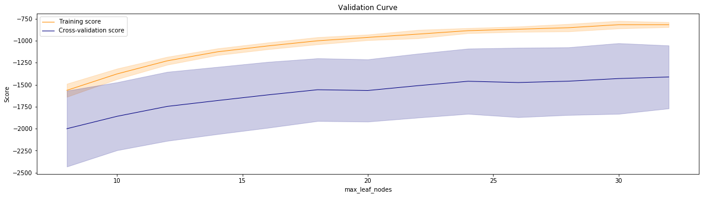
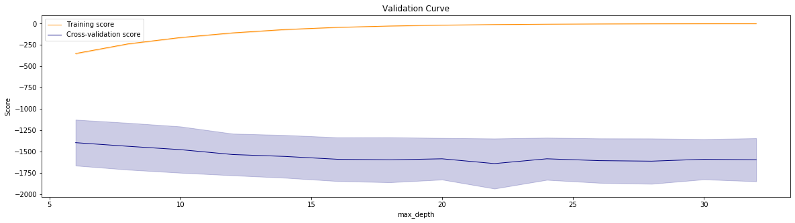
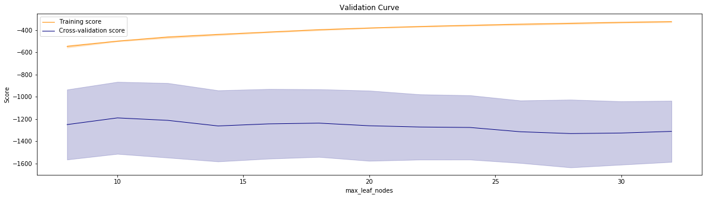
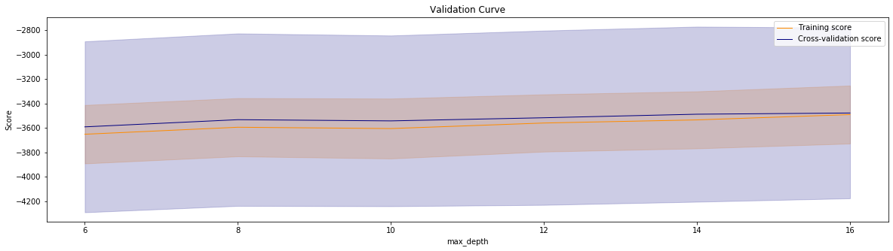

```python
# DataFrame
import pandas as pd
# Linear Algebra
import numpy as np
# Viz
import seaborn as sns
import matplotlib.pyplot as plt
# Stats
import scipy.stats as sp
# Predictive
from sklearn.preprocessing import OneHotEncoder
from sklearn.model_selection import validation_curve
from sklearn.model_selection import cross_val_score, StratifiedKFold, ShuffleSplit
# Misc
import warnings
```


```python
warnings.filterwarnings('ignore')
```

### Read Data


```python
df = pd.read_csv("train.csv")
```


```python
test = pd.read_csv("test.csv")
```

### Basic checks


```python
df.head()
```


<div>
<style scoped>
    .dataframe tbody tr th:only-of-type {
        vertical-align: middle;
    }

    .dataframe tbody tr th {
        vertical-align: top;
    }

    .dataframe thead th {
        text-align: right;
    }
</style>
<table border="1" class="dataframe">
  <thead>
    <tr style="text-align: right;">
      <th></th>
      <th>ID</th>
      <th>Tag</th>
      <th>Reputation</th>
      <th>Answers</th>
      <th>Username</th>
      <th>Views</th>
      <th>Upvotes</th>
    </tr>
  </thead>
  <tbody>
    <tr>
      <td>0</td>
      <td>52664</td>
      <td>a</td>
      <td>3942.0</td>
      <td>2.0</td>
      <td>155623</td>
      <td>7855.0</td>
      <td>42.0</td>
    </tr>
    <tr>
      <td>1</td>
      <td>327662</td>
      <td>a</td>
      <td>26046.0</td>
      <td>12.0</td>
      <td>21781</td>
      <td>55801.0</td>
      <td>1175.0</td>
    </tr>
    <tr>
      <td>2</td>
      <td>468453</td>
      <td>c</td>
      <td>1358.0</td>
      <td>4.0</td>
      <td>56177</td>
      <td>8067.0</td>
      <td>60.0</td>
    </tr>
    <tr>
      <td>3</td>
      <td>96996</td>
      <td>a</td>
      <td>264.0</td>
      <td>3.0</td>
      <td>168793</td>
      <td>27064.0</td>
      <td>9.0</td>
    </tr>
    <tr>
      <td>4</td>
      <td>131465</td>
      <td>c</td>
      <td>4271.0</td>
      <td>4.0</td>
      <td>112223</td>
      <td>13986.0</td>
      <td>83.0</td>
    </tr>
  </tbody>
</table>
</div>


```python
df.shape
```


    (330045, 7)


```python
df.describe(include="all")
```


<div>
<style scoped>
    .dataframe tbody tr th:only-of-type {
        vertical-align: middle;
    }

    .dataframe tbody tr th {
        vertical-align: top;
    }

    .dataframe thead th {
        text-align: right;
    }
</style>
<table border="1" class="dataframe">
  <thead>
    <tr style="text-align: right;">
      <th></th>
      <th>ID</th>
      <th>Tag</th>
      <th>Reputation</th>
      <th>Answers</th>
      <th>Username</th>
      <th>Views</th>
      <th>Upvotes</th>
    </tr>
  </thead>
  <tbody>
    <tr>
      <td>count</td>
      <td>330045.000000</td>
      <td>330045</td>
      <td>3.300450e+05</td>
      <td>330045.000000</td>
      <td>330045.000000</td>
      <td>3.300450e+05</td>
      <td>330045.000000</td>
    </tr>
    <tr>
      <td>unique</td>
      <td>NaN</td>
      <td>10</td>
      <td>NaN</td>
      <td>NaN</td>
      <td>NaN</td>
      <td>NaN</td>
      <td>NaN</td>
    </tr>
    <tr>
      <td>top</td>
      <td>NaN</td>
      <td>c</td>
      <td>NaN</td>
      <td>NaN</td>
      <td>NaN</td>
      <td>NaN</td>
      <td>NaN</td>
    </tr>
    <tr>
      <td>freq</td>
      <td>NaN</td>
      <td>72458</td>
      <td>NaN</td>
      <td>NaN</td>
      <td>NaN</td>
      <td>NaN</td>
      <td>NaN</td>
    </tr>
    <tr>
      <td>mean</td>
      <td>235748.682789</td>
      <td>NaN</td>
      <td>7.773147e+03</td>
      <td>3.917672</td>
      <td>81442.888803</td>
      <td>2.964507e+04</td>
      <td>337.505358</td>
    </tr>
    <tr>
      <td>std</td>
      <td>136039.418471</td>
      <td>NaN</td>
      <td>2.706141e+04</td>
      <td>3.579515</td>
      <td>49215.100730</td>
      <td>8.095646e+04</td>
      <td>3592.441135</td>
    </tr>
    <tr>
      <td>min</td>
      <td>1.000000</td>
      <td>NaN</td>
      <td>0.000000e+00</td>
      <td>0.000000</td>
      <td>0.000000</td>
      <td>9.000000e+00</td>
      <td>0.000000</td>
    </tr>
    <tr>
      <td>25%</td>
      <td>117909.000000</td>
      <td>NaN</td>
      <td>2.820000e+02</td>
      <td>2.000000</td>
      <td>39808.000000</td>
      <td>2.594000e+03</td>
      <td>8.000000</td>
    </tr>
    <tr>
      <td>50%</td>
      <td>235699.000000</td>
      <td>NaN</td>
      <td>1.236000e+03</td>
      <td>3.000000</td>
      <td>79010.000000</td>
      <td>8.954000e+03</td>
      <td>28.000000</td>
    </tr>
    <tr>
      <td>75%</td>
      <td>353620.000000</td>
      <td>NaN</td>
      <td>5.118000e+03</td>
      <td>5.000000</td>
      <td>122559.000000</td>
      <td>2.687000e+04</td>
      <td>107.000000</td>
    </tr>
    <tr>
      <td>max</td>
      <td>471493.000000</td>
      <td>NaN</td>
      <td>1.042428e+06</td>
      <td>76.000000</td>
      <td>175738.000000</td>
      <td>5.231058e+06</td>
      <td>615278.000000</td>
    </tr>
  </tbody>
</table>
</div>


Let us check for missing values


```python
df.isnull().sum()
```


    ID            0
    Tag           0
    Reputation    0
    Answers       0
    Username      0
    Views         0
    Upvotes       0
    dtype: int64


```python
df.info()
```

    <class 'pandas.core.frame.DataFrame'>
    RangeIndex: 330045 entries, 0 to 330044
    Data columns (total 7 columns):
    ID            330045 non-null int64
    Tag           330045 non-null object
    Reputation    330045 non-null float64
    Answers       330045 non-null float64
    Username      330045 non-null int64
    Views         330045 non-null float64
    Upvotes       330045 non-null float64
    dtypes: float64(4), int64(2), object(1)
    memory usage: 17.6+ MB
    


```python
df['Tag'].value_counts()
```


    c    72458
    j    72232
    p    43407
    i    32400
    a    31695
    s    23323
    h    20564
    o    14546
    r    12442
    x     6978
    Name: Tag, dtype: int64


There are no missing values in this dataset.

### Feature addition and new dataframe generation

We also break the dataset into X and Y.


```python
def username_freq(df):
    # Append the frequency of user in `new_df`
    username_df = pd.DataFrame(df['Username'].value_counts().reset_index())
    username_df.columns = ['Username', 'Freq']
    new_df = df.set_index('Username').join(username_df.set_index('Username'), how = 'left').reset_index()
    X = new_df[["Reputation","Answers","Views","Freq"]]
    try:
        Y = new_df[["Upvotes"]]
    except (UnboundLocalError, KeyError):
        Y = 0
        pass
    return new_df,X, Y
```


```python
new_df, X, y = username_freq(df)
```

### Dealing with categorical variables

OneHotEncoder cannot process string values directly. If your nominal features are strings, then you need to first map them into integers.

pandas.get_dummies is kind of the opposite. By default, it only converts string columns into one-hot representation, unless columns are specified.

However, OHE has an option to handle unknown values.

Hence, we use OneHotEncoder.


#### OHE


```python
def ohe_cat_var(new_df, X):
    ohe = OneHotEncoder(handle_unknown='ignore')
    ohe_df = pd.DataFrame(ohe.fit_transform(new_df[['Tag']]).toarray())
    ohe_df.columns = ohe.get_feature_names(['Tag']).tolist()
    # merge with main df bridge_df on key values
    X_ohe = X.join(ohe_df)
    return X_ohe
```


```python
X_ohe = ohe_cat_var(new_df, X)
```


```python
X_ohe.shape
```


    (330045, 14)


### Generate combined dataframe called new_df_1


```python
new_df_1 = X_ohe.join(y, how = "outer")
```

### Feature importance

Before proceeding with our main analysis, let us check what features are important using chisq test. We see which variable has the strongest relationship with our target variable and rank them accordingly.


```python
from sklearn.feature_selection import SelectKBest
from sklearn.feature_selection import chi2
bestfeatures = SelectKBest(score_func=chi2, k=10)
fit = bestfeatures.fit(X_ohe,y)
dfscores = pd.DataFrame(fit.scores_)
dfcolumns = pd.DataFrame(X_ohe.columns)
#concat two dataframes for better visualization 
featureScores = pd.concat([dfcolumns,dfscores],axis=1)
featureScores.columns = ['Specs','Score']  #naming the dataframe columns
print(featureScores.nlargest(10,'Score'))  #print 10 best features
```

             Specs         Score
    2        Views  5.048328e+10
    0   Reputation  1.514921e+10
    3         Freq  2.390643e+06
    1      Answers  3.428539e+05
    8        Tag_j  1.086871e+04
    6        Tag_h  8.571940e+03
    4        Tag_a  7.286273e+03
    10       Tag_p  7.219698e+03
    12       Tag_s  7.209124e+03
    5        Tag_c  7.099724e+03
    

We learn that Views, Reputation, Freq and Answers have a strong relationship with our target variable in that order. This information will be used to prioritise features for data manipulation

Looking at all distributions without a filter on Tag


```python
fig = plt.figure(figsize = (15,10))
ax = fig.gca()
hist = new_df_1.hist(ax = ax)
```





## Exploration

### Pairplot
sns.pairplot(new_df_1)
### Correlation


```python
sns.set(style="white")

# Compute the correlation matrix
corr = round(new_df_1.corr(),1)

# Generate a mask for the upper triangle
mask = np.triu(np.ones_like(corr, dtype=np.bool))

# Set up the matplotlib figure
f, ax = plt.subplots(figsize=(20, 30))

# Generate a custom diverging colormap
cmap = sns.diverging_palette(220, 10, as_cmap=True)

# Draw the heatmap with the mask and correct aspect ratio
sns.heatmap(corr, mask=mask, cmap=cmap, vmax=1,vmin=-1, center=0,
            square=True, linewidths=.5, cbar_kws={"shrink": .5}, annot=True)
```


    <matplotlib.axes._subplots.AxesSubplot at 0x2f8164628d0>





There is mild correlation in the dataset but that should not stop us from proceeding with the models.

## Models

### Functions


```python
def stratified_cross_val_results(reg, df,target , no_of_splits):
    rmse = []
    skf = StratifiedKFold(n_splits=no_of_splits, random_state=42)
    #skf.get_n_splits(df, target)
    for train_index, test_index in skf.split(df, target):
        #print("Train:", train_index, "Validation:", test_index)
        X1_train, X1_test = df.iloc[train_index], df.iloc[test_index]
        y1_train, y1_test = target.iloc[train_index], target.iloc[test_index]
        reg.fit(X1_train, y1_train)
        prediction = reg.predict(X1_test)
        score = np.sqrt(mean_squared_error(y1_test, prediction))#accuracy_score(prediction, y1_test)
        rmse.append(score)
    print("Stratified cross val Mean RMSE: ", np.mean(rmse))
    reg.fit(X_train, y_train)
    pred = reg.predict(X_test)
    print("Prediction RMSE: ", np.sqrt(mean_squared_error(y_test, pred)))
    #np.sqrt(mean_squared_error(y_test, pred))
    #return reg, np.mean(rmse)
```


```python
def validation_curve_function(fn,parameter_range,parameter_name,xlab):
    param_range = parameter_range
    train_scores, test_scores = validation_curve(
        fn, X_train, y_train, param_name=parameter_name, param_range=param_range,
        cv=4, scoring="neg_root_mean_squared_error", n_jobs=-1)
    train_scores_mean = np.mean(train_scores, axis=1)
    train_scores_std = np.std(train_scores, axis=1)
    test_scores_mean = np.mean(test_scores, axis=1)
    test_scores_std = np.std(test_scores, axis=1)
    #plt.figure(figsize=(17,9))
    plt.figure(figsize=(20,5))
    plt.title("Validation Curve")
    plt.xlabel(xlab)
    plt.ylabel("Score")
    #plt.ylim(0.4, 1.1)
    lw = 1
    plt.plot(param_range, train_scores_mean, label="Training score",
                 color="darkorange", lw=lw)
    plt.fill_between(param_range, train_scores_mean - train_scores_std,
                     train_scores_mean + train_scores_std, alpha=0.2,
                     color="darkorange", lw=lw)
    plt.plot(param_range, test_scores_mean, label="Cross-validation score",
                 color="navy", lw=lw)
    plt.fill_between(param_range, test_scores_mean - test_scores_std,
                     test_scores_mean + test_scores_std, alpha=0.2,
                     color="navy", lw=lw)
    plt.legend(loc="best")
    plt.show()
```


```python
def cross_val_score_calculation(reg, X,y,cv):
    scores =  cross_val_score(reg, X, y, cv=cv, n_jobs=-1, scoring= "neg_root_mean_squared_error")*-1
    print("Min score: ", scores.min())
    print("25th percentile: ", np.quantile(scores, 0.25))
    print("Mean score: ", scores.mean())
    print("75th percentile: ", np.quantile(scores, 0.75))
    print("Max score: ", scores.max())
```

### Determine X and y variables


```python
X = new_df_1.drop(['Upvotes'], axis=1)
```


```python
y = new_df_1["Upvotes"]
```

### Train test split

We divide the dataset in 70:30 ratio


```python
from sklearn.model_selection import train_test_split
```


```python
from sklearn.metrics import mean_squared_error
```


```python
X_train, X_test, y_train, y_test = train_test_split(X,y, train_size = 0.7,random_state = 42)
```

### Base models

#### Decision Tree


```python
from sklearn.tree import DecisionTreeRegressor
```

##### Hyperparameter estimation


```python
validation_curve_function(DecisionTreeRegressor(),list(range(5,21)),"max_depth","max_depth")
```





```python
validation_curve_function(DecisionTreeRegressor(max_depth = 12),list(range(8,50,2)),"max_leaf_nodes","max_leaf_nodes")
```





##### cross val score


```python
dtr = DecisionTreeRegressor(max_depth = 12, max_leaf_nodes=35)
```


```python
cross_val_score_calculation(dtr, X, y, cv=10)
```

    Min score:  1212.9518902564116
    25th percentile:  1234.5269952033384
    Mean score:  1601.5007472324207
    75th percentile:  1834.1410705456497
    Max score:  2579.6878000702786
    


```python
cross_val_score_calculation(dtr, X, y, cv=20)
```

    Min score:  712.3408753243086
    25th percentile:  1197.4351974659457
    Mean score:  1510.722063569337
    75th percentile:  1664.5277340441949
    Max score:  2682.957759602357
    


```python
cross_val_score_calculation(dtr, X, y, cv=30)
```

    Min score:  646.4517576126489
    25th percentile:  951.0505792440201
    Mean score:  1510.8299712301716
    75th percentile:  1714.2245460655581
    Max score:  4051.918433366182
    

##### Stratified k-fold


```python
stratified_cross_val_results(dtr, X_train, y_train, 10)
```

    Stratified cross val Mean RMSE:  1757.009754336984
    Prediction RMSE:  1527.6748850340532
    


```python
stratified_cross_val_results(dtr, X_train, y_train, 20)
```

    Stratified cross val Mean RMSE:  1687.9112521336933
    Prediction RMSE:  1565.7043056590173
    


```python
stratified_cross_val_results(dtr, X_train, y_train, 30)
```

    Stratified cross val Mean RMSE:  1530.1084124083475
    Prediction RMSE:  1565.7043056590173
    

##### Modeling


```python
dtr.fit(X_train, y_train)
pred = dtr.predict(X_test)
print("Prediction RMSE: ", np.sqrt(mean_squared_error(y_test, pred)))
```

    Prediction RMSE:  2256.4630291746007
    

### Ensemble methods

We are going to try different ensemble models and decide which model performs the best.
The models are
1. Random Forest
2. Light GBM
3. Gradient Boosting Regressor
4. XGBoost

#### Random Forest


```python
from sklearn.ensemble import RandomForestRegressor
```

##### Hyperparameter estimation


```python
validation_curve_function(RandomForestRegressor(),list(range(6,34,2)),"max_depth","max_depth")
```





```python
validation_curve_function(RandomForestRegressor(max_depth=10),list(range(8,34,2)),"max_leaf_nodes","max_leaf_nodes")
```





```python
rf = RandomForestRegressor(max_depth=10, max_leaf_nodes=22)
```

##### cross val score


```python
cross_val_score_calculation(rf, X, y, cv=10)
```

    Min score:  1080.188935530931
    25th percentile:  1203.2449501410858
    Mean score:  1430.1046554617249
    75th percentile:  1609.5099969125686
    Max score:  2196.7537708897435
    


```python
cross_val_score_calculation(rf, X, y, cv=20) #2511 max
```

    Min score:  663.2472935502562
    25th percentile:  1043.8879115883697
    Mean score:  1322.8461045701317
    75th percentile:  1541.5913718040515
    Max score:  2742.586504002012
    


```python
cross_val_score_calculation(rf, X, y, cv=30) #1156 mean/median
```

    Min score:  607.9860277601267
    25th percentile:  815.2714252659008
    Mean score:  1281.405078621515
    75th percentile:  1410.061527139581
    Max score:  3557.3905530808647
    

##### Stratified k-fold


```python
stratified_cross_val_results(rf, X_train, y_train, 10)
```

    Stratified cross val Mean RMSE:  1364.571247777451
    Prediction RMSE:  1220.665352478296
    


```python
stratified_cross_val_results(rf, X_train, y_train, 20)
```

    Stratified cross val Mean RMSE:  1295.6788701235519
    Prediction RMSE:  1201.4145659253454
    


```python
stratified_cross_val_results(rf, X_train, y_train, 30)
```

    Stratified cross val Mean RMSE:  1258.097310951358
    Prediction RMSE:  1230.722433996946
    

##### Modeling


```python
rf = RandomForestRegressor(max_depth=10, max_leaf_nodes=22, oob_score=True)
```


```python
rf.fit(X_train, y_train)
```


    RandomForestRegressor(bootstrap=True, ccp_alpha=0.0, criterion='mse',
                          max_depth=10, max_features='auto', max_leaf_nodes=22,
                          max_samples=None, min_impurity_decrease=0.0,
                          min_impurity_split=None, min_samples_leaf=1,
                          min_samples_split=2, min_weight_fraction_leaf=0.0,
                          n_estimators=100, n_jobs=None, oob_score=True,
                          random_state=None, verbose=0, warm_start=False)


```python
pred = rf.predict(X_test)
print("Prediction RMSE: ", np.sqrt(mean_squared_error(y_test, pred)))
```

    Prediction RMSE:  1210.562066788874
    
#### LightGBMfrom lightgbm import LGBMRegressorlgb = LGBMRegressor()#X_train_train, X_valid, y_train_train, y_valid = train_test_split(X_train, y_train, train_size = 0.8, random_state = 42)# lgbm_train = X_train_train.join(y_train_train, how = 'outer')# lgbm_valid =  X_valid.join(y_valid, how = 'outer')##### Using default parameterslgb.fit(X_train, y_train)pred = lgb.predict(X_test)
print("Prediction RMSE: ", np.sqrt(mean_squared_error(y_test, pred)))import lightgbm as lgbparams = {
    'boosting_type': 'gbdt',
    'objective': 'regression',
    'metric': 'rmse',
    'max_depth': 10, 
    'learning_rate': 0.1,
    'verbose': 0, 
    'early_stopping_round': 20,
    'n_estimators' : [200, 400, 500]}#n_estimators = 100
n_iters = 15
preds_buf = []
err_buf = []
for i in range(n_iters):
    X_train_train, X_valid, y_train_train, y_valid = train_test_split(X_train, y_train, train_size = 0.9, random_state = i)
    #x_train, x_valid, y_train, y_valid = train_test_split(X, y, test_size=0.10, random_state=i)
    d_train = lgb.Dataset(X_train_train, label=y_train_train)
    d_valid = lgb.Dataset(X_valid, label=y_valid)
    watchlist = [d_valid]

    model = lgb.train(params, d_train,  watchlist, verbose_eval=1)

    pred = model.predict(X_test)
    err = np.sqrt(mean_squared_error(y_test, pred))
    err_buf.append(err)
    print('RMSE = ' + str(err))
    
    pred = model.predict(X_test)
    preds_buf.append(pred)

print('Mean RMSE = ' + str(np.mean(err_buf)) + ' +/- ' + str(np.std(err_buf)))err_bufX_train_train, X_valid, y_train_train, y_valid = train_test_split(X_train, y_train, train_size = 0.9, random_state = 11)
d_train = lgb.Dataset(X_train_train, label=y_train_train)
d_valid = lgb.Dataset(X_valid, label=y_valid)watchlist = [d_valid]

model = lgb.train(params, d_train, n_estimators, watchlist, verbose_eval=1)pred = model.predict(X_test)np.sqrt(mean_squared_error(y_test, pred))
#### Gradient Boosting Regressor


```python
from sklearn.ensemble import GradientBoostingRegressor 
```

##### Hyperparameter estimation


```python
validation_curve_function(GradientBoostingRegressor(),list(range(6,34,2)),"max_depth","max_depth")
```





```python
validation_curve_function(GradientBoostingRegressor(max_depth=12),list(range(8,34,2)),"max_leaf_nodes","max_leaf_nodes")
```





```python
gbr = GradientBoostingRegressor(max_depth=12, max_leaf_nodes=12)
```

##### cross val score


```python
cross_val_score_calculation(gbr, X, y, cv=10)
```

    Min score:  827.8122043633111
    25th percentile:  1121.98182858242
    Mean score:  1190.6475021203219
    75th percentile:  1352.2699880318348
    Max score:  1473.2462636218984
    


```python
cross_val_score_calculation(gbr, X, y, cv=20)
```

    Min score:  430.5441761398115
    25th percentile:  840.5278121295528
    Mean score:  1116.8207639265988
    75th percentile:  1373.477838444866
    Max score:  2195.7552672579063
    


```python
cross_val_score_calculation(gbr, X, y, cv=30)
```

    Min score:  422.924662618468
    25th percentile:  654.7450722910226
    Mean score:  1081.7800480686385
    75th percentile:  1265.486022088334
    Max score:  2327.6956535967847
    


```python
cross_val_score_calculation(gbr, X, y, cv=40)
```

    Min score:  295.7146603670245
    25th percentile:  638.334165607519
    Mean score:  1048.7535203862408
    75th percentile:  1155.5002767169885
    Max score:  3089.12891005014
    


```python
cross_val_score_calculation(gbr, X, y, cv=50)
```

    Min score:  113.5027622575795
    25th percentile:  595.177038794851
    Mean score:  999.5341734554868
    75th percentile:  1199.9426437930165
    Max score:  3076.6036431213934
    

##### Stratified k-fold


```python
stratified_cross_val_results(gbr, X_train, y_train, 10)
```

    Stratified cross val Mean RMSE:  1224.4146018440729
    Prediction RMSE:  1165.7458325932448
    


```python
stratified_cross_val_results(gbr, X_train, y_train, 20)
```

    Stratified cross val Mean RMSE:  1067.6092366047692
    Prediction RMSE:  1168.5243545404567
    


```python
stratified_cross_val_results(gbr, X_train, y_train, 30)
```

    Stratified cross val Mean RMSE:  1069.8884921608096
    Prediction RMSE:  1153.3558193595136
    


```python
stratified_cross_val_results(gbr, X_train, y_train, 40)
```

    Stratified cross val Mean RMSE:  1092.2235412597572
    Prediction RMSE:  1168.939541098438
    


```python
stratified_cross_val_results(gbr, X_train, y_train, 50)
```

    Stratified cross val Mean RMSE:  1081.468683253745
    Prediction RMSE:  1160.9295646947842
    

##### Modeling


```python
gbr.fit(X_train, y_train)
```


```python
pred = rf.predict(X_test)
print("Prediction RMSE: ", np.sqrt(mean_squared_error(y_test, pred)))
```

    Prediction RMSE:  1210.562066788874
    
#### Stacking classifierfrom sklearn.ensemble import StackingRegressor
from sklearn.linear_model import LinearRegression
from sklearn.model_selection import RepeatedKFolddef evaluate_model(model):
	cv = RepeatedKFold(n_splits=10, n_repeats=3, random_state=1)
	scores = cross_val_score(model, X_train, y_train, scoring='neg_root_mean_squared_error', cv=cv, n_jobs=-1, error_score='raise')
	return scores# get a stacking ensemble of models
def get_stacking():
	# define the base models
	level0 = list()
	level0.append(('rf', RandomForestRegressor()))
	level0.append(('gbr', GradientBoostingRegressor()))
    #	level0.append(('lgbm', ))
	# define meta learner model
	level1 = LinearRegression()
	# define the stacking ensemble
	model = StackingRegressor(estimators=level0, final_estimator=level1, cv=5)
	return model# get a list of models to evaluate
def get_models():
	models = dict()
	models['rf'] = RandomForestRegressor()
	models['gbr'] = GradientBoostingRegressor()
    # models['svm'] = SVR()
	models['stacking'] = get_stacking()
	return modelsmodels = get_models()
results, names = list(), list()
for name, model in models.items():
	scores = evaluate_model(model)
	results.append(scores)
	names.append(name)
	print('>%s %.3f (%.3f)' % (name, np.mean(scores), np.std(scores)))
# plot model performance for comparison
plt.boxplot(results, labels=names, showmeans=True)
plt.show()
#### CatboostRegressor


```python
from catboost import CatBoostRegressor
```

##### Hyperparameter estimation


```python
validation_curve_function(CatBoostRegressor(learning_rate=0.1, loss_function = "MAPE",eval_metric="MAPE", boost_from_average = True),list(range(6,20,2)),"max_depth","max_depth")
```





```python
ctb = CatBoostRegressor(learning_rate=0.1, loss_function = "MAPE",eval_metric="MAPE", boost_from_average = True, max_depth = 8)
```

##### cross val score


```python
cross_val_score_calculation(ctb, X, y, cv=10)
```

    Min score:  2251.766953858753
    25th percentile:  2690.265217759018
    Mean score:  3431.375948841194
    75th percentile:  4197.568145301786
    Max score:  4472.551202661819
    


```python
cross_val_score_calculation(ctb, X, y, cv=20)
```

    Min score:  1164.8667935668996
    25th percentile:  2369.2070783008776
    Mean score:  3320.8706243360784
    75th percentile:  3970.5845175550403
    Max score:  5353.482261036186
    

##### Stratified k-fold


```python
stratified_cross_val_results(ctb, X_train, y_train, 10)
```

    0:	learn: 0.8523575	total: 119ms	remaining: 1m 59s
    1:	learn: 0.8351395	total: 175ms	remaining: 1m 27s
    2:	learn: 0.8197881	total: 237ms	remaining: 1m 18s
    3:	learn: 0.8052796	total: 306ms	remaining: 1m 16s
    4:	learn: 0.7861025	total: 358ms	remaining: 1m 11s
    5:	learn: 0.7802464	total: 427ms	remaining: 1m 10s
    6:	learn: 0.7681655	total: 500ms	remaining: 1m 10s
    7:	learn: 0.7574203	total: 644ms	remaining: 1m 19s
    8:	learn: 0.7436521	total: 701ms	remaining: 1m 17s
    9:	learn: 0.7391258	total: 765ms	remaining: 1m 15s
    10:	learn: 0.7329496	total: 825ms	remaining: 1m 14s
    11:	learn: 0.7277381	total: 878ms	remaining: 1m 12s
    12:	learn: 0.7253701	total: 938ms	remaining: 1m 11s
    13:	learn: 0.7207735	total: 999ms	remaining: 1m 10s
    14:	learn: 0.7171621	total: 1.06s	remaining: 1m 9s
    15:	learn: 0.7079382	total: 1.11s	remaining: 1m 8s
    16:	learn: 0.7013091	total: 1.18s	remaining: 1m 8s
    17:	learn: 0.6965237	total: 1.25s	remaining: 1m 8s
    18:	learn: 0.6937730	total: 1.31s	remaining: 1m 7s
    19:	learn: 0.6923750	total: 1.38s	remaining: 1m 7s
    20:	learn: 0.6881121	total: 1.43s	remaining: 1m 6s
    21:	learn: 0.6830636	total: 1.48s	remaining: 1m 5s
    22:	learn: 0.6796616	total: 1.54s	remaining: 1m 5s
    23:	learn: 0.6776515	total: 1.6s	remaining: 1m 5s
    24:	learn: 0.6757802	total: 1.67s	remaining: 1m 5s
    25:	learn: 0.6739044	total: 1.77s	remaining: 1m 6s
    26:	learn: 0.6718820	total: 1.83s	remaining: 1m 5s
    27:	learn: 0.6702535	total: 1.9s	remaining: 1m 5s
    28:	learn: 0.6683737	total: 1.95s	remaining: 1m 5s
    29:	learn: 0.6665894	total: 2.02s	remaining: 1m 5s
    30:	learn: 0.6656281	total: 2.09s	remaining: 1m 5s
    31:	learn: 0.6647087	total: 2.16s	remaining: 1m 5s
    32:	learn: 0.6623642	total: 2.23s	remaining: 1m 5s
    33:	learn: 0.6600042	total: 2.3s	remaining: 1m 5s
    34:	learn: 0.6586898	total: 2.37s	remaining: 1m 5s
    35:	learn: 0.6576346	total: 2.44s	remaining: 1m 5s
    36:	learn: 0.6569316	total: 2.49s	remaining: 1m 4s
    37:	learn: 0.6543240	total: 2.54s	remaining: 1m 4s
    38:	learn: 0.6539385	total: 2.61s	remaining: 1m 4s
    39:	learn: 0.6532041	total: 2.69s	remaining: 1m 4s
    40:	learn: 0.6526232	total: 2.78s	remaining: 1m 4s
    41:	learn: 0.6516261	total: 2.9s	remaining: 1m 6s
    42:	learn: 0.6509886	total: 2.99s	remaining: 1m 6s
    43:	learn: 0.6504378	total: 3.05s	remaining: 1m 6s
    44:	learn: 0.6488222	total: 3.1s	remaining: 1m 5s
    45:	learn: 0.6479747	total: 3.17s	remaining: 1m 5s
    46:	learn: 0.6462421	total: 3.24s	remaining: 1m 5s
    47:	learn: 0.6459553	total: 3.31s	remaining: 1m 5s
    48:	learn: 0.6457439	total: 3.38s	remaining: 1m 5s
    49:	learn: 0.6454435	total: 3.45s	remaining: 1m 5s
    50:	learn: 0.6449499	total: 3.5s	remaining: 1m 5s
    51:	learn: 0.6445461	total: 3.56s	remaining: 1m 4s
    52:	learn: 0.6416463	total: 3.62s	remaining: 1m 4s
    53:	learn: 0.6413742	total: 3.7s	remaining: 1m 4s
    54:	learn: 0.6409325	total: 3.76s	remaining: 1m 4s
    55:	learn: 0.6386394	total: 3.81s	remaining: 1m 4s
    56:	learn: 0.6379662	total: 3.87s	remaining: 1m 4s
    57:	learn: 0.6375675	total: 4.01s	remaining: 1m 5s
    58:	learn: 0.6354666	total: 4.07s	remaining: 1m 4s
    59:	learn: 0.6351446	total: 4.12s	remaining: 1m 4s
    60:	learn: 0.6347277	total: 4.17s	remaining: 1m 4s
    61:	learn: 0.6344090	total: 4.21s	remaining: 1m 3s
    62:	learn: 0.6341462	total: 4.27s	remaining: 1m 3s
    63:	learn: 0.6337740	total: 4.34s	remaining: 1m 3s
    64:	learn: 0.6328581	total: 4.39s	remaining: 1m 3s
    65:	learn: 0.6326192	total: 4.45s	remaining: 1m 2s
    66:	learn: 0.6323124	total: 4.52s	remaining: 1m 2s
    67:	learn: 0.6319255	total: 4.59s	remaining: 1m 2s
    68:	learn: 0.6319221	total: 4.66s	remaining: 1m 2s
    69:	learn: 0.6317228	total: 4.74s	remaining: 1m 2s
    70:	learn: 0.6312520	total: 4.8s	remaining: 1m 2s
    71:	learn: 0.6304138	total: 4.86s	remaining: 1m 2s
    72:	learn: 0.6298570	total: 4.93s	remaining: 1m 2s
    73:	learn: 0.6298020	total: 4.99s	remaining: 1m 2s
    74:	learn: 0.6271380	total: 5.17s	remaining: 1m 3s
    75:	learn: 0.6270711	total: 5.24s	remaining: 1m 3s
    76:	learn: 0.6266269	total: 5.31s	remaining: 1m 3s
    77:	learn: 0.6263458	total: 5.38s	remaining: 1m 3s
    78:	learn: 0.6243839	total: 5.43s	remaining: 1m 3s
    79:	learn: 0.6241553	total: 5.48s	remaining: 1m 3s
    80:	learn: 0.6239551	total: 5.54s	remaining: 1m 2s
    81:	learn: 0.6235812	total: 5.61s	remaining: 1m 2s
    82:	learn: 0.6234618	total: 5.66s	remaining: 1m 2s
    83:	learn: 0.6228557	total: 5.71s	remaining: 1m 2s
    84:	learn: 0.6211546	total: 5.76s	remaining: 1m 1s
    85:	learn: 0.6209031	total: 5.8s	remaining: 1m 1s
    86:	learn: 0.6206764	total: 5.86s	remaining: 1m 1s
    87:	learn: 0.6204978	total: 5.93s	remaining: 1m 1s
    88:	learn: 0.6202520	total: 6.01s	remaining: 1m 1s
    89:	learn: 0.6197714	total: 6.08s	remaining: 1m 1s
    90:	learn: 0.6194856	total: 6.14s	remaining: 1m 1s
    91:	learn: 0.6188388	total: 6.32s	remaining: 1m 2s
    92:	learn: 0.6184998	total: 6.4s	remaining: 1m 2s
    93:	learn: 0.6184858	total: 6.47s	remaining: 1m 2s
    94:	learn: 0.6183716	total: 6.58s	remaining: 1m 2s
    95:	learn: 0.6180470	total: 6.66s	remaining: 1m 2s
    96:	learn: 0.6174985	total: 6.75s	remaining: 1m 2s
    97:	learn: 0.6173130	total: 6.82s	remaining: 1m 2s
    98:	learn: 0.6172996	total: 6.89s	remaining: 1m 2s
    99:	learn: 0.6172092	total: 6.94s	remaining: 1m 2s
    100:	learn: 0.6167673	total: 7.02s	remaining: 1m 2s
    101:	learn: 0.6166579	total: 7.13s	remaining: 1m 2s
    102:	learn: 0.6164210	total: 7.21s	remaining: 1m 2s
    103:	learn: 0.6156056	total: 7.29s	remaining: 1m 2s
    104:	learn: 0.6154314	total: 7.43s	remaining: 1m 3s
    105:	learn: 0.6153118	total: 7.55s	remaining: 1m 3s
    106:	learn: 0.6119156	total: 7.63s	remaining: 1m 3s
    107:	learn: 0.6105354	total: 7.73s	remaining: 1m 3s
    108:	learn: 0.6102113	total: 7.8s	remaining: 1m 3s
    109:	learn: 0.6099347	total: 7.88s	remaining: 1m 3s
    110:	learn: 0.6096999	total: 7.95s	remaining: 1m 3s
    111:	learn: 0.6083590	total: 8.01s	remaining: 1m 3s
    112:	learn: 0.6082194	total: 8.07s	remaining: 1m 3s
    113:	learn: 0.6081036	total: 8.18s	remaining: 1m 3s
    114:	learn: 0.6078247	total: 8.24s	remaining: 1m 3s
    115:	learn: 0.6070913	total: 8.32s	remaining: 1m 3s
    116:	learn: 0.6069523	total: 8.41s	remaining: 1m 3s
    117:	learn: 0.6068565	total: 8.47s	remaining: 1m 3s
    118:	learn: 0.6067448	total: 8.58s	remaining: 1m 3s
    119:	learn: 0.6064273	total: 8.7s	remaining: 1m 3s
    120:	learn: 0.6059221	total: 8.78s	remaining: 1m 3s
    121:	learn: 0.6056966	total: 8.84s	remaining: 1m 3s
    122:	learn: 0.6054392	total: 8.91s	remaining: 1m 3s
    123:	learn: 0.6050798	total: 8.98s	remaining: 1m 3s
    124:	learn: 0.6049745	total: 9.04s	remaining: 1m 3s
    125:	learn: 0.6048032	total: 9.1s	remaining: 1m 3s
    126:	learn: 0.6046089	total: 9.17s	remaining: 1m 3s
    127:	learn: 0.6043247	total: 9.24s	remaining: 1m 2s
    128:	learn: 0.6042365	total: 9.32s	remaining: 1m 2s
    129:	learn: 0.6040185	total: 9.38s	remaining: 1m 2s
    130:	learn: 0.6037923	total: 9.43s	remaining: 1m 2s
    131:	learn: 0.6036162	total: 9.53s	remaining: 1m 2s
    132:	learn: 0.6034873	total: 9.62s	remaining: 1m 2s
    133:	learn: 0.6033160	total: 9.71s	remaining: 1m 2s
    134:	learn: 0.6031646	total: 9.83s	remaining: 1m 2s
    135:	learn: 0.6029954	total: 9.9s	remaining: 1m 2s
    136:	learn: 0.6027503	total: 9.98s	remaining: 1m 2s
    137:	learn: 0.6026867	total: 10s	remaining: 1m 2s
    138:	learn: 0.6026385	total: 10.1s	remaining: 1m 2s
    139:	learn: 0.6019356	total: 10.2s	remaining: 1m 2s
    140:	learn: 0.6016695	total: 10.2s	remaining: 1m 2s
    141:	learn: 0.6015371	total: 10.3s	remaining: 1m 2s
    142:	learn: 0.6012787	total: 10.4s	remaining: 1m 2s
    143:	learn: 0.6011053	total: 10.5s	remaining: 1m 2s
    144:	learn: 0.6007934	total: 10.6s	remaining: 1m 2s
    145:	learn: 0.6006889	total: 10.6s	remaining: 1m 2s
    146:	learn: 0.6005396	total: 10.7s	remaining: 1m 1s
    147:	learn: 0.6004026	total: 10.8s	remaining: 1m 1s
    148:	learn: 0.6002556	total: 10.8s	remaining: 1m 1s
    149:	learn: 0.5993224	total: 11s	remaining: 1m 2s
    150:	learn: 0.5991060	total: 11s	remaining: 1m 2s
    151:	learn: 0.5989282	total: 11.1s	remaining: 1m 1s
    152:	learn: 0.5987565	total: 11.2s	remaining: 1m 1s
    153:	learn: 0.5985159	total: 11.2s	remaining: 1m 1s
    154:	learn: 0.5983662	total: 11.3s	remaining: 1m 1s
    155:	learn: 0.5982322	total: 11.4s	remaining: 1m 1s
    156:	learn: 0.5977382	total: 11.5s	remaining: 1m 1s
    157:	learn: 0.5975081	total: 11.5s	remaining: 1m 1s
    158:	learn: 0.5973583	total: 11.6s	remaining: 1m 1s
    159:	learn: 0.5971660	total: 11.7s	remaining: 1m 1s
    160:	learn: 0.5968482	total: 11.8s	remaining: 1m 1s
    161:	learn: 0.5964494	total: 11.8s	remaining: 1m 1s
    162:	learn: 0.5963552	total: 11.9s	remaining: 1m 1s
    163:	learn: 0.5962246	total: 12.1s	remaining: 1m 1s
    164:	learn: 0.5961141	total: 12.2s	remaining: 1m 1s
    165:	learn: 0.5960197	total: 12.3s	remaining: 1m 1s
    166:	learn: 0.5958452	total: 12.3s	remaining: 1m 1s
    167:	learn: 0.5953549	total: 12.4s	remaining: 1m 1s
    168:	learn: 0.5952499	total: 12.5s	remaining: 1m 1s
    169:	learn: 0.5951320	total: 12.5s	remaining: 1m 1s
    170:	learn: 0.5949577	total: 12.6s	remaining: 1m 1s
    171:	learn: 0.5948205	total: 12.6s	remaining: 1m
    172:	learn: 0.5946446	total: 12.7s	remaining: 1m
    173:	learn: 0.5944862	total: 12.8s	remaining: 1m
    174:	learn: 0.5943182	total: 12.8s	remaining: 1m
    175:	learn: 0.5942534	total: 12.9s	remaining: 1m
    176:	learn: 0.5941094	total: 12.9s	remaining: 1m
    177:	learn: 0.5940148	total: 13s	remaining: 60s
    178:	learn: 0.5939442	total: 13s	remaining: 59.8s
    179:	learn: 0.5938419	total: 13.1s	remaining: 59.6s
    180:	learn: 0.5937367	total: 13.1s	remaining: 59.5s
    181:	learn: 0.5935887	total: 13.2s	remaining: 59.4s
    182:	learn: 0.5934988	total: 13.3s	remaining: 59.4s
    183:	learn: 0.5933498	total: 13.4s	remaining: 59.3s
    184:	learn: 0.5932655	total: 13.4s	remaining: 59.1s
    185:	learn: 0.5931612	total: 13.5s	remaining: 58.9s
    186:	learn: 0.5930377	total: 13.5s	remaining: 58.8s
    187:	learn: 0.5928765	total: 13.6s	remaining: 58.7s
    188:	learn: 0.5927674	total: 13.6s	remaining: 58.5s
    189:	learn: 0.5926566	total: 13.7s	remaining: 58.5s
    190:	learn: 0.5925711	total: 13.8s	remaining: 58.4s
    191:	learn: 0.5924936	total: 13.9s	remaining: 58.4s
    192:	learn: 0.5923818	total: 14s	remaining: 58.4s
    193:	learn: 0.5922350	total: 14.1s	remaining: 58.4s
    194:	learn: 0.5921506	total: 14.1s	remaining: 58.3s
    195:	learn: 0.5920556	total: 14.2s	remaining: 58.3s
    196:	learn: 0.5919131	total: 14.4s	remaining: 58.6s
    197:	learn: 0.5918632	total: 14.6s	remaining: 58.9s
    198:	learn: 0.5917792	total: 14.7s	remaining: 59s
    199:	learn: 0.5917016	total: 14.8s	remaining: 59.1s
    200:	learn: 0.5916546	total: 14.9s	remaining: 59.3s
    201:	learn: 0.5916033	total: 15.1s	remaining: 59.6s
    202:	learn: 0.5914887	total: 15.2s	remaining: 59.7s
    203:	learn: 0.5914276	total: 15.3s	remaining: 59.9s
    204:	learn: 0.5913184	total: 15.5s	remaining: 60s
    205:	learn: 0.5912504	total: 15.6s	remaining: 1m
    206:	learn: 0.5911320	total: 15.8s	remaining: 1m
    207:	learn: 0.5910153	total: 16s	remaining: 1m
    208:	learn: 0.5908507	total: 16.1s	remaining: 1m 1s
    209:	learn: 0.5906922	total: 16.2s	remaining: 1m 1s
    210:	learn: 0.5905352	total: 16.4s	remaining: 1m 1s
    211:	learn: 0.5904042	total: 16.5s	remaining: 1m 1s
    212:	learn: 0.5903265	total: 16.6s	remaining: 1m 1s
    213:	learn: 0.5903152	total: 16.8s	remaining: 1m 1s
    214:	learn: 0.5902035	total: 17s	remaining: 1m 2s
    215:	learn: 0.5900884	total: 17.2s	remaining: 1m 2s
    216:	learn: 0.5900844	total: 17.4s	remaining: 1m 2s
    217:	learn: 0.5899748	total: 17.5s	remaining: 1m 2s
    218:	learn: 0.5898733	total: 17.6s	remaining: 1m 2s
    219:	learn: 0.5897656	total: 17.7s	remaining: 1m 2s
    220:	learn: 0.5896650	total: 17.9s	remaining: 1m 3s
    221:	learn: 0.5895594	total: 18.1s	remaining: 1m 3s
    222:	learn: 0.5894619	total: 18.3s	remaining: 1m 3s
    223:	learn: 0.5893822	total: 18.5s	remaining: 1m 3s
    224:	learn: 0.5892704	total: 18.6s	remaining: 1m 4s
    225:	learn: 0.5891803	total: 18.8s	remaining: 1m 4s
    226:	learn: 0.5890914	total: 18.9s	remaining: 1m 4s
    227:	learn: 0.5890057	total: 19s	remaining: 1m 4s
    228:	learn: 0.5889210	total: 19s	remaining: 1m 4s
    229:	learn: 0.5888414	total: 19.2s	remaining: 1m 4s
    230:	learn: 0.5887559	total: 19.2s	remaining: 1m 3s
    231:	learn: 0.5887519	total: 19.4s	remaining: 1m 4s
    232:	learn: 0.5886496	total: 19.5s	remaining: 1m 4s
    233:	learn: 0.5885292	total: 19.5s	remaining: 1m 3s
    234:	learn: 0.5885140	total: 19.6s	remaining: 1m 3s
    235:	learn: 0.5884371	total: 19.7s	remaining: 1m 3s
    236:	learn: 0.5883673	total: 19.8s	remaining: 1m 3s
    237:	learn: 0.5882856	total: 19.9s	remaining: 1m 3s
    238:	learn: 0.5882707	total: 20.1s	remaining: 1m 3s
    239:	learn: 0.5882552	total: 20.2s	remaining: 1m 3s
    240:	learn: 0.5881742	total: 20.3s	remaining: 1m 3s
    241:	learn: 0.5880960	total: 20.4s	remaining: 1m 3s
    242:	learn: 0.5880148	total: 20.4s	remaining: 1m 3s
    243:	learn: 0.5879245	total: 20.6s	remaining: 1m 3s
    244:	learn: 0.5878536	total: 20.7s	remaining: 1m 3s
    245:	learn: 0.5877816	total: 20.8s	remaining: 1m 3s
    246:	learn: 0.5876852	total: 20.8s	remaining: 1m 3s
    247:	learn: 0.5876095	total: 20.9s	remaining: 1m 3s
    248:	learn: 0.5874994	total: 21s	remaining: 1m 3s
    249:	learn: 0.5873942	total: 21.1s	remaining: 1m 3s
    250:	learn: 0.5873191	total: 21.2s	remaining: 1m 3s
    251:	learn: 0.5872103	total: 21.3s	remaining: 1m 3s
    252:	learn: 0.5871021	total: 21.4s	remaining: 1m 3s
    253:	learn: 0.5870172	total: 21.5s	remaining: 1m 3s
    254:	learn: 0.5869184	total: 21.6s	remaining: 1m 3s
    255:	learn: 0.5869374	total: 21.8s	remaining: 1m 3s
    256:	learn: 0.5868500	total: 21.9s	remaining: 1m 3s
    257:	learn: 0.5867188	total: 22s	remaining: 1m 3s
    258:	learn: 0.5866244	total: 22.1s	remaining: 1m 3s
    259:	learn: 0.5865069	total: 22.2s	remaining: 1m 3s
    260:	learn: 0.5864317	total: 22.3s	remaining: 1m 3s
    261:	learn: 0.5864397	total: 22.4s	remaining: 1m 3s
    262:	learn: 0.5863657	total: 22.5s	remaining: 1m 3s
    263:	learn: 0.5862858	total: 22.6s	remaining: 1m 3s
    264:	learn: 0.5861964	total: 22.7s	remaining: 1m 3s
    265:	learn: 0.5860990	total: 22.8s	remaining: 1m 2s
    266:	learn: 0.5859939	total: 23s	remaining: 1m 3s
    267:	learn: 0.5859105	total: 23.2s	remaining: 1m 3s
    268:	learn: 0.5859134	total: 23.3s	remaining: 1m 3s
    269:	learn: 0.5858290	total: 23.3s	remaining: 1m 3s
    270:	learn: 0.5857627	total: 23.5s	remaining: 1m 3s
    271:	learn: 0.5857692	total: 23.5s	remaining: 1m 2s
    272:	learn: 0.5857088	total: 23.6s	remaining: 1m 2s
    273:	learn: 0.5856013	total: 23.7s	remaining: 1m 2s
    274:	learn: 0.5856016	total: 23.8s	remaining: 1m 2s
    275:	learn: 0.5855288	total: 23.9s	remaining: 1m 2s
    276:	learn: 0.5854455	total: 23.9s	remaining: 1m 2s
    277:	learn: 0.5853802	total: 24.1s	remaining: 1m 2s
    278:	learn: 0.5853004	total: 24.2s	remaining: 1m 2s
    279:	learn: 0.5852417	total: 24.3s	remaining: 1m 2s
    280:	learn: 0.5851822	total: 24.4s	remaining: 1m 2s
    281:	learn: 0.5851112	total: 24.6s	remaining: 1m 2s
    282:	learn: 0.5850225	total: 24.7s	remaining: 1m 2s
    283:	learn: 0.5849624	total: 24.8s	remaining: 1m 2s
    284:	learn: 0.5848820	total: 24.9s	remaining: 1m 2s
    285:	learn: 0.5848317	total: 25s	remaining: 1m 2s
    286:	learn: 0.5847883	total: 25.1s	remaining: 1m 2s
    287:	learn: 0.5847308	total: 25.3s	remaining: 1m 2s
    288:	learn: 0.5846552	total: 25.4s	remaining: 1m 2s
    289:	learn: 0.5846173	total: 25.5s	remaining: 1m 2s
    290:	learn: 0.5845447	total: 25.6s	remaining: 1m 2s
    291:	learn: 0.5845056	total: 25.7s	remaining: 1m 2s
    292:	learn: 0.5844862	total: 25.8s	remaining: 1m 2s
    293:	learn: 0.5844572	total: 25.9s	remaining: 1m 2s
    294:	learn: 0.5843944	total: 25.9s	remaining: 1m 1s
    295:	learn: 0.5843526	total: 26s	remaining: 1m 1s
    296:	learn: 0.5843016	total: 26.1s	remaining: 1m 1s
    297:	learn: 0.5842791	total: 26.2s	remaining: 1m 1s
    298:	learn: 0.5841889	total: 26.3s	remaining: 1m 1s
    299:	learn: 0.5841346	total: 26.4s	remaining: 1m 1s
    300:	learn: 0.5840685	total: 26.5s	remaining: 1m 1s
    301:	learn: 0.5840095	total: 26.6s	remaining: 1m 1s
    302:	learn: 0.5839501	total: 26.7s	remaining: 1m 1s
    303:	learn: 0.5838886	total: 26.8s	remaining: 1m 1s
    304:	learn: 0.5838292	total: 26.8s	remaining: 1m 1s
    305:	learn: 0.5837743	total: 26.9s	remaining: 1m 1s
    306:	learn: 0.5837158	total: 27s	remaining: 1m
    307:	learn: 0.5836576	total: 27.1s	remaining: 1m
    308:	learn: 0.5836057	total: 27.2s	remaining: 1m
    309:	learn: 0.5835912	total: 27.2s	remaining: 1m
    310:	learn: 0.5835165	total: 27.3s	remaining: 1m
    311:	learn: 0.5834699	total: 27.4s	remaining: 1m
    312:	learn: 0.5834807	total: 27.5s	remaining: 1m
    313:	learn: 0.5834319	total: 27.6s	remaining: 1m
    314:	learn: 0.5834001	total: 27.7s	remaining: 1m
    315:	learn: 0.5833579	total: 27.8s	remaining: 1m
    316:	learn: 0.5833128	total: 27.9s	remaining: 1m
    317:	learn: 0.5832836	total: 28s	remaining: 1m
    318:	learn: 0.5832590	total: 28.2s	remaining: 1m
    319:	learn: 0.5832367	total: 28.3s	remaining: 1m
    320:	learn: 0.5831954	total: 28.4s	remaining: 1m
    321:	learn: 0.5831718	total: 28.5s	remaining: 1m
    322:	learn: 0.5831485	total: 28.7s	remaining: 1m
    323:	learn: 0.5831294	total: 28.8s	remaining: 1m
    324:	learn: 0.5831035	total: 28.9s	remaining: 60s
    325:	learn: 0.5830766	total: 29s	remaining: 59.9s
    326:	learn: 0.5830511	total: 29.1s	remaining: 59.8s
    327:	learn: 0.5830240	total: 29.1s	remaining: 59.7s
    328:	learn: 0.5829935	total: 29.2s	remaining: 59.6s
    329:	learn: 0.5829690	total: 29.3s	remaining: 59.6s
    330:	learn: 0.5829452	total: 29.4s	remaining: 59.4s
    331:	learn: 0.5829181	total: 29.5s	remaining: 59.3s
    332:	learn: 0.5828718	total: 29.6s	remaining: 59.2s
    333:	learn: 0.5828503	total: 29.7s	remaining: 59.2s
    334:	learn: 0.5827981	total: 29.8s	remaining: 59.1s
    335:	learn: 0.5827662	total: 29.9s	remaining: 59.1s
    336:	learn: 0.5827381	total: 30s	remaining: 59.1s
    337:	learn: 0.5827060	total: 30.1s	remaining: 59s
    338:	learn: 0.5827060	total: 30.2s	remaining: 58.9s
    339:	learn: 0.5826782	total: 30.3s	remaining: 58.9s
    340:	learn: 0.5826490	total: 30.4s	remaining: 58.8s
    341:	learn: 0.5826143	total: 30.5s	remaining: 58.7s
    342:	learn: 0.5825840	total: 30.6s	remaining: 58.6s
    343:	learn: 0.5825570	total: 30.7s	remaining: 58.5s
    344:	learn: 0.5825249	total: 30.7s	remaining: 58.4s
    345:	learn: 0.5824945	total: 30.8s	remaining: 58.2s
    346:	learn: 0.5824651	total: 30.9s	remaining: 58.2s
    347:	learn: 0.5824342	total: 31s	remaining: 58.2s
    348:	learn: 0.5824058	total: 31.1s	remaining: 58.1s
    349:	learn: 0.5823787	total: 31.2s	remaining: 58s
    350:	learn: 0.5823517	total: 31.3s	remaining: 57.9s
    351:	learn: 0.5823298	total: 31.4s	remaining: 57.8s
    352:	learn: 0.5823077	total: 31.5s	remaining: 57.7s
    353:	learn: 0.5822874	total: 31.6s	remaining: 57.6s
    354:	learn: 0.5822655	total: 31.6s	remaining: 57.5s
    355:	learn: 0.5822503	total: 31.7s	remaining: 57.4s
    356:	learn: 0.5822357	total: 31.8s	remaining: 57.3s
    357:	learn: 0.5822153	total: 31.9s	remaining: 57.2s
    358:	learn: 0.5821974	total: 32s	remaining: 57.2s
    359:	learn: 0.5821848	total: 32.1s	remaining: 57.1s
    360:	learn: 0.5821691	total: 32.3s	remaining: 57.1s
    361:	learn: 0.5821536	total: 32.4s	remaining: 57.1s
    362:	learn: 0.5821365	total: 32.5s	remaining: 57s
    363:	learn: 0.5821208	total: 32.6s	remaining: 57s
    364:	learn: 0.5821042	total: 32.7s	remaining: 56.9s
    365:	learn: 0.5820853	total: 32.8s	remaining: 56.8s
    366:	learn: 0.5820656	total: 32.9s	remaining: 56.7s
    367:	learn: 0.5820453	total: 33s	remaining: 56.6s
    368:	learn: 0.5820248	total: 33.1s	remaining: 56.5s
    369:	learn: 0.5820037	total: 33.2s	remaining: 56.5s
    370:	learn: 0.5819624	total: 33.3s	remaining: 56.4s
    371:	learn: 0.5819418	total: 33.4s	remaining: 56.4s
    372:	learn: 0.5819196	total: 33.5s	remaining: 56.4s
    373:	learn: 0.5819017	total: 33.6s	remaining: 56.3s
    374:	learn: 0.5818802	total: 33.7s	remaining: 56.2s
    375:	learn: 0.5818585	total: 33.8s	remaining: 56.1s
    376:	learn: 0.5818353	total: 33.9s	remaining: 56s
    377:	learn: 0.5818122	total: 33.9s	remaining: 55.8s
    378:	learn: 0.5817941	total: 34s	remaining: 55.7s
    379:	learn: 0.5817746	total: 34.1s	remaining: 55.6s
    380:	learn: 0.5817540	total: 34.2s	remaining: 55.5s
    381:	learn: 0.5817347	total: 34.3s	remaining: 55.4s
    382:	learn: 0.5817110	total: 34.4s	remaining: 55.3s
    383:	learn: 0.5816857	total: 34.5s	remaining: 55.3s
    384:	learn: 0.5816647	total: 34.6s	remaining: 55.2s
    385:	learn: 0.5816434	total: 34.7s	remaining: 55.1s
    386:	learn: 0.5816347	total: 34.8s	remaining: 55s
    387:	learn: 0.5816066	total: 34.8s	remaining: 54.9s
    388:	learn: 0.5815850	total: 34.9s	remaining: 54.8s
    389:	learn: 0.5815661	total: 35s	remaining: 54.7s
    390:	learn: 0.5815491	total: 35.1s	remaining: 54.6s
    391:	learn: 0.5815231	total: 35.1s	remaining: 54.5s
    392:	learn: 0.5815037	total: 35.2s	remaining: 54.4s
    393:	learn: 0.5814840	total: 35.3s	remaining: 54.3s
    394:	learn: 0.5814650	total: 35.4s	remaining: 54.2s
    395:	learn: 0.5814471	total: 35.5s	remaining: 54.1s
    396:	learn: 0.5814036	total: 35.5s	remaining: 54s
    397:	learn: 0.5813879	total: 35.6s	remaining: 53.9s
    398:	learn: 0.5813689	total: 35.8s	remaining: 53.9s
    399:	learn: 0.5813479	total: 35.9s	remaining: 53.8s
    400:	learn: 0.5813279	total: 35.9s	remaining: 53.7s
    401:	learn: 0.5813064	total: 36s	remaining: 53.6s
    402:	learn: 0.5812877	total: 36.1s	remaining: 53.5s
    403:	learn: 0.5812688	total: 36.2s	remaining: 53.4s
    404:	learn: 0.5812474	total: 36.3s	remaining: 53.3s
    405:	learn: 0.5812281	total: 36.3s	remaining: 53.2s
    406:	learn: 0.5812082	total: 36.4s	remaining: 53s
    407:	learn: 0.5811916	total: 36.5s	remaining: 53s
    408:	learn: 0.5811685	total: 36.6s	remaining: 52.8s
    409:	learn: 0.5811431	total: 36.6s	remaining: 52.7s
    410:	learn: 0.5811205	total: 36.8s	remaining: 52.7s
    411:	learn: 0.5810986	total: 36.9s	remaining: 52.6s
    412:	learn: 0.5810799	total: 37s	remaining: 52.6s
    413:	learn: 0.5810612	total: 37.1s	remaining: 52.5s
    414:	learn: 0.5810394	total: 37.2s	remaining: 52.4s
    415:	learn: 0.5810158	total: 37.3s	remaining: 52.3s
    416:	learn: 0.5809935	total: 37.4s	remaining: 52.2s
    417:	learn: 0.5809695	total: 37.4s	remaining: 52.1s
    418:	learn: 0.5809477	total: 37.5s	remaining: 52s
    419:	learn: 0.5809280	total: 37.6s	remaining: 51.9s
    420:	learn: 0.5809081	total: 37.7s	remaining: 51.8s
    421:	learn: 0.5808907	total: 37.8s	remaining: 51.7s
    422:	learn: 0.5808718	total: 37.8s	remaining: 51.6s
    423:	learn: 0.5808513	total: 37.9s	remaining: 51.5s
    424:	learn: 0.5808296	total: 38.1s	remaining: 51.6s
    425:	learn: 0.5808082	total: 38.2s	remaining: 51.5s
    426:	learn: 0.5807868	total: 38.3s	remaining: 51.4s
    427:	learn: 0.5807637	total: 38.4s	remaining: 51.3s
    428:	learn: 0.5807403	total: 38.5s	remaining: 51.3s
    429:	learn: 0.5807192	total: 38.6s	remaining: 51.2s
    430:	learn: 0.5806988	total: 38.7s	remaining: 51.1s
    431:	learn: 0.5806604	total: 38.8s	remaining: 51s
    432:	learn: 0.5806385	total: 38.9s	remaining: 50.9s
    433:	learn: 0.5806143	total: 39s	remaining: 50.8s
    434:	learn: 0.5805945	total: 39.1s	remaining: 50.7s
    435:	learn: 0.5805748	total: 39.1s	remaining: 50.6s
    436:	learn: 0.5805562	total: 39.3s	remaining: 50.6s
    437:	learn: 0.5805374	total: 39.4s	remaining: 50.5s
    438:	learn: 0.5805189	total: 39.5s	remaining: 50.4s
    439:	learn: 0.5805007	total: 39.5s	remaining: 50.3s
    440:	learn: 0.5804813	total: 39.6s	remaining: 50.2s
    441:	learn: 0.5804657	total: 39.7s	remaining: 50.1s
    442:	learn: 0.5804505	total: 39.8s	remaining: 50s
    443:	learn: 0.5804331	total: 39.9s	remaining: 49.9s
    444:	learn: 0.5804145	total: 39.9s	remaining: 49.8s
    445:	learn: 0.5803966	total: 40s	remaining: 49.7s
    446:	learn: 0.5803762	total: 40.1s	remaining: 49.6s
    447:	learn: 0.5803596	total: 40.2s	remaining: 49.5s
    448:	learn: 0.5803437	total: 40.3s	remaining: 49.4s
    449:	learn: 0.5803279	total: 40.4s	remaining: 49.4s
    450:	learn: 0.5803109	total: 40.5s	remaining: 49.3s
    451:	learn: 0.5802948	total: 40.6s	remaining: 49.2s
    452:	learn: 0.5802737	total: 40.7s	remaining: 49.1s
    453:	learn: 0.5802561	total: 40.7s	remaining: 49s
    454:	learn: 0.5802363	total: 40.8s	remaining: 48.9s
    455:	learn: 0.5802194	total: 40.9s	remaining: 48.8s
    456:	learn: 0.5802032	total: 41s	remaining: 48.7s
    457:	learn: 0.5801881	total: 41s	remaining: 48.6s
    458:	learn: 0.5801734	total: 41.1s	remaining: 48.5s
    459:	learn: 0.5801593	total: 41.2s	remaining: 48.4s
    460:	learn: 0.5801434	total: 41.3s	remaining: 48.3s
    461:	learn: 0.5801309	total: 41.3s	remaining: 48.2s
    462:	learn: 0.5801185	total: 41.4s	remaining: 48.1s
    463:	learn: 0.5801054	total: 41.6s	remaining: 48s
    464:	learn: 0.5800876	total: 41.7s	remaining: 47.9s
    465:	learn: 0.5800737	total: 41.8s	remaining: 47.8s
    466:	learn: 0.5800602	total: 41.8s	remaining: 47.7s
    467:	learn: 0.5800459	total: 41.9s	remaining: 47.6s
    468:	learn: 0.5800322	total: 42s	remaining: 47.5s
    469:	learn: 0.5800194	total: 42.1s	remaining: 47.4s
    470:	learn: 0.5800034	total: 42.1s	remaining: 47.3s
    471:	learn: 0.5799889	total: 42.2s	remaining: 47.2s
    472:	learn: 0.5799714	total: 42.3s	remaining: 47.1s
    473:	learn: 0.5799510	total: 42.4s	remaining: 47s
    474:	learn: 0.5799298	total: 42.4s	remaining: 46.9s
    475:	learn: 0.5799294	total: 42.5s	remaining: 46.8s
    476:	learn: 0.5799059	total: 42.6s	remaining: 46.7s
    477:	learn: 0.5798797	total: 42.8s	remaining: 46.8s
    478:	learn: 0.5798741	total: 42.9s	remaining: 46.7s
    479:	learn: 0.5798529	total: 43s	remaining: 46.6s
    480:	learn: 0.5798335	total: 43.1s	remaining: 46.5s
    481:	learn: 0.5798160	total: 43.2s	remaining: 46.4s
    482:	learn: 0.5797955	total: 43.3s	remaining: 46.3s
    483:	learn: 0.5797766	total: 43.4s	remaining: 46.2s
    484:	learn: 0.5797607	total: 43.4s	remaining: 46.1s
    485:	learn: 0.5797453	total: 43.5s	remaining: 46s
    486:	learn: 0.5797334	total: 43.6s	remaining: 45.9s
    487:	learn: 0.5797181	total: 43.7s	remaining: 45.8s
    488:	learn: 0.5797045	total: 43.7s	remaining: 45.7s
    489:	learn: 0.5796909	total: 43.8s	remaining: 45.6s
    490:	learn: 0.5796774	total: 43.9s	remaining: 45.6s
    491:	learn: 0.5796638	total: 44s	remaining: 45.5s
    492:	learn: 0.5796485	total: 44.1s	remaining: 45.4s
    493:	learn: 0.5796362	total: 44.2s	remaining: 45.3s
    494:	learn: 0.5796432	total: 44.3s	remaining: 45.2s
    495:	learn: 0.5796296	total: 44.3s	remaining: 45.1s
    496:	learn: 0.5796140	total: 44.4s	remaining: 45s
    497:	learn: 0.5795999	total: 44.5s	remaining: 44.9s
    498:	learn: 0.5795846	total: 44.6s	remaining: 44.8s
    499:	learn: 0.5795682	total: 44.7s	remaining: 44.7s
    500:	learn: 0.5795355	total: 44.7s	remaining: 44.6s
    501:	learn: 0.5795226	total: 44.8s	remaining: 44.5s
    502:	learn: 0.5795129	total: 44.9s	remaining: 44.4s
    503:	learn: 0.5794995	total: 45s	remaining: 44.3s
    504:	learn: 0.5794849	total: 45.1s	remaining: 44.2s
    505:	learn: 0.5793900	total: 45.2s	remaining: 44.1s
    506:	learn: 0.5793769	total: 45.3s	remaining: 44s
    507:	learn: 0.5793642	total: 45.4s	remaining: 44s
    508:	learn: 0.5793506	total: 45.5s	remaining: 43.8s
    509:	learn: 0.5793365	total: 45.5s	remaining: 43.8s
    510:	learn: 0.5793226	total: 45.6s	remaining: 43.7s
    511:	learn: 0.5793119	total: 45.7s	remaining: 43.5s
    512:	learn: 0.5793016	total: 45.8s	remaining: 43.4s
    513:	learn: 0.5792887	total: 45.9s	remaining: 43.4s
    514:	learn: 0.5792778	total: 45.9s	remaining: 43.2s
    515:	learn: 0.5792669	total: 46s	remaining: 43.1s
    516:	learn: 0.5792560	total: 46.1s	remaining: 43.1s
    517:	learn: 0.5792468	total: 46.2s	remaining: 43s
    518:	learn: 0.5792378	total: 46.3s	remaining: 42.9s
    519:	learn: 0.5792315	total: 46.4s	remaining: 42.8s
    520:	learn: 0.5792230	total: 46.5s	remaining: 42.7s
    521:	learn: 0.5792174	total: 46.6s	remaining: 42.6s
    522:	learn: 0.5792097	total: 46.6s	remaining: 42.5s
    523:	learn: 0.5792019	total: 46.7s	remaining: 42.4s
    524:	learn: 0.5791941	total: 46.8s	remaining: 42.3s
    525:	learn: 0.5791789	total: 46.9s	remaining: 42.2s
    526:	learn: 0.5791721	total: 47s	remaining: 42.1s
    527:	learn: 0.5791645	total: 47s	remaining: 42s
    528:	learn: 0.5791578	total: 47.1s	remaining: 41.9s
    529:	learn: 0.5791446	total: 47.2s	remaining: 41.8s
    530:	learn: 0.5791344	total: 47.2s	remaining: 41.7s
    531:	learn: 0.5791228	total: 47.3s	remaining: 41.6s
    532:	learn: 0.5791114	total: 47.5s	remaining: 41.6s
    533:	learn: 0.5791023	total: 47.5s	remaining: 41.5s
    534:	learn: 0.5790916	total: 47.6s	remaining: 41.4s
    535:	learn: 0.5790807	total: 47.7s	remaining: 41.3s
    536:	learn: 0.5790748	total: 47.8s	remaining: 41.2s
    537:	learn: 0.5790659	total: 47.9s	remaining: 41.1s
    538:	learn: 0.5790606	total: 47.9s	remaining: 41s
    539:	learn: 0.5790513	total: 48s	remaining: 40.9s
    540:	learn: 0.5790439	total: 48.1s	remaining: 40.8s
    541:	learn: 0.5790352	total: 48.2s	remaining: 40.7s
    542:	learn: 0.5790276	total: 48.2s	remaining: 40.6s
    543:	learn: 0.5790219	total: 48.3s	remaining: 40.5s
    544:	learn: 0.5790148	total: 48.4s	remaining: 40.4s
    545:	learn: 0.5790082	total: 48.5s	remaining: 40.3s
    546:	learn: 0.5790005	total: 48.6s	remaining: 40.3s
    547:	learn: 0.5789947	total: 48.7s	remaining: 40.2s
    548:	learn: 0.5789890	total: 48.8s	remaining: 40.1s
    549:	learn: 0.5789818	total: 48.9s	remaining: 40s
    550:	learn: 0.5789766	total: 49s	remaining: 39.9s
    551:	learn: 0.5789718	total: 49s	remaining: 39.8s
    552:	learn: 0.5789665	total: 49.1s	remaining: 39.7s
    553:	learn: 0.5789612	total: 49.2s	remaining: 39.6s
    554:	learn: 0.5789559	total: 49.3s	remaining: 39.5s
    555:	learn: 0.5789496	total: 49.4s	remaining: 39.4s
    556:	learn: 0.5789445	total: 49.5s	remaining: 39.3s
    557:	learn: 0.5789393	total: 49.6s	remaining: 39.3s
    558:	learn: 0.5789331	total: 49.6s	remaining: 39.2s
    559:	learn: 0.5789279	total: 49.8s	remaining: 39.1s
    560:	learn: 0.5789213	total: 49.9s	remaining: 39s
    561:	learn: 0.5789159	total: 50s	remaining: 38.9s
    562:	learn: 0.5789132	total: 50s	remaining: 38.8s
    563:	learn: 0.5789080	total: 50.1s	remaining: 38.7s
    564:	learn: 0.5789020	total: 50.2s	remaining: 38.7s
    565:	learn: 0.5788971	total: 50.3s	remaining: 38.6s
    566:	learn: 0.5788910	total: 50.4s	remaining: 38.5s
    567:	learn: 0.5788925	total: 50.4s	remaining: 38.4s
    568:	learn: 0.5788850	total: 50.5s	remaining: 38.3s
    569:	learn: 0.5788781	total: 50.6s	remaining: 38.2s
    570:	learn: 0.5788715	total: 50.7s	remaining: 38.1s
    571:	learn: 0.5788655	total: 50.7s	remaining: 38s
    572:	learn: 0.5788628	total: 50.9s	remaining: 37.9s
    573:	learn: 0.5788595	total: 51s	remaining: 37.8s
    574:	learn: 0.5788549	total: 51.1s	remaining: 37.7s
    575:	learn: 0.5788473	total: 51.2s	remaining: 37.7s
    576:	learn: 0.5788399	total: 51.2s	remaining: 37.6s
    577:	learn: 0.5787624	total: 51.3s	remaining: 37.5s
    578:	learn: 0.5787543	total: 51.4s	remaining: 37.4s
    579:	learn: 0.5787473	total: 51.5s	remaining: 37.3s
    580:	learn: 0.5787408	total: 51.6s	remaining: 37.2s
    581:	learn: 0.5787375	total: 51.6s	remaining: 37.1s
    582:	learn: 0.5787348	total: 51.7s	remaining: 37s
    583:	learn: 0.5787290	total: 51.8s	remaining: 36.9s
    584:	learn: 0.5787225	total: 51.9s	remaining: 36.8s
    585:	learn: 0.5787197	total: 52s	remaining: 36.7s
    586:	learn: 0.5787133	total: 52.2s	remaining: 36.7s
    587:	learn: 0.5787071	total: 52.3s	remaining: 36.6s
    588:	learn: 0.5787028	total: 52.4s	remaining: 36.5s
    589:	learn: 0.5786982	total: 52.4s	remaining: 36.4s
    590:	learn: 0.5786925	total: 52.5s	remaining: 36.4s
    591:	learn: 0.5786871	total: 52.6s	remaining: 36.3s
    592:	learn: 0.5786813	total: 52.7s	remaining: 36.2s
    593:	learn: 0.5786760	total: 52.8s	remaining: 36.1s
    594:	learn: 0.5786748	total: 52.9s	remaining: 36s
    595:	learn: 0.5786568	total: 53s	remaining: 35.9s
    596:	learn: 0.5786512	total: 53.1s	remaining: 35.8s
    597:	learn: 0.5786458	total: 53.1s	remaining: 35.7s
    598:	learn: 0.5786409	total: 53.3s	remaining: 35.7s
    599:	learn: 0.5786350	total: 53.4s	remaining: 35.6s
    600:	learn: 0.5786306	total: 53.5s	remaining: 35.5s
    601:	learn: 0.5786261	total: 53.5s	remaining: 35.4s
    602:	learn: 0.5786215	total: 53.6s	remaining: 35.3s
    603:	learn: 0.5786216	total: 53.7s	remaining: 35.2s
    604:	learn: 0.5786152	total: 53.8s	remaining: 35.1s
    605:	learn: 0.5786175	total: 53.9s	remaining: 35s
    606:	learn: 0.5786112	total: 54s	remaining: 34.9s
    607:	learn: 0.5786057	total: 54.1s	remaining: 34.9s
    608:	learn: 0.5786000	total: 54.1s	remaining: 34.8s
    609:	learn: 0.5785946	total: 54.2s	remaining: 34.7s
    610:	learn: 0.5785904	total: 54.3s	remaining: 34.6s
    611:	learn: 0.5785856	total: 54.5s	remaining: 34.5s
    612:	learn: 0.5785812	total: 54.6s	remaining: 34.5s
    613:	learn: 0.5785851	total: 54.7s	remaining: 34.4s
    614:	learn: 0.5785809	total: 54.8s	remaining: 34.3s
    615:	learn: 0.5785777	total: 54.8s	remaining: 34.2s
    616:	learn: 0.5785741	total: 54.9s	remaining: 34.1s
    617:	learn: 0.5785758	total: 55s	remaining: 34s
    618:	learn: 0.5785657	total: 55.1s	remaining: 33.9s
    619:	learn: 0.5785641	total: 55.2s	remaining: 33.8s
    620:	learn: 0.5785668	total: 55.3s	remaining: 33.7s
    621:	learn: 0.5785686	total: 55.4s	remaining: 33.6s
    622:	learn: 0.5785646	total: 55.5s	remaining: 33.6s
    623:	learn: 0.5785669	total: 55.7s	remaining: 33.5s
    624:	learn: 0.5785613	total: 55.7s	remaining: 33.4s
    625:	learn: 0.5785629	total: 55.8s	remaining: 33.3s
    626:	learn: 0.5785587	total: 55.9s	remaining: 33.2s
    627:	learn: 0.5784807	total: 56s	remaining: 33.2s
    628:	learn: 0.5784807	total: 56.1s	remaining: 33.1s
    629:	learn: 0.5784739	total: 56.1s	remaining: 33s
    630:	learn: 0.5784675	total: 56.2s	remaining: 32.9s
    631:	learn: 0.5784617	total: 56.3s	remaining: 32.8s
    632:	learn: 0.5784557	total: 56.4s	remaining: 32.7s
    633:	learn: 0.5784493	total: 56.5s	remaining: 32.6s
    634:	learn: 0.5784426	total: 56.5s	remaining: 32.5s
    635:	learn: 0.5784368	total: 56.6s	remaining: 32.4s
    636:	learn: 0.5784320	total: 56.8s	remaining: 32.3s
    637:	learn: 0.5784249	total: 56.9s	remaining: 32.3s
    638:	learn: 0.5784213	total: 57s	remaining: 32.2s
    639:	learn: 0.5784171	total: 57s	remaining: 32.1s
    640:	learn: 0.5784134	total: 57.1s	remaining: 32s
    641:	learn: 0.5784073	total: 57.2s	remaining: 31.9s
    642:	learn: 0.5784038	total: 57.3s	remaining: 31.8s
    643:	learn: 0.5784007	total: 57.4s	remaining: 31.7s
    644:	learn: 0.5783954	total: 57.5s	remaining: 31.7s
    645:	learn: 0.5783910	total: 57.6s	remaining: 31.6s
    646:	learn: 0.5783872	total: 57.7s	remaining: 31.5s
    647:	learn: 0.5783817	total: 57.8s	remaining: 31.4s
    648:	learn: 0.5783772	total: 57.9s	remaining: 31.3s
    649:	learn: 0.5783728	total: 58.1s	remaining: 31.3s
    650:	learn: 0.5783696	total: 58.2s	remaining: 31.2s
    651:	learn: 0.5783668	total: 58.3s	remaining: 31.1s
    652:	learn: 0.5783642	total: 58.4s	remaining: 31s
    653:	learn: 0.5783600	total: 58.5s	remaining: 30.9s
    654:	learn: 0.5783558	total: 58.6s	remaining: 30.9s
    655:	learn: 0.5783514	total: 58.7s	remaining: 30.8s
    656:	learn: 0.5783462	total: 58.8s	remaining: 30.7s
    657:	learn: 0.5783412	total: 58.9s	remaining: 30.6s
    658:	learn: 0.5783368	total: 59s	remaining: 30.5s
    659:	learn: 0.5783317	total: 59s	remaining: 30.4s
    660:	learn: 0.5783269	total: 59.1s	remaining: 30.3s
    661:	learn: 0.5783222	total: 59.3s	remaining: 30.3s
    662:	learn: 0.5783176	total: 59.4s	remaining: 30.2s
    663:	learn: 0.5783138	total: 59.5s	remaining: 30.1s
    664:	learn: 0.5783094	total: 59.6s	remaining: 30s
    665:	learn: 0.5783048	total: 59.7s	remaining: 29.9s
    666:	learn: 0.5783003	total: 59.7s	remaining: 29.8s
    667:	learn: 0.5782960	total: 59.8s	remaining: 29.7s
    668:	learn: 0.5782929	total: 59.9s	remaining: 29.7s
    669:	learn: 0.5782866	total: 1m	remaining: 29.6s
    670:	learn: 0.5782811	total: 1m	remaining: 29.5s
    671:	learn: 0.5782750	total: 1m	remaining: 29.4s
    672:	learn: 0.5782670	total: 1m	remaining: 29.4s
    673:	learn: 0.5782584	total: 1m	remaining: 29.3s
    674:	learn: 0.5782505	total: 1m	remaining: 29.2s
    675:	learn: 0.5782434	total: 1m	remaining: 29.1s
    676:	learn: 0.5782367	total: 1m	remaining: 29s
    677:	learn: 0.5782303	total: 1m	remaining: 28.9s
    678:	learn: 0.5782233	total: 1m	remaining: 28.8s
    679:	learn: 0.5782167	total: 1m 1s	remaining: 28.7s
    680:	learn: 0.5782107	total: 1m 1s	remaining: 28.6s
    681:	learn: 0.5782056	total: 1m 1s	remaining: 28.6s
    682:	learn: 0.5781992	total: 1m 1s	remaining: 28.5s
    683:	learn: 0.5781936	total: 1m 1s	remaining: 28.4s
    684:	learn: 0.5781897	total: 1m 1s	remaining: 28.3s
    685:	learn: 0.5781839	total: 1m 1s	remaining: 28.2s
    686:	learn: 0.5781787	total: 1m 1s	remaining: 28.1s
    687:	learn: 0.5781740	total: 1m 1s	remaining: 28s
    688:	learn: 0.5781696	total: 1m 1s	remaining: 27.9s
    689:	learn: 0.5781657	total: 1m 2s	remaining: 27.9s
    690:	learn: 0.5781619	total: 1m 2s	remaining: 27.8s
    691:	learn: 0.5781583	total: 1m 2s	remaining: 27.7s
    692:	learn: 0.5781547	total: 1m 2s	remaining: 27.6s
    693:	learn: 0.5781511	total: 1m 2s	remaining: 27.5s
    694:	learn: 0.5781471	total: 1m 2s	remaining: 27.4s
    695:	learn: 0.5781437	total: 1m 2s	remaining: 27.3s
    696:	learn: 0.5781401	total: 1m 2s	remaining: 27.2s
    697:	learn: 0.5781352	total: 1m 2s	remaining: 27.1s
    698:	learn: 0.5781317	total: 1m 2s	remaining: 27.1s
    699:	learn: 0.5781283	total: 1m 2s	remaining: 27s
    700:	learn: 0.5781207	total: 1m 3s	remaining: 26.9s
    701:	learn: 0.5781169	total: 1m 3s	remaining: 26.8s
    702:	learn: 0.5781135	total: 1m 3s	remaining: 26.7s
    703:	learn: 0.5781087	total: 1m 3s	remaining: 26.7s
    704:	learn: 0.5781078	total: 1m 3s	remaining: 26.6s
    705:	learn: 0.5781055	total: 1m 3s	remaining: 26.5s
    706:	learn: 0.5781032	total: 1m 3s	remaining: 26.4s
    707:	learn: 0.5780997	total: 1m 3s	remaining: 26.3s
    708:	learn: 0.5780986	total: 1m 4s	remaining: 26.3s
    709:	learn: 0.5780963	total: 1m 4s	remaining: 26.2s
    710:	learn: 0.5780942	total: 1m 4s	remaining: 26.1s
    711:	learn: 0.5780902	total: 1m 4s	remaining: 26s
    712:	learn: 0.5780880	total: 1m 4s	remaining: 25.9s
    713:	learn: 0.5780886	total: 1m 4s	remaining: 25.9s
    714:	learn: 0.5780862	total: 1m 4s	remaining: 25.8s
    715:	learn: 0.5780834	total: 1m 4s	remaining: 25.7s
    716:	learn: 0.5780805	total: 1m 4s	remaining: 25.6s
    717:	learn: 0.5780760	total: 1m 5s	remaining: 25.6s
    718:	learn: 0.5780736	total: 1m 5s	remaining: 25.5s
    719:	learn: 0.5780712	total: 1m 5s	remaining: 25.4s
    720:	learn: 0.5780539	total: 1m 5s	remaining: 25.3s
    721:	learn: 0.5780465	total: 1m 5s	remaining: 25.2s
    722:	learn: 0.5780403	total: 1m 5s	remaining: 25.1s
    723:	learn: 0.5780344	total: 1m 5s	remaining: 25.1s
    724:	learn: 0.5780285	total: 1m 5s	remaining: 25s
    725:	learn: 0.5780311	total: 1m 5s	remaining: 24.9s
    726:	learn: 0.5780251	total: 1m 6s	remaining: 24.8s
    727:	learn: 0.5780191	total: 1m 6s	remaining: 24.7s
    728:	learn: 0.5780111	total: 1m 6s	remaining: 24.7s
    729:	learn: 0.5780058	total: 1m 6s	remaining: 24.6s
    730:	learn: 0.5780010	total: 1m 6s	remaining: 24.5s
    731:	learn: 0.5779959	total: 1m 6s	remaining: 24.4s
    732:	learn: 0.5779909	total: 1m 6s	remaining: 24.3s
    733:	learn: 0.5779863	total: 1m 6s	remaining: 24.2s
    734:	learn: 0.5779831	total: 1m 6s	remaining: 24.1s
    735:	learn: 0.5779784	total: 1m 6s	remaining: 24s
    736:	learn: 0.5779720	total: 1m 7s	remaining: 23.9s
    737:	learn: 0.5779680	total: 1m 7s	remaining: 23.8s
    738:	learn: 0.5779633	total: 1m 7s	remaining: 23.8s
    739:	learn: 0.5779610	total: 1m 7s	remaining: 23.7s
    740:	learn: 0.5779562	total: 1m 7s	remaining: 23.6s
    741:	learn: 0.5779556	total: 1m 7s	remaining: 23.5s
    742:	learn: 0.5779520	total: 1m 7s	remaining: 23.4s
    743:	learn: 0.5779508	total: 1m 7s	remaining: 23.3s
    744:	learn: 0.5779447	total: 1m 7s	remaining: 23.2s
    745:	learn: 0.5779496	total: 1m 7s	remaining: 23.1s
    746:	learn: 0.5779456	total: 1m 8s	remaining: 23s
    747:	learn: 0.5779415	total: 1m 8s	remaining: 22.9s
    748:	learn: 0.5779382	total: 1m 8s	remaining: 22.8s
    749:	learn: 0.5779333	total: 1m 8s	remaining: 22.8s
    750:	learn: 0.5779321	total: 1m 8s	remaining: 22.7s
    751:	learn: 0.5779270	total: 1m 8s	remaining: 22.6s
    752:	learn: 0.5779224	total: 1m 8s	remaining: 22.5s
    753:	learn: 0.5779183	total: 1m 8s	remaining: 22.4s
    754:	learn: 0.5779144	total: 1m 8s	remaining: 22.3s
    755:	learn: 0.5779107	total: 1m 8s	remaining: 22.2s
    756:	learn: 0.5779054	total: 1m 8s	remaining: 22.1s
    757:	learn: 0.5779005	total: 1m 9s	remaining: 22s
    758:	learn: 0.5778982	total: 1m 9s	remaining: 21.9s
    759:	learn: 0.5778936	total: 1m 9s	remaining: 21.9s
    760:	learn: 0.5778897	total: 1m 9s	remaining: 21.8s
    761:	learn: 0.5778859	total: 1m 9s	remaining: 21.7s
    762:	learn: 0.5778826	total: 1m 9s	remaining: 21.6s
    763:	learn: 0.5778804	total: 1m 9s	remaining: 21.5s
    764:	learn: 0.5778864	total: 1m 9s	remaining: 21.4s
    765:	learn: 0.5778837	total: 1m 9s	remaining: 21.3s
    766:	learn: 0.5778822	total: 1m 9s	remaining: 21.2s
    767:	learn: 0.5778797	total: 1m 9s	remaining: 21.1s
    768:	learn: 0.5778774	total: 1m 10s	remaining: 21s
    769:	learn: 0.5778756	total: 1m 10s	remaining: 20.9s
    770:	learn: 0.5778826	total: 1m 10s	remaining: 20.9s
    771:	learn: 0.5778801	total: 1m 10s	remaining: 20.8s
    772:	learn: 0.5778777	total: 1m 10s	remaining: 20.7s
    773:	learn: 0.5778767	total: 1m 10s	remaining: 20.6s
    774:	learn: 0.5778733	total: 1m 10s	remaining: 20.5s
    775:	learn: 0.5778737	total: 1m 10s	remaining: 20.4s
    776:	learn: 0.5778729	total: 1m 10s	remaining: 20.3s
    777:	learn: 0.5778721	total: 1m 10s	remaining: 20.2s
    778:	learn: 0.5778673	total: 1m 10s	remaining: 20.1s
    779:	learn: 0.5778629	total: 1m 11s	remaining: 20s
    780:	learn: 0.5778580	total: 1m 11s	remaining: 19.9s
    781:	learn: 0.5778539	total: 1m 11s	remaining: 19.9s
    782:	learn: 0.5778492	total: 1m 11s	remaining: 19.8s
    783:	learn: 0.5778449	total: 1m 11s	remaining: 19.7s
    784:	learn: 0.5778407	total: 1m 11s	remaining: 19.6s
    785:	learn: 0.5778367	total: 1m 11s	remaining: 19.5s
    786:	learn: 0.5778321	total: 1m 11s	remaining: 19.4s
    787:	learn: 0.5778271	total: 1m 11s	remaining: 19.3s
    788:	learn: 0.5778239	total: 1m 11s	remaining: 19.2s
    789:	learn: 0.5778189	total: 1m 11s	remaining: 19.1s
    790:	learn: 0.5778143	total: 1m 11s	remaining: 19s
    791:	learn: 0.5778102	total: 1m 12s	remaining: 18.9s
    792:	learn: 0.5778066	total: 1m 12s	remaining: 18.9s
    793:	learn: 0.5778067	total: 1m 12s	remaining: 18.8s
    794:	learn: 0.5778069	total: 1m 12s	remaining: 18.7s
    795:	learn: 0.5778123	total: 1m 12s	remaining: 18.6s
    796:	learn: 0.5778123	total: 1m 12s	remaining: 18.5s
    797:	learn: 0.5778088	total: 1m 12s	remaining: 18.4s
    798:	learn: 0.5778072	total: 1m 12s	remaining: 18.3s
    799:	learn: 0.5778036	total: 1m 12s	remaining: 18.2s
    800:	learn: 0.5778006	total: 1m 12s	remaining: 18.1s
    801:	learn: 0.5777971	total: 1m 12s	remaining: 18s
    802:	learn: 0.5777916	total: 1m 13s	remaining: 17.9s
    803:	learn: 0.5777870	total: 1m 13s	remaining: 17.8s
    804:	learn: 0.5777833	total: 1m 13s	remaining: 17.8s
    805:	learn: 0.5777796	total: 1m 13s	remaining: 17.7s
    806:	learn: 0.5777752	total: 1m 13s	remaining: 17.6s
    807:	learn: 0.5777724	total: 1m 13s	remaining: 17.5s
    808:	learn: 0.5777693	total: 1m 13s	remaining: 17.4s
    809:	learn: 0.5777664	total: 1m 13s	remaining: 17.3s
    810:	learn: 0.5777636	total: 1m 13s	remaining: 17.2s
    811:	learn: 0.5777605	total: 1m 13s	remaining: 17.1s
    812:	learn: 0.5777577	total: 1m 13s	remaining: 17s
    813:	learn: 0.5777549	total: 1m 14s	remaining: 16.9s
    814:	learn: 0.5777524	total: 1m 14s	remaining: 16.8s
    815:	learn: 0.5777492	total: 1m 14s	remaining: 16.7s
    816:	learn: 0.5777453	total: 1m 14s	remaining: 16.6s
    817:	learn: 0.5777415	total: 1m 14s	remaining: 16.6s
    818:	learn: 0.5777378	total: 1m 14s	remaining: 16.5s
    819:	learn: 0.5777347	total: 1m 14s	remaining: 16.4s
    820:	learn: 0.5777301	total: 1m 14s	remaining: 16.3s
    821:	learn: 0.5777254	total: 1m 14s	remaining: 16.2s
    822:	learn: 0.5777212	total: 1m 14s	remaining: 16.1s
    823:	learn: 0.5777177	total: 1m 14s	remaining: 16s
    824:	learn: 0.5777143	total: 1m 15s	remaining: 15.9s
    825:	learn: 0.5777117	total: 1m 15s	remaining: 15.8s
    826:	learn: 0.5777094	total: 1m 15s	remaining: 15.7s
    827:	learn: 0.5777145	total: 1m 15s	remaining: 15.6s
    828:	learn: 0.5777150	total: 1m 15s	remaining: 15.5s
    829:	learn: 0.5777122	total: 1m 15s	remaining: 15.5s
    830:	learn: 0.5777093	total: 1m 15s	remaining: 15.4s
    831:	learn: 0.5777065	total: 1m 15s	remaining: 15.3s
    832:	learn: 0.5777039	total: 1m 15s	remaining: 15.2s
    833:	learn: 0.5777012	total: 1m 15s	remaining: 15.1s
    834:	learn: 0.5776981	total: 1m 15s	remaining: 15s
    835:	learn: 0.5776952	total: 1m 16s	remaining: 14.9s
    836:	learn: 0.5776925	total: 1m 16s	remaining: 14.8s
    837:	learn: 0.5776901	total: 1m 16s	remaining: 14.7s
    838:	learn: 0.5776877	total: 1m 16s	remaining: 14.6s
    839:	learn: 0.5776845	total: 1m 16s	remaining: 14.5s
    840:	learn: 0.5776884	total: 1m 16s	remaining: 14.5s
    841:	learn: 0.5776867	total: 1m 16s	remaining: 14.4s
    842:	learn: 0.5776942	total: 1m 16s	remaining: 14.3s
    843:	learn: 0.5776916	total: 1m 16s	remaining: 14.2s
    844:	learn: 0.5776908	total: 1m 16s	remaining: 14.1s
    845:	learn: 0.5776927	total: 1m 16s	remaining: 14s
    846:	learn: 0.5776915	total: 1m 17s	remaining: 13.9s
    847:	learn: 0.5776903	total: 1m 17s	remaining: 13.8s
    848:	learn: 0.5776957	total: 1m 17s	remaining: 13.7s
    849:	learn: 0.5776936	total: 1m 17s	remaining: 13.6s
    850:	learn: 0.5776917	total: 1m 17s	remaining: 13.5s
    851:	learn: 0.5776900	total: 1m 17s	remaining: 13.5s
    852:	learn: 0.5776887	total: 1m 17s	remaining: 13.4s
    853:	learn: 0.5776874	total: 1m 17s	remaining: 13.3s
    854:	learn: 0.5776868	total: 1m 17s	remaining: 13.2s
    855:	learn: 0.5776857	total: 1m 17s	remaining: 13.1s
    856:	learn: 0.5776843	total: 1m 17s	remaining: 13s
    857:	learn: 0.5776841	total: 1m 18s	remaining: 12.9s
    858:	learn: 0.5776836	total: 1m 18s	remaining: 12.8s
    859:	learn: 0.5776811	total: 1m 18s	remaining: 12.7s
    860:	learn: 0.5776801	total: 1m 18s	remaining: 12.6s
    861:	learn: 0.5776798	total: 1m 18s	remaining: 12.5s
    862:	learn: 0.5776788	total: 1m 18s	remaining: 12.5s
    863:	learn: 0.5776783	total: 1m 18s	remaining: 12.4s
    864:	learn: 0.5776759	total: 1m 18s	remaining: 12.3s
    865:	learn: 0.5776760	total: 1m 18s	remaining: 12.2s
    866:	learn: 0.5776757	total: 1m 18s	remaining: 12.1s
    867:	learn: 0.5776723	total: 1m 18s	remaining: 12s
    868:	learn: 0.5776659	total: 1m 18s	remaining: 11.9s
    869:	learn: 0.5776614	total: 1m 19s	remaining: 11.8s
    870:	learn: 0.5776569	total: 1m 19s	remaining: 11.7s
    871:	learn: 0.5776557	total: 1m 19s	remaining: 11.6s
    872:	learn: 0.5776519	total: 1m 19s	remaining: 11.5s
    873:	learn: 0.5776507	total: 1m 19s	remaining: 11.4s
    874:	learn: 0.5776496	total: 1m 19s	remaining: 11.4s
    875:	learn: 0.5776464	total: 1m 19s	remaining: 11.3s
    876:	learn: 0.5776432	total: 1m 19s	remaining: 11.2s
    877:	learn: 0.5776439	total: 1m 19s	remaining: 11.1s
    878:	learn: 0.5776426	total: 1m 19s	remaining: 11s
    879:	learn: 0.5776388	total: 1m 19s	remaining: 10.9s
    880:	learn: 0.5776379	total: 1m 19s	remaining: 10.8s
    881:	learn: 0.5776368	total: 1m 20s	remaining: 10.7s
    882:	learn: 0.5776361	total: 1m 20s	remaining: 10.6s
    883:	learn: 0.5776323	total: 1m 20s	remaining: 10.5s
    884:	learn: 0.5776316	total: 1m 20s	remaining: 10.4s
    885:	learn: 0.5776281	total: 1m 20s	remaining: 10.4s
    886:	learn: 0.5776278	total: 1m 20s	remaining: 10.3s
    887:	learn: 0.5776254	total: 1m 20s	remaining: 10.2s
    888:	learn: 0.5776254	total: 1m 20s	remaining: 10.1s
    889:	learn: 0.5776253	total: 1m 20s	remaining: 10s
    890:	learn: 0.5776252	total: 1m 21s	remaining: 9.91s
    891:	learn: 0.5776160	total: 1m 21s	remaining: 9.82s
    892:	learn: 0.5776103	total: 1m 21s	remaining: 9.74s
    893:	learn: 0.5776104	total: 1m 21s	remaining: 9.65s
    894:	learn: 0.5776101	total: 1m 21s	remaining: 9.57s
    895:	learn: 0.5776099	total: 1m 21s	remaining: 9.48s
    896:	learn: 0.5776069	total: 1m 21s	remaining: 9.4s
    897:	learn: 0.5776070	total: 1m 21s	remaining: 9.31s
    898:	learn: 0.5776071	total: 1m 22s	remaining: 9.22s
    899:	learn: 0.5775980	total: 1m 22s	remaining: 9.13s
    900:	learn: 0.5775980	total: 1m 22s	remaining: 9.04s
    901:	learn: 0.5775980	total: 1m 22s	remaining: 8.95s
    902:	learn: 0.5775980	total: 1m 22s	remaining: 8.86s
    903:	learn: 0.5776015	total: 1m 22s	remaining: 8.78s
    904:	learn: 0.5776011	total: 1m 22s	remaining: 8.69s
    905:	learn: 0.5776010	total: 1m 22s	remaining: 8.6s
    906:	learn: 0.5775991	total: 1m 22s	remaining: 8.51s
    907:	learn: 0.5775910	total: 1m 23s	remaining: 8.42s
    908:	learn: 0.5775894	total: 1m 23s	remaining: 8.33s
    909:	learn: 0.5775919	total: 1m 23s	remaining: 8.24s
    910:	learn: 0.5775918	total: 1m 23s	remaining: 8.15s
    911:	learn: 0.5775829	total: 1m 23s	remaining: 8.06s
    912:	learn: 0.5775751	total: 1m 23s	remaining: 7.96s
    913:	learn: 0.5775765	total: 1m 23s	remaining: 7.88s
    914:	learn: 0.5775778	total: 1m 23s	remaining: 7.79s
    915:	learn: 0.5775792	total: 1m 23s	remaining: 7.7s
    916:	learn: 0.5775805	total: 1m 24s	remaining: 7.61s
    917:	learn: 0.5775811	total: 1m 24s	remaining: 7.52s
    918:	learn: 0.5775818	total: 1m 24s	remaining: 7.43s
    919:	learn: 0.5775824	total: 1m 24s	remaining: 7.33s
    920:	learn: 0.5775826	total: 1m 24s	remaining: 7.25s
    921:	learn: 0.5775827	total: 1m 24s	remaining: 7.15s
    922:	learn: 0.5775845	total: 1m 24s	remaining: 7.06s
    923:	learn: 0.5775836	total: 1m 24s	remaining: 6.97s
    924:	learn: 0.5775828	total: 1m 24s	remaining: 6.88s
    925:	learn: 0.5775878	total: 1m 24s	remaining: 6.79s
    926:	learn: 0.5775864	total: 1m 25s	remaining: 6.7s
    927:	learn: 0.5775850	total: 1m 25s	remaining: 6.61s
    928:	learn: 0.5775849	total: 1m 25s	remaining: 6.52s
    929:	learn: 0.5775837	total: 1m 25s	remaining: 6.42s
    930:	learn: 0.5775850	total: 1m 25s	remaining: 6.33s
    931:	learn: 0.5775838	total: 1m 25s	remaining: 6.24s
    932:	learn: 0.5775841	total: 1m 25s	remaining: 6.15s
    933:	learn: 0.5775832	total: 1m 25s	remaining: 6.06s
    934:	learn: 0.5775823	total: 1m 25s	remaining: 5.96s
    935:	learn: 0.5775812	total: 1m 25s	remaining: 5.87s
    936:	learn: 0.5775802	total: 1m 25s	remaining: 5.78s
    937:	learn: 0.5775715	total: 1m 26s	remaining: 5.69s
    938:	learn: 0.5775710	total: 1m 26s	remaining: 5.6s
    939:	learn: 0.5775705	total: 1m 26s	remaining: 5.51s
    940:	learn: 0.5775680	total: 1m 26s	remaining: 5.42s
    941:	learn: 0.5775680	total: 1m 26s	remaining: 5.33s
    942:	learn: 0.5775676	total: 1m 26s	remaining: 5.23s
    943:	learn: 0.5775673	total: 1m 26s	remaining: 5.14s
    944:	learn: 0.5775671	total: 1m 26s	remaining: 5.05s
    945:	learn: 0.5775645	total: 1m 26s	remaining: 4.96s
    946:	learn: 0.5775648	total: 1m 26s	remaining: 4.86s
    947:	learn: 0.5775651	total: 1m 26s	remaining: 4.77s
    948:	learn: 0.5775652	total: 1m 27s	remaining: 4.68s
    949:	learn: 0.5775654	total: 1m 27s	remaining: 4.59s
    950:	learn: 0.5775655	total: 1m 27s	remaining: 4.5s
    951:	learn: 0.5775659	total: 1m 27s	remaining: 4.41s
    952:	learn: 0.5775684	total: 1m 27s	remaining: 4.32s
    953:	learn: 0.5775683	total: 1m 27s	remaining: 4.22s
    954:	learn: 0.5775691	total: 1m 27s	remaining: 4.13s
    955:	learn: 0.5775690	total: 1m 27s	remaining: 4.04s
    956:	learn: 0.5775690	total: 1m 27s	remaining: 3.95s
    957:	learn: 0.5775715	total: 1m 27s	remaining: 3.85s
    958:	learn: 0.5775714	total: 1m 28s	remaining: 3.76s
    959:	learn: 0.5775753	total: 1m 28s	remaining: 3.67s
    960:	learn: 0.5775746	total: 1m 28s	remaining: 3.58s
    961:	learn: 0.5775740	total: 1m 28s	remaining: 3.49s
    962:	learn: 0.5775735	total: 1m 28s	remaining: 3.39s
    963:	learn: 0.5775730	total: 1m 28s	remaining: 3.3s
    964:	learn: 0.5775731	total: 1m 28s	remaining: 3.21s
    965:	learn: 0.5775733	total: 1m 28s	remaining: 3.12s
    966:	learn: 0.5775719	total: 1m 28s	remaining: 3.03s
    967:	learn: 0.5775719	total: 1m 28s	remaining: 2.94s
    968:	learn: 0.5775725	total: 1m 28s	remaining: 2.85s
    969:	learn: 0.5775730	total: 1m 29s	remaining: 2.75s
    970:	learn: 0.5775726	total: 1m 29s	remaining: 2.66s
    971:	learn: 0.5775757	total: 1m 29s	remaining: 2.57s
    972:	learn: 0.5775762	total: 1m 29s	remaining: 2.48s
    973:	learn: 0.5775756	total: 1m 29s	remaining: 2.38s
    974:	learn: 0.5775762	total: 1m 29s	remaining: 2.29s
    975:	learn: 0.5775764	total: 1m 29s	remaining: 2.2s
    976:	learn: 0.5775774	total: 1m 29s	remaining: 2.11s
    977:	learn: 0.5775784	total: 1m 29s	remaining: 2.02s
    978:	learn: 0.5775792	total: 1m 29s	remaining: 1.93s
    979:	learn: 0.5775801	total: 1m 29s	remaining: 1.83s
    980:	learn: 0.5775809	total: 1m 30s	remaining: 1.74s
    981:	learn: 0.5775817	total: 1m 30s	remaining: 1.65s
    982:	learn: 0.5775826	total: 1m 30s	remaining: 1.56s
    983:	learn: 0.5775837	total: 1m 30s	remaining: 1.47s
    984:	learn: 0.5775849	total: 1m 30s	remaining: 1.38s
    985:	learn: 0.5775891	total: 1m 30s	remaining: 1.28s
    986:	learn: 0.5775893	total: 1m 30s	remaining: 1.19s
    987:	learn: 0.5775906	total: 1m 30s	remaining: 1.1s
    988:	learn: 0.5775979	total: 1m 30s	remaining: 1.01s
    989:	learn: 0.5775902	total: 1m 30s	remaining: 917ms
    990:	learn: 0.5775898	total: 1m 30s	remaining: 826ms
    991:	learn: 0.5775894	total: 1m 31s	remaining: 735ms
    992:	learn: 0.5775892	total: 1m 31s	remaining: 643ms
    993:	learn: 0.5775891	total: 1m 31s	remaining: 551ms
    994:	learn: 0.5775903	total: 1m 31s	remaining: 459ms
    995:	learn: 0.5775909	total: 1m 31s	remaining: 368ms
    996:	learn: 0.5775911	total: 1m 31s	remaining: 276ms
    997:	learn: 0.5775916	total: 1m 31s	remaining: 184ms
    998:	learn: 0.5775925	total: 1m 31s	remaining: 91.9ms
    999:	learn: 0.5775935	total: 1m 31s	remaining: 0us
    0:	learn: 0.8521095	total: 88.8ms	remaining: 1m 28s
    1:	learn: 0.8351434	total: 186ms	remaining: 1m 32s
    2:	learn: 0.8196704	total: 266ms	remaining: 1m 28s
    3:	learn: 0.8012307	total: 369ms	remaining: 1m 31s
    4:	learn: 0.7830916	total: 452ms	remaining: 1m 29s
    5:	learn: 0.7771799	total: 532ms	remaining: 1m 28s
    6:	learn: 0.7625254	total: 644ms	remaining: 1m 31s
    7:	learn: 0.7576544	total: 760ms	remaining: 1m 34s
    8:	learn: 0.7450812	total: 915ms	remaining: 1m 40s
    9:	learn: 0.7378466	total: 1.01s	remaining: 1m 40s
    10:	learn: 0.7328465	total: 1.1s	remaining: 1m 39s
    11:	learn: 0.7278450	total: 1.21s	remaining: 1m 40s
    12:	learn: 0.7254424	total: 1.3s	remaining: 1m 38s
    13:	learn: 0.7223425	total: 1.42s	remaining: 1m 39s
    14:	learn: 0.7190451	total: 1.51s	remaining: 1m 39s
    15:	learn: 0.7092950	total: 1.62s	remaining: 1m 39s
    16:	learn: 0.7022234	total: 1.74s	remaining: 1m 40s
    17:	learn: 0.6976581	total: 1.86s	remaining: 1m 41s
    18:	learn: 0.6958374	total: 2.13s	remaining: 1m 49s
    19:	learn: 0.6892220	total: 2.24s	remaining: 1m 49s
    20:	learn: 0.6854938	total: 2.35s	remaining: 1m 49s
    21:	learn: 0.6785012	total: 2.47s	remaining: 1m 49s
    22:	learn: 0.6768839	total: 2.56s	remaining: 1m 48s
    23:	learn: 0.6756632	total: 2.69s	remaining: 1m 49s
    24:	learn: 0.6737002	total: 2.81s	remaining: 1m 49s
    25:	learn: 0.6718062	total: 2.94s	remaining: 1m 49s
    26:	learn: 0.6691278	total: 3.04s	remaining: 1m 49s
    27:	learn: 0.6681674	total: 3.21s	remaining: 1m 51s
    28:	learn: 0.6666788	total: 3.38s	remaining: 1m 53s
    29:	learn: 0.6650226	total: 3.48s	remaining: 1m 52s
    30:	learn: 0.6641212	total: 3.59s	remaining: 1m 52s
    31:	learn: 0.6632097	total: 3.71s	remaining: 1m 52s
    32:	learn: 0.6611282	total: 3.82s	remaining: 1m 51s
    33:	learn: 0.6586208	total: 3.92s	remaining: 1m 51s
    34:	learn: 0.6574561	total: 4s	remaining: 1m 50s
    35:	learn: 0.6563778	total: 4.1s	remaining: 1m 49s
    36:	learn: 0.6557414	total: 4.18s	remaining: 1m 48s
    37:	learn: 0.6530814	total: 4.26s	remaining: 1m 47s
    38:	learn: 0.6519595	total: 4.36s	remaining: 1m 47s
    39:	learn: 0.6514896	total: 4.53s	remaining: 1m 48s
    40:	learn: 0.6510294	total: 4.61s	remaining: 1m 47s
    41:	learn: 0.6499725	total: 4.7s	remaining: 1m 47s
    42:	learn: 0.6492263	total: 4.8s	remaining: 1m 46s
    43:	learn: 0.6487975	total: 4.88s	remaining: 1m 46s
    44:	learn: 0.6471781	total: 4.97s	remaining: 1m 45s
    45:	learn: 0.6461333	total: 5.05s	remaining: 1m 44s
    46:	learn: 0.6449095	total: 5.14s	remaining: 1m 44s
    47:	learn: 0.6444318	total: 5.21s	remaining: 1m 43s
    48:	learn: 0.6434199	total: 5.3s	remaining: 1m 42s
    49:	learn: 0.6430481	total: 5.39s	remaining: 1m 42s
    50:	learn: 0.6427099	total: 5.47s	remaining: 1m 41s
    51:	learn: 0.6422288	total: 5.58s	remaining: 1m 41s
    52:	learn: 0.6395175	total: 5.72s	remaining: 1m 42s
    53:	learn: 0.6387773	total: 5.8s	remaining: 1m 41s
    54:	learn: 0.6385736	total: 5.89s	remaining: 1m 41s
    55:	learn: 0.6341565	total: 5.97s	remaining: 1m 40s
    56:	learn: 0.6334344	total: 6.05s	remaining: 1m 40s
    57:	learn: 0.6323696	total: 6.14s	remaining: 1m 39s
    58:	learn: 0.6311882	total: 6.23s	remaining: 1m 39s
    59:	learn: 0.6308593	total: 6.31s	remaining: 1m 38s
    60:	learn: 0.6304065	total: 6.4s	remaining: 1m 38s
    61:	learn: 0.6300597	total: 6.49s	remaining: 1m 38s
    62:	learn: 0.6297718	total: 6.61s	remaining: 1m 38s
    63:	learn: 0.6293373	total: 6.71s	remaining: 1m 38s
    64:	learn: 0.6291621	total: 6.92s	remaining: 1m 39s
    65:	learn: 0.6289522	total: 7.03s	remaining: 1m 39s
    66:	learn: 0.6286042	total: 7.14s	remaining: 1m 39s
    67:	learn: 0.6280526	total: 7.25s	remaining: 1m 39s
    68:	learn: 0.6279053	total: 7.33s	remaining: 1m 38s
    69:	learn: 0.6275617	total: 7.45s	remaining: 1m 39s
    70:	learn: 0.6270642	total: 7.53s	remaining: 1m 38s
    71:	learn: 0.6264464	total: 7.64s	remaining: 1m 38s
    72:	learn: 0.6262347	total: 7.73s	remaining: 1m 38s
    73:	learn: 0.6260680	total: 7.83s	remaining: 1m 37s
    74:	learn: 0.6256910	total: 7.91s	remaining: 1m 37s
    75:	learn: 0.6255636	total: 8.1s	remaining: 1m 38s
    76:	learn: 0.6250835	total: 8.2s	remaining: 1m 38s
    77:	learn: 0.6247234	total: 8.28s	remaining: 1m 37s
    78:	learn: 0.6227832	total: 8.38s	remaining: 1m 37s
    79:	learn: 0.6225647	total: 8.47s	remaining: 1m 37s
    80:	learn: 0.6223182	total: 8.58s	remaining: 1m 37s
    81:	learn: 0.6219016	total: 8.69s	remaining: 1m 37s
    82:	learn: 0.6217316	total: 8.82s	remaining: 1m 37s
    83:	learn: 0.6212641	total: 8.93s	remaining: 1m 37s
    84:	learn: 0.6194540	total: 9.06s	remaining: 1m 37s
    85:	learn: 0.6191581	total: 9.31s	remaining: 1m 38s
    86:	learn: 0.6189258	total: 9.41s	remaining: 1m 38s
    87:	learn: 0.6187876	total: 9.49s	remaining: 1m 38s
    88:	learn: 0.6184896	total: 9.6s	remaining: 1m 38s
    89:	learn: 0.6180290	total: 9.67s	remaining: 1m 37s
    90:	learn: 0.6177407	total: 9.78s	remaining: 1m 37s
    91:	learn: 0.6170572	total: 9.86s	remaining: 1m 37s
    92:	learn: 0.6167771	total: 10s	remaining: 1m 37s
    93:	learn: 0.6166542	total: 10.1s	remaining: 1m 37s
    94:	learn: 0.6165088	total: 10.3s	remaining: 1m 38s
    95:	learn: 0.6160001	total: 10.5s	remaining: 1m 39s
    96:	learn: 0.6156729	total: 10.7s	remaining: 1m 39s
    97:	learn: 0.6154514	total: 10.8s	remaining: 1m 39s
    98:	learn: 0.6153879	total: 10.9s	remaining: 1m 39s
    99:	learn: 0.6152547	total: 11.1s	remaining: 1m 39s
    100:	learn: 0.6148562	total: 11.2s	remaining: 1m 39s
    101:	learn: 0.6147357	total: 11.3s	remaining: 1m 39s
    102:	learn: 0.6122868	total: 11.4s	remaining: 1m 39s
    103:	learn: 0.6109811	total: 11.7s	remaining: 1m 40s
    104:	learn: 0.6107595	total: 11.8s	remaining: 1m 40s
    105:	learn: 0.6106555	total: 11.9s	remaining: 1m 40s
    106:	learn: 0.6100563	total: 12.1s	remaining: 1m 40s
    107:	learn: 0.6086633	total: 12.2s	remaining: 1m 40s
    108:	learn: 0.6083252	total: 12.3s	remaining: 1m 40s
    109:	learn: 0.6080614	total: 12.4s	remaining: 1m 40s
    110:	learn: 0.6078133	total: 12.5s	remaining: 1m 40s
    111:	learn: 0.6060028	total: 12.6s	remaining: 1m 40s
    112:	learn: 0.6058770	total: 12.8s	remaining: 1m 40s
    113:	learn: 0.6057223	total: 13s	remaining: 1m 40s
    114:	learn: 0.6055593	total: 13s	remaining: 1m 40s
    115:	learn: 0.6050268	total: 13.2s	remaining: 1m 40s
    116:	learn: 0.6048836	total: 13.3s	remaining: 1m 40s
    117:	learn: 0.6048033	total: 13.4s	remaining: 1m 40s
    118:	learn: 0.6047295	total: 13.5s	remaining: 1m 40s
    119:	learn: 0.6045184	total: 13.6s	remaining: 1m 40s
    120:	learn: 0.6039565	total: 13.7s	remaining: 1m 39s
    121:	learn: 0.6036385	total: 13.9s	remaining: 1m 39s
    122:	learn: 0.6034035	total: 14.1s	remaining: 1m 40s
    123:	learn: 0.6030995	total: 14.2s	remaining: 1m 40s
    124:	learn: 0.6029667	total: 14.3s	remaining: 1m 40s
    125:	learn: 0.6028035	total: 14.4s	remaining: 1m 40s
    126:	learn: 0.6026177	total: 14.5s	remaining: 1m 39s
    127:	learn: 0.6025124	total: 14.7s	remaining: 1m 39s
    128:	learn: 0.6023971	total: 14.8s	remaining: 1m 39s
    129:	learn: 0.6020967	total: 14.9s	remaining: 1m 39s
    130:	learn: 0.6018971	total: 15s	remaining: 1m 39s
    131:	learn: 0.6017152	total: 15.2s	remaining: 1m 40s
    132:	learn: 0.6016332	total: 15.4s	remaining: 1m 40s
    133:	learn: 0.6011276	total: 15.5s	remaining: 1m 39s
    134:	learn: 0.6009756	total: 15.6s	remaining: 1m 39s
    135:	learn: 0.6008184	total: 15.7s	remaining: 1m 39s
    136:	learn: 0.6005756	total: 15.8s	remaining: 1m 39s
    137:	learn: 0.6002902	total: 15.9s	remaining: 1m 39s
    138:	learn: 0.6000912	total: 16s	remaining: 1m 39s
    139:	learn: 0.5998982	total: 16.1s	remaining: 1m 39s
    140:	learn: 0.5996801	total: 16.3s	remaining: 1m 39s
    141:	learn: 0.5996031	total: 16.5s	remaining: 1m 39s
    142:	learn: 0.5995032	total: 16.6s	remaining: 1m 39s
    143:	learn: 0.5993581	total: 16.7s	remaining: 1m 39s
    144:	learn: 0.5991061	total: 16.8s	remaining: 1m 38s
    145:	learn: 0.5989785	total: 16.9s	remaining: 1m 38s
    146:	learn: 0.5987298	total: 17s	remaining: 1m 38s
    147:	learn: 0.5986395	total: 17.1s	remaining: 1m 38s
    148:	learn: 0.5985021	total: 17.2s	remaining: 1m 38s
    149:	learn: 0.5983161	total: 17.3s	remaining: 1m 38s
    150:	learn: 0.5976097	total: 17.4s	remaining: 1m 37s
    151:	learn: 0.5973051	total: 17.5s	remaining: 1m 37s
    152:	learn: 0.5971716	total: 17.6s	remaining: 1m 37s
    153:	learn: 0.5969550	total: 17.7s	remaining: 1m 37s
    154:	learn: 0.5967925	total: 17.8s	remaining: 1m 37s
    155:	learn: 0.5966829	total: 17.9s	remaining: 1m 36s
    156:	learn: 0.5965149	total: 18s	remaining: 1m 36s
    157:	learn: 0.5963190	total: 18.1s	remaining: 1m 36s
    158:	learn: 0.5961838	total: 18.1s	remaining: 1m 35s
    159:	learn: 0.5959988	total: 18.2s	remaining: 1m 35s
    160:	learn: 0.5958625	total: 18.3s	remaining: 1m 35s
    161:	learn: 0.5957513	total: 18.4s	remaining: 1m 35s
    162:	learn: 0.5956516	total: 18.5s	remaining: 1m 34s
    163:	learn: 0.5955510	total: 18.5s	remaining: 1m 34s
    164:	learn: 0.5949129	total: 18.7s	remaining: 1m 34s
    165:	learn: 0.5948022	total: 18.8s	remaining: 1m 34s
    166:	learn: 0.5946990	total: 18.9s	remaining: 1m 34s
    167:	learn: 0.5945915	total: 19s	remaining: 1m 34s
    168:	learn: 0.5944881	total: 19.1s	remaining: 1m 33s
    169:	learn: 0.5942518	total: 19.2s	remaining: 1m 33s
    170:	learn: 0.5941525	total: 19.3s	remaining: 1m 33s
    171:	learn: 0.5940472	total: 19.4s	remaining: 1m 33s
    172:	learn: 0.5938977	total: 19.5s	remaining: 1m 33s
    173:	learn: 0.5938110	total: 19.6s	remaining: 1m 32s
    174:	learn: 0.5937207	total: 19.7s	remaining: 1m 32s
    175:	learn: 0.5935902	total: 19.8s	remaining: 1m 32s
    176:	learn: 0.5934540	total: 20s	remaining: 1m 33s
    177:	learn: 0.5933738	total: 20.1s	remaining: 1m 32s
    178:	learn: 0.5932996	total: 20.2s	remaining: 1m 32s
    179:	learn: 0.5932129	total: 20.3s	remaining: 1m 32s
    180:	learn: 0.5931262	total: 20.4s	remaining: 1m 32s
    181:	learn: 0.5930414	total: 20.4s	remaining: 1m 31s
    182:	learn: 0.5929211	total: 20.5s	remaining: 1m 31s
    183:	learn: 0.5928363	total: 20.6s	remaining: 1m 31s
    184:	learn: 0.5926994	total: 20.7s	remaining: 1m 31s
    185:	learn: 0.5926162	total: 20.8s	remaining: 1m 30s
    186:	learn: 0.5925372	total: 20.9s	remaining: 1m 30s
    187:	learn: 0.5924615	total: 20.9s	remaining: 1m 30s
    188:	learn: 0.5924215	total: 21.1s	remaining: 1m 30s
    189:	learn: 0.5923648	total: 21.2s	remaining: 1m 30s
    190:	learn: 0.5922805	total: 21.3s	remaining: 1m 30s
    191:	learn: 0.5922086	total: 21.4s	remaining: 1m 30s
    192:	learn: 0.5921010	total: 21.5s	remaining: 1m 29s
    193:	learn: 0.5920199	total: 21.6s	remaining: 1m 29s
    194:	learn: 0.5919711	total: 21.7s	remaining: 1m 29s
    195:	learn: 0.5918955	total: 21.8s	remaining: 1m 29s
    196:	learn: 0.5918451	total: 21.9s	remaining: 1m 29s
    197:	learn: 0.5917827	total: 22s	remaining: 1m 29s
    198:	learn: 0.5917331	total: 22.1s	remaining: 1m 28s
    199:	learn: 0.5916745	total: 22.1s	remaining: 1m 28s
    200:	learn: 0.5915796	total: 22.3s	remaining: 1m 28s
    201:	learn: 0.5914732	total: 22.4s	remaining: 1m 28s
    202:	learn: 0.5914207	total: 22.5s	remaining: 1m 28s
    203:	learn: 0.5913646	total: 22.5s	remaining: 1m 27s
    204:	learn: 0.5913085	total: 22.6s	remaining: 1m 27s
    205:	learn: 0.5912528	total: 22.7s	remaining: 1m 27s
    206:	learn: 0.5911955	total: 22.8s	remaining: 1m 27s
    207:	learn: 0.5911411	total: 22.9s	remaining: 1m 27s
    208:	learn: 0.5910916	total: 22.9s	remaining: 1m 26s
    209:	learn: 0.5910346	total: 23s	remaining: 1m 26s
    210:	learn: 0.5909762	total: 23.1s	remaining: 1m 26s
    211:	learn: 0.5909182	total: 23.2s	remaining: 1m 26s
    212:	learn: 0.5908644	total: 23.3s	remaining: 1m 25s
    213:	learn: 0.5908137	total: 23.4s	remaining: 1m 25s
    214:	learn: 0.5907669	total: 23.5s	remaining: 1m 25s
    215:	learn: 0.5907238	total: 23.6s	remaining: 1m 25s
    216:	learn: 0.5906777	total: 23.7s	remaining: 1m 25s
    217:	learn: 0.5906430	total: 23.8s	remaining: 1m 25s
    218:	learn: 0.5905957	total: 23.9s	remaining: 1m 25s
    219:	learn: 0.5905529	total: 23.9s	remaining: 1m 24s
    220:	learn: 0.5905143	total: 24s	remaining: 1m 24s
    221:	learn: 0.5904738	total: 24.1s	remaining: 1m 24s
    222:	learn: 0.5904394	total: 24.2s	remaining: 1m 24s
    223:	learn: 0.5903967	total: 24.3s	remaining: 1m 24s
    224:	learn: 0.5903578	total: 24.4s	remaining: 1m 23s
    225:	learn: 0.5902137	total: 24.4s	remaining: 1m 23s
    226:	learn: 0.5901783	total: 24.5s	remaining: 1m 23s
    227:	learn: 0.5901395	total: 24.7s	remaining: 1m 23s
    228:	learn: 0.5901025	total: 24.8s	remaining: 1m 23s
    229:	learn: 0.5899150	total: 24.9s	remaining: 1m 23s
    230:	learn: 0.5898807	total: 24.9s	remaining: 1m 23s
    231:	learn: 0.5898466	total: 25s	remaining: 1m 22s
    232:	learn: 0.5898127	total: 25.1s	remaining: 1m 22s
    233:	learn: 0.5897788	total: 25.2s	remaining: 1m 22s
    234:	learn: 0.5896158	total: 25.3s	remaining: 1m 22s
    235:	learn: 0.5895820	total: 25.4s	remaining: 1m 22s
    236:	learn: 0.5895464	total: 25.5s	remaining: 1m 21s
    237:	learn: 0.5895087	total: 25.5s	remaining: 1m 21s
    238:	learn: 0.5894636	total: 25.6s	remaining: 1m 21s
    239:	learn: 0.5894247	total: 25.7s	remaining: 1m 21s
    240:	learn: 0.5893798	total: 25.9s	remaining: 1m 21s
    241:	learn: 0.5893367	total: 26s	remaining: 1m 21s
    242:	learn: 0.5892976	total: 26s	remaining: 1m 21s
    243:	learn: 0.5892601	total: 26.1s	remaining: 1m 20s
    244:	learn: 0.5892215	total: 26.2s	remaining: 1m 20s
    245:	learn: 0.5890912	total: 26.3s	remaining: 1m 20s
    246:	learn: 0.5890569	total: 26.4s	remaining: 1m 20s
    247:	learn: 0.5890249	total: 26.5s	remaining: 1m 20s
    248:	learn: 0.5889897	total: 26.5s	remaining: 1m 20s
    249:	learn: 0.5889547	total: 26.6s	remaining: 1m 19s
    250:	learn: 0.5889209	total: 26.7s	remaining: 1m 19s
    251:	learn: 0.5887600	total: 26.8s	remaining: 1m 19s
    252:	learn: 0.5887241	total: 26.9s	remaining: 1m 19s
    253:	learn: 0.5886896	total: 27.1s	remaining: 1m 19s
    254:	learn: 0.5886566	total: 27.1s	remaining: 1m 19s
    255:	learn: 0.5886286	total: 27.2s	remaining: 1m 19s
    256:	learn: 0.5885966	total: 27.3s	remaining: 1m 18s
    257:	learn: 0.5884471	total: 27.4s	remaining: 1m 18s
    258:	learn: 0.5884158	total: 27.5s	remaining: 1m 18s
    259:	learn: 0.5883843	total: 27.6s	remaining: 1m 18s
    260:	learn: 0.5882804	total: 27.6s	remaining: 1m 18s
    261:	learn: 0.5882480	total: 27.7s	remaining: 1m 18s
    262:	learn: 0.5881063	total: 27.8s	remaining: 1m 17s
    263:	learn: 0.5879724	total: 27.9s	remaining: 1m 17s
    264:	learn: 0.5879403	total: 28s	remaining: 1m 17s
    265:	learn: 0.5877982	total: 28.1s	remaining: 1m 17s
    266:	learn: 0.5877694	total: 28.2s	remaining: 1m 17s
    267:	learn: 0.5877414	total: 28.3s	remaining: 1m 17s
    268:	learn: 0.5877148	total: 28.4s	remaining: 1m 17s
    269:	learn: 0.5875776	total: 28.5s	remaining: 1m 16s
    270:	learn: 0.5874431	total: 28.6s	remaining: 1m 16s
    271:	learn: 0.5874564	total: 28.6s	remaining: 1m 16s
    272:	learn: 0.5873277	total: 28.7s	remaining: 1m 16s
    273:	learn: 0.5873045	total: 28.8s	remaining: 1m 16s
    274:	learn: 0.5872836	total: 28.9s	remaining: 1m 16s
    275:	learn: 0.5872634	total: 29s	remaining: 1m 15s
    276:	learn: 0.5871935	total: 29.1s	remaining: 1m 15s
    277:	learn: 0.5870741	total: 29.1s	remaining: 1m 15s
    278:	learn: 0.5870550	total: 29.2s	remaining: 1m 15s
    279:	learn: 0.5870359	total: 29.4s	remaining: 1m 15s
    280:	learn: 0.5870176	total: 29.5s	remaining: 1m 15s
    281:	learn: 0.5869979	total: 29.6s	remaining: 1m 15s
    282:	learn: 0.5869782	total: 29.6s	remaining: 1m 15s
    283:	learn: 0.5868656	total: 29.7s	remaining: 1m 14s
    284:	learn: 0.5868461	total: 29.8s	remaining: 1m 14s
    285:	learn: 0.5868254	total: 29.9s	remaining: 1m 14s
    286:	learn: 0.5867137	total: 30s	remaining: 1m 14s
    287:	learn: 0.5866410	total: 30.1s	remaining: 1m 14s
    288:	learn: 0.5866218	total: 30.2s	remaining: 1m 14s
    289:	learn: 0.5866094	total: 30.2s	remaining: 1m 14s
    290:	learn: 0.5865897	total: 30.3s	remaining: 1m 13s
    291:	learn: 0.5864810	total: 30.4s	remaining: 1m 13s
    292:	learn: 0.5864815	total: 30.6s	remaining: 1m 13s
    293:	learn: 0.5864667	total: 30.6s	remaining: 1m 13s
    294:	learn: 0.5864520	total: 30.7s	remaining: 1m 13s
    295:	learn: 0.5863430	total: 30.9s	remaining: 1m 13s
    296:	learn: 0.5863262	total: 30.9s	remaining: 1m 13s
    297:	learn: 0.5863092	total: 31s	remaining: 1m 13s
    298:	learn: 0.5862935	total: 31.1s	remaining: 1m 13s
    299:	learn: 0.5862781	total: 31.2s	remaining: 1m 12s
    300:	learn: 0.5862096	total: 31.3s	remaining: 1m 12s
    301:	learn: 0.5861963	total: 31.4s	remaining: 1m 12s
    302:	learn: 0.5861833	total: 31.5s	remaining: 1m 12s
    303:	learn: 0.5861153	total: 31.6s	remaining: 1m 12s
    304:	learn: 0.5861037	total: 31.7s	remaining: 1m 12s
    305:	learn: 0.5859970	total: 31.8s	remaining: 1m 12s
    306:	learn: 0.5859827	total: 31.9s	remaining: 1m 12s
    307:	learn: 0.5859684	total: 32s	remaining: 1m 11s
    308:	learn: 0.5859521	total: 32.1s	remaining: 1m 11s
    309:	learn: 0.5859369	total: 32.2s	remaining: 1m 11s
    310:	learn: 0.5859230	total: 32.3s	remaining: 1m 11s
    311:	learn: 0.5858582	total: 32.3s	remaining: 1m 11s
    312:	learn: 0.5858474	total: 32.4s	remaining: 1m 11s
    313:	learn: 0.5858316	total: 32.5s	remaining: 1m 11s
    314:	learn: 0.5858158	total: 32.6s	remaining: 1m 10s
    315:	learn: 0.5857980	total: 32.7s	remaining: 1m 10s
    316:	learn: 0.5857791	total: 32.9s	remaining: 1m 10s
    317:	learn: 0.5857171	total: 32.9s	remaining: 1m 10s
    318:	learn: 0.5856986	total: 33s	remaining: 1m 10s
    319:	learn: 0.5856811	total: 33.1s	remaining: 1m 10s
    320:	learn: 0.5856654	total: 33.2s	remaining: 1m 10s
    321:	learn: 0.5856503	total: 33.3s	remaining: 1m 10s
    322:	learn: 0.5856325	total: 33.4s	remaining: 1m 9s
    323:	learn: 0.5856152	total: 33.4s	remaining: 1m 9s
    324:	learn: 0.5855529	total: 33.5s	remaining: 1m 9s
    325:	learn: 0.5855372	total: 33.6s	remaining: 1m 9s
    326:	learn: 0.5855217	total: 33.7s	remaining: 1m 9s
    327:	learn: 0.5855072	total: 33.8s	remaining: 1m 9s
    328:	learn: 0.5854919	total: 33.9s	remaining: 1m 9s
    329:	learn: 0.5854767	total: 34s	remaining: 1m 9s
    330:	learn: 0.5854613	total: 34.1s	remaining: 1m 8s
    331:	learn: 0.5853747	total: 34.2s	remaining: 1m 8s
    332:	learn: 0.5853492	total: 34.3s	remaining: 1m 8s
    333:	learn: 0.5853343	total: 34.4s	remaining: 1m 8s
    334:	learn: 0.5853224	total: 34.5s	remaining: 1m 8s
    335:	learn: 0.5852605	total: 34.6s	remaining: 1m 8s
    336:	learn: 0.5852459	total: 34.7s	remaining: 1m 8s
    337:	learn: 0.5852325	total: 34.7s	remaining: 1m 8s
    338:	learn: 0.5852189	total: 34.8s	remaining: 1m 7s
    339:	learn: 0.5852055	total: 34.9s	remaining: 1m 7s
    340:	learn: 0.5851919	total: 35s	remaining: 1m 7s
    341:	learn: 0.5851779	total: 35.1s	remaining: 1m 7s
    342:	learn: 0.5851651	total: 35.2s	remaining: 1m 7s
    343:	learn: 0.5851522	total: 35.3s	remaining: 1m 7s
    344:	learn: 0.5851389	total: 35.4s	remaining: 1m 7s
    345:	learn: 0.5851271	total: 35.5s	remaining: 1m 7s
    346:	learn: 0.5851046	total: 35.6s	remaining: 1m 6s
    347:	learn: 0.5850928	total: 35.7s	remaining: 1m 6s
    348:	learn: 0.5850806	total: 35.8s	remaining: 1m 6s
    349:	learn: 0.5850589	total: 35.8s	remaining: 1m 6s
    350:	learn: 0.5850490	total: 35.9s	remaining: 1m 6s
    351:	learn: 0.5850390	total: 36s	remaining: 1m 6s
    352:	learn: 0.5849523	total: 36.1s	remaining: 1m 6s
    353:	learn: 0.5849416	total: 36.2s	remaining: 1m 6s
    354:	learn: 0.5847992	total: 36.3s	remaining: 1m 5s
    355:	learn: 0.5847968	total: 36.4s	remaining: 1m 5s
    356:	learn: 0.5847374	total: 36.5s	remaining: 1m 5s
    357:	learn: 0.5847327	total: 36.6s	remaining: 1m 5s
    358:	learn: 0.5847271	total: 36.7s	remaining: 1m 5s
    359:	learn: 0.5847183	total: 36.8s	remaining: 1m 5s
    360:	learn: 0.5847083	total: 36.8s	remaining: 1m 5s
    361:	learn: 0.5846978	total: 36.9s	remaining: 1m 5s
    362:	learn: 0.5846866	total: 37s	remaining: 1m 4s
    363:	learn: 0.5846754	total: 37.1s	remaining: 1m 4s
    364:	learn: 0.5845913	total: 37.2s	remaining: 1m 4s
    365:	learn: 0.5845794	total: 37.3s	remaining: 1m 4s
    366:	learn: 0.5845216	total: 37.3s	remaining: 1m 4s
    367:	learn: 0.5844433	total: 37.4s	remaining: 1m 4s
    368:	learn: 0.5844311	total: 37.6s	remaining: 1m 4s
    369:	learn: 0.5844199	total: 37.7s	remaining: 1m 4s
    370:	learn: 0.5844095	total: 37.8s	remaining: 1m 4s
    371:	learn: 0.5843991	total: 37.8s	remaining: 1m 3s
    372:	learn: 0.5843884	total: 37.9s	remaining: 1m 3s
    373:	learn: 0.5843342	total: 38s	remaining: 1m 3s
    374:	learn: 0.5843255	total: 38.1s	remaining: 1m 3s
    375:	learn: 0.5843165	total: 38.2s	remaining: 1m 3s
    376:	learn: 0.5843071	total: 38.3s	remaining: 1m 3s
    377:	learn: 0.5842980	total: 38.4s	remaining: 1m 3s
    378:	learn: 0.5842887	total: 38.5s	remaining: 1m 3s
    379:	learn: 0.5842812	total: 38.5s	remaining: 1m 2s
    380:	learn: 0.5842733	total: 38.7s	remaining: 1m 2s
    381:	learn: 0.5842635	total: 38.8s	remaining: 1m 2s
    382:	learn: 0.5842536	total: 38.9s	remaining: 1m 2s
    383:	learn: 0.5842434	total: 39s	remaining: 1m 2s
    384:	learn: 0.5842328	total: 39s	remaining: 1m 2s
    385:	learn: 0.5842223	total: 39.1s	remaining: 1m 2s
    386:	learn: 0.5842126	total: 39.2s	remaining: 1m 2s
    387:	learn: 0.5842043	total: 39.3s	remaining: 1m 1s
    388:	learn: 0.5841970	total: 39.4s	remaining: 1m 1s
    389:	learn: 0.5841892	total: 39.5s	remaining: 1m 1s
    390:	learn: 0.5841062	total: 39.5s	remaining: 1m 1s
    391:	learn: 0.5840968	total: 39.6s	remaining: 1m 1s
    392:	learn: 0.5840861	total: 39.7s	remaining: 1m 1s
    393:	learn: 0.5840766	total: 39.9s	remaining: 1m 1s
    394:	learn: 0.5840665	total: 40s	remaining: 1m 1s
    395:	learn: 0.5840627	total: 40s	remaining: 1m 1s
    396:	learn: 0.5840531	total: 40.1s	remaining: 1m
    397:	learn: 0.5840487	total: 40.2s	remaining: 1m
    398:	learn: 0.5840381	total: 40.3s	remaining: 1m
    399:	learn: 0.5840268	total: 40.4s	remaining: 1m
    400:	learn: 0.5840163	total: 40.4s	remaining: 1m
    401:	learn: 0.5840001	total: 40.6s	remaining: 1m
    402:	learn: 0.5839913	total: 40.6s	remaining: 1m
    403:	learn: 0.5839391	total: 40.7s	remaining: 1m
    404:	learn: 0.5839295	total: 40.8s	remaining: 59.9s
    405:	learn: 0.5839218	total: 40.9s	remaining: 59.8s
    406:	learn: 0.5839124	total: 41s	remaining: 59.8s
    407:	learn: 0.5839050	total: 41.1s	remaining: 59.7s
    408:	learn: 0.5838962	total: 41.2s	remaining: 59.6s
    409:	learn: 0.5838876	total: 41.3s	remaining: 59.4s
    410:	learn: 0.5838793	total: 41.4s	remaining: 59.3s
    411:	learn: 0.5838711	total: 41.5s	remaining: 59.2s
    412:	learn: 0.5837946	total: 41.5s	remaining: 59.1s
    413:	learn: 0.5837867	total: 41.6s	remaining: 58.9s
    414:	learn: 0.5837786	total: 41.7s	remaining: 58.8s
    415:	learn: 0.5837720	total: 41.8s	remaining: 58.7s
    416:	learn: 0.5837655	total: 41.9s	remaining: 58.6s
    417:	learn: 0.5837606	total: 42s	remaining: 58.4s
    418:	learn: 0.5837540	total: 42.1s	remaining: 58.3s
    419:	learn: 0.5837474	total: 42.2s	remaining: 58.3s
    420:	learn: 0.5837416	total: 42.3s	remaining: 58.2s
    421:	learn: 0.5837338	total: 42.4s	remaining: 58.1s
    422:	learn: 0.5837256	total: 42.5s	remaining: 57.9s
    423:	learn: 0.5837192	total: 42.6s	remaining: 57.8s
    424:	learn: 0.5837112	total: 42.6s	remaining: 57.7s
    425:	learn: 0.5837038	total: 42.7s	remaining: 57.6s
    426:	learn: 0.5836957	total: 42.8s	remaining: 57.4s
    427:	learn: 0.5836866	total: 42.9s	remaining: 57.3s
    428:	learn: 0.5836779	total: 43s	remaining: 57.2s
    429:	learn: 0.5836696	total: 43.1s	remaining: 57.1s
    430:	learn: 0.5836620	total: 43.1s	remaining: 57s
    431:	learn: 0.5835617	total: 43.2s	remaining: 56.8s
    432:	learn: 0.5835564	total: 43.4s	remaining: 56.8s
    433:	learn: 0.5835515	total: 43.5s	remaining: 56.7s
    434:	learn: 0.5835462	total: 43.6s	remaining: 56.6s
    435:	learn: 0.5834947	total: 43.6s	remaining: 56.5s
    436:	learn: 0.5834897	total: 43.7s	remaining: 56.3s
    437:	learn: 0.5834841	total: 43.8s	remaining: 56.2s
    438:	learn: 0.5834788	total: 43.9s	remaining: 56.1s
    439:	learn: 0.5834737	total: 44s	remaining: 56s
    440:	learn: 0.5834697	total: 44s	remaining: 55.8s
    441:	learn: 0.5834660	total: 44.1s	remaining: 55.7s
    442:	learn: 0.5834627	total: 44.2s	remaining: 55.6s
    443:	learn: 0.5833669	total: 44.3s	remaining: 55.5s
    444:	learn: 0.5833654	total: 44.4s	remaining: 55.3s
    445:	learn: 0.5833635	total: 44.5s	remaining: 55.3s
    446:	learn: 0.5833618	total: 44.6s	remaining: 55.2s
    447:	learn: 0.5833606	total: 44.7s	remaining: 55s
    448:	learn: 0.5833597	total: 44.8s	remaining: 54.9s
    449:	learn: 0.5833585	total: 44.8s	remaining: 54.8s
    450:	learn: 0.5833570	total: 44.9s	remaining: 54.7s
    451:	learn: 0.5833554	total: 45s	remaining: 54.6s
    452:	learn: 0.5833539	total: 45.1s	remaining: 54.4s
    453:	learn: 0.5833522	total: 45.2s	remaining: 54.3s
    454:	learn: 0.5833494	total: 45.3s	remaining: 54.2s
    455:	learn: 0.5832512	total: 45.3s	remaining: 54.1s
    456:	learn: 0.5832509	total: 45.4s	remaining: 54s
    457:	learn: 0.5832501	total: 45.5s	remaining: 53.9s
    458:	learn: 0.5832493	total: 45.6s	remaining: 53.8s
    459:	learn: 0.5832487	total: 45.8s	remaining: 53.7s
    460:	learn: 0.5832472	total: 45.8s	remaining: 53.6s
    461:	learn: 0.5832459	total: 45.9s	remaining: 53.5s
    462:	learn: 0.5832454	total: 46s	remaining: 53.4s
    463:	learn: 0.5832442	total: 46.1s	remaining: 53.3s
    464:	learn: 0.5832430	total: 46.2s	remaining: 53.1s
    465:	learn: 0.5832418	total: 46.3s	remaining: 53s
    466:	learn: 0.5832410	total: 46.4s	remaining: 52.9s
    467:	learn: 0.5832399	total: 46.4s	remaining: 52.8s
    468:	learn: 0.5832388	total: 46.5s	remaining: 52.7s
    469:	learn: 0.5832374	total: 46.6s	remaining: 52.5s
    470:	learn: 0.5832352	total: 46.7s	remaining: 52.4s
    471:	learn: 0.5832340	total: 46.8s	remaining: 52.3s
    472:	learn: 0.5832323	total: 46.9s	remaining: 52.3s
    473:	learn: 0.5832300	total: 47s	remaining: 52.2s
    474:	learn: 0.5832278	total: 47.1s	remaining: 52.1s
    475:	learn: 0.5832250	total: 47.2s	remaining: 51.9s
    476:	learn: 0.5832227	total: 47.3s	remaining: 51.8s
    477:	learn: 0.5832204	total: 47.4s	remaining: 51.7s
    478:	learn: 0.5831017	total: 47.5s	remaining: 51.6s
    479:	learn: 0.5830984	total: 47.5s	remaining: 51.5s
    480:	learn: 0.5830954	total: 47.6s	remaining: 51.4s
    481:	learn: 0.5830926	total: 47.7s	remaining: 51.3s
    482:	learn: 0.5830893	total: 47.8s	remaining: 51.1s
    483:	learn: 0.5830865	total: 47.9s	remaining: 51s
    484:	learn: 0.5830829	total: 48s	remaining: 51s
    485:	learn: 0.5830791	total: 48.1s	remaining: 50.9s
    486:	learn: 0.5830762	total: 48.2s	remaining: 50.8s
    487:	learn: 0.5830728	total: 48.3s	remaining: 50.7s
    488:	learn: 0.5830693	total: 48.4s	remaining: 50.5s
    489:	learn: 0.5830658	total: 48.5s	remaining: 50.4s
    490:	learn: 0.5830617	total: 48.5s	remaining: 50.3s
    491:	learn: 0.5829927	total: 48.6s	remaining: 50.2s
    492:	learn: 0.5829883	total: 48.7s	remaining: 50.1s
    493:	learn: 0.5829837	total: 48.8s	remaining: 50s
    494:	learn: 0.5829791	total: 48.9s	remaining: 49.9s
    495:	learn: 0.5829768	total: 49s	remaining: 49.7s
    496:	learn: 0.5829642	total: 49s	remaining: 49.6s
    497:	learn: 0.5829593	total: 49.2s	remaining: 49.6s
    498:	learn: 0.5829558	total: 49.3s	remaining: 49.5s
    499:	learn: 0.5829523	total: 49.4s	remaining: 49.4s
    500:	learn: 0.5829468	total: 49.5s	remaining: 49.3s
    501:	learn: 0.5828917	total: 49.5s	remaining: 49.1s
    502:	learn: 0.5828864	total: 49.6s	remaining: 49s
    503:	learn: 0.5828815	total: 49.7s	remaining: 48.9s
    504:	learn: 0.5828767	total: 49.8s	remaining: 48.8s
    505:	learn: 0.5828722	total: 49.9s	remaining: 48.7s
    506:	learn: 0.5828718	total: 50s	remaining: 48.6s
    507:	learn: 0.5828684	total: 50s	remaining: 48.4s
    508:	learn: 0.5828654	total: 50.1s	remaining: 48.3s
    509:	learn: 0.5828627	total: 50.2s	remaining: 48.2s
    510:	learn: 0.5828602	total: 50.3s	remaining: 48.1s
    511:	learn: 0.5828577	total: 50.4s	remaining: 48.1s
    512:	learn: 0.5827892	total: 50.5s	remaining: 48s
    513:	learn: 0.5827303	total: 50.6s	remaining: 47.8s
    514:	learn: 0.5827293	total: 50.7s	remaining: 47.7s
    515:	learn: 0.5827277	total: 50.8s	remaining: 47.6s
    516:	learn: 0.5826456	total: 50.9s	remaining: 47.5s
    517:	learn: 0.5826454	total: 50.9s	remaining: 47.4s
    518:	learn: 0.5825659	total: 51s	remaining: 47.3s
    519:	learn: 0.5825672	total: 51.1s	remaining: 47.2s
    520:	learn: 0.5825680	total: 51.2s	remaining: 47.1s
    521:	learn: 0.5825684	total: 51.3s	remaining: 47s
    522:	learn: 0.5825684	total: 51.4s	remaining: 46.9s
    523:	learn: 0.5825683	total: 51.5s	remaining: 46.8s
    524:	learn: 0.5825680	total: 51.6s	remaining: 46.7s
    525:	learn: 0.5825678	total: 51.7s	remaining: 46.6s
    526:	learn: 0.5825683	total: 51.8s	remaining: 46.5s
    527:	learn: 0.5825679	total: 51.9s	remaining: 46.4s
    528:	learn: 0.5825681	total: 52s	remaining: 46.3s
    529:	learn: 0.5825681	total: 52s	remaining: 46.1s
    530:	learn: 0.5825673	total: 52.1s	remaining: 46s
    531:	learn: 0.5825666	total: 52.2s	remaining: 45.9s
    532:	learn: 0.5825659	total: 52.3s	remaining: 45.8s
    533:	learn: 0.5825649	total: 52.4s	remaining: 45.7s
    534:	learn: 0.5825637	total: 52.5s	remaining: 45.6s
    535:	learn: 0.5825508	total: 52.5s	remaining: 45.5s
    536:	learn: 0.5825500	total: 52.6s	remaining: 45.4s
    537:	learn: 0.5825495	total: 52.8s	remaining: 45.3s
    538:	learn: 0.5825498	total: 52.9s	remaining: 45.2s
    539:	learn: 0.5825493	total: 52.9s	remaining: 45.1s
    540:	learn: 0.5825488	total: 53s	remaining: 45s
    541:	learn: 0.5825486	total: 53.1s	remaining: 44.9s
    542:	learn: 0.5825489	total: 53.2s	remaining: 44.8s
    543:	learn: 0.5825488	total: 53.3s	remaining: 44.7s
    544:	learn: 0.5825487	total: 53.4s	remaining: 44.6s
    545:	learn: 0.5825477	total: 53.5s	remaining: 44.5s
    546:	learn: 0.5825468	total: 53.6s	remaining: 44.4s
    547:	learn: 0.5825462	total: 53.7s	remaining: 44.3s
    548:	learn: 0.5825449	total: 53.8s	remaining: 44.2s
    549:	learn: 0.5825440	total: 53.9s	remaining: 44.1s
    550:	learn: 0.5824975	total: 54s	remaining: 44s
    551:	learn: 0.5824968	total: 54.1s	remaining: 43.9s
    552:	learn: 0.5824962	total: 54.2s	remaining: 43.8s
    553:	learn: 0.5824954	total: 54.3s	remaining: 43.7s
    554:	learn: 0.5824944	total: 54.3s	remaining: 43.6s
    555:	learn: 0.5824733	total: 54.4s	remaining: 43.5s
    556:	learn: 0.5824693	total: 54.5s	remaining: 43.4s
    557:	learn: 0.5824559	total: 54.6s	remaining: 43.3s
    558:	learn: 0.5824529	total: 54.7s	remaining: 43.1s
    559:	learn: 0.5824503	total: 54.8s	remaining: 43s
    560:	learn: 0.5824490	total: 54.9s	remaining: 42.9s
    561:	learn: 0.5824255	total: 55s	remaining: 42.8s
    562:	learn: 0.5824146	total: 55.1s	remaining: 42.8s
    563:	learn: 0.5824064	total: 55.2s	remaining: 42.7s
    564:	learn: 0.5824004	total: 55.3s	remaining: 42.6s
    565:	learn: 0.5823922	total: 55.4s	remaining: 42.5s
    566:	learn: 0.5823829	total: 55.5s	remaining: 42.4s
    567:	learn: 0.5823759	total: 55.6s	remaining: 42.3s
    568:	learn: 0.5823689	total: 55.7s	remaining: 42.2s
    569:	learn: 0.5823629	total: 55.8s	remaining: 42.1s
    570:	learn: 0.5823570	total: 55.9s	remaining: 42s
    571:	learn: 0.5823548	total: 56.1s	remaining: 42s
    572:	learn: 0.5823489	total: 56.2s	remaining: 41.9s
    573:	learn: 0.5823416	total: 56.3s	remaining: 41.8s
    574:	learn: 0.5823278	total: 56.4s	remaining: 41.7s
    575:	learn: 0.5823239	total: 56.5s	remaining: 41.6s
    576:	learn: 0.5823164	total: 56.6s	remaining: 41.5s
    577:	learn: 0.5823129	total: 56.7s	remaining: 41.4s
    578:	learn: 0.5823096	total: 56.7s	remaining: 41.3s
    579:	learn: 0.5823069	total: 56.8s	remaining: 41.2s
    580:	learn: 0.5823043	total: 56.9s	remaining: 41s
    581:	learn: 0.5823024	total: 57s	remaining: 40.9s
    582:	learn: 0.5823003	total: 57.1s	remaining: 40.8s
    583:	learn: 0.5822984	total: 57.2s	remaining: 40.7s
    584:	learn: 0.5822944	total: 57.3s	remaining: 40.6s
    585:	learn: 0.5822289	total: 57.4s	remaining: 40.5s
    586:	learn: 0.5822262	total: 57.5s	remaining: 40.5s
    587:	learn: 0.5822237	total: 57.6s	remaining: 40.4s
    588:	learn: 0.5822221	total: 57.7s	remaining: 40.3s
    589:	learn: 0.5822210	total: 57.8s	remaining: 40.2s
    590:	learn: 0.5822176	total: 57.9s	remaining: 40.1s
    591:	learn: 0.5822137	total: 58s	remaining: 40s
    592:	learn: 0.5822111	total: 58.1s	remaining: 39.9s
    593:	learn: 0.5822091	total: 58.2s	remaining: 39.8s
    594:	learn: 0.5822076	total: 58.3s	remaining: 39.7s
    595:	learn: 0.5822067	total: 58.4s	remaining: 39.6s
    596:	learn: 0.5822092	total: 58.5s	remaining: 39.5s
    597:	learn: 0.5822067	total: 58.6s	remaining: 39.4s
    598:	learn: 0.5822052	total: 58.7s	remaining: 39.3s
    599:	learn: 0.5822046	total: 58.8s	remaining: 39.2s
    600:	learn: 0.5822043	total: 58.9s	remaining: 39.1s
    601:	learn: 0.5822048	total: 59s	remaining: 39s
    602:	learn: 0.5822052	total: 59.1s	remaining: 38.9s
    603:	learn: 0.5821752	total: 59.2s	remaining: 38.8s
    604:	learn: 0.5821766	total: 59.2s	remaining: 38.7s
    605:	learn: 0.5821755	total: 59.3s	remaining: 38.6s
    606:	learn: 0.5821766	total: 59.4s	remaining: 38.5s
    607:	learn: 0.5821766	total: 59.5s	remaining: 38.4s
    608:	learn: 0.5821825	total: 59.6s	remaining: 38.3s
    609:	learn: 0.5821817	total: 59.7s	remaining: 38.1s
    610:	learn: 0.5821827	total: 59.8s	remaining: 38s
    611:	learn: 0.5821333	total: 59.9s	remaining: 38s
    612:	learn: 0.5821365	total: 1m	remaining: 37.9s
    613:	learn: 0.5821384	total: 1m	remaining: 37.8s
    614:	learn: 0.5821403	total: 1m	remaining: 37.7s
    615:	learn: 0.5821431	total: 1m	remaining: 37.6s
    616:	learn: 0.5821447	total: 1m	remaining: 37.4s
    617:	learn: 0.5821460	total: 1m	remaining: 37.3s
    618:	learn: 0.5821470	total: 1m	remaining: 37.3s
    619:	learn: 0.5821501	total: 1m	remaining: 37.1s
    620:	learn: 0.5821499	total: 1m	remaining: 37s
    621:	learn: 0.5821504	total: 1m	remaining: 36.9s
    622:	learn: 0.5821502	total: 1m	remaining: 36.8s
    623:	learn: 0.5821490	total: 1m	remaining: 36.7s
    624:	learn: 0.5821479	total: 1m 1s	remaining: 36.7s
    625:	learn: 0.5821469	total: 1m 1s	remaining: 36.5s
    626:	learn: 0.5820791	total: 1m 1s	remaining: 36.4s
    627:	learn: 0.5820790	total: 1m 1s	remaining: 36.3s
    628:	learn: 0.5820785	total: 1m 1s	remaining: 36.2s
    629:	learn: 0.5820777	total: 1m 1s	remaining: 36.1s
    630:	learn: 0.5820779	total: 1m 1s	remaining: 36s
    631:	learn: 0.5820772	total: 1m 1s	remaining: 35.9s
    632:	learn: 0.5820792	total: 1m 1s	remaining: 35.8s
    633:	learn: 0.5820783	total: 1m 1s	remaining: 35.7s
    634:	learn: 0.5820774	total: 1m 1s	remaining: 35.6s
    635:	learn: 0.5820766	total: 1m 2s	remaining: 35.5s
    636:	learn: 0.5820286	total: 1m 2s	remaining: 35.4s
    637:	learn: 0.5820290	total: 1m 2s	remaining: 35.3s
    638:	learn: 0.5820293	total: 1m 2s	remaining: 35.2s
    639:	learn: 0.5820293	total: 1m 2s	remaining: 35.1s
    640:	learn: 0.5820298	total: 1m 2s	remaining: 35s
    641:	learn: 0.5820304	total: 1m 2s	remaining: 34.9s
    642:	learn: 0.5820310	total: 1m 2s	remaining: 34.8s
    643:	learn: 0.5820315	total: 1m 2s	remaining: 34.7s
    644:	learn: 0.5820329	total: 1m 2s	remaining: 34.6s
    645:	learn: 0.5820327	total: 1m 2s	remaining: 34.5s
    646:	learn: 0.5820333	total: 1m 3s	remaining: 34.4s
    647:	learn: 0.5820338	total: 1m 3s	remaining: 34.3s
    648:	learn: 0.5820341	total: 1m 3s	remaining: 34.2s
    649:	learn: 0.5820371	total: 1m 3s	remaining: 34.1s
    650:	learn: 0.5820369	total: 1m 3s	remaining: 34s
    651:	learn: 0.5819880	total: 1m 3s	remaining: 33.9s
    652:	learn: 0.5819885	total: 1m 3s	remaining: 33.8s
    653:	learn: 0.5819885	total: 1m 3s	remaining: 33.7s
    654:	learn: 0.5819888	total: 1m 3s	remaining: 33.6s
    655:	learn: 0.5819441	total: 1m 3s	remaining: 33.5s
    656:	learn: 0.5819453	total: 1m 3s	remaining: 33.4s
    657:	learn: 0.5819466	total: 1m 4s	remaining: 33.3s
    658:	learn: 0.5819480	total: 1m 4s	remaining: 33.2s
    659:	learn: 0.5819494	total: 1m 4s	remaining: 33.1s
    660:	learn: 0.5819510	total: 1m 4s	remaining: 33s
    661:	learn: 0.5819521	total: 1m 4s	remaining: 32.9s
    662:	learn: 0.5819406	total: 1m 4s	remaining: 32.8s
    663:	learn: 0.5819434	total: 1m 4s	remaining: 32.7s
    664:	learn: 0.5819459	total: 1m 4s	remaining: 32.6s
    665:	learn: 0.5819484	total: 1m 4s	remaining: 32.5s
    666:	learn: 0.5819493	total: 1m 4s	remaining: 32.4s
    667:	learn: 0.5819029	total: 1m 4s	remaining: 32.3s
    668:	learn: 0.5819055	total: 1m 5s	remaining: 32.2s
    669:	learn: 0.5819098	total: 1m 5s	remaining: 32.1s
    670:	learn: 0.5819121	total: 1m 5s	remaining: 32s
    671:	learn: 0.5819139	total: 1m 5s	remaining: 31.9s
    672:	learn: 0.5819169	total: 1m 5s	remaining: 31.8s
    673:	learn: 0.5819185	total: 1m 5s	remaining: 31.7s
    674:	learn: 0.5819200	total: 1m 5s	remaining: 31.6s
    675:	learn: 0.5819251	total: 1m 5s	remaining: 31.5s
    676:	learn: 0.5819258	total: 1m 5s	remaining: 31.4s
    677:	learn: 0.5819263	total: 1m 5s	remaining: 31.3s
    678:	learn: 0.5819265	total: 1m 5s	remaining: 31.2s
    679:	learn: 0.5819262	total: 1m 6s	remaining: 31.1s
    680:	learn: 0.5819277	total: 1m 6s	remaining: 31s
    681:	learn: 0.5819276	total: 1m 6s	remaining: 30.9s
    682:	learn: 0.5819272	total: 1m 6s	remaining: 30.8s
    683:	learn: 0.5819285	total: 1m 6s	remaining: 30.7s
    684:	learn: 0.5819282	total: 1m 6s	remaining: 30.6s
    685:	learn: 0.5819277	total: 1m 6s	remaining: 30.5s
    686:	learn: 0.5819269	total: 1m 6s	remaining: 30.4s
    687:	learn: 0.5819262	total: 1m 6s	remaining: 30.3s
    688:	learn: 0.5819256	total: 1m 6s	remaining: 30.2s
    689:	learn: 0.5819317	total: 1m 6s	remaining: 30.1s
    690:	learn: 0.5819282	total: 1m 7s	remaining: 30s
    691:	learn: 0.5819175	total: 1m 7s	remaining: 29.9s
    692:	learn: 0.5819173	total: 1m 7s	remaining: 29.8s
    693:	learn: 0.5819172	total: 1m 7s	remaining: 29.7s
    694:	learn: 0.5819160	total: 1m 7s	remaining: 29.6s
    695:	learn: 0.5819147	total: 1m 7s	remaining: 29.5s
    696:	learn: 0.5819136	total: 1m 7s	remaining: 29.4s
    697:	learn: 0.5819128	total: 1m 7s	remaining: 29.3s
    698:	learn: 0.5819112	total: 1m 7s	remaining: 29.2s
    699:	learn: 0.5819097	total: 1m 7s	remaining: 29.1s
    700:	learn: 0.5819078	total: 1m 7s	remaining: 29s
    701:	learn: 0.5819059	total: 1m 8s	remaining: 28.9s
    702:	learn: 0.5819039	total: 1m 8s	remaining: 28.8s
    703:	learn: 0.5819026	total: 1m 8s	remaining: 28.7s
    704:	learn: 0.5819023	total: 1m 8s	remaining: 28.6s
    705:	learn: 0.5819018	total: 1m 8s	remaining: 28.5s
    706:	learn: 0.5819006	total: 1m 8s	remaining: 28.4s
    707:	learn: 0.5818995	total: 1m 8s	remaining: 28.3s
    708:	learn: 0.5818985	total: 1m 8s	remaining: 28.2s
    709:	learn: 0.5818977	total: 1m 8s	remaining: 28.1s
    710:	learn: 0.5818967	total: 1m 8s	remaining: 28s
    711:	learn: 0.5818958	total: 1m 8s	remaining: 27.9s
    712:	learn: 0.5818515	total: 1m 9s	remaining: 27.8s
    713:	learn: 0.5818500	total: 1m 9s	remaining: 27.7s
    714:	learn: 0.5818485	total: 1m 9s	remaining: 27.6s
    715:	learn: 0.5818472	total: 1m 9s	remaining: 27.5s
    716:	learn: 0.5818458	total: 1m 9s	remaining: 27.4s
    717:	learn: 0.5818449	total: 1m 9s	remaining: 27.3s
    718:	learn: 0.5818437	total: 1m 9s	remaining: 27.2s
    719:	learn: 0.5818425	total: 1m 9s	remaining: 27.1s
    720:	learn: 0.5818416	total: 1m 9s	remaining: 27s
    721:	learn: 0.5818409	total: 1m 9s	remaining: 26.9s
    722:	learn: 0.5818397	total: 1m 9s	remaining: 26.8s
    723:	learn: 0.5818381	total: 1m 10s	remaining: 26.7s
    724:	learn: 0.5818375	total: 1m 10s	remaining: 26.6s
    725:	learn: 0.5818359	total: 1m 10s	remaining: 26.5s
    726:	learn: 0.5818364	total: 1m 10s	remaining: 26.5s
    727:	learn: 0.5818342	total: 1m 10s	remaining: 26.4s
    728:	learn: 0.5818319	total: 1m 10s	remaining: 26.3s
    729:	learn: 0.5818300	total: 1m 10s	remaining: 26.2s
    730:	learn: 0.5818165	total: 1m 10s	remaining: 26.1s
    731:	learn: 0.5818149	total: 1m 10s	remaining: 26s
    732:	learn: 0.5818129	total: 1m 11s	remaining: 25.9s
    733:	learn: 0.5818105	total: 1m 11s	remaining: 25.8s
    734:	learn: 0.5818089	total: 1m 11s	remaining: 25.7s
    735:	learn: 0.5818066	total: 1m 11s	remaining: 25.6s
    736:	learn: 0.5818045	total: 1m 11s	remaining: 25.5s
    737:	learn: 0.5818022	total: 1m 11s	remaining: 25.4s
    738:	learn: 0.5818001	total: 1m 11s	remaining: 25.3s
    739:	learn: 0.5817975	total: 1m 11s	remaining: 25.2s
    740:	learn: 0.5817957	total: 1m 11s	remaining: 25.1s
    741:	learn: 0.5817932	total: 1m 11s	remaining: 25s
    742:	learn: 0.5817907	total: 1m 11s	remaining: 24.9s
    743:	learn: 0.5817881	total: 1m 12s	remaining: 24.8s
    744:	learn: 0.5816824	total: 1m 12s	remaining: 24.7s
    745:	learn: 0.5816819	total: 1m 12s	remaining: 24.6s
    746:	learn: 0.5816814	total: 1m 12s	remaining: 24.5s
    747:	learn: 0.5816808	total: 1m 12s	remaining: 24.4s
    748:	learn: 0.5816802	total: 1m 12s	remaining: 24.3s
    749:	learn: 0.5816795	total: 1m 12s	remaining: 24.2s
    750:	learn: 0.5816787	total: 1m 12s	remaining: 24.1s
    751:	learn: 0.5816779	total: 1m 12s	remaining: 24s
    752:	learn: 0.5816769	total: 1m 12s	remaining: 23.9s
    753:	learn: 0.5816392	total: 1m 13s	remaining: 23.8s
    754:	learn: 0.5816376	total: 1m 13s	remaining: 23.7s
    755:	learn: 0.5816361	total: 1m 13s	remaining: 23.6s
    756:	learn: 0.5816346	total: 1m 13s	remaining: 23.5s
    757:	learn: 0.5816329	total: 1m 13s	remaining: 23.4s
    758:	learn: 0.5815951	total: 1m 13s	remaining: 23.3s
    759:	learn: 0.5815937	total: 1m 13s	remaining: 23.2s
    760:	learn: 0.5815915	total: 1m 13s	remaining: 23.1s
    761:	learn: 0.5815895	total: 1m 13s	remaining: 23s
    762:	learn: 0.5815873	total: 1m 13s	remaining: 22.9s
    763:	learn: 0.5815850	total: 1m 13s	remaining: 22.8s
    764:	learn: 0.5815834	total: 1m 14s	remaining: 22.7s
    765:	learn: 0.5815812	total: 1m 14s	remaining: 22.6s
    766:	learn: 0.5815791	total: 1m 14s	remaining: 22.5s
    767:	learn: 0.5815771	total: 1m 14s	remaining: 22.4s
    768:	learn: 0.5815751	total: 1m 14s	remaining: 22.3s
    769:	learn: 0.5815733	total: 1m 14s	remaining: 22.2s
    770:	learn: 0.5815715	total: 1m 14s	remaining: 22.1s
    771:	learn: 0.5815697	total: 1m 14s	remaining: 22s
    772:	learn: 0.5815679	total: 1m 14s	remaining: 21.9s
    773:	learn: 0.5815661	total: 1m 14s	remaining: 21.8s
    774:	learn: 0.5815644	total: 1m 14s	remaining: 21.7s
    775:	learn: 0.5815628	total: 1m 14s	remaining: 21.6s
    776:	learn: 0.5815613	total: 1m 15s	remaining: 21.5s
    777:	learn: 0.5815598	total: 1m 15s	remaining: 21.5s
    778:	learn: 0.5815582	total: 1m 15s	remaining: 21.4s
    779:	learn: 0.5815572	total: 1m 15s	remaining: 21.3s
    780:	learn: 0.5815564	total: 1m 15s	remaining: 21.2s
    781:	learn: 0.5815552	total: 1m 15s	remaining: 21.1s
    782:	learn: 0.5815545	total: 1m 15s	remaining: 21s
    783:	learn: 0.5815533	total: 1m 15s	remaining: 20.9s
    784:	learn: 0.5815519	total: 1m 15s	remaining: 20.8s
    785:	learn: 0.5815507	total: 1m 15s	remaining: 20.7s
    786:	learn: 0.5815495	total: 1m 15s	remaining: 20.6s
    787:	learn: 0.5815480	total: 1m 16s	remaining: 20.5s
    788:	learn: 0.5815466	total: 1m 16s	remaining: 20.4s
    789:	learn: 0.5815453	total: 1m 16s	remaining: 20.3s
    790:	learn: 0.5815440	total: 1m 16s	remaining: 20.2s
    791:	learn: 0.5815427	total: 1m 16s	remaining: 20.1s
    792:	learn: 0.5815414	total: 1m 16s	remaining: 20s
    793:	learn: 0.5815401	total: 1m 16s	remaining: 19.9s
    794:	learn: 0.5815394	total: 1m 16s	remaining: 19.8s
    795:	learn: 0.5815381	total: 1m 16s	remaining: 19.7s
    796:	learn: 0.5815368	total: 1m 16s	remaining: 19.6s
    797:	learn: 0.5815356	total: 1m 17s	remaining: 19.5s
    798:	learn: 0.5815343	total: 1m 17s	remaining: 19.4s
    799:	learn: 0.5814808	total: 1m 17s	remaining: 19.3s
    800:	learn: 0.5814813	total: 1m 17s	remaining: 19.2s
    801:	learn: 0.5814819	total: 1m 17s	remaining: 19.1s
    802:	learn: 0.5814825	total: 1m 17s	remaining: 19s
    803:	learn: 0.5814829	total: 1m 17s	remaining: 18.9s
    804:	learn: 0.5814831	total: 1m 17s	remaining: 18.8s
    805:	learn: 0.5814834	total: 1m 17s	remaining: 18.7s
    806:	learn: 0.5814836	total: 1m 17s	remaining: 18.6s
    807:	learn: 0.5814837	total: 1m 17s	remaining: 18.5s
    808:	learn: 0.5814070	total: 1m 18s	remaining: 18.4s
    809:	learn: 0.5814093	total: 1m 18s	remaining: 18.3s
    810:	learn: 0.5814113	total: 1m 18s	remaining: 18.2s
    811:	learn: 0.5814130	total: 1m 18s	remaining: 18.1s
    812:	learn: 0.5814142	total: 1m 18s	remaining: 18s
    813:	learn: 0.5814154	total: 1m 18s	remaining: 17.9s
    814:	learn: 0.5814163	total: 1m 18s	remaining: 17.8s
    815:	learn: 0.5814170	total: 1m 18s	remaining: 17.8s
    816:	learn: 0.5814177	total: 1m 18s	remaining: 17.7s
    817:	learn: 0.5814182	total: 1m 18s	remaining: 17.6s
    818:	learn: 0.5814185	total: 1m 18s	remaining: 17.5s
    819:	learn: 0.5814187	total: 1m 19s	remaining: 17.4s
    820:	learn: 0.5814188	total: 1m 19s	remaining: 17.3s
    821:	learn: 0.5814192	total: 1m 19s	remaining: 17.2s
    822:	learn: 0.5814192	total: 1m 19s	remaining: 17.1s
    823:	learn: 0.5814192	total: 1m 19s	remaining: 17s
    824:	learn: 0.5814191	total: 1m 19s	remaining: 16.9s
    825:	learn: 0.5814191	total: 1m 19s	remaining: 16.8s
    826:	learn: 0.5814190	total: 1m 19s	remaining: 16.7s
    827:	learn: 0.5814191	total: 1m 19s	remaining: 16.6s
    828:	learn: 0.5814191	total: 1m 19s	remaining: 16.5s
    829:	learn: 0.5814189	total: 1m 19s	remaining: 16.4s
    830:	learn: 0.5814186	total: 1m 20s	remaining: 16.3s
    831:	learn: 0.5814183	total: 1m 20s	remaining: 16.2s
    832:	learn: 0.5814179	total: 1m 20s	remaining: 16.1s
    833:	learn: 0.5814179	total: 1m 20s	remaining: 16s
    834:	learn: 0.5814178	total: 1m 20s	remaining: 15.9s
    835:	learn: 0.5814177	total: 1m 20s	remaining: 15.8s
    836:	learn: 0.5814174	total: 1m 20s	remaining: 15.7s
    837:	learn: 0.5814171	total: 1m 20s	remaining: 15.6s
    838:	learn: 0.5814171	total: 1m 20s	remaining: 15.5s
    839:	learn: 0.5814167	total: 1m 20s	remaining: 15.4s
    840:	learn: 0.5814163	total: 1m 21s	remaining: 15.3s
    841:	learn: 0.5814157	total: 1m 21s	remaining: 15.2s
    842:	learn: 0.5814152	total: 1m 21s	remaining: 15.1s
    843:	learn: 0.5814146	total: 1m 21s	remaining: 15s
    844:	learn: 0.5814141	total: 1m 21s	remaining: 14.9s
    845:	learn: 0.5814134	total: 1m 21s	remaining: 14.8s
    846:	learn: 0.5814128	total: 1m 21s	remaining: 14.7s
    847:	learn: 0.5814119	total: 1m 21s	remaining: 14.6s
    848:	learn: 0.5814114	total: 1m 21s	remaining: 14.5s
    849:	learn: 0.5814108	total: 1m 21s	remaining: 14.4s
    850:	learn: 0.5814101	total: 1m 21s	remaining: 14.3s
    851:	learn: 0.5814094	total: 1m 21s	remaining: 14.2s
    852:	learn: 0.5814086	total: 1m 22s	remaining: 14.1s
    853:	learn: 0.5814077	total: 1m 22s	remaining: 14s
    854:	learn: 0.5814068	total: 1m 22s	remaining: 13.9s
    855:	learn: 0.5814057	total: 1m 22s	remaining: 13.8s
    856:	learn: 0.5814048	total: 1m 22s	remaining: 13.8s
    857:	learn: 0.5814039	total: 1m 22s	remaining: 13.7s
    858:	learn: 0.5814030	total: 1m 22s	remaining: 13.6s
    859:	learn: 0.5814022	total: 1m 22s	remaining: 13.5s
    860:	learn: 0.5814014	total: 1m 22s	remaining: 13.4s
    861:	learn: 0.5814004	total: 1m 22s	remaining: 13.3s
    862:	learn: 0.5813994	total: 1m 22s	remaining: 13.2s
    863:	learn: 0.5813986	total: 1m 23s	remaining: 13.1s
    864:	learn: 0.5813977	total: 1m 23s	remaining: 13s
    865:	learn: 0.5813969	total: 1m 23s	remaining: 12.9s
    866:	learn: 0.5813961	total: 1m 23s	remaining: 12.8s
    867:	learn: 0.5813834	total: 1m 23s	remaining: 12.7s
    868:	learn: 0.5813846	total: 1m 23s	remaining: 12.6s
    869:	learn: 0.5813855	total: 1m 23s	remaining: 12.5s
    870:	learn: 0.5813862	total: 1m 23s	remaining: 12.4s
    871:	learn: 0.5813872	total: 1m 23s	remaining: 12.3s
    872:	learn: 0.5813876	total: 1m 23s	remaining: 12.2s
    873:	learn: 0.5813866	total: 1m 23s	remaining: 12.1s
    874:	learn: 0.5813465	total: 1m 24s	remaining: 12s
    875:	learn: 0.5813470	total: 1m 24s	remaining: 11.9s
    876:	learn: 0.5812867	total: 1m 24s	remaining: 11.8s
    877:	learn: 0.5812863	total: 1m 24s	remaining: 11.7s
    878:	learn: 0.5812861	total: 1m 24s	remaining: 11.6s
    879:	learn: 0.5812858	total: 1m 24s	remaining: 11.5s
    880:	learn: 0.5812841	total: 1m 24s	remaining: 11.4s
    881:	learn: 0.5812839	total: 1m 24s	remaining: 11.3s
    882:	learn: 0.5812836	total: 1m 24s	remaining: 11.2s
    883:	learn: 0.5812834	total: 1m 24s	remaining: 11.1s
    884:	learn: 0.5812831	total: 1m 24s	remaining: 11s
    885:	learn: 0.5812826	total: 1m 25s	remaining: 10.9s
    886:	learn: 0.5812822	total: 1m 25s	remaining: 10.8s
    887:	learn: 0.5812836	total: 1m 25s	remaining: 10.7s
    888:	learn: 0.5812830	total: 1m 25s	remaining: 10.7s
    889:	learn: 0.5812270	total: 1m 25s	remaining: 10.6s
    890:	learn: 0.5812271	total: 1m 25s	remaining: 10.5s
    891:	learn: 0.5812272	total: 1m 25s	remaining: 10.4s
    892:	learn: 0.5812272	total: 1m 25s	remaining: 10.3s
    893:	learn: 0.5812265	total: 1m 25s	remaining: 10.2s
    894:	learn: 0.5812259	total: 1m 25s	remaining: 10.1s
    895:	learn: 0.5812257	total: 1m 26s	remaining: 9.98s
    896:	learn: 0.5812248	total: 1m 26s	remaining: 9.88s
    897:	learn: 0.5812242	total: 1m 26s	remaining: 9.79s
    898:	learn: 0.5812236	total: 1m 26s	remaining: 9.69s
    899:	learn: 0.5812230	total: 1m 26s	remaining: 9.59s
    900:	learn: 0.5812225	total: 1m 26s	remaining: 9.5s
    901:	learn: 0.5812217	total: 1m 26s	remaining: 9.4s
    902:	learn: 0.5812210	total: 1m 26s	remaining: 9.3s
    903:	learn: 0.5812203	total: 1m 26s	remaining: 9.21s
    904:	learn: 0.5812198	total: 1m 26s	remaining: 9.12s
    905:	learn: 0.5812193	total: 1m 26s	remaining: 9.02s
    906:	learn: 0.5812178	total: 1m 27s	remaining: 8.92s
    907:	learn: 0.5812161	total: 1m 27s	remaining: 8.82s
    908:	learn: 0.5812145	total: 1m 27s	remaining: 8.73s
    909:	learn: 0.5812131	total: 1m 27s	remaining: 8.63s
    910:	learn: 0.5812120	total: 1m 27s	remaining: 8.53s
    911:	learn: 0.5812110	total: 1m 27s	remaining: 8.43s
    912:	learn: 0.5812111	total: 1m 27s	remaining: 8.34s
    913:	learn: 0.5812111	total: 1m 27s	remaining: 8.24s
    914:	learn: 0.5812111	total: 1m 27s	remaining: 8.15s
    915:	learn: 0.5812110	total: 1m 27s	remaining: 8.05s
    916:	learn: 0.5812109	total: 1m 27s	remaining: 7.96s
    917:	learn: 0.5812107	total: 1m 28s	remaining: 7.86s
    918:	learn: 0.5812106	total: 1m 28s	remaining: 7.76s
    919:	learn: 0.5812104	total: 1m 28s	remaining: 7.67s
    920:	learn: 0.5812104	total: 1m 28s	remaining: 7.57s
    921:	learn: 0.5812103	total: 1m 28s	remaining: 7.47s
    922:	learn: 0.5812102	total: 1m 28s	remaining: 7.38s
    923:	learn: 0.5811394	total: 1m 28s	remaining: 7.28s
    924:	learn: 0.5811393	total: 1m 28s	remaining: 7.18s
    925:	learn: 0.5811396	total: 1m 28s	remaining: 7.09s
    926:	learn: 0.5811399	total: 1m 28s	remaining: 7s
    927:	learn: 0.5811402	total: 1m 28s	remaining: 6.9s
    928:	learn: 0.5811404	total: 1m 29s	remaining: 6.8s
    929:	learn: 0.5811406	total: 1m 29s	remaining: 6.71s
    930:	learn: 0.5811407	total: 1m 29s	remaining: 6.61s
    931:	learn: 0.5811408	total: 1m 29s	remaining: 6.51s
    932:	learn: 0.5811409	total: 1m 29s	remaining: 6.42s
    933:	learn: 0.5811409	total: 1m 29s	remaining: 6.32s
    934:	learn: 0.5811410	total: 1m 29s	remaining: 6.23s
    935:	learn: 0.5811410	total: 1m 29s	remaining: 6.13s
    936:	learn: 0.5811409	total: 1m 29s	remaining: 6.03s
    937:	learn: 0.5811406	total: 1m 29s	remaining: 5.94s
    938:	learn: 0.5811403	total: 1m 29s	remaining: 5.84s
    939:	learn: 0.5811400	total: 1m 30s	remaining: 5.75s
    940:	learn: 0.5811400	total: 1m 30s	remaining: 5.65s
    941:	learn: 0.5811399	total: 1m 30s	remaining: 5.56s
    942:	learn: 0.5811397	total: 1m 30s	remaining: 5.46s
    943:	learn: 0.5811396	total: 1m 30s	remaining: 5.36s
    944:	learn: 0.5811395	total: 1m 30s	remaining: 5.27s
    945:	learn: 0.5811393	total: 1m 30s	remaining: 5.17s
    946:	learn: 0.5811392	total: 1m 30s	remaining: 5.07s
    947:	learn: 0.5811391	total: 1m 30s	remaining: 4.98s
    948:	learn: 0.5811326	total: 1m 30s	remaining: 4.88s
    949:	learn: 0.5811336	total: 1m 30s	remaining: 4.78s
    950:	learn: 0.5811347	total: 1m 30s	remaining: 4.69s
    951:	learn: 0.5811355	total: 1m 31s	remaining: 4.59s
    952:	learn: 0.5811362	total: 1m 31s	remaining: 4.5s
    953:	learn: 0.5811386	total: 1m 31s	remaining: 4.4s
    954:	learn: 0.5811407	total: 1m 31s	remaining: 4.31s
    955:	learn: 0.5811401	total: 1m 31s	remaining: 4.21s
    956:	learn: 0.5811401	total: 1m 31s	remaining: 4.11s
    957:	learn: 0.5811400	total: 1m 31s	remaining: 4.02s
    958:	learn: 0.5811395	total: 1m 31s	remaining: 3.92s
    959:	learn: 0.5810722	total: 1m 31s	remaining: 3.83s
    960:	learn: 0.5810702	total: 1m 31s	remaining: 3.73s
    961:	learn: 0.5810682	total: 1m 31s	remaining: 3.63s
    962:	learn: 0.5810664	total: 1m 32s	remaining: 3.54s
    963:	learn: 0.5810655	total: 1m 32s	remaining: 3.44s
    964:	learn: 0.5810669	total: 1m 32s	remaining: 3.35s
    965:	learn: 0.5810656	total: 1m 32s	remaining: 3.25s
    966:	learn: 0.5810637	total: 1m 32s	remaining: 3.15s
    967:	learn: 0.5810624	total: 1m 32s	remaining: 3.06s
    968:	learn: 0.5810640	total: 1m 32s	remaining: 2.96s
    969:	learn: 0.5810618	total: 1m 32s	remaining: 2.87s
    970:	learn: 0.5810599	total: 1m 32s	remaining: 2.77s
    971:	learn: 0.5810531	total: 1m 32s	remaining: 2.68s
    972:	learn: 0.5810531	total: 1m 32s	remaining: 2.58s
    973:	learn: 0.5810521	total: 1m 33s	remaining: 2.48s
    974:	learn: 0.5810512	total: 1m 33s	remaining: 2.39s
    975:	learn: 0.5810502	total: 1m 33s	remaining: 2.29s
    976:	learn: 0.5810496	total: 1m 33s	remaining: 2.2s
    977:	learn: 0.5810485	total: 1m 33s	remaining: 2.1s
    978:	learn: 0.5810479	total: 1m 33s	remaining: 2.01s
    979:	learn: 0.5810473	total: 1m 33s	remaining: 1.91s
    980:	learn: 0.5810468	total: 1m 33s	remaining: 1.82s
    981:	learn: 0.5810464	total: 1m 33s	remaining: 1.72s
    982:	learn: 0.5810460	total: 1m 33s	remaining: 1.63s
    983:	learn: 0.5810456	total: 1m 34s	remaining: 1.53s
    984:	learn: 0.5810452	total: 1m 34s	remaining: 1.43s
    985:	learn: 0.5810450	total: 1m 34s	remaining: 1.34s
    986:	learn: 0.5810444	total: 1m 34s	remaining: 1.24s
    987:	learn: 0.5810439	total: 1m 34s	remaining: 1.15s
    988:	learn: 0.5810435	total: 1m 34s	remaining: 1.05s
    989:	learn: 0.5810434	total: 1m 34s	remaining: 955ms
    990:	learn: 0.5810236	total: 1m 34s	remaining: 860ms
    991:	learn: 0.5809819	total: 1m 34s	remaining: 765ms
    992:	learn: 0.5809777	total: 1m 34s	remaining: 669ms
    993:	learn: 0.5809738	total: 1m 34s	remaining: 573ms
    994:	learn: 0.5809259	total: 1m 35s	remaining: 478ms
    995:	learn: 0.5809235	total: 1m 35s	remaining: 382ms
    996:	learn: 0.5809214	total: 1m 35s	remaining: 287ms
    997:	learn: 0.5809191	total: 1m 35s	remaining: 191ms
    998:	learn: 0.5809043	total: 1m 35s	remaining: 95.5ms
    999:	learn: 0.5809019	total: 1m 35s	remaining: 0us
    0:	learn: 0.8520065	total: 92.5ms	remaining: 1m 32s
    1:	learn: 0.8349666	total: 169ms	remaining: 1m 24s
    2:	learn: 0.8155339	total: 253ms	remaining: 1m 23s
    3:	learn: 0.7932513	total: 329ms	remaining: 1m 21s
    4:	learn: 0.7732493	total: 417ms	remaining: 1m 22s
    5:	learn: 0.7602252	total: 498ms	remaining: 1m 22s
    6:	learn: 0.7523839	total: 592ms	remaining: 1m 24s
    7:	learn: 0.7469000	total: 721ms	remaining: 1m 29s
    8:	learn: 0.7363802	total: 835ms	remaining: 1m 31s
    9:	learn: 0.7297920	total: 942ms	remaining: 1m 33s
    10:	learn: 0.7242709	total: 1.06s	remaining: 1m 35s
    11:	learn: 0.7194600	total: 1.19s	remaining: 1m 37s
    12:	learn: 0.7167197	total: 1.29s	remaining: 1m 38s
    13:	learn: 0.7134512	total: 1.42s	remaining: 1m 39s
    14:	learn: 0.7105461	total: 1.5s	remaining: 1m 38s
    15:	learn: 0.7023392	total: 1.61s	remaining: 1m 38s
    16:	learn: 0.6952294	total: 1.7s	remaining: 1m 38s
    17:	learn: 0.6919904	total: 1.82s	remaining: 1m 39s
    18:	learn: 0.6882010	total: 2s	remaining: 1m 43s
    19:	learn: 0.6848890	total: 2.1s	remaining: 1m 42s
    20:	learn: 0.6831063	total: 2.2s	remaining: 1m 42s
    21:	learn: 0.6794035	total: 2.34s	remaining: 1m 43s
    22:	learn: 0.6778631	total: 2.42s	remaining: 1m 42s
    23:	learn: 0.6760727	total: 2.51s	remaining: 1m 42s
    24:	learn: 0.6745927	total: 2.59s	remaining: 1m 40s
    25:	learn: 0.6691313	total: 2.68s	remaining: 1m 40s
    26:	learn: 0.6677627	total: 2.76s	remaining: 1m 39s
    27:	learn: 0.6658732	total: 2.84s	remaining: 1m 38s
    28:	learn: 0.6650400	total: 2.94s	remaining: 1m 38s
    29:	learn: 0.6633105	total: 3.04s	remaining: 1m 38s
    30:	learn: 0.6596265	total: 3.12s	remaining: 1m 37s
    31:	learn: 0.6588275	total: 3.21s	remaining: 1m 37s
    32:	learn: 0.6581632	total: 3.32s	remaining: 1m 37s
    33:	learn: 0.6555892	total: 3.42s	remaining: 1m 37s
    34:	learn: 0.6546268	total: 3.52s	remaining: 1m 37s
    35:	learn: 0.6537164	total: 3.6s	remaining: 1m 36s
    36:	learn: 0.6531547	total: 3.69s	remaining: 1m 36s
    37:	learn: 0.6507113	total: 3.77s	remaining: 1m 35s
    38:	learn: 0.6502027	total: 3.87s	remaining: 1m 35s
    39:	learn: 0.6497676	total: 3.96s	remaining: 1m 35s
    40:	learn: 0.6491783	total: 4.04s	remaining: 1m 34s
    41:	learn: 0.6485594	total: 4.14s	remaining: 1m 34s
    42:	learn: 0.6478521	total: 4.29s	remaining: 1m 35s
    43:	learn: 0.6474361	total: 4.38s	remaining: 1m 35s
    44:	learn: 0.6458205	total: 4.49s	remaining: 1m 35s
    45:	learn: 0.6450576	total: 4.6s	remaining: 1m 35s
    46:	learn: 0.6436910	total: 4.72s	remaining: 1m 35s
    47:	learn: 0.6433058	total: 4.83s	remaining: 1m 35s
    48:	learn: 0.6413274	total: 4.94s	remaining: 1m 35s
    49:	learn: 0.6409773	total: 5.02s	remaining: 1m 35s
    50:	learn: 0.6405566	total: 5.12s	remaining: 1m 35s
    51:	learn: 0.6400959	total: 5.2s	remaining: 1m 34s
    52:	learn: 0.6381506	total: 5.31s	remaining: 1m 34s
    53:	learn: 0.6379074	total: 5.42s	remaining: 1m 35s
    54:	learn: 0.6377863	total: 5.53s	remaining: 1m 34s
    55:	learn: 0.6333503	total: 5.6s	remaining: 1m 34s
    56:	learn: 0.6318433	total: 5.72s	remaining: 1m 34s
    57:	learn: 0.6315110	total: 5.82s	remaining: 1m 34s
    58:	learn: 0.6303925	total: 5.91s	remaining: 1m 34s
    59:	learn: 0.6301881	total: 6.03s	remaining: 1m 34s
    60:	learn: 0.6296150	total: 6.14s	remaining: 1m 34s
    61:	learn: 0.6291699	total: 6.25s	remaining: 1m 34s
    62:	learn: 0.6289756	total: 6.33s	remaining: 1m 34s
    63:	learn: 0.6285297	total: 6.48s	remaining: 1m 34s
    64:	learn: 0.6283159	total: 6.67s	remaining: 1m 35s
    65:	learn: 0.6280691	total: 6.78s	remaining: 1m 35s
    66:	learn: 0.6278012	total: 6.88s	remaining: 1m 35s
    67:	learn: 0.6273392	total: 7.01s	remaining: 1m 36s
    68:	learn: 0.6272976	total: 7.14s	remaining: 1m 36s
    69:	learn: 0.6269640	total: 7.28s	remaining: 1m 36s
    70:	learn: 0.6264816	total: 7.39s	remaining: 1m 36s
    71:	learn: 0.6257877	total: 7.51s	remaining: 1m 36s
    72:	learn: 0.6256276	total: 7.64s	remaining: 1m 37s
    73:	learn: 0.6255579	total: 7.81s	remaining: 1m 37s
    74:	learn: 0.6253874	total: 7.94s	remaining: 1m 37s
    75:	learn: 0.6252996	total: 8.09s	remaining: 1m 38s
    76:	learn: 0.6248823	total: 8.21s	remaining: 1m 38s
    77:	learn: 0.6237164	total: 8.33s	remaining: 1m 38s
    78:	learn: 0.6224453	total: 8.43s	remaining: 1m 38s
    79:	learn: 0.6223526	total: 8.56s	remaining: 1m 38s
    80:	learn: 0.6221291	total: 8.68s	remaining: 1m 38s
    81:	learn: 0.6213827	total: 8.8s	remaining: 1m 38s
    82:	learn: 0.6213373	total: 8.97s	remaining: 1m 39s
    83:	learn: 0.6209521	total: 9.09s	remaining: 1m 39s
    84:	learn: 0.6208207	total: 9.21s	remaining: 1m 39s
    85:	learn: 0.6205563	total: 9.33s	remaining: 1m 39s
    86:	learn: 0.6203676	total: 9.48s	remaining: 1m 39s
    87:	learn: 0.6201696	total: 9.6s	remaining: 1m 39s
    88:	learn: 0.6198685	total: 9.74s	remaining: 1m 39s
    89:	learn: 0.6195054	total: 9.88s	remaining: 1m 39s
    90:	learn: 0.6191923	total: 10.1s	remaining: 1m 40s
    91:	learn: 0.6187883	total: 10.2s	remaining: 1m 40s
    92:	learn: 0.6185010	total: 10.4s	remaining: 1m 41s
    93:	learn: 0.6184982	total: 10.5s	remaining: 1m 41s
    94:	learn: 0.6183840	total: 10.6s	remaining: 1m 41s
    95:	learn: 0.6180414	total: 10.8s	remaining: 1m 41s
    96:	learn: 0.6176330	total: 10.9s	remaining: 1m 41s
    97:	learn: 0.6174740	total: 11s	remaining: 1m 41s
    98:	learn: 0.6174266	total: 11.1s	remaining: 1m 41s
    99:	learn: 0.6173264	total: 11.2s	remaining: 1m 40s
    100:	learn: 0.6169730	total: 11.3s	remaining: 1m 40s
    101:	learn: 0.6168595	total: 11.4s	remaining: 1m 40s
    102:	learn: 0.6144556	total: 11.6s	remaining: 1m 40s
    103:	learn: 0.6131762	total: 11.7s	remaining: 1m 40s
    104:	learn: 0.6130142	total: 11.8s	remaining: 1m 40s
    105:	learn: 0.6128855	total: 11.9s	remaining: 1m 40s
    106:	learn: 0.6099897	total: 12s	remaining: 1m 40s
    107:	learn: 0.6088798	total: 12.1s	remaining: 1m 40s
    108:	learn: 0.6086274	total: 12.3s	remaining: 1m 40s
    109:	learn: 0.6083415	total: 12.4s	remaining: 1m 40s
    110:	learn: 0.6081503	total: 12.5s	remaining: 1m 40s
    111:	learn: 0.6069012	total: 12.6s	remaining: 1m 40s
    112:	learn: 0.6067776	total: 12.7s	remaining: 1m 40s
    113:	learn: 0.6066792	total: 12.9s	remaining: 1m 40s
    114:	learn: 0.6063858	total: 13s	remaining: 1m 40s
    115:	learn: 0.6058453	total: 13.1s	remaining: 1m 39s
    116:	learn: 0.6058090	total: 13.2s	remaining: 1m 39s
    117:	learn: 0.6057454	total: 13.3s	remaining: 1m 39s
    118:	learn: 0.6056412	total: 13.4s	remaining: 1m 39s
    119:	learn: 0.6054232	total: 13.6s	remaining: 1m 39s
    120:	learn: 0.6047404	total: 13.7s	remaining: 1m 39s
    121:	learn: 0.6045716	total: 13.9s	remaining: 1m 39s
    122:	learn: 0.6043259	total: 14s	remaining: 1m 39s
    123:	learn: 0.6040624	total: 14.1s	remaining: 1m 39s
    124:	learn: 0.6038134	total: 14.2s	remaining: 1m 39s
    125:	learn: 0.6036247	total: 14.3s	remaining: 1m 39s
    126:	learn: 0.6034267	total: 14.4s	remaining: 1m 38s
    127:	learn: 0.6032460	total: 14.5s	remaining: 1m 38s
    128:	learn: 0.6031382	total: 14.6s	remaining: 1m 38s
    129:	learn: 0.6030630	total: 14.7s	remaining: 1m 38s
    130:	learn: 0.6027185	total: 14.8s	remaining: 1m 38s
    131:	learn: 0.6026366	total: 14.9s	remaining: 1m 37s
    132:	learn: 0.6025830	total: 15s	remaining: 1m 37s
    133:	learn: 0.6020573	total: 15.1s	remaining: 1m 37s
    134:	learn: 0.6017724	total: 15.2s	remaining: 1m 37s
    135:	learn: 0.6015488	total: 15.2s	remaining: 1m 36s
    136:	learn: 0.6013339	total: 15.3s	remaining: 1m 36s
    137:	learn: 0.6012728	total: 15.4s	remaining: 1m 36s
    138:	learn: 0.6012001	total: 15.5s	remaining: 1m 36s
    139:	learn: 0.6011258	total: 15.6s	remaining: 1m 35s
    140:	learn: 0.6008887	total: 15.7s	remaining: 1m 35s
    141:	learn: 0.6006812	total: 15.8s	remaining: 1m 35s
    142:	learn: 0.6004271	total: 15.8s	remaining: 1m 34s
    143:	learn: 0.6002080	total: 15.9s	remaining: 1m 34s
    144:	learn: 0.6000318	total: 16s	remaining: 1m 34s
    145:	learn: 0.5997667	total: 16.1s	remaining: 1m 34s
    146:	learn: 0.5996447	total: 16.2s	remaining: 1m 34s
    147:	learn: 0.5995168	total: 16.3s	remaining: 1m 33s
    148:	learn: 0.5993018	total: 16.4s	remaining: 1m 33s
    149:	learn: 0.5990582	total: 16.5s	remaining: 1m 33s
    150:	learn: 0.5989648	total: 16.6s	remaining: 1m 33s
    151:	learn: 0.5987420	total: 16.7s	remaining: 1m 33s
    152:	learn: 0.5985978	total: 16.8s	remaining: 1m 32s
    153:	learn: 0.5984173	total: 16.9s	remaining: 1m 32s
    154:	learn: 0.5982837	total: 17s	remaining: 1m 32s
    155:	learn: 0.5980817	total: 17.1s	remaining: 1m 32s
    156:	learn: 0.5978839	total: 17.2s	remaining: 1m 32s
    157:	learn: 0.5978450	total: 17.4s	remaining: 1m 32s
    158:	learn: 0.5977362	total: 17.5s	remaining: 1m 32s
    159:	learn: 0.5974103	total: 17.6s	remaining: 1m 32s
    160:	learn: 0.5972485	total: 17.6s	remaining: 1m 31s
    161:	learn: 0.5970807	total: 17.7s	remaining: 1m 31s
    162:	learn: 0.5969203	total: 17.8s	remaining: 1m 31s
    163:	learn: 0.5967485	total: 17.9s	remaining: 1m 31s
    164:	learn: 0.5966081	total: 18s	remaining: 1m 30s
    165:	learn: 0.5964657	total: 18.1s	remaining: 1m 30s
    166:	learn: 0.5963342	total: 18.1s	remaining: 1m 30s
    167:	learn: 0.5956686	total: 18.3s	remaining: 1m 30s
    168:	learn: 0.5956230	total: 18.4s	remaining: 1m 30s
    169:	learn: 0.5955138	total: 18.5s	remaining: 1m 30s
    170:	learn: 0.5953497	total: 18.6s	remaining: 1m 29s
    171:	learn: 0.5953151	total: 18.6s	remaining: 1m 29s
    172:	learn: 0.5952000	total: 18.7s	remaining: 1m 29s
    173:	learn: 0.5951412	total: 18.8s	remaining: 1m 29s
    174:	learn: 0.5951101	total: 18.9s	remaining: 1m 29s
    175:	learn: 0.5950021	total: 19s	remaining: 1m 29s
    176:	learn: 0.5948172	total: 19.1s	remaining: 1m 28s
    177:	learn: 0.5947073	total: 19.2s	remaining: 1m 28s
    178:	learn: 0.5945299	total: 19.3s	remaining: 1m 28s
    179:	learn: 0.5943358	total: 19.4s	remaining: 1m 28s
    180:	learn: 0.5943232	total: 19.5s	remaining: 1m 28s
    181:	learn: 0.5942992	total: 19.6s	remaining: 1m 28s
    182:	learn: 0.5942247	total: 19.7s	remaining: 1m 28s
    183:	learn: 0.5941348	total: 19.8s	remaining: 1m 27s
    184:	learn: 0.5940371	total: 19.9s	remaining: 1m 27s
    185:	learn: 0.5939636	total: 20s	remaining: 1m 27s
    186:	learn: 0.5938804	total: 20.1s	remaining: 1m 27s
    187:	learn: 0.5937979	total: 20.1s	remaining: 1m 26s
    188:	learn: 0.5937426	total: 20.2s	remaining: 1m 26s
    189:	learn: 0.5936445	total: 20.3s	remaining: 1m 26s
    190:	learn: 0.5935309	total: 20.4s	remaining: 1m 26s
    191:	learn: 0.5933480	total: 20.5s	remaining: 1m 26s
    192:	learn: 0.5931746	total: 20.6s	remaining: 1m 26s
    193:	learn: 0.5930129	total: 20.7s	remaining: 1m 26s
    194:	learn: 0.5928700	total: 20.8s	remaining: 1m 25s
    195:	learn: 0.5927613	total: 20.9s	remaining: 1m 25s
    196:	learn: 0.5926092	total: 21s	remaining: 1m 25s
    197:	learn: 0.5922894	total: 21.1s	remaining: 1m 25s
    198:	learn: 0.5921750	total: 21.2s	remaining: 1m 25s
    199:	learn: 0.5918500	total: 21.2s	remaining: 1m 24s
    200:	learn: 0.5917439	total: 21.3s	remaining: 1m 24s
    201:	learn: 0.5914627	total: 21.4s	remaining: 1m 24s
    202:	learn: 0.5911717	total: 21.5s	remaining: 1m 24s
    203:	learn: 0.5909519	total: 21.6s	remaining: 1m 24s
    204:	learn: 0.5909086	total: 21.7s	remaining: 1m 24s
    205:	learn: 0.5906445	total: 21.8s	remaining: 1m 23s
    206:	learn: 0.5904479	total: 21.9s	remaining: 1m 23s
    207:	learn: 0.5902054	total: 22s	remaining: 1m 23s
    208:	learn: 0.5900300	total: 22.1s	remaining: 1m 23s
    209:	learn: 0.5899727	total: 22.1s	remaining: 1m 23s
    210:	learn: 0.5898653	total: 22.2s	remaining: 1m 23s
    211:	learn: 0.5897841	total: 22.3s	remaining: 1m 22s
    212:	learn: 0.5896988	total: 22.4s	remaining: 1m 22s
    213:	learn: 0.5895572	total: 22.5s	remaining: 1m 22s
    214:	learn: 0.5894538	total: 22.6s	remaining: 1m 22s
    215:	learn: 0.5893993	total: 22.6s	remaining: 1m 22s
    216:	learn: 0.5892935	total: 22.7s	remaining: 1m 22s
    217:	learn: 0.5891986	total: 22.9s	remaining: 1m 22s
    218:	learn: 0.5888487	total: 22.9s	remaining: 1m 21s
    219:	learn: 0.5887892	total: 23.1s	remaining: 1m 21s
    220:	learn: 0.5886949	total: 23.2s	remaining: 1m 21s
    221:	learn: 0.5886029	total: 23.3s	remaining: 1m 21s
    222:	learn: 0.5885274	total: 23.4s	remaining: 1m 21s
    223:	learn: 0.5884530	total: 23.5s	remaining: 1m 21s
    224:	learn: 0.5882588	total: 23.6s	remaining: 1m 21s
    225:	learn: 0.5881104	total: 23.7s	remaining: 1m 21s
    226:	learn: 0.5878879	total: 23.8s	remaining: 1m 21s
    227:	learn: 0.5876958	total: 23.9s	remaining: 1m 20s
    228:	learn: 0.5876261	total: 24s	remaining: 1m 20s
    229:	learn: 0.5873224	total: 24.1s	remaining: 1m 20s
    230:	learn: 0.5869806	total: 24.2s	remaining: 1m 20s
    231:	learn: 0.5867595	total: 24.3s	remaining: 1m 20s
    232:	learn: 0.5864845	total: 24.4s	remaining: 1m 20s
    233:	learn: 0.5864307	total: 24.4s	remaining: 1m 20s
    234:	learn: 0.5862340	total: 24.5s	remaining: 1m 19s
    235:	learn: 0.5860299	total: 24.6s	remaining: 1m 19s
    236:	learn: 0.5858528	total: 24.7s	remaining: 1m 19s
    237:	learn: 0.5857991	total: 24.8s	remaining: 1m 19s
    238:	learn: 0.5857289	total: 24.9s	remaining: 1m 19s
    239:	learn: 0.5855619	total: 24.9s	remaining: 1m 18s
    240:	learn: 0.5855160	total: 25s	remaining: 1m 18s
    241:	learn: 0.5853514	total: 25.1s	remaining: 1m 18s
    242:	learn: 0.5852182	total: 25.2s	remaining: 1m 18s
    243:	learn: 0.5849443	total: 25.4s	remaining: 1m 18s
    244:	learn: 0.5847513	total: 25.5s	remaining: 1m 18s
    245:	learn: 0.5845820	total: 25.6s	remaining: 1m 18s
    246:	learn: 0.5844429	total: 25.6s	remaining: 1m 18s
    247:	learn: 0.5843687	total: 25.8s	remaining: 1m 18s
    248:	learn: 0.5843211	total: 25.9s	remaining: 1m 17s
    249:	learn: 0.5842764	total: 26s	remaining: 1m 17s
    250:	learn: 0.5842336	total: 26s	remaining: 1m 17s
    251:	learn: 0.5841937	total: 26.2s	remaining: 1m 17s
    252:	learn: 0.5840056	total: 26.3s	remaining: 1m 17s
    253:	learn: 0.5839641	total: 26.4s	remaining: 1m 17s
    254:	learn: 0.5839272	total: 26.5s	remaining: 1m 17s
    255:	learn: 0.5838824	total: 26.6s	remaining: 1m 17s
    256:	learn: 0.5838462	total: 26.7s	remaining: 1m 17s
    257:	learn: 0.5838116	total: 26.8s	remaining: 1m 17s
    258:	learn: 0.5837750	total: 26.9s	remaining: 1m 16s
    259:	learn: 0.5837358	total: 26.9s	remaining: 1m 16s
    260:	learn: 0.5835618	total: 27s	remaining: 1m 16s
    261:	learn: 0.5835212	total: 27.1s	remaining: 1m 16s
    262:	learn: 0.5834829	total: 27.2s	remaining: 1m 16s
    263:	learn: 0.5834415	total: 27.3s	remaining: 1m 16s
    264:	learn: 0.5833997	total: 27.4s	remaining: 1m 15s
    265:	learn: 0.5833545	total: 27.5s	remaining: 1m 15s
    266:	learn: 0.5833123	total: 27.5s	remaining: 1m 15s
    267:	learn: 0.5832724	total: 27.6s	remaining: 1m 15s
    268:	learn: 0.5832336	total: 27.8s	remaining: 1m 15s
    269:	learn: 0.5831944	total: 27.8s	remaining: 1m 15s
    270:	learn: 0.5831569	total: 27.9s	remaining: 1m 15s
    271:	learn: 0.5831190	total: 28s	remaining: 1m 14s
    272:	learn: 0.5830828	total: 28.1s	remaining: 1m 14s
    273:	learn: 0.5830455	total: 28.2s	remaining: 1m 14s
    274:	learn: 0.5830073	total: 28.3s	remaining: 1m 14s
    275:	learn: 0.5829702	total: 28.3s	remaining: 1m 14s
    276:	learn: 0.5829328	total: 28.4s	remaining: 1m 14s
    277:	learn: 0.5828556	total: 28.6s	remaining: 1m 14s
    278:	learn: 0.5828176	total: 28.6s	remaining: 1m 14s
    279:	learn: 0.5827757	total: 28.7s	remaining: 1m 13s
    280:	learn: 0.5827354	total: 28.9s	remaining: 1m 13s
    281:	learn: 0.5826963	total: 29s	remaining: 1m 13s
    282:	learn: 0.5826518	total: 29.1s	remaining: 1m 13s
    283:	learn: 0.5826151	total: 29.2s	remaining: 1m 13s
    284:	learn: 0.5825773	total: 29.3s	remaining: 1m 13s
    285:	learn: 0.5825415	total: 29.4s	remaining: 1m 13s
    286:	learn: 0.5825069	total: 29.5s	remaining: 1m 13s
    287:	learn: 0.5824732	total: 29.5s	remaining: 1m 13s
    288:	learn: 0.5824377	total: 29.6s	remaining: 1m 12s
    289:	learn: 0.5824018	total: 29.8s	remaining: 1m 12s
    290:	learn: 0.5823673	total: 29.8s	remaining: 1m 12s
    291:	learn: 0.5823330	total: 29.9s	remaining: 1m 12s
    292:	learn: 0.5822998	total: 30s	remaining: 1m 12s
    293:	learn: 0.5822692	total: 30.1s	remaining: 1m 12s
    294:	learn: 0.5822400	total: 30.2s	remaining: 1m 12s
    295:	learn: 0.5822024	total: 30.3s	remaining: 1m 12s
    296:	learn: 0.5821712	total: 30.4s	remaining: 1m 11s
    297:	learn: 0.5821457	total: 30.4s	remaining: 1m 11s
    298:	learn: 0.5821177	total: 30.5s	remaining: 1m 11s
    299:	learn: 0.5820913	total: 30.6s	remaining: 1m 11s
    300:	learn: 0.5820595	total: 30.7s	remaining: 1m 11s
    301:	learn: 0.5820346	total: 30.8s	remaining: 1m 11s
    302:	learn: 0.5820053	total: 30.9s	remaining: 1m 11s
    303:	learn: 0.5819928	total: 31s	remaining: 1m 10s
    304:	learn: 0.5819706	total: 31.1s	remaining: 1m 10s
    305:	learn: 0.5819565	total: 31.2s	remaining: 1m 10s
    306:	learn: 0.5819246	total: 31.3s	remaining: 1m 10s
    307:	learn: 0.5819242	total: 31.4s	remaining: 1m 10s
    308:	learn: 0.5819014	total: 31.4s	remaining: 1m 10s
    309:	learn: 0.5818719	total: 31.5s	remaining: 1m 10s
    310:	learn: 0.5818580	total: 31.6s	remaining: 1m 10s
    311:	learn: 0.5818393	total: 31.7s	remaining: 1m 9s
    312:	learn: 0.5818094	total: 31.8s	remaining: 1m 9s
    313:	learn: 0.5817923	total: 31.9s	remaining: 1m 9s
    314:	learn: 0.5817740	total: 32s	remaining: 1m 9s
    315:	learn: 0.5817501	total: 32.1s	remaining: 1m 9s
    316:	learn: 0.5817403	total: 32.2s	remaining: 1m 9s
    317:	learn: 0.5817183	total: 32.3s	remaining: 1m 9s
    318:	learn: 0.5816944	total: 32.4s	remaining: 1m 9s
    319:	learn: 0.5816546	total: 32.5s	remaining: 1m 8s
    320:	learn: 0.5816397	total: 32.5s	remaining: 1m 8s
    321:	learn: 0.5816337	total: 32.6s	remaining: 1m 8s
    322:	learn: 0.5816245	total: 32.7s	remaining: 1m 8s
    323:	learn: 0.5816159	total: 32.8s	remaining: 1m 8s
    324:	learn: 0.5816079	total: 32.9s	remaining: 1m 8s
    325:	learn: 0.5815844	total: 33s	remaining: 1m 8s
    326:	learn: 0.5815769	total: 33.1s	remaining: 1m 8s
    327:	learn: 0.5815705	total: 33.2s	remaining: 1m 8s
    328:	learn: 0.5815555	total: 33.3s	remaining: 1m 7s
    329:	learn: 0.5815384	total: 33.4s	remaining: 1m 7s
    330:	learn: 0.5815275	total: 33.5s	remaining: 1m 7s
    331:	learn: 0.5814869	total: 33.6s	remaining: 1m 7s
    332:	learn: 0.5814802	total: 33.7s	remaining: 1m 7s
    333:	learn: 0.5814420	total: 33.8s	remaining: 1m 7s
    334:	learn: 0.5814312	total: 33.9s	remaining: 1m 7s
    335:	learn: 0.5814120	total: 34s	remaining: 1m 7s
    336:	learn: 0.5813737	total: 34.1s	remaining: 1m 7s
    337:	learn: 0.5813323	total: 34.3s	remaining: 1m 7s
    338:	learn: 0.5812935	total: 34.4s	remaining: 1m 7s
    339:	learn: 0.5812576	total: 34.5s	remaining: 1m 7s
    340:	learn: 0.5812509	total: 34.6s	remaining: 1m 6s
    341:	learn: 0.5812427	total: 34.7s	remaining: 1m 6s
    342:	learn: 0.5812347	total: 34.8s	remaining: 1m 6s
    343:	learn: 0.5812248	total: 34.9s	remaining: 1m 6s
    344:	learn: 0.5812097	total: 35s	remaining: 1m 6s
    345:	learn: 0.5811974	total: 35.1s	remaining: 1m 6s
    346:	learn: 0.5811909	total: 35.2s	remaining: 1m 6s
    347:	learn: 0.5811843	total: 35.3s	remaining: 1m 6s
    348:	learn: 0.5811774	total: 35.3s	remaining: 1m 5s
    349:	learn: 0.5811658	total: 35.5s	remaining: 1m 5s
    350:	learn: 0.5811482	total: 35.5s	remaining: 1m 5s
    351:	learn: 0.5811416	total: 35.6s	remaining: 1m 5s
    352:	learn: 0.5811346	total: 35.8s	remaining: 1m 5s
    353:	learn: 0.5811167	total: 35.9s	remaining: 1m 5s
    354:	learn: 0.5810976	total: 36s	remaining: 1m 5s
    355:	learn: 0.5810908	total: 36.1s	remaining: 1m 5s
    356:	learn: 0.5810730	total: 36.2s	remaining: 1m 5s
    357:	learn: 0.5810603	total: 36.2s	remaining: 1m 4s
    358:	learn: 0.5810535	total: 36.3s	remaining: 1m 4s
    359:	learn: 0.5810412	total: 36.4s	remaining: 1m 4s
    360:	learn: 0.5810275	total: 36.5s	remaining: 1m 4s
    361:	learn: 0.5810206	total: 36.6s	remaining: 1m 4s
    362:	learn: 0.5809917	total: 36.7s	remaining: 1m 4s
    363:	learn: 0.5809856	total: 36.8s	remaining: 1m 4s
    364:	learn: 0.5809804	total: 36.9s	remaining: 1m 4s
    365:	learn: 0.5809485	total: 37s	remaining: 1m 4s
    366:	learn: 0.5809434	total: 37.1s	remaining: 1m 3s
    367:	learn: 0.5809284	total: 37.1s	remaining: 1m 3s
    368:	learn: 0.5809055	total: 37.2s	remaining: 1m 3s
    369:	learn: 0.5808976	total: 37.3s	remaining: 1m 3s
    370:	learn: 0.5808774	total: 37.4s	remaining: 1m 3s
    371:	learn: 0.5808630	total: 37.6s	remaining: 1m 3s
    372:	learn: 0.5808379	total: 37.7s	remaining: 1m 3s
    373:	learn: 0.5808265	total: 37.8s	remaining: 1m 3s
    374:	learn: 0.5808148	total: 37.9s	remaining: 1m 3s
    375:	learn: 0.5808011	total: 38.1s	remaining: 1m 3s
    376:	learn: 0.5807886	total: 38.2s	remaining: 1m 3s
    377:	learn: 0.5807750	total: 38.3s	remaining: 1m 3s
    378:	learn: 0.5807614	total: 38.4s	remaining: 1m 2s
    379:	learn: 0.5807360	total: 38.5s	remaining: 1m 2s
    380:	learn: 0.5805997	total: 38.6s	remaining: 1m 2s
    381:	learn: 0.5805868	total: 38.7s	remaining: 1m 2s
    382:	learn: 0.5805746	total: 38.8s	remaining: 1m 2s
    383:	learn: 0.5805628	total: 39s	remaining: 1m 2s
    384:	learn: 0.5805499	total: 39.1s	remaining: 1m 2s
    385:	learn: 0.5805357	total: 39.2s	remaining: 1m 2s
    386:	learn: 0.5805217	total: 39.3s	remaining: 1m 2s
    387:	learn: 0.5805075	total: 39.4s	remaining: 1m 2s
    388:	learn: 0.5804958	total: 39.5s	remaining: 1m 2s
    389:	learn: 0.5804827	total: 39.6s	remaining: 1m 2s
    390:	learn: 0.5803614	total: 39.7s	remaining: 1m 1s
    391:	learn: 0.5803501	total: 39.9s	remaining: 1m 1s
    392:	learn: 0.5803398	total: 40s	remaining: 1m 1s
    393:	learn: 0.5803269	total: 40.1s	remaining: 1m 1s
    394:	learn: 0.5803201	total: 40.3s	remaining: 1m 1s
    395:	learn: 0.5803063	total: 40.4s	remaining: 1m 1s
    396:	learn: 0.5802670	total: 40.5s	remaining: 1m 1s
    397:	learn: 0.5802268	total: 40.7s	remaining: 1m 1s
    398:	learn: 0.5802195	total: 40.7s	remaining: 1m 1s
    399:	learn: 0.5802124	total: 40.9s	remaining: 1m 1s
    400:	learn: 0.5801979	total: 41s	remaining: 1m 1s
    401:	learn: 0.5801926	total: 41.1s	remaining: 1m 1s
    402:	learn: 0.5801773	total: 41.2s	remaining: 1m 1s
    403:	learn: 0.5801625	total: 41.3s	remaining: 1m
    404:	learn: 0.5800744	total: 41.4s	remaining: 1m
    405:	learn: 0.5800670	total: 41.6s	remaining: 1m
    406:	learn: 0.5800519	total: 41.6s	remaining: 1m
    407:	learn: 0.5800456	total: 41.8s	remaining: 1m
    408:	learn: 0.5800411	total: 41.9s	remaining: 1m
    409:	learn: 0.5800353	total: 42s	remaining: 1m
    410:	learn: 0.5800088	total: 42s	remaining: 1m
    411:	learn: 0.5800036	total: 42.2s	remaining: 1m
    412:	learn: 0.5799968	total: 42.3s	remaining: 1m
    413:	learn: 0.5799944	total: 42.4s	remaining: 60s
    414:	learn: 0.5799876	total: 42.4s	remaining: 59.8s
    415:	learn: 0.5798525	total: 42.6s	remaining: 59.8s
    416:	learn: 0.5798502	total: 42.7s	remaining: 59.8s
    417:	learn: 0.5798509	total: 42.8s	remaining: 59.7s
    418:	learn: 0.5798501	total: 43s	remaining: 59.6s
    419:	learn: 0.5798509	total: 43.1s	remaining: 59.5s
    420:	learn: 0.5798514	total: 43.2s	remaining: 59.4s
    421:	learn: 0.5797570	total: 43.3s	remaining: 59.3s
    422:	learn: 0.5796675	total: 43.4s	remaining: 59.2s
    423:	learn: 0.5796712	total: 43.6s	remaining: 59.2s
    424:	learn: 0.5795587	total: 43.7s	remaining: 59.1s
    425:	learn: 0.5795388	total: 43.8s	remaining: 59s
    426:	learn: 0.5794972	total: 43.9s	remaining: 59s
    427:	learn: 0.5794133	total: 44s	remaining: 58.9s
    428:	learn: 0.5793891	total: 44.2s	remaining: 58.8s
    429:	learn: 0.5793062	total: 44.3s	remaining: 58.7s
    430:	learn: 0.5793059	total: 44.4s	remaining: 58.6s
    431:	learn: 0.5792849	total: 44.5s	remaining: 58.5s
    432:	learn: 0.5792808	total: 44.6s	remaining: 58.4s
    433:	learn: 0.5792590	total: 44.7s	remaining: 58.3s
    434:	learn: 0.5791792	total: 44.8s	remaining: 58.2s
    435:	learn: 0.5791014	total: 44.9s	remaining: 58.1s
    436:	learn: 0.5789855	total: 45s	remaining: 58s
    437:	learn: 0.5789675	total: 45.2s	remaining: 57.9s
    438:	learn: 0.5788581	total: 45.3s	remaining: 57.8s
    439:	learn: 0.5787534	total: 45.4s	remaining: 57.8s
    440:	learn: 0.5786579	total: 45.5s	remaining: 57.6s
    441:	learn: 0.5786383	total: 45.6s	remaining: 57.6s
    442:	learn: 0.5786204	total: 45.7s	remaining: 57.4s
    443:	learn: 0.5785427	total: 45.8s	remaining: 57.4s
    444:	learn: 0.5785218	total: 45.9s	remaining: 57.3s
    445:	learn: 0.5784277	total: 46s	remaining: 57.2s
    446:	learn: 0.5783322	total: 46.2s	remaining: 57.1s
    447:	learn: 0.5783193	total: 46.3s	remaining: 57.1s
    448:	learn: 0.5782226	total: 46.4s	remaining: 57s
    449:	learn: 0.5782073	total: 46.5s	remaining: 56.9s
    450:	learn: 0.5781213	total: 46.6s	remaining: 56.8s
    451:	learn: 0.5781076	total: 46.7s	remaining: 56.7s
    452:	learn: 0.5780959	total: 46.8s	remaining: 56.5s
    453:	learn: 0.5780298	total: 46.9s	remaining: 56.4s
    454:	learn: 0.5779612	total: 47s	remaining: 56.3s
    455:	learn: 0.5778984	total: 47.1s	remaining: 56.2s
    456:	learn: 0.5778185	total: 47.3s	remaining: 56.2s
    457:	learn: 0.5777634	total: 47.4s	remaining: 56.1s
    458:	learn: 0.5777105	total: 47.5s	remaining: 56s
    459:	learn: 0.5777018	total: 47.6s	remaining: 55.9s
    460:	learn: 0.5776959	total: 47.7s	remaining: 55.8s
    461:	learn: 0.5776916	total: 47.9s	remaining: 55.7s
    462:	learn: 0.5776851	total: 48s	remaining: 55.6s
    463:	learn: 0.5776809	total: 48.1s	remaining: 55.5s
    464:	learn: 0.5776767	total: 48.2s	remaining: 55.4s
    465:	learn: 0.5776333	total: 48.3s	remaining: 55.3s
    466:	learn: 0.5775797	total: 48.4s	remaining: 55.2s
    467:	learn: 0.5775783	total: 48.6s	remaining: 55.2s
    468:	learn: 0.5775740	total: 48.7s	remaining: 55.1s
    469:	learn: 0.5774956	total: 48.8s	remaining: 55s
    470:	learn: 0.5774944	total: 48.9s	remaining: 54.9s
    471:	learn: 0.5774166	total: 49s	remaining: 54.8s
    472:	learn: 0.5774113	total: 49.1s	remaining: 54.7s
    473:	learn: 0.5774026	total: 49.2s	remaining: 54.6s
    474:	learn: 0.5773951	total: 49.3s	remaining: 54.5s
    475:	learn: 0.5773917	total: 49.4s	remaining: 54.4s
    476:	learn: 0.5773860	total: 49.6s	remaining: 54.3s
    477:	learn: 0.5773810	total: 49.7s	remaining: 54.3s
    478:	learn: 0.5773818	total: 49.9s	remaining: 54.2s
    479:	learn: 0.5773328	total: 49.9s	remaining: 54.1s
    480:	learn: 0.5773248	total: 50.1s	remaining: 54s
    481:	learn: 0.5773203	total: 50.2s	remaining: 53.9s
    482:	learn: 0.5773117	total: 50.3s	remaining: 53.8s
    483:	learn: 0.5773077	total: 50.4s	remaining: 53.7s
    484:	learn: 0.5773026	total: 50.5s	remaining: 53.6s
    485:	learn: 0.5772979	total: 50.6s	remaining: 53.5s
    486:	learn: 0.5772942	total: 50.7s	remaining: 53.4s
    487:	learn: 0.5772870	total: 50.8s	remaining: 53.3s
    488:	learn: 0.5772797	total: 51s	remaining: 53.3s
    489:	learn: 0.5772724	total: 51.1s	remaining: 53.1s
    490:	learn: 0.5772684	total: 51.2s	remaining: 53s
    491:	learn: 0.5772615	total: 51.3s	remaining: 52.9s
    492:	learn: 0.5772584	total: 51.4s	remaining: 52.8s
    493:	learn: 0.5772512	total: 51.5s	remaining: 52.7s
    494:	learn: 0.5772486	total: 51.6s	remaining: 52.6s
    495:	learn: 0.5772452	total: 51.7s	remaining: 52.5s
    496:	learn: 0.5772379	total: 51.9s	remaining: 52.5s
    497:	learn: 0.5772303	total: 52s	remaining: 52.4s
    498:	learn: 0.5771529	total: 52.2s	remaining: 52.4s
    499:	learn: 0.5771483	total: 52.3s	remaining: 52.3s
    500:	learn: 0.5771413	total: 52.4s	remaining: 52.2s
    501:	learn: 0.5771330	total: 52.5s	remaining: 52.1s
    502:	learn: 0.5771258	total: 52.6s	remaining: 52s
    503:	learn: 0.5770912	total: 52.7s	remaining: 51.9s
    504:	learn: 0.5770895	total: 52.8s	remaining: 51.8s
    505:	learn: 0.5770869	total: 52.9s	remaining: 51.6s
    506:	learn: 0.5770828	total: 53s	remaining: 51.5s
    507:	learn: 0.5770752	total: 53.1s	remaining: 51.4s
    508:	learn: 0.5770713	total: 53.3s	remaining: 51.4s
    509:	learn: 0.5770653	total: 53.5s	remaining: 51.4s
    510:	learn: 0.5770568	total: 53.6s	remaining: 51.3s
    511:	learn: 0.5770094	total: 53.7s	remaining: 51.2s
    512:	learn: 0.5769996	total: 53.8s	remaining: 51.1s
    513:	learn: 0.5769949	total: 53.9s	remaining: 51s
    514:	learn: 0.5769871	total: 54.1s	remaining: 50.9s
    515:	learn: 0.5769769	total: 54.2s	remaining: 50.9s
    516:	learn: 0.5769697	total: 54.4s	remaining: 50.8s
    517:	learn: 0.5768882	total: 54.6s	remaining: 50.8s
    518:	learn: 0.5768813	total: 54.7s	remaining: 50.7s
    519:	learn: 0.5768716	total: 54.8s	remaining: 50.6s
    520:	learn: 0.5768655	total: 54.9s	remaining: 50.5s
    521:	learn: 0.5768594	total: 55s	remaining: 50.4s
    522:	learn: 0.5768178	total: 55.2s	remaining: 50.3s
    523:	learn: 0.5768098	total: 55.3s	remaining: 50.2s
    524:	learn: 0.5768048	total: 55.4s	remaining: 50.1s
    525:	learn: 0.5767967	total: 55.5s	remaining: 50s
    526:	learn: 0.5767915	total: 55.6s	remaining: 49.9s
    527:	learn: 0.5767862	total: 55.8s	remaining: 49.9s
    528:	learn: 0.5767815	total: 55.9s	remaining: 49.8s
    529:	learn: 0.5767773	total: 56s	remaining: 49.6s
    530:	learn: 0.5766942	total: 56.1s	remaining: 49.5s
    531:	learn: 0.5766886	total: 56.2s	remaining: 49.4s
    532:	learn: 0.5766807	total: 56.3s	remaining: 49.3s
    533:	learn: 0.5766755	total: 56.4s	remaining: 49.2s
    534:	learn: 0.5766711	total: 56.5s	remaining: 49.1s
    535:	learn: 0.5766641	total: 56.6s	remaining: 49s
    536:	learn: 0.5766568	total: 56.7s	remaining: 48.9s
    537:	learn: 0.5766497	total: 56.9s	remaining: 48.9s
    538:	learn: 0.5766439	total: 57.1s	remaining: 48.8s
    539:	learn: 0.5766366	total: 57.2s	remaining: 48.7s
    540:	learn: 0.5765634	total: 57.3s	remaining: 48.6s
    541:	learn: 0.5765641	total: 57.4s	remaining: 48.5s
    542:	learn: 0.5765573	total: 57.5s	remaining: 48.4s
    543:	learn: 0.5764843	total: 57.6s	remaining: 48.3s
    544:	learn: 0.5764776	total: 57.7s	remaining: 48.2s
    545:	learn: 0.5764728	total: 57.8s	remaining: 48.1s
    546:	learn: 0.5764664	total: 57.9s	remaining: 48s
    547:	learn: 0.5764583	total: 58s	remaining: 47.9s
    548:	learn: 0.5764528	total: 58.2s	remaining: 47.8s
    549:	learn: 0.5764449	total: 58.3s	remaining: 47.7s
    550:	learn: 0.5764402	total: 58.4s	remaining: 47.6s
    551:	learn: 0.5763950	total: 58.5s	remaining: 47.5s
    552:	learn: 0.5763882	total: 58.6s	remaining: 47.4s
    553:	learn: 0.5763837	total: 58.7s	remaining: 47.2s
    554:	learn: 0.5763775	total: 58.8s	remaining: 47.1s
    555:	learn: 0.5763727	total: 58.9s	remaining: 47s
    556:	learn: 0.5763711	total: 59s	remaining: 46.9s
    557:	learn: 0.5763680	total: 59.1s	remaining: 46.8s
    558:	learn: 0.5763193	total: 59.2s	remaining: 46.7s
    559:	learn: 0.5763151	total: 59.4s	remaining: 46.7s
    560:	learn: 0.5763100	total: 59.5s	remaining: 46.6s
    561:	learn: 0.5763070	total: 59.6s	remaining: 46.5s
    562:	learn: 0.5762352	total: 59.7s	remaining: 46.4s
    563:	learn: 0.5762317	total: 59.8s	remaining: 46.2s
    564:	learn: 0.5762331	total: 59.9s	remaining: 46.1s
    565:	learn: 0.5762295	total: 1m	remaining: 46s
    566:	learn: 0.5762236	total: 1m	remaining: 45.9s
    567:	learn: 0.5762240	total: 1m	remaining: 45.8s
    568:	learn: 0.5762209	total: 1m	remaining: 45.7s
    569:	learn: 0.5761826	total: 1m	remaining: 45.6s
    570:	learn: 0.5761822	total: 1m	remaining: 45.6s
    571:	learn: 0.5761114	total: 1m	remaining: 45.5s
    572:	learn: 0.5761107	total: 1m	remaining: 45.3s
    573:	learn: 0.5761061	total: 1m	remaining: 45.2s
    574:	learn: 0.5761060	total: 1m 1s	remaining: 45.1s
    575:	learn: 0.5761054	total: 1m 1s	remaining: 45s
    576:	learn: 0.5761004	total: 1m 1s	remaining: 44.9s
    577:	learn: 0.5760965	total: 1m 1s	remaining: 44.8s
    578:	learn: 0.5760987	total: 1m 1s	remaining: 44.7s
    579:	learn: 0.5761035	total: 1m 1s	remaining: 44.6s
    580:	learn: 0.5760369	total: 1m 1s	remaining: 44.6s
    581:	learn: 0.5760345	total: 1m 1s	remaining: 44.5s
    582:	learn: 0.5759916	total: 1m 2s	remaining: 44.4s
    583:	learn: 0.5759939	total: 1m 2s	remaining: 44.3s
    584:	learn: 0.5759975	total: 1m 2s	remaining: 44.1s
    585:	learn: 0.5759985	total: 1m 2s	remaining: 44.1s
    586:	learn: 0.5759997	total: 1m 2s	remaining: 43.9s
    587:	learn: 0.5759996	total: 1m 2s	remaining: 43.8s
    588:	learn: 0.5760012	total: 1m 2s	remaining: 43.7s
    589:	learn: 0.5760000	total: 1m 2s	remaining: 43.6s
    590:	learn: 0.5760009	total: 1m 2s	remaining: 43.5s
    591:	learn: 0.5759379	total: 1m 3s	remaining: 43.5s
    592:	learn: 0.5759375	total: 1m 3s	remaining: 43.4s
    593:	learn: 0.5759381	total: 1m 3s	remaining: 43.2s
    594:	learn: 0.5759393	total: 1m 3s	remaining: 43.1s
    595:	learn: 0.5759366	total: 1m 3s	remaining: 43s
    596:	learn: 0.5759366	total: 1m 3s	remaining: 42.9s
    597:	learn: 0.5759393	total: 1m 3s	remaining: 42.8s
    598:	learn: 0.5758782	total: 1m 3s	remaining: 42.7s
    599:	learn: 0.5758794	total: 1m 3s	remaining: 42.6s
    600:	learn: 0.5758823	total: 1m 4s	remaining: 42.5s
    601:	learn: 0.5758853	total: 1m 4s	remaining: 42.4s
    602:	learn: 0.5758846	total: 1m 4s	remaining: 42.3s
    603:	learn: 0.5758880	total: 1m 4s	remaining: 42.2s
    604:	learn: 0.5758882	total: 1m 4s	remaining: 42.1s
    605:	learn: 0.5758891	total: 1m 4s	remaining: 42s
    606:	learn: 0.5758902	total: 1m 4s	remaining: 41.9s
    607:	learn: 0.5758900	total: 1m 4s	remaining: 41.8s
    608:	learn: 0.5758902	total: 1m 4s	remaining: 41.7s
    609:	learn: 0.5758894	total: 1m 5s	remaining: 41.6s
    610:	learn: 0.5758904	total: 1m 5s	remaining: 41.5s
    611:	learn: 0.5758917	total: 1m 5s	remaining: 41.4s
    612:	learn: 0.5758928	total: 1m 5s	remaining: 41.3s
    613:	learn: 0.5758918	total: 1m 5s	remaining: 41.2s
    614:	learn: 0.5758893	total: 1m 5s	remaining: 41.1s
    615:	learn: 0.5758884	total: 1m 5s	remaining: 41s
    616:	learn: 0.5758290	total: 1m 5s	remaining: 40.9s
    617:	learn: 0.5758298	total: 1m 5s	remaining: 40.8s
    618:	learn: 0.5758273	total: 1m 6s	remaining: 40.7s
    619:	learn: 0.5758276	total: 1m 6s	remaining: 40.5s
    620:	learn: 0.5758249	total: 1m 6s	remaining: 40.4s
    621:	learn: 0.5758203	total: 1m 6s	remaining: 40.4s
    622:	learn: 0.5758169	total: 1m 6s	remaining: 40.2s
    623:	learn: 0.5758164	total: 1m 6s	remaining: 40.2s
    624:	learn: 0.5758133	total: 1m 6s	remaining: 40.1s
    625:	learn: 0.5758122	total: 1m 6s	remaining: 40s
    626:	learn: 0.5758098	total: 1m 7s	remaining: 39.9s
    627:	learn: 0.5757458	total: 1m 7s	remaining: 39.8s
    628:	learn: 0.5757450	total: 1m 7s	remaining: 39.7s
    629:	learn: 0.5757414	total: 1m 7s	remaining: 39.6s
    630:	learn: 0.5757414	total: 1m 7s	remaining: 39.4s
    631:	learn: 0.5757396	total: 1m 7s	remaining: 39.3s
    632:	learn: 0.5757379	total: 1m 7s	remaining: 39.2s
    633:	learn: 0.5757351	total: 1m 7s	remaining: 39.1s
    634:	learn: 0.5757342	total: 1m 7s	remaining: 39s
    635:	learn: 0.5757339	total: 1m 8s	remaining: 39s
    636:	learn: 0.5757319	total: 1m 8s	remaining: 38.9s
    637:	learn: 0.5757299	total: 1m 8s	remaining: 38.8s
    638:	learn: 0.5757253	total: 1m 8s	remaining: 38.7s
    639:	learn: 0.5757229	total: 1m 8s	remaining: 38.6s
    640:	learn: 0.5757202	total: 1m 8s	remaining: 38.5s
    641:	learn: 0.5757187	total: 1m 8s	remaining: 38.3s
    642:	learn: 0.5757162	total: 1m 8s	remaining: 38.2s
    643:	learn: 0.5757139	total: 1m 8s	remaining: 38.1s
    644:	learn: 0.5757114	total: 1m 9s	remaining: 38s
    645:	learn: 0.5757057	total: 1m 9s	remaining: 37.9s
    646:	learn: 0.5757032	total: 1m 9s	remaining: 37.8s
    647:	learn: 0.5757012	total: 1m 9s	remaining: 37.7s
    648:	learn: 0.5756993	total: 1m 9s	remaining: 37.6s
    649:	learn: 0.5756955	total: 1m 9s	remaining: 37.5s
    650:	learn: 0.5756906	total: 1m 9s	remaining: 37.4s
    651:	learn: 0.5756884	total: 1m 9s	remaining: 37.3s
    652:	learn: 0.5756861	total: 1m 9s	remaining: 37.2s
    653:	learn: 0.5756848	total: 1m 10s	remaining: 37.1s
    654:	learn: 0.5756800	total: 1m 10s	remaining: 37s
    655:	learn: 0.5756777	total: 1m 10s	remaining: 36.9s
    656:	learn: 0.5756241	total: 1m 10s	remaining: 36.8s
    657:	learn: 0.5756201	total: 1m 10s	remaining: 36.7s
    658:	learn: 0.5756161	total: 1m 10s	remaining: 36.6s
    659:	learn: 0.5756150	total: 1m 10s	remaining: 36.5s
    660:	learn: 0.5756109	total: 1m 10s	remaining: 36.3s
    661:	learn: 0.5756071	total: 1m 10s	remaining: 36.2s
    662:	learn: 0.5756022	total: 1m 11s	remaining: 36.1s
    663:	learn: 0.5755975	total: 1m 11s	remaining: 36s
    664:	learn: 0.5755942	total: 1m 11s	remaining: 35.9s
    665:	learn: 0.5755908	total: 1m 11s	remaining: 35.8s
    666:	learn: 0.5755875	total: 1m 11s	remaining: 35.7s
    667:	learn: 0.5755817	total: 1m 11s	remaining: 35.6s
    668:	learn: 0.5755210	total: 1m 11s	remaining: 35.5s
    669:	learn: 0.5755178	total: 1m 11s	remaining: 35.4s
    670:	learn: 0.5755143	total: 1m 12s	remaining: 35.3s
    671:	learn: 0.5755120	total: 1m 12s	remaining: 35.2s
    672:	learn: 0.5755087	total: 1m 12s	remaining: 35.1s
    673:	learn: 0.5755066	total: 1m 12s	remaining: 35s
    674:	learn: 0.5755040	total: 1m 12s	remaining: 34.9s
    675:	learn: 0.5755010	total: 1m 12s	remaining: 34.8s
    676:	learn: 0.5754984	total: 1m 12s	remaining: 34.7s
    677:	learn: 0.5754552	total: 1m 12s	remaining: 34.6s
    678:	learn: 0.5754524	total: 1m 12s	remaining: 34.5s
    679:	learn: 0.5754506	total: 1m 13s	remaining: 34.4s
    680:	learn: 0.5754472	total: 1m 13s	remaining: 34.2s
    681:	learn: 0.5754428	total: 1m 13s	remaining: 34.1s
    682:	learn: 0.5753844	total: 1m 13s	remaining: 34s
    683:	learn: 0.5753779	total: 1m 13s	remaining: 33.9s
    684:	learn: 0.5753722	total: 1m 13s	remaining: 33.8s
    685:	learn: 0.5753682	total: 1m 13s	remaining: 33.7s
    686:	learn: 0.5753665	total: 1m 13s	remaining: 33.6s
    687:	learn: 0.5753611	total: 1m 13s	remaining: 33.5s
    688:	learn: 0.5753562	total: 1m 14s	remaining: 33.4s
    689:	learn: 0.5753535	total: 1m 14s	remaining: 33.3s
    690:	learn: 0.5753491	total: 1m 14s	remaining: 33.2s
    691:	learn: 0.5753445	total: 1m 14s	remaining: 33.1s
    692:	learn: 0.5753419	total: 1m 14s	remaining: 33s
    693:	learn: 0.5753410	total: 1m 14s	remaining: 32.9s
    694:	learn: 0.5752863	total: 1m 14s	remaining: 32.8s
    695:	learn: 0.5752824	total: 1m 14s	remaining: 32.7s
    696:	learn: 0.5752779	total: 1m 15s	remaining: 32.7s
    697:	learn: 0.5752734	total: 1m 15s	remaining: 32.6s
    698:	learn: 0.5752693	total: 1m 15s	remaining: 32.5s
    699:	learn: 0.5752659	total: 1m 15s	remaining: 32.4s
    700:	learn: 0.5752618	total: 1m 15s	remaining: 32.3s
    701:	learn: 0.5752554	total: 1m 15s	remaining: 32.3s
    702:	learn: 0.5752542	total: 1m 16s	remaining: 32.2s
    703:	learn: 0.5752533	total: 1m 16s	remaining: 32.2s
    704:	learn: 0.5752488	total: 1m 16s	remaining: 32.1s
    705:	learn: 0.5752447	total: 1m 16s	remaining: 32s
    706:	learn: 0.5751919	total: 1m 17s	remaining: 31.9s
    707:	learn: 0.5751889	total: 1m 17s	remaining: 31.9s
    708:	learn: 0.5751840	total: 1m 17s	remaining: 31.8s
    709:	learn: 0.5751808	total: 1m 17s	remaining: 31.7s
    710:	learn: 0.5751753	total: 1m 17s	remaining: 31.6s
    711:	learn: 0.5751703	total: 1m 17s	remaining: 31.5s
    712:	learn: 0.5751669	total: 1m 18s	remaining: 31.5s
    713:	learn: 0.5751622	total: 1m 18s	remaining: 31.4s
    714:	learn: 0.5751577	total: 1m 18s	remaining: 31.3s
    715:	learn: 0.5751539	total: 1m 18s	remaining: 31.2s
    716:	learn: 0.5751479	total: 1m 19s	remaining: 31.2s
    717:	learn: 0.5751427	total: 1m 19s	remaining: 31.1s
    718:	learn: 0.5751386	total: 1m 19s	remaining: 31s
    719:	learn: 0.5751338	total: 1m 19s	remaining: 30.9s
    720:	learn: 0.5751295	total: 1m 19s	remaining: 30.9s
    721:	learn: 0.5751248	total: 1m 20s	remaining: 30.9s
    722:	learn: 0.5751227	total: 1m 20s	remaining: 30.9s
    723:	learn: 0.5751189	total: 1m 21s	remaining: 30.9s
    724:	learn: 0.5751145	total: 1m 21s	remaining: 30.9s
    725:	learn: 0.5751129	total: 1m 21s	remaining: 30.8s
    726:	learn: 0.5751100	total: 1m 21s	remaining: 30.8s
    727:	learn: 0.5751079	total: 1m 22s	remaining: 30.7s
    728:	learn: 0.5751059	total: 1m 22s	remaining: 30.6s
    729:	learn: 0.5751026	total: 1m 22s	remaining: 30.5s
    730:	learn: 0.5751018	total: 1m 22s	remaining: 30.4s
    731:	learn: 0.5751001	total: 1m 22s	remaining: 30.3s
    732:	learn: 0.5750975	total: 1m 23s	remaining: 30.2s
    733:	learn: 0.5750976	total: 1m 23s	remaining: 30.2s
    734:	learn: 0.5750961	total: 1m 23s	remaining: 30.1s
    735:	learn: 0.5750946	total: 1m 23s	remaining: 30s
    736:	learn: 0.5750928	total: 1m 23s	remaining: 29.9s
    737:	learn: 0.5750914	total: 1m 23s	remaining: 29.8s
    738:	learn: 0.5750893	total: 1m 23s	remaining: 29.6s
    739:	learn: 0.5750886	total: 1m 24s	remaining: 29.5s
    740:	learn: 0.5750877	total: 1m 24s	remaining: 29.4s
    741:	learn: 0.5750869	total: 1m 24s	remaining: 29.3s
    742:	learn: 0.5750862	total: 1m 24s	remaining: 29.2s
    743:	learn: 0.5750842	total: 1m 24s	remaining: 29.1s
    744:	learn: 0.5750818	total: 1m 24s	remaining: 29s
    745:	learn: 0.5750809	total: 1m 24s	remaining: 28.8s
    746:	learn: 0.5750799	total: 1m 24s	remaining: 28.7s
    747:	learn: 0.5750788	total: 1m 24s	remaining: 28.6s
    748:	learn: 0.5750779	total: 1m 25s	remaining: 28.5s
    749:	learn: 0.5750757	total: 1m 25s	remaining: 28.4s
    750:	learn: 0.5750745	total: 1m 25s	remaining: 28.3s
    751:	learn: 0.5750710	total: 1m 25s	remaining: 28.2s
    752:	learn: 0.5750688	total: 1m 25s	remaining: 28s
    753:	learn: 0.5750665	total: 1m 25s	remaining: 27.9s
    754:	learn: 0.5750653	total: 1m 25s	remaining: 27.8s
    755:	learn: 0.5750641	total: 1m 25s	remaining: 27.7s
    756:	learn: 0.5750612	total: 1m 25s	remaining: 27.6s
    757:	learn: 0.5750569	total: 1m 25s	remaining: 27.4s
    758:	learn: 0.5750541	total: 1m 26s	remaining: 27.3s
    759:	learn: 0.5750532	total: 1m 26s	remaining: 27.2s
    760:	learn: 0.5750522	total: 1m 26s	remaining: 27.1s
    761:	learn: 0.5750511	total: 1m 26s	remaining: 27s
    762:	learn: 0.5750502	total: 1m 26s	remaining: 26.9s
    763:	learn: 0.5750485	total: 1m 26s	remaining: 26.8s
    764:	learn: 0.5750463	total: 1m 26s	remaining: 26.6s
    765:	learn: 0.5750453	total: 1m 26s	remaining: 26.5s
    766:	learn: 0.5750436	total: 1m 26s	remaining: 26.4s
    767:	learn: 0.5750419	total: 1m 27s	remaining: 26.3s
    768:	learn: 0.5750403	total: 1m 27s	remaining: 26.2s
    769:	learn: 0.5750393	total: 1m 27s	remaining: 26.1s
    770:	learn: 0.5750383	total: 1m 27s	remaining: 25.9s
    771:	learn: 0.5750373	total: 1m 27s	remaining: 25.8s
    772:	learn: 0.5750354	total: 1m 27s	remaining: 25.7s
    773:	learn: 0.5750345	total: 1m 27s	remaining: 25.6s
    774:	learn: 0.5750324	total: 1m 27s	remaining: 25.5s
    775:	learn: 0.5750312	total: 1m 27s	remaining: 25.4s
    776:	learn: 0.5749739	total: 1m 28s	remaining: 25.3s
    777:	learn: 0.5749730	total: 1m 28s	remaining: 25.1s
    778:	learn: 0.5749703	total: 1m 28s	remaining: 25s
    779:	learn: 0.5749694	total: 1m 28s	remaining: 24.9s
    780:	learn: 0.5749686	total: 1m 28s	remaining: 24.8s
    781:	learn: 0.5749660	total: 1m 28s	remaining: 24.7s
    782:	learn: 0.5749662	total: 1m 28s	remaining: 24.6s
    783:	learn: 0.5749652	total: 1m 28s	remaining: 24.4s
    784:	learn: 0.5749231	total: 1m 28s	remaining: 24.3s
    785:	learn: 0.5749233	total: 1m 29s	remaining: 24.2s
    786:	learn: 0.5749235	total: 1m 29s	remaining: 24.1s
    787:	learn: 0.5749231	total: 1m 29s	remaining: 24s
    788:	learn: 0.5749240	total: 1m 29s	remaining: 23.9s
    789:	learn: 0.5749234	total: 1m 29s	remaining: 23.8s
    790:	learn: 0.5749220	total: 1m 29s	remaining: 23.6s
    791:	learn: 0.5749220	total: 1m 29s	remaining: 23.5s
    792:	learn: 0.5749216	total: 1m 29s	remaining: 23.4s
    793:	learn: 0.5749211	total: 1m 29s	remaining: 23.3s
    794:	learn: 0.5749208	total: 1m 29s	remaining: 23.2s
    795:	learn: 0.5749202	total: 1m 30s	remaining: 23.1s
    796:	learn: 0.5749195	total: 1m 30s	remaining: 23s
    797:	learn: 0.5749187	total: 1m 30s	remaining: 22.9s
    798:	learn: 0.5749174	total: 1m 30s	remaining: 22.8s
    799:	learn: 0.5749172	total: 1m 30s	remaining: 22.6s
    800:	learn: 0.5749170	total: 1m 30s	remaining: 22.5s
    801:	learn: 0.5749163	total: 1m 30s	remaining: 22.4s
    802:	learn: 0.5749151	total: 1m 30s	remaining: 22.3s
    803:	learn: 0.5749151	total: 1m 30s	remaining: 22.2s
    804:	learn: 0.5749154	total: 1m 30s	remaining: 22s
    805:	learn: 0.5749152	total: 1m 31s	remaining: 21.9s
    806:	learn: 0.5749150	total: 1m 31s	remaining: 21.8s
    807:	learn: 0.5749151	total: 1m 31s	remaining: 21.7s
    808:	learn: 0.5749120	total: 1m 31s	remaining: 21.6s
    809:	learn: 0.5749107	total: 1m 31s	remaining: 21.5s
    810:	learn: 0.5749074	total: 1m 31s	remaining: 21.4s
    811:	learn: 0.5749078	total: 1m 31s	remaining: 21.2s
    812:	learn: 0.5749070	total: 1m 31s	remaining: 21.1s
    813:	learn: 0.5749041	total: 1m 31s	remaining: 21s
    814:	learn: 0.5749031	total: 1m 32s	remaining: 20.9s
    815:	learn: 0.5749023	total: 1m 32s	remaining: 20.8s
    816:	learn: 0.5748999	total: 1m 32s	remaining: 20.7s
    817:	learn: 0.5748968	total: 1m 32s	remaining: 20.6s
    818:	learn: 0.5748940	total: 1m 32s	remaining: 20.4s
    819:	learn: 0.5748913	total: 1m 32s	remaining: 20.4s
    820:	learn: 0.5748900	total: 1m 32s	remaining: 20.2s
    821:	learn: 0.5748864	total: 1m 32s	remaining: 20.1s
    822:	learn: 0.5748808	total: 1m 33s	remaining: 20s
    823:	learn: 0.5748748	total: 1m 33s	remaining: 19.9s
    824:	learn: 0.5748720	total: 1m 33s	remaining: 19.8s
    825:	learn: 0.5748701	total: 1m 33s	remaining: 19.7s
    826:	learn: 0.5748648	total: 1m 33s	remaining: 19.5s
    827:	learn: 0.5748590	total: 1m 33s	remaining: 19.4s
    828:	learn: 0.5748534	total: 1m 33s	remaining: 19.3s
    829:	learn: 0.5748517	total: 1m 33s	remaining: 19.2s
    830:	learn: 0.5748501	total: 1m 33s	remaining: 19.1s
    831:	learn: 0.5748474	total: 1m 34s	remaining: 19s
    832:	learn: 0.5748428	total: 1m 34s	remaining: 18.9s
    833:	learn: 0.5748397	total: 1m 34s	remaining: 18.8s
    834:	learn: 0.5748378	total: 1m 34s	remaining: 18.7s
    835:	learn: 0.5748356	total: 1m 34s	remaining: 18.5s
    836:	learn: 0.5748329	total: 1m 34s	remaining: 18.4s
    837:	learn: 0.5748310	total: 1m 34s	remaining: 18.3s
    838:	learn: 0.5748298	total: 1m 34s	remaining: 18.2s
    839:	learn: 0.5748286	total: 1m 35s	remaining: 18.1s
    840:	learn: 0.5748251	total: 1m 35s	remaining: 18s
    841:	learn: 0.5748218	total: 1m 35s	remaining: 17.9s
    842:	learn: 0.5748189	total: 1m 35s	remaining: 17.8s
    843:	learn: 0.5748162	total: 1m 35s	remaining: 17.7s
    844:	learn: 0.5748148	total: 1m 35s	remaining: 17.5s
    845:	learn: 0.5748122	total: 1m 35s	remaining: 17.4s
    846:	learn: 0.5748101	total: 1m 35s	remaining: 17.3s
    847:	learn: 0.5748067	total: 1m 35s	remaining: 17.2s
    848:	learn: 0.5748047	total: 1m 35s	remaining: 17.1s
    849:	learn: 0.5748040	total: 1m 36s	remaining: 17s
    850:	learn: 0.5748015	total: 1m 36s	remaining: 16.9s
    851:	learn: 0.5748008	total: 1m 36s	remaining: 16.7s
    852:	learn: 0.5747994	total: 1m 36s	remaining: 16.6s
    853:	learn: 0.5747976	total: 1m 36s	remaining: 16.5s
    854:	learn: 0.5747952	total: 1m 36s	remaining: 16.4s
    855:	learn: 0.5747937	total: 1m 36s	remaining: 16.3s
    856:	learn: 0.5747943	total: 1m 36s	remaining: 16.2s
    857:	learn: 0.5747937	total: 1m 37s	remaining: 16.1s
    858:	learn: 0.5747932	total: 1m 37s	remaining: 15.9s
    859:	learn: 0.5747930	total: 1m 37s	remaining: 15.8s
    860:	learn: 0.5747924	total: 1m 37s	remaining: 15.7s
    861:	learn: 0.5747922	total: 1m 37s	remaining: 15.6s
    862:	learn: 0.5747916	total: 1m 37s	remaining: 15.5s
    863:	learn: 0.5747910	total: 1m 37s	remaining: 15.4s
    864:	learn: 0.5747904	total: 1m 37s	remaining: 15.3s
    865:	learn: 0.5747888	total: 1m 37s	remaining: 15.2s
    866:	learn: 0.5747884	total: 1m 38s	remaining: 15s
    867:	learn: 0.5747870	total: 1m 38s	remaining: 14.9s
    868:	learn: 0.5747868	total: 1m 38s	remaining: 14.8s
    869:	learn: 0.5747865	total: 1m 38s	remaining: 14.7s
    870:	learn: 0.5747383	total: 1m 38s	remaining: 14.6s
    871:	learn: 0.5747362	total: 1m 38s	remaining: 14.5s
    872:	learn: 0.5747369	total: 1m 38s	remaining: 14.4s
    873:	learn: 0.5747368	total: 1m 38s	remaining: 14.3s
    874:	learn: 0.5747374	total: 1m 38s	remaining: 14.1s
    875:	learn: 0.5747363	total: 1m 39s	remaining: 14s
    876:	learn: 0.5747365	total: 1m 39s	remaining: 13.9s
    877:	learn: 0.5747367	total: 1m 39s	remaining: 13.8s
    878:	learn: 0.5747371	total: 1m 39s	remaining: 13.7s
    879:	learn: 0.5747372	total: 1m 39s	remaining: 13.6s
    880:	learn: 0.5747372	total: 1m 39s	remaining: 13.5s
    881:	learn: 0.5747370	total: 1m 39s	remaining: 13.3s
    882:	learn: 0.5747375	total: 1m 39s	remaining: 13.2s
    883:	learn: 0.5747372	total: 1m 40s	remaining: 13.1s
    884:	learn: 0.5747373	total: 1m 40s	remaining: 13s
    885:	learn: 0.5747380	total: 1m 40s	remaining: 12.9s
    886:	learn: 0.5747392	total: 1m 40s	remaining: 12.8s
    887:	learn: 0.5747397	total: 1m 40s	remaining: 12.7s
    888:	learn: 0.5747405	total: 1m 40s	remaining: 12.5s
    889:	learn: 0.5747412	total: 1m 40s	remaining: 12.4s
    890:	learn: 0.5747434	total: 1m 40s	remaining: 12.3s
    891:	learn: 0.5747149	total: 1m 40s	remaining: 12.2s
    892:	learn: 0.5747174	total: 1m 41s	remaining: 12.1s
    893:	learn: 0.5747188	total: 1m 41s	remaining: 12s
    894:	learn: 0.5747202	total: 1m 41s	remaining: 11.9s
    895:	learn: 0.5747228	total: 1m 41s	remaining: 11.8s
    896:	learn: 0.5746734	total: 1m 41s	remaining: 11.7s
    897:	learn: 0.5746255	total: 1m 41s	remaining: 11.6s
    898:	learn: 0.5746280	total: 1m 42s	remaining: 11.5s
    899:	learn: 0.5746315	total: 1m 42s	remaining: 11.4s
    900:	learn: 0.5746355	total: 1m 42s	remaining: 11.3s
    901:	learn: 0.5746385	total: 1m 42s	remaining: 11.1s
    902:	learn: 0.5746423	total: 1m 42s	remaining: 11s
    903:	learn: 0.5746496	total: 1m 42s	remaining: 10.9s
    904:	learn: 0.5746566	total: 1m 43s	remaining: 10.8s
    905:	learn: 0.5746570	total: 1m 43s	remaining: 10.7s
    906:	learn: 0.5746570	total: 1m 43s	remaining: 10.6s
    907:	learn: 0.5746572	total: 1m 43s	remaining: 10.5s
    908:	learn: 0.5746574	total: 1m 44s	remaining: 10.4s
    909:	learn: 0.5746639	total: 1m 44s	remaining: 10.3s
    910:	learn: 0.5746706	total: 1m 44s	remaining: 10.2s
    911:	learn: 0.5746738	total: 1m 44s	remaining: 10.1s
    912:	learn: 0.5746754	total: 1m 44s	remaining: 9.97s
    913:	learn: 0.5746787	total: 1m 44s	remaining: 9.86s
    914:	learn: 0.5746789	total: 1m 45s	remaining: 9.76s
    915:	learn: 0.5746795	total: 1m 45s	remaining: 9.65s
    916:	learn: 0.5746784	total: 1m 45s	remaining: 9.54s
    917:	learn: 0.5746792	total: 1m 45s	remaining: 9.43s
    918:	learn: 0.5746771	total: 1m 45s	remaining: 9.32s
    919:	learn: 0.5746749	total: 1m 45s	remaining: 9.2s
    920:	learn: 0.5746779	total: 1m 45s	remaining: 9.09s
    921:	learn: 0.5746755	total: 1m 46s	remaining: 8.97s
    922:	learn: 0.5746764	total: 1m 46s	remaining: 8.86s
    923:	learn: 0.5746788	total: 1m 46s	remaining: 8.74s
    924:	learn: 0.5746808	total: 1m 46s	remaining: 8.62s
    925:	learn: 0.5746836	total: 1m 46s	remaining: 8.51s
    926:	learn: 0.5746357	total: 1m 46s	remaining: 8.39s
    927:	learn: 0.5746366	total: 1m 46s	remaining: 8.27s
    928:	learn: 0.5746378	total: 1m 46s	remaining: 8.15s
    929:	learn: 0.5746386	total: 1m 46s	remaining: 8.04s
    930:	learn: 0.5745952	total: 1m 46s	remaining: 7.92s
    931:	learn: 0.5745992	total: 1m 46s	remaining: 7.8s
    932:	learn: 0.5746031	total: 1m 47s	remaining: 7.69s
    933:	learn: 0.5746072	total: 1m 47s	remaining: 7.57s
    934:	learn: 0.5746136	total: 1m 47s	remaining: 7.46s
    935:	learn: 0.5746174	total: 1m 47s	remaining: 7.34s
    936:	learn: 0.5746211	total: 1m 47s	remaining: 7.22s
    937:	learn: 0.5745772	total: 1m 47s	remaining: 7.11s
    938:	learn: 0.5745854	total: 1m 47s	remaining: 6.99s
    939:	learn: 0.5745433	total: 1m 47s	remaining: 6.88s
    940:	learn: 0.5745475	total: 1m 47s	remaining: 6.76s
    941:	learn: 0.5745532	total: 1m 47s	remaining: 6.64s
    942:	learn: 0.5745575	total: 1m 47s	remaining: 6.53s
    943:	learn: 0.5745271	total: 1m 48s	remaining: 6.41s
    944:	learn: 0.5745280	total: 1m 48s	remaining: 6.29s
    945:	learn: 0.5745292	total: 1m 48s	remaining: 6.18s
    946:	learn: 0.5745371	total: 1m 48s	remaining: 6.06s
    947:	learn: 0.5744967	total: 1m 48s	remaining: 5.95s
    948:	learn: 0.5745057	total: 1m 48s	remaining: 5.83s
    949:	learn: 0.5745064	total: 1m 48s	remaining: 5.72s
    950:	learn: 0.5745148	total: 1m 48s	remaining: 5.6s
    951:	learn: 0.5744750	total: 1m 48s	remaining: 5.49s
    952:	learn: 0.5744843	total: 1m 48s	remaining: 5.37s
    953:	learn: 0.5744900	total: 1m 49s	remaining: 5.25s
    954:	learn: 0.5744983	total: 1m 49s	remaining: 5.14s
    955:	learn: 0.5745071	total: 1m 49s	remaining: 5.02s
    956:	learn: 0.5745149	total: 1m 49s	remaining: 4.91s
    957:	learn: 0.5745220	total: 1m 49s	remaining: 4.79s
    958:	learn: 0.5745291	total: 1m 49s	remaining: 4.68s
    959:	learn: 0.5745331	total: 1m 49s	remaining: 4.56s
    960:	learn: 0.5745377	total: 1m 49s	remaining: 4.45s
    961:	learn: 0.5745425	total: 1m 49s	remaining: 4.34s
    962:	learn: 0.5745476	total: 1m 49s	remaining: 4.22s
    963:	learn: 0.5745513	total: 1m 49s	remaining: 4.11s
    964:	learn: 0.5745563	total: 1m 50s	remaining: 3.99s
    965:	learn: 0.5745599	total: 1m 50s	remaining: 3.88s
    966:	learn: 0.5745615	total: 1m 50s	remaining: 3.76s
    967:	learn: 0.5745647	total: 1m 50s	remaining: 3.65s
    968:	learn: 0.5745659	total: 1m 50s	remaining: 3.53s
    969:	learn: 0.5745694	total: 1m 50s	remaining: 3.42s
    970:	learn: 0.5745706	total: 1m 50s	remaining: 3.3s
    971:	learn: 0.5745747	total: 1m 50s	remaining: 3.19s
    972:	learn: 0.5745784	total: 1m 50s	remaining: 3.08s
    973:	learn: 0.5745810	total: 1m 50s	remaining: 2.96s
    974:	learn: 0.5745352	total: 1m 50s	remaining: 2.85s
    975:	learn: 0.5745365	total: 1m 51s	remaining: 2.73s
    976:	learn: 0.5745377	total: 1m 51s	remaining: 2.62s
    977:	learn: 0.5744988	total: 1m 51s	remaining: 2.5s
    978:	learn: 0.5745010	total: 1m 51s	remaining: 2.39s
    979:	learn: 0.5745041	total: 1m 51s	remaining: 2.27s
    980:	learn: 0.5745112	total: 1m 51s	remaining: 2.16s
    981:	learn: 0.5745166	total: 1m 51s	remaining: 2.04s
    982:	learn: 0.5745215	total: 1m 51s	remaining: 1.93s
    983:	learn: 0.5745277	total: 1m 51s	remaining: 1.82s
    984:	learn: 0.5745320	total: 1m 51s	remaining: 1.7s
    985:	learn: 0.5745023	total: 1m 52s	remaining: 1.59s
    986:	learn: 0.5745091	total: 1m 52s	remaining: 1.48s
    987:	learn: 0.5745148	total: 1m 52s	remaining: 1.36s
    988:	learn: 0.5745191	total: 1m 52s	remaining: 1.25s
    989:	learn: 0.5744825	total: 1m 52s	remaining: 1.13s
    990:	learn: 0.5744883	total: 1m 52s	remaining: 1.02s
    991:	learn: 0.5744921	total: 1m 52s	remaining: 908ms
    992:	learn: 0.5744955	total: 1m 52s	remaining: 794ms
    993:	learn: 0.5744983	total: 1m 52s	remaining: 681ms
    994:	learn: 0.5745015	total: 1m 52s	remaining: 567ms
    995:	learn: 0.5745074	total: 1m 52s	remaining: 453ms
    996:	learn: 0.5745106	total: 1m 52s	remaining: 340ms
    997:	learn: 0.5745139	total: 1m 53s	remaining: 227ms
    998:	learn: 0.5745146	total: 1m 53s	remaining: 113ms
    999:	learn: 0.5745187	total: 1m 53s	remaining: 0us
    0:	learn: 0.8519288	total: 87.8ms	remaining: 1m 27s
    1:	learn: 0.8347916	total: 180ms	remaining: 1m 30s
    2:	learn: 0.8192351	total: 258ms	remaining: 1m 25s
    3:	learn: 0.8052165	total: 345ms	remaining: 1m 25s
    4:	learn: 0.7857241	total: 441ms	remaining: 1m 27s
    5:	learn: 0.7735862	total: 548ms	remaining: 1m 30s
    6:	learn: 0.7641170	total: 701ms	remaining: 1m 39s
    7:	learn: 0.7595860	total: 811ms	remaining: 1m 40s
    8:	learn: 0.7494916	total: 912ms	remaining: 1m 40s
    9:	learn: 0.7405685	total: 1s	remaining: 1m 39s
    10:	learn: 0.7339150	total: 1.12s	remaining: 1m 40s
    11:	learn: 0.7297149	total: 1.22s	remaining: 1m 40s
    12:	learn: 0.7272492	total: 1.33s	remaining: 1m 40s
    13:	learn: 0.7216109	total: 1.42s	remaining: 1m 39s
    14:	learn: 0.7181516	total: 1.54s	remaining: 1m 41s
    15:	learn: 0.7079683	total: 1.68s	remaining: 1m 43s
    16:	learn: 0.7058743	total: 1.82s	remaining: 1m 45s
    17:	learn: 0.6995946	total: 1.94s	remaining: 1m 46s
    18:	learn: 0.6982954	total: 2.04s	remaining: 1m 45s
    19:	learn: 0.6965286	total: 2.12s	remaining: 1m 44s
    20:	learn: 0.6920226	total: 2.24s	remaining: 1m 44s
    21:	learn: 0.6895479	total: 2.34s	remaining: 1m 44s
    22:	learn: 0.6867272	total: 2.46s	remaining: 1m 44s
    23:	learn: 0.6820466	total: 2.56s	remaining: 1m 44s
    24:	learn: 0.6795222	total: 2.69s	remaining: 1m 44s
    25:	learn: 0.6774854	total: 2.88s	remaining: 1m 47s
    26:	learn: 0.6760431	total: 3.03s	remaining: 1m 49s
    27:	learn: 0.6750829	total: 3.15s	remaining: 1m 49s
    28:	learn: 0.6742542	total: 3.27s	remaining: 1m 49s
    29:	learn: 0.6733306	total: 3.37s	remaining: 1m 48s
    30:	learn: 0.6722734	total: 3.48s	remaining: 1m 48s
    31:	learn: 0.6709107	total: 3.57s	remaining: 1m 48s
    32:	learn: 0.6668592	total: 3.68s	remaining: 1m 47s
    33:	learn: 0.6634315	total: 3.78s	remaining: 1m 47s
    34:	learn: 0.6621012	total: 3.91s	remaining: 1m 47s
    35:	learn: 0.6612684	total: 4.06s	remaining: 1m 48s
    36:	learn: 0.6603746	total: 4.19s	remaining: 1m 49s
    37:	learn: 0.6570318	total: 4.29s	remaining: 1m 48s
    38:	learn: 0.6564947	total: 4.42s	remaining: 1m 48s
    39:	learn: 0.6549684	total: 4.49s	remaining: 1m 47s
    40:	learn: 0.6545531	total: 4.61s	remaining: 1m 47s
    41:	learn: 0.6532239	total: 4.71s	remaining: 1m 47s
    42:	learn: 0.6522884	total: 4.82s	remaining: 1m 47s
    43:	learn: 0.6517708	total: 4.91s	remaining: 1m 46s
    44:	learn: 0.6500752	total: 5.01s	remaining: 1m 46s
    45:	learn: 0.6491337	total: 5.12s	remaining: 1m 46s
    46:	learn: 0.6489706	total: 5.26s	remaining: 1m 46s
    47:	learn: 0.6484793	total: 5.37s	remaining: 1m 46s
    48:	learn: 0.6480672	total: 5.45s	remaining: 1m 45s
    49:	learn: 0.6477228	total: 5.52s	remaining: 1m 44s
    50:	learn: 0.6472219	total: 5.61s	remaining: 1m 44s
    51:	learn: 0.6469331	total: 5.7s	remaining: 1m 43s
    52:	learn: 0.6439609	total: 5.78s	remaining: 1m 43s
    53:	learn: 0.6430960	total: 5.86s	remaining: 1m 42s
    54:	learn: 0.6426345	total: 5.95s	remaining: 1m 42s
    55:	learn: 0.6402253	total: 6.02s	remaining: 1m 41s
    56:	learn: 0.6394213	total: 6.11s	remaining: 1m 41s
    57:	learn: 0.6390407	total: 6.21s	remaining: 1m 40s
    58:	learn: 0.6349917	total: 6.31s	remaining: 1m 40s
    59:	learn: 0.6345589	total: 6.47s	remaining: 1m 41s
    60:	learn: 0.6340067	total: 6.54s	remaining: 1m 40s
    61:	learn: 0.6334621	total: 6.64s	remaining: 1m 40s
    62:	learn: 0.6329725	total: 6.72s	remaining: 1m 39s
    63:	learn: 0.6324264	total: 6.82s	remaining: 1m 39s
    64:	learn: 0.6321574	total: 6.9s	remaining: 1m 39s
    65:	learn: 0.6318903	total: 7s	remaining: 1m 39s
    66:	learn: 0.6314696	total: 7.08s	remaining: 1m 38s
    67:	learn: 0.6308346	total: 7.15s	remaining: 1m 38s
    68:	learn: 0.6307649	total: 7.24s	remaining: 1m 37s
    69:	learn: 0.6304631	total: 7.34s	remaining: 1m 37s
    70:	learn: 0.6302335	total: 7.44s	remaining: 1m 37s
    71:	learn: 0.6293353	total: 7.56s	remaining: 1m 37s
    72:	learn: 0.6292511	total: 7.66s	remaining: 1m 37s
    73:	learn: 0.6290628	total: 7.76s	remaining: 1m 37s
    74:	learn: 0.6289254	total: 7.84s	remaining: 1m 36s
    75:	learn: 0.6288540	total: 7.94s	remaining: 1m 36s
    76:	learn: 0.6282329	total: 8.02s	remaining: 1m 36s
    77:	learn: 0.6278175	total: 8.12s	remaining: 1m 36s
    78:	learn: 0.6272926	total: 8.2s	remaining: 1m 35s
    79:	learn: 0.6266864	total: 8.29s	remaining: 1m 35s
    80:	learn: 0.6263638	total: 8.38s	remaining: 1m 35s
    81:	learn: 0.6258842	total: 8.47s	remaining: 1m 34s
    82:	learn: 0.6258560	total: 8.62s	remaining: 1m 35s
    83:	learn: 0.6250818	total: 8.73s	remaining: 1m 35s
    84:	learn: 0.6230864	total: 8.84s	remaining: 1m 35s
    85:	learn: 0.6227425	total: 8.95s	remaining: 1m 35s
    86:	learn: 0.6224637	total: 9.05s	remaining: 1m 34s
    87:	learn: 0.6222336	total: 9.17s	remaining: 1m 35s
    88:	learn: 0.6218951	total: 9.28s	remaining: 1m 34s
    89:	learn: 0.6213377	total: 9.4s	remaining: 1m 35s
    90:	learn: 0.6210454	total: 9.53s	remaining: 1m 35s
    91:	learn: 0.6200701	total: 9.66s	remaining: 1m 35s
    92:	learn: 0.6197309	total: 9.8s	remaining: 1m 35s
    93:	learn: 0.6196832	total: 9.97s	remaining: 1m 36s
    94:	learn: 0.6195312	total: 10.1s	remaining: 1m 36s
    95:	learn: 0.6189881	total: 10.2s	remaining: 1m 36s
    96:	learn: 0.6185029	total: 10.3s	remaining: 1m 36s
    97:	learn: 0.6182759	total: 10.5s	remaining: 1m 36s
    98:	learn: 0.6182812	total: 10.6s	remaining: 1m 36s
    99:	learn: 0.6181562	total: 10.7s	remaining: 1m 36s
    100:	learn: 0.6176184	total: 10.8s	remaining: 1m 36s
    101:	learn: 0.6174797	total: 11s	remaining: 1m 36s
    102:	learn: 0.6151806	total: 11.2s	remaining: 1m 37s
    103:	learn: 0.6140690	total: 11.3s	remaining: 1m 37s
    104:	learn: 0.6138635	total: 11.4s	remaining: 1m 37s
    105:	learn: 0.6137609	total: 11.5s	remaining: 1m 37s
    106:	learn: 0.6106339	total: 11.6s	remaining: 1m 37s
    107:	learn: 0.6088931	total: 11.8s	remaining: 1m 37s
    108:	learn: 0.6085903	total: 11.9s	remaining: 1m 37s
    109:	learn: 0.6083538	total: 12s	remaining: 1m 37s
    110:	learn: 0.6080882	total: 12.2s	remaining: 1m 37s
    111:	learn: 0.6071697	total: 12.3s	remaining: 1m 37s
    112:	learn: 0.6070514	total: 12.4s	remaining: 1m 37s
    113:	learn: 0.6069457	total: 12.5s	remaining: 1m 37s
    114:	learn: 0.6066122	total: 12.6s	remaining: 1m 37s
    115:	learn: 0.6063932	total: 12.8s	remaining: 1m 37s
    116:	learn: 0.6062571	total: 12.9s	remaining: 1m 37s
    117:	learn: 0.6061892	total: 13.1s	remaining: 1m 37s
    118:	learn: 0.6060522	total: 13.2s	remaining: 1m 37s
    119:	learn: 0.6057367	total: 13.4s	remaining: 1m 37s
    120:	learn: 0.6050746	total: 13.5s	remaining: 1m 38s
    121:	learn: 0.6047988	total: 13.6s	remaining: 1m 37s
    122:	learn: 0.6045686	total: 13.7s	remaining: 1m 37s
    123:	learn: 0.6041826	total: 13.8s	remaining: 1m 37s
    124:	learn: 0.6039841	total: 13.9s	remaining: 1m 37s
    125:	learn: 0.6032686	total: 14s	remaining: 1m 36s
    126:	learn: 0.6031174	total: 14.1s	remaining: 1m 36s
    127:	learn: 0.6029896	total: 14.1s	remaining: 1m 36s
    128:	learn: 0.6028073	total: 14.2s	remaining: 1m 36s
    129:	learn: 0.6024875	total: 14.3s	remaining: 1m 35s
    130:	learn: 0.6021614	total: 14.4s	remaining: 1m 35s
    131:	learn: 0.6019666	total: 14.6s	remaining: 1m 35s
    132:	learn: 0.6018240	total: 14.7s	remaining: 1m 35s
    133:	learn: 0.6011280	total: 14.8s	remaining: 1m 35s
    134:	learn: 0.6010385	total: 14.9s	remaining: 1m 35s
    135:	learn: 0.6008963	total: 15s	remaining: 1m 35s
    136:	learn: 0.6005307	total: 15.1s	remaining: 1m 35s
    137:	learn: 0.6003965	total: 15.2s	remaining: 1m 34s
    138:	learn: 0.6003085	total: 15.3s	remaining: 1m 34s
    139:	learn: 0.6002542	total: 15.4s	remaining: 1m 34s
    140:	learn: 0.6001288	total: 15.6s	remaining: 1m 34s
    141:	learn: 0.5999719	total: 15.7s	remaining: 1m 35s
    142:	learn: 0.5998070	total: 15.9s	remaining: 1m 35s
    143:	learn: 0.5996185	total: 16s	remaining: 1m 34s
    144:	learn: 0.5994932	total: 16.1s	remaining: 1m 35s
    145:	learn: 0.5992107	total: 16.2s	remaining: 1m 35s
    146:	learn: 0.5991431	total: 16.4s	remaining: 1m 34s
    147:	learn: 0.5989532	total: 16.5s	remaining: 1m 34s
    148:	learn: 0.5987898	total: 16.6s	remaining: 1m 34s
    149:	learn: 0.5985192	total: 16.7s	remaining: 1m 34s
    150:	learn: 0.5983002	total: 16.9s	remaining: 1m 34s
    151:	learn: 0.5979479	total: 17s	remaining: 1m 34s
    152:	learn: 0.5977596	total: 17.1s	remaining: 1m 34s
    153:	learn: 0.5975787	total: 17.2s	remaining: 1m 34s
    154:	learn: 0.5973997	total: 17.3s	remaining: 1m 34s
    155:	learn: 0.5973046	total: 17.5s	remaining: 1m 34s
    156:	learn: 0.5970517	total: 17.5s	remaining: 1m 34s
    157:	learn: 0.5967689	total: 17.6s	remaining: 1m 34s
    158:	learn: 0.5966097	total: 17.8s	remaining: 1m 33s
    159:	learn: 0.5963871	total: 17.9s	remaining: 1m 33s
    160:	learn: 0.5961466	total: 18s	remaining: 1m 33s
    161:	learn: 0.5959201	total: 18.2s	remaining: 1m 34s
    162:	learn: 0.5958001	total: 18.3s	remaining: 1m 33s
    163:	learn: 0.5956947	total: 18.4s	remaining: 1m 33s
    164:	learn: 0.5955411	total: 18.5s	remaining: 1m 33s
    165:	learn: 0.5953867	total: 18.6s	remaining: 1m 33s
    166:	learn: 0.5951742	total: 18.7s	remaining: 1m 33s
    167:	learn: 0.5949925	total: 18.8s	remaining: 1m 33s
    168:	learn: 0.5945839	total: 18.9s	remaining: 1m 32s
    169:	learn: 0.5938576	total: 19s	remaining: 1m 32s
    170:	learn: 0.5937398	total: 19.1s	remaining: 1m 32s
    171:	learn: 0.5935548	total: 19.2s	remaining: 1m 32s
    172:	learn: 0.5933496	total: 19.3s	remaining: 1m 32s
    173:	learn: 0.5931629	total: 19.4s	remaining: 1m 31s
    174:	learn: 0.5929725	total: 19.5s	remaining: 1m 31s
    175:	learn: 0.5928121	total: 19.5s	remaining: 1m 31s
    176:	learn: 0.5926430	total: 19.6s	remaining: 1m 31s
    177:	learn: 0.5924535	total: 19.7s	remaining: 1m 30s
    178:	learn: 0.5920780	total: 19.8s	remaining: 1m 30s
    179:	learn: 0.5920196	total: 19.9s	remaining: 1m 30s
    180:	learn: 0.5918769	total: 19.9s	remaining: 1m 30s
    181:	learn: 0.5917232	total: 20s	remaining: 1m 29s
    182:	learn: 0.5912579	total: 20.1s	remaining: 1m 29s
    183:	learn: 0.5908968	total: 20.2s	remaining: 1m 29s
    184:	learn: 0.5905956	total: 20.3s	remaining: 1m 29s
    185:	learn: 0.5902078	total: 20.4s	remaining: 1m 29s
    186:	learn: 0.5900261	total: 20.5s	remaining: 1m 29s
    187:	learn: 0.5897381	total: 20.6s	remaining: 1m 29s
    188:	learn: 0.5895826	total: 20.7s	remaining: 1m 28s
    189:	learn: 0.5894580	total: 20.8s	remaining: 1m 28s
    190:	learn: 0.5893319	total: 20.9s	remaining: 1m 28s
    191:	learn: 0.5891726	total: 20.9s	remaining: 1m 28s
    192:	learn: 0.5888939	total: 21s	remaining: 1m 27s
    193:	learn: 0.5887519	total: 21.1s	remaining: 1m 27s
    194:	learn: 0.5884116	total: 21.2s	remaining: 1m 27s
    195:	learn: 0.5881584	total: 21.3s	remaining: 1m 27s
    196:	learn: 0.5880218	total: 21.4s	remaining: 1m 27s
    197:	learn: 0.5879009	total: 21.5s	remaining: 1m 27s
    198:	learn: 0.5876669	total: 21.6s	remaining: 1m 26s
    199:	learn: 0.5875508	total: 21.7s	remaining: 1m 26s
    200:	learn: 0.5873240	total: 21.8s	remaining: 1m 26s
    201:	learn: 0.5871721	total: 21.9s	remaining: 1m 26s
    202:	learn: 0.5869821	total: 22s	remaining: 1m 26s
    203:	learn: 0.5868401	total: 22s	remaining: 1m 25s
    204:	learn: 0.5867516	total: 22.1s	remaining: 1m 25s
    205:	learn: 0.5865612	total: 22.2s	remaining: 1m 25s
    206:	learn: 0.5864461	total: 22.3s	remaining: 1m 25s
    207:	learn: 0.5861680	total: 22.4s	remaining: 1m 25s
    208:	learn: 0.5860323	total: 22.5s	remaining: 1m 25s
    209:	learn: 0.5859294	total: 22.7s	remaining: 1m 25s
    210:	learn: 0.5857996	total: 22.8s	remaining: 1m 25s
    211:	learn: 0.5857114	total: 22.9s	remaining: 1m 25s
    212:	learn: 0.5856051	total: 23s	remaining: 1m 24s
    213:	learn: 0.5855155	total: 23.1s	remaining: 1m 24s
    214:	learn: 0.5854292	total: 23.2s	remaining: 1m 24s
    215:	learn: 0.5851742	total: 23.2s	remaining: 1m 24s
    216:	learn: 0.5850954	total: 23.3s	remaining: 1m 24s
    217:	learn: 0.5850395	total: 23.4s	remaining: 1m 23s
    218:	learn: 0.5849545	total: 23.5s	remaining: 1m 23s
    219:	learn: 0.5848741	total: 23.5s	remaining: 1m 23s
    220:	learn: 0.5847248	total: 23.6s	remaining: 1m 23s
    221:	learn: 0.5846977	total: 23.7s	remaining: 1m 23s
    222:	learn: 0.5846317	total: 23.9s	remaining: 1m 23s
    223:	learn: 0.5845619	total: 24s	remaining: 1m 23s
    224:	learn: 0.5844935	total: 24.1s	remaining: 1m 22s
    225:	learn: 0.5844185	total: 24.2s	remaining: 1m 22s
    226:	learn: 0.5843543	total: 24.3s	remaining: 1m 22s
    227:	learn: 0.5842967	total: 24.4s	remaining: 1m 22s
    228:	learn: 0.5842329	total: 24.4s	remaining: 1m 22s
    229:	learn: 0.5841706	total: 24.5s	remaining: 1m 22s
    230:	learn: 0.5840911	total: 24.6s	remaining: 1m 21s
    231:	learn: 0.5840245	total: 24.7s	remaining: 1m 21s
    232:	learn: 0.5839670	total: 24.9s	remaining: 1m 21s
    233:	learn: 0.5839041	total: 25s	remaining: 1m 21s
    234:	learn: 0.5838233	total: 25.1s	remaining: 1m 21s
    235:	learn: 0.5836807	total: 25.2s	remaining: 1m 21s
    236:	learn: 0.5835426	total: 25.3s	remaining: 1m 21s
    237:	learn: 0.5833646	total: 25.4s	remaining: 1m 21s
    238:	learn: 0.5832346	total: 25.5s	remaining: 1m 21s
    239:	learn: 0.5831928	total: 25.6s	remaining: 1m 21s
    240:	learn: 0.5831329	total: 25.7s	remaining: 1m 20s
    241:	learn: 0.5828200	total: 25.8s	remaining: 1m 20s
    242:	learn: 0.5826732	total: 25.8s	remaining: 1m 20s
    243:	learn: 0.5826154	total: 25.9s	remaining: 1m 20s
    244:	learn: 0.5825581	total: 26s	remaining: 1m 20s
    245:	learn: 0.5825021	total: 26.1s	remaining: 1m 20s
    246:	learn: 0.5824461	total: 26.2s	remaining: 1m 20s
    247:	learn: 0.5824097	total: 26.3s	remaining: 1m 19s
    248:	learn: 0.5823538	total: 26.4s	remaining: 1m 19s
    249:	learn: 0.5823566	total: 26.5s	remaining: 1m 19s
    250:	learn: 0.5823062	total: 26.6s	remaining: 1m 19s
    251:	learn: 0.5822459	total: 26.7s	remaining: 1m 19s
    252:	learn: 0.5821950	total: 26.8s	remaining: 1m 19s
    253:	learn: 0.5821388	total: 26.8s	remaining: 1m 18s
    254:	learn: 0.5821082	total: 26.9s	remaining: 1m 18s
    255:	learn: 0.5820732	total: 27s	remaining: 1m 18s
    256:	learn: 0.5820462	total: 27.1s	remaining: 1m 18s
    257:	learn: 0.5820107	total: 27.2s	remaining: 1m 18s
    258:	learn: 0.5819527	total: 27.4s	remaining: 1m 18s
    259:	learn: 0.5818955	total: 27.5s	remaining: 1m 18s
    260:	learn: 0.5818538	total: 27.6s	remaining: 1m 18s
    261:	learn: 0.5817974	total: 27.7s	remaining: 1m 18s
    262:	learn: 0.5817543	total: 27.9s	remaining: 1m 18s
    263:	learn: 0.5816967	total: 28s	remaining: 1m 18s
    264:	learn: 0.5816376	total: 28.1s	remaining: 1m 17s
    265:	learn: 0.5815845	total: 28.2s	remaining: 1m 17s
    266:	learn: 0.5815333	total: 28.3s	remaining: 1m 17s
    267:	learn: 0.5814801	total: 28.4s	remaining: 1m 17s
    268:	learn: 0.5814434	total: 28.6s	remaining: 1m 17s
    269:	learn: 0.5814060	total: 28.7s	remaining: 1m 17s
    270:	learn: 0.5813536	total: 28.8s	remaining: 1m 17s
    271:	learn: 0.5813075	total: 28.9s	remaining: 1m 17s
    272:	learn: 0.5812557	total: 29s	remaining: 1m 17s
    273:	learn: 0.5812064	total: 29.1s	remaining: 1m 17s
    274:	learn: 0.5811616	total: 29.2s	remaining: 1m 16s
    275:	learn: 0.5811287	total: 29.3s	remaining: 1m 16s
    276:	learn: 0.5810822	total: 29.4s	remaining: 1m 16s
    277:	learn: 0.5810518	total: 29.5s	remaining: 1m 16s
    278:	learn: 0.5809202	total: 29.6s	remaining: 1m 16s
    279:	learn: 0.5808797	total: 29.7s	remaining: 1m 16s
    280:	learn: 0.5808507	total: 29.8s	remaining: 1m 16s
    281:	learn: 0.5807494	total: 29.9s	remaining: 1m 16s
    282:	learn: 0.5807043	total: 30s	remaining: 1m 16s
    283:	learn: 0.5806630	total: 30.1s	remaining: 1m 15s
    284:	learn: 0.5805451	total: 30.2s	remaining: 1m 15s
    285:	learn: 0.5805070	total: 30.3s	remaining: 1m 15s
    286:	learn: 0.5804707	total: 30.4s	remaining: 1m 15s
    287:	learn: 0.5804506	total: 30.5s	remaining: 1m 15s
    288:	learn: 0.5804116	total: 30.6s	remaining: 1m 15s
    289:	learn: 0.5803736	total: 30.7s	remaining: 1m 15s
    290:	learn: 0.5803530	total: 30.8s	remaining: 1m 15s
    291:	learn: 0.5803196	total: 30.9s	remaining: 1m 14s
    292:	learn: 0.5802871	total: 31s	remaining: 1m 14s
    293:	learn: 0.5802517	total: 31.1s	remaining: 1m 14s
    294:	learn: 0.5802342	total: 31.2s	remaining: 1m 14s
    295:	learn: 0.5802145	total: 31.3s	remaining: 1m 14s
    296:	learn: 0.5801821	total: 31.4s	remaining: 1m 14s
    297:	learn: 0.5801486	total: 31.5s	remaining: 1m 14s
    298:	learn: 0.5801297	total: 31.6s	remaining: 1m 14s
    299:	learn: 0.5801123	total: 31.7s	remaining: 1m 14s
    300:	learn: 0.5800939	total: 31.9s	remaining: 1m 14s
    301:	learn: 0.5800646	total: 32s	remaining: 1m 13s
    302:	learn: 0.5800344	total: 32.1s	remaining: 1m 13s
    303:	learn: 0.5800040	total: 32.2s	remaining: 1m 13s
    304:	learn: 0.5799719	total: 32.3s	remaining: 1m 13s
    305:	learn: 0.5799451	total: 32.4s	remaining: 1m 13s
    306:	learn: 0.5799161	total: 32.4s	remaining: 1m 13s
    307:	learn: 0.5798848	total: 32.5s	remaining: 1m 13s
    308:	learn: 0.5798657	total: 32.6s	remaining: 1m 12s
    309:	learn: 0.5798359	total: 32.7s	remaining: 1m 12s
    310:	learn: 0.5798053	total: 32.8s	remaining: 1m 12s
    311:	learn: 0.5797731	total: 32.9s	remaining: 1m 12s
    312:	learn: 0.5797423	total: 33s	remaining: 1m 12s
    313:	learn: 0.5797137	total: 33.1s	remaining: 1m 12s
    314:	learn: 0.5796815	total: 33.2s	remaining: 1m 12s
    315:	learn: 0.5796483	total: 33.3s	remaining: 1m 12s
    316:	learn: 0.5795655	total: 33.4s	remaining: 1m 11s
    317:	learn: 0.5795410	total: 33.5s	remaining: 1m 11s
    318:	learn: 0.5795097	total: 33.6s	remaining: 1m 11s
    319:	learn: 0.5794776	total: 33.6s	remaining: 1m 11s
    320:	learn: 0.5794474	total: 33.7s	remaining: 1m 11s
    321:	learn: 0.5793649	total: 33.8s	remaining: 1m 11s
    322:	learn: 0.5793382	total: 33.9s	remaining: 1m 11s
    323:	learn: 0.5793218	total: 34s	remaining: 1m 10s
    324:	learn: 0.5793197	total: 34.1s	remaining: 1m 10s
    325:	learn: 0.5792902	total: 34.2s	remaining: 1m 10s
    326:	learn: 0.5792616	total: 34.3s	remaining: 1m 10s
    327:	learn: 0.5792466	total: 34.4s	remaining: 1m 10s
    328:	learn: 0.5792248	total: 34.5s	remaining: 1m 10s
    329:	learn: 0.5791947	total: 34.6s	remaining: 1m 10s
    330:	learn: 0.5791623	total: 34.7s	remaining: 1m 10s
    331:	learn: 0.5791300	total: 34.7s	remaining: 1m 9s
    332:	learn: 0.5790971	total: 34.8s	remaining: 1m 9s
    333:	learn: 0.5790652	total: 34.9s	remaining: 1m 9s
    334:	learn: 0.5790847	total: 35s	remaining: 1m 9s
    335:	learn: 0.5790543	total: 35.1s	remaining: 1m 9s
    336:	learn: 0.5790255	total: 35.2s	remaining: 1m 9s
    337:	learn: 0.5789986	total: 35.3s	remaining: 1m 9s
    338:	learn: 0.5789720	total: 35.4s	remaining: 1m 9s
    339:	learn: 0.5789426	total: 35.5s	remaining: 1m 8s
    340:	learn: 0.5789164	total: 35.6s	remaining: 1m 8s
    341:	learn: 0.5789006	total: 35.7s	remaining: 1m 8s
    342:	learn: 0.5788854	total: 35.7s	remaining: 1m 8s
    343:	learn: 0.5788577	total: 35.8s	remaining: 1m 8s
    344:	learn: 0.5788316	total: 35.9s	remaining: 1m 8s
    345:	learn: 0.5788052	total: 36s	remaining: 1m 8s
    346:	learn: 0.5787225	total: 36.1s	remaining: 1m 7s
    347:	learn: 0.5786956	total: 36.1s	remaining: 1m 7s
    348:	learn: 0.5786749	total: 36.2s	remaining: 1m 7s
    349:	learn: 0.5786492	total: 36.3s	remaining: 1m 7s
    350:	learn: 0.5786344	total: 36.4s	remaining: 1m 7s
    351:	learn: 0.5786029	total: 36.5s	remaining: 1m 7s
    352:	learn: 0.5785725	total: 36.6s	remaining: 1m 7s
    353:	learn: 0.5785443	total: 36.8s	remaining: 1m 7s
    354:	learn: 0.5785317	total: 36.8s	remaining: 1m 6s
    355:	learn: 0.5785560	total: 36.9s	remaining: 1m 6s
    356:	learn: 0.5785246	total: 37s	remaining: 1m 6s
    357:	learn: 0.5785085	total: 37.1s	remaining: 1m 6s
    358:	learn: 0.5784773	total: 37.2s	remaining: 1m 6s
    359:	learn: 0.5784492	total: 37.3s	remaining: 1m 6s
    360:	learn: 0.5784210	total: 37.3s	remaining: 1m 6s
    361:	learn: 0.5783950	total: 37.4s	remaining: 1m 5s
    362:	learn: 0.5783641	total: 37.5s	remaining: 1m 5s
    363:	learn: 0.5782711	total: 37.6s	remaining: 1m 5s
    364:	learn: 0.5782436	total: 37.8s	remaining: 1m 5s
    365:	learn: 0.5782172	total: 37.9s	remaining: 1m 5s
    366:	learn: 0.5781883	total: 37.9s	remaining: 1m 5s
    367:	learn: 0.5781621	total: 38s	remaining: 1m 5s
    368:	learn: 0.5781475	total: 38.1s	remaining: 1m 5s
    369:	learn: 0.5781414	total: 38.2s	remaining: 1m 5s
    370:	learn: 0.5781147	total: 38.3s	remaining: 1m 4s
    371:	learn: 0.5780888	total: 38.4s	remaining: 1m 4s
    372:	learn: 0.5780620	total: 38.5s	remaining: 1m 4s
    373:	learn: 0.5780316	total: 38.6s	remaining: 1m 4s
    374:	learn: 0.5780040	total: 38.7s	remaining: 1m 4s
    375:	learn: 0.5779872	total: 38.8s	remaining: 1m 4s
    376:	learn: 0.5778931	total: 38.9s	remaining: 1m 4s
    377:	learn: 0.5778590	total: 39s	remaining: 1m 4s
    378:	learn: 0.5778302	total: 39.1s	remaining: 1m 4s
    379:	learn: 0.5777991	total: 39.2s	remaining: 1m 4s
    380:	learn: 0.5777632	total: 39.3s	remaining: 1m 3s
    381:	learn: 0.5777309	total: 39.4s	remaining: 1m 3s
    382:	learn: 0.5776963	total: 39.5s	remaining: 1m 3s
    383:	learn: 0.5776622	total: 39.6s	remaining: 1m 3s
    384:	learn: 0.5776295	total: 39.7s	remaining: 1m 3s
    385:	learn: 0.5776051	total: 39.8s	remaining: 1m 3s
    386:	learn: 0.5775791	total: 39.9s	remaining: 1m 3s
    387:	learn: 0.5774967	total: 40s	remaining: 1m 3s
    388:	learn: 0.5774658	total: 40.1s	remaining: 1m 3s
    389:	learn: 0.5774352	total: 40.2s	remaining: 1m 2s
    390:	learn: 0.5774056	total: 40.3s	remaining: 1m 2s
    391:	learn: 0.5773805	total: 40.4s	remaining: 1m 2s
    392:	learn: 0.5773528	total: 40.5s	remaining: 1m 2s
    393:	learn: 0.5773286	total: 40.6s	remaining: 1m 2s
    394:	learn: 0.5773078	total: 40.7s	remaining: 1m 2s
    395:	learn: 0.5772817	total: 40.8s	remaining: 1m 2s
    396:	learn: 0.5772569	total: 40.9s	remaining: 1m 2s
    397:	learn: 0.5772336	total: 41s	remaining: 1m 1s
    398:	learn: 0.5772056	total: 41.1s	remaining: 1m 1s
    399:	learn: 0.5771819	total: 41.3s	remaining: 1m 1s
    400:	learn: 0.5771577	total: 41.4s	remaining: 1m 1s
    401:	learn: 0.5771308	total: 41.5s	remaining: 1m 1s
    402:	learn: 0.5770602	total: 41.5s	remaining: 1m 1s
    403:	learn: 0.5770097	total: 41.6s	remaining: 1m 1s
    404:	learn: 0.5769653	total: 41.7s	remaining: 1m 1s
    405:	learn: 0.5769406	total: 41.8s	remaining: 1m 1s
    406:	learn: 0.5769342	total: 41.9s	remaining: 1m
    407:	learn: 0.5769075	total: 42s	remaining: 1m
    408:	learn: 0.5769050	total: 42s	remaining: 1m
    409:	learn: 0.5768620	total: 42.1s	remaining: 1m
    410:	learn: 0.5768122	total: 42.2s	remaining: 1m
    411:	learn: 0.5767573	total: 42.3s	remaining: 1m
    412:	learn: 0.5767552	total: 42.5s	remaining: 1m
    413:	learn: 0.5766956	total: 42.5s	remaining: 1m
    414:	learn: 0.5766489	total: 42.6s	remaining: 1m
    415:	learn: 0.5766454	total: 42.7s	remaining: 59.9s
    416:	learn: 0.5765924	total: 42.8s	remaining: 59.8s
    417:	learn: 0.5765443	total: 42.9s	remaining: 59.7s
    418:	learn: 0.5765012	total: 43s	remaining: 59.6s
    419:	learn: 0.5764559	total: 43s	remaining: 59.4s
    420:	learn: 0.5764189	total: 43.1s	remaining: 59.3s
    421:	learn: 0.5764330	total: 43.2s	remaining: 59.2s
    422:	learn: 0.5764188	total: 43.3s	remaining: 59.1s
    423:	learn: 0.5763795	total: 43.4s	remaining: 58.9s
    424:	learn: 0.5763377	total: 43.5s	remaining: 58.8s
    425:	learn: 0.5762980	total: 43.6s	remaining: 58.8s
    426:	learn: 0.5762663	total: 43.7s	remaining: 58.7s
    427:	learn: 0.5762364	total: 43.8s	remaining: 58.5s
    428:	learn: 0.5762047	total: 43.9s	remaining: 58.4s
    429:	learn: 0.5761962	total: 44s	remaining: 58.3s
    430:	learn: 0.5761618	total: 44.1s	remaining: 58.2s
    431:	learn: 0.5761278	total: 44.1s	remaining: 58s
    432:	learn: 0.5760863	total: 44.2s	remaining: 57.9s
    433:	learn: 0.5760419	total: 44.3s	remaining: 57.8s
    434:	learn: 0.5759900	total: 44.4s	remaining: 57.7s
    435:	learn: 0.5759992	total: 44.5s	remaining: 57.6s
    436:	learn: 0.5759848	total: 44.6s	remaining: 57.4s
    437:	learn: 0.5760024	total: 44.8s	remaining: 57.5s
    438:	learn: 0.5759983	total: 44.9s	remaining: 57.4s
    439:	learn: 0.5759468	total: 45s	remaining: 57.2s
    440:	learn: 0.5759278	total: 45.1s	remaining: 57.1s
    441:	learn: 0.5758554	total: 45.2s	remaining: 57s
    442:	learn: 0.5758381	total: 45.2s	remaining: 56.9s
    443:	learn: 0.5758220	total: 45.3s	remaining: 56.8s
    444:	learn: 0.5758055	total: 45.4s	remaining: 56.7s
    445:	learn: 0.5757877	total: 45.5s	remaining: 56.6s
    446:	learn: 0.5757767	total: 45.6s	remaining: 56.5s
    447:	learn: 0.5757654	total: 45.7s	remaining: 56.3s
    448:	learn: 0.5757509	total: 45.8s	remaining: 56.2s
    449:	learn: 0.5757363	total: 46s	remaining: 56.2s
    450:	learn: 0.5757253	total: 46.1s	remaining: 56.1s
    451:	learn: 0.5757144	total: 46.2s	remaining: 56s
    452:	learn: 0.5757012	total: 46.2s	remaining: 55.8s
    453:	learn: 0.5756894	total: 46.3s	remaining: 55.7s
    454:	learn: 0.5756780	total: 46.4s	remaining: 55.6s
    455:	learn: 0.5756691	total: 46.5s	remaining: 55.5s
    456:	learn: 0.5756602	total: 46.6s	remaining: 55.3s
    457:	learn: 0.5756510	total: 46.7s	remaining: 55.2s
    458:	learn: 0.5756408	total: 46.7s	remaining: 55.1s
    459:	learn: 0.5756306	total: 46.8s	remaining: 55s
    460:	learn: 0.5756215	total: 46.9s	remaining: 54.9s
    461:	learn: 0.5756115	total: 47.1s	remaining: 54.8s
    462:	learn: 0.5755585	total: 47.2s	remaining: 54.7s
    463:	learn: 0.5755466	total: 47.3s	remaining: 54.6s
    464:	learn: 0.5755384	total: 47.3s	remaining: 54.5s
    465:	learn: 0.5755261	total: 47.4s	remaining: 54.4s
    466:	learn: 0.5755160	total: 47.5s	remaining: 54.2s
    467:	learn: 0.5755057	total: 47.6s	remaining: 54.1s
    468:	learn: 0.5754957	total: 47.7s	remaining: 54s
    469:	learn: 0.5754454	total: 47.8s	remaining: 53.9s
    470:	learn: 0.5754363	total: 47.9s	remaining: 53.8s
    471:	learn: 0.5754209	total: 47.9s	remaining: 53.6s
    472:	learn: 0.5754083	total: 48s	remaining: 53.5s
    473:	learn: 0.5753950	total: 48.1s	remaining: 53.4s
    474:	learn: 0.5753822	total: 48.2s	remaining: 53.3s
    475:	learn: 0.5753660	total: 48.4s	remaining: 53.2s
    476:	learn: 0.5753549	total: 48.5s	remaining: 53.1s
    477:	learn: 0.5753443	total: 48.5s	remaining: 53s
    478:	learn: 0.5753323	total: 48.6s	remaining: 52.9s
    479:	learn: 0.5753227	total: 48.7s	remaining: 52.8s
    480:	learn: 0.5753143	total: 48.8s	remaining: 52.7s
    481:	learn: 0.5753054	total: 48.9s	remaining: 52.6s
    482:	learn: 0.5752960	total: 49s	remaining: 52.5s
    483:	learn: 0.5752872	total: 49.1s	remaining: 52.4s
    484:	learn: 0.5752749	total: 49.2s	remaining: 52.2s
    485:	learn: 0.5752679	total: 49.3s	remaining: 52.2s
    486:	learn: 0.5752565	total: 49.4s	remaining: 52.1s
    487:	learn: 0.5752461	total: 49.6s	remaining: 52s
    488:	learn: 0.5752367	total: 49.6s	remaining: 51.9s
    489:	learn: 0.5751557	total: 49.7s	remaining: 51.8s
    490:	learn: 0.5751479	total: 49.8s	remaining: 51.6s
    491:	learn: 0.5751358	total: 49.9s	remaining: 51.5s
    492:	learn: 0.5751289	total: 50s	remaining: 51.4s
    493:	learn: 0.5751221	total: 50.1s	remaining: 51.3s
    494:	learn: 0.5751115	total: 50.1s	remaining: 51.1s
    495:	learn: 0.5751058	total: 50.2s	remaining: 51s
    496:	learn: 0.5751001	total: 50.3s	remaining: 50.9s
    497:	learn: 0.5750958	total: 50.4s	remaining: 50.8s
    498:	learn: 0.5750860	total: 50.5s	remaining: 50.7s
    499:	learn: 0.5750804	total: 50.6s	remaining: 50.6s
    500:	learn: 0.5750357	total: 50.7s	remaining: 50.5s
    501:	learn: 0.5750316	total: 50.8s	remaining: 50.4s
    502:	learn: 0.5750270	total: 50.9s	remaining: 50.3s
    503:	learn: 0.5750220	total: 51s	remaining: 50.2s
    504:	learn: 0.5750179	total: 51.1s	remaining: 50.1s
    505:	learn: 0.5750087	total: 51.2s	remaining: 50s
    506:	learn: 0.5750004	total: 51.3s	remaining: 49.8s
    507:	learn: 0.5749915	total: 51.3s	remaining: 49.7s
    508:	learn: 0.5749843	total: 51.4s	remaining: 49.6s
    509:	learn: 0.5749773	total: 51.5s	remaining: 49.5s
    510:	learn: 0.5749707	total: 51.6s	remaining: 49.4s
    511:	learn: 0.5749614	total: 51.8s	remaining: 49.3s
    512:	learn: 0.5749575	total: 51.8s	remaining: 49.2s
    513:	learn: 0.5749500	total: 51.9s	remaining: 49.1s
    514:	learn: 0.5749458	total: 52s	remaining: 49s
    515:	learn: 0.5749381	total: 52.1s	remaining: 48.9s
    516:	learn: 0.5749304	total: 52.2s	remaining: 48.7s
    517:	learn: 0.5749226	total: 52.2s	remaining: 48.6s
    518:	learn: 0.5749153	total: 52.3s	remaining: 48.5s
    519:	learn: 0.5749085	total: 52.4s	remaining: 48.4s
    520:	learn: 0.5749001	total: 52.5s	remaining: 48.3s
    521:	learn: 0.5748591	total: 52.6s	remaining: 48.2s
    522:	learn: 0.5748517	total: 52.7s	remaining: 48.1s
    523:	learn: 0.5748439	total: 52.8s	remaining: 47.9s
    524:	learn: 0.5748348	total: 52.9s	remaining: 47.9s
    525:	learn: 0.5748264	total: 53s	remaining: 47.8s
    526:	learn: 0.5748184	total: 53.1s	remaining: 47.7s
    527:	learn: 0.5748109	total: 53.2s	remaining: 47.6s
    528:	learn: 0.5748029	total: 53.3s	remaining: 47.4s
    529:	learn: 0.5747945	total: 53.4s	remaining: 47.3s
    530:	learn: 0.5747861	total: 53.5s	remaining: 47.2s
    531:	learn: 0.5747771	total: 53.5s	remaining: 47.1s
    532:	learn: 0.5747150	total: 53.6s	remaining: 47s
    533:	learn: 0.5747053	total: 53.7s	remaining: 46.9s
    534:	learn: 0.5746954	total: 53.8s	remaining: 46.8s
    535:	learn: 0.5746865	total: 53.9s	remaining: 46.6s
    536:	learn: 0.5746776	total: 54s	remaining: 46.5s
    537:	learn: 0.5746691	total: 54.1s	remaining: 46.5s
    538:	learn: 0.5746605	total: 54.2s	remaining: 46.4s
    539:	learn: 0.5746511	total: 54.3s	remaining: 46.2s
    540:	learn: 0.5746425	total: 54.4s	remaining: 46.1s
    541:	learn: 0.5746329	total: 54.5s	remaining: 46s
    542:	learn: 0.5746239	total: 54.5s	remaining: 45.9s
    543:	learn: 0.5746148	total: 54.6s	remaining: 45.8s
    544:	learn: 0.5745610	total: 54.7s	remaining: 45.7s
    545:	learn: 0.5745545	total: 54.8s	remaining: 45.6s
    546:	learn: 0.5745481	total: 54.9s	remaining: 45.4s
    547:	learn: 0.5745415	total: 55s	remaining: 45.3s
    548:	learn: 0.5745352	total: 55s	remaining: 45.2s
    549:	learn: 0.5745265	total: 55.1s	remaining: 45.1s
    550:	learn: 0.5745219	total: 55.3s	remaining: 45s
    551:	learn: 0.5745125	total: 55.4s	remaining: 44.9s
    552:	learn: 0.5745031	total: 55.4s	remaining: 44.8s
    553:	learn: 0.5744941	total: 55.5s	remaining: 44.7s
    554:	learn: 0.5744855	total: 55.6s	remaining: 44.6s
    555:	learn: 0.5744771	total: 55.7s	remaining: 44.5s
    556:	learn: 0.5744692	total: 55.8s	remaining: 44.3s
    557:	learn: 0.5744609	total: 55.8s	remaining: 44.2s
    558:	learn: 0.5743958	total: 55.9s	remaining: 44.1s
    559:	learn: 0.5742975	total: 56s	remaining: 44s
    560:	learn: 0.5742911	total: 56.1s	remaining: 43.9s
    561:	learn: 0.5742819	total: 56.2s	remaining: 43.8s
    562:	learn: 0.5742733	total: 56.3s	remaining: 43.7s
    563:	learn: 0.5742694	total: 56.5s	remaining: 43.7s
    564:	learn: 0.5741795	total: 56.6s	remaining: 43.5s
    565:	learn: 0.5741217	total: 56.7s	remaining: 43.4s
    566:	learn: 0.5741177	total: 56.7s	remaining: 43.3s
    567:	learn: 0.5739880	total: 56.9s	remaining: 43.2s
    568:	learn: 0.5739867	total: 56.9s	remaining: 43.1s
    569:	learn: 0.5739875	total: 57s	remaining: 43s
    570:	learn: 0.5739832	total: 57.1s	remaining: 42.9s
    571:	learn: 0.5739825	total: 57.2s	remaining: 42.8s
    572:	learn: 0.5739778	total: 57.3s	remaining: 42.7s
    573:	learn: 0.5739732	total: 57.4s	remaining: 42.6s
    574:	learn: 0.5739129	total: 57.5s	remaining: 42.5s
    575:	learn: 0.5738183	total: 57.7s	remaining: 42.4s
    576:	learn: 0.5737928	total: 57.7s	remaining: 42.3s
    577:	learn: 0.5737701	total: 57.8s	remaining: 42.2s
    578:	learn: 0.5737707	total: 57.9s	remaining: 42.1s
    579:	learn: 0.5737706	total: 58s	remaining: 42s
    580:	learn: 0.5737467	total: 58.1s	remaining: 41.9s
    581:	learn: 0.5736878	total: 58.2s	remaining: 41.8s
    582:	learn: 0.5736855	total: 58.3s	remaining: 41.7s
    583:	learn: 0.5736829	total: 58.4s	remaining: 41.6s
    584:	learn: 0.5736978	total: 58.4s	remaining: 41.5s
    585:	learn: 0.5736711	total: 58.5s	remaining: 41.3s
    586:	learn: 0.5736688	total: 58.6s	remaining: 41.2s
    587:	learn: 0.5736666	total: 58.7s	remaining: 41.1s
    588:	learn: 0.5736620	total: 58.8s	remaining: 41.1s
    589:	learn: 0.5736655	total: 58.9s	remaining: 41s
    590:	learn: 0.5736342	total: 59s	remaining: 40.8s
    591:	learn: 0.5736081	total: 59.1s	remaining: 40.7s
    592:	learn: 0.5736018	total: 59.2s	remaining: 40.6s
    593:	learn: 0.5736026	total: 59.3s	remaining: 40.5s
    594:	learn: 0.5735782	total: 59.4s	remaining: 40.4s
    595:	learn: 0.5735752	total: 59.4s	remaining: 40.3s
    596:	learn: 0.5735803	total: 59.5s	remaining: 40.2s
    597:	learn: 0.5735567	total: 59.6s	remaining: 40.1s
    598:	learn: 0.5735157	total: 59.7s	remaining: 40s
    599:	learn: 0.5735101	total: 59.8s	remaining: 39.9s
    600:	learn: 0.5735030	total: 60s	remaining: 39.8s
    601:	learn: 0.5735021	total: 1m	remaining: 39.7s
    602:	learn: 0.5734979	total: 1m	remaining: 39.6s
    603:	learn: 0.5734951	total: 1m	remaining: 39.5s
    604:	learn: 0.5734917	total: 1m	remaining: 39.4s
    605:	learn: 0.5734883	total: 1m	remaining: 39.3s
    606:	learn: 0.5734890	total: 1m	remaining: 39.2s
    607:	learn: 0.5734891	total: 1m	remaining: 39.1s
    608:	learn: 0.5734501	total: 1m	remaining: 39s
    609:	learn: 0.5734457	total: 1m	remaining: 38.9s
    610:	learn: 0.5734417	total: 1m	remaining: 38.8s
    611:	learn: 0.5734368	total: 1m 1s	remaining: 38.7s
    612:	learn: 0.5734325	total: 1m 1s	remaining: 38.6s
    613:	learn: 0.5734278	total: 1m 1s	remaining: 38.5s
    614:	learn: 0.5734228	total: 1m 1s	remaining: 38.4s
    615:	learn: 0.5734166	total: 1m 1s	remaining: 38.3s
    616:	learn: 0.5734107	total: 1m 1s	remaining: 38.2s
    617:	learn: 0.5734026	total: 1m 1s	remaining: 38.1s
    618:	learn: 0.5733965	total: 1m 1s	remaining: 38s
    619:	learn: 0.5733908	total: 1m 1s	remaining: 37.9s
    620:	learn: 0.5733699	total: 1m 1s	remaining: 37.8s
    621:	learn: 0.5733606	total: 1m 2s	remaining: 37.7s
    622:	learn: 0.5733530	total: 1m 2s	remaining: 37.6s
    623:	learn: 0.5733414	total: 1m 2s	remaining: 37.5s
    624:	learn: 0.5733335	total: 1m 2s	remaining: 37.4s
    625:	learn: 0.5733253	total: 1m 2s	remaining: 37.3s
    626:	learn: 0.5732898	total: 1m 2s	remaining: 37.2s
    627:	learn: 0.5732820	total: 1m 2s	remaining: 37.1s
    628:	learn: 0.5732732	total: 1m 2s	remaining: 37s
    629:	learn: 0.5732668	total: 1m 2s	remaining: 36.9s
    630:	learn: 0.5732610	total: 1m 2s	remaining: 36.7s
    631:	learn: 0.5732517	total: 1m 2s	remaining: 36.6s
    632:	learn: 0.5732464	total: 1m 2s	remaining: 36.5s
    633:	learn: 0.5732393	total: 1m 3s	remaining: 36.4s
    634:	learn: 0.5732331	total: 1m 3s	remaining: 36.3s
    635:	learn: 0.5732299	total: 1m 3s	remaining: 36.2s
    636:	learn: 0.5732265	total: 1m 3s	remaining: 36.1s
    637:	learn: 0.5732197	total: 1m 3s	remaining: 36s
    638:	learn: 0.5732132	total: 1m 3s	remaining: 35.9s
    639:	learn: 0.5732061	total: 1m 3s	remaining: 35.8s
    640:	learn: 0.5731990	total: 1m 3s	remaining: 35.7s
    641:	learn: 0.5731810	total: 1m 3s	remaining: 35.6s
    642:	learn: 0.5731723	total: 1m 3s	remaining: 35.5s
    643:	learn: 0.5731606	total: 1m 4s	remaining: 35.4s
    644:	learn: 0.5731470	total: 1m 4s	remaining: 35.3s
    645:	learn: 0.5731356	total: 1m 4s	remaining: 35.2s
    646:	learn: 0.5731234	total: 1m 4s	remaining: 35.1s
    647:	learn: 0.5731119	total: 1m 4s	remaining: 34.9s
    648:	learn: 0.5731000	total: 1m 4s	remaining: 34.8s
    649:	learn: 0.5730893	total: 1m 4s	remaining: 34.8s
    650:	learn: 0.5730780	total: 1m 4s	remaining: 34.7s
    651:	learn: 0.5730735	total: 1m 4s	remaining: 34.6s
    652:	learn: 0.5730638	total: 1m 4s	remaining: 34.5s
    653:	learn: 0.5730529	total: 1m 4s	remaining: 34.3s
    654:	learn: 0.5730543	total: 1m 5s	remaining: 34.2s
    655:	learn: 0.5730455	total: 1m 5s	remaining: 34.1s
    656:	learn: 0.5730317	total: 1m 5s	remaining: 34s
    657:	learn: 0.5730249	total: 1m 5s	remaining: 33.9s
    658:	learn: 0.5730174	total: 1m 5s	remaining: 33.8s
    659:	learn: 0.5730053	total: 1m 5s	remaining: 33.7s
    660:	learn: 0.5729925	total: 1m 5s	remaining: 33.6s
    661:	learn: 0.5729828	total: 1m 5s	remaining: 33.5s
    662:	learn: 0.5729771	total: 1m 5s	remaining: 33.4s
    663:	learn: 0.5729663	total: 1m 5s	remaining: 33.3s
    664:	learn: 0.5729552	total: 1m 5s	remaining: 33.2s
    665:	learn: 0.5729450	total: 1m 5s	remaining: 33.1s
    666:	learn: 0.5729352	total: 1m 6s	remaining: 33s
    667:	learn: 0.5729251	total: 1m 6s	remaining: 32.9s
    668:	learn: 0.5729154	total: 1m 6s	remaining: 32.8s
    669:	learn: 0.5729061	total: 1m 6s	remaining: 32.7s
    670:	learn: 0.5728966	total: 1m 6s	remaining: 32.6s
    671:	learn: 0.5728880	total: 1m 6s	remaining: 32.4s
    672:	learn: 0.5728789	total: 1m 6s	remaining: 32.3s
    673:	learn: 0.5728704	total: 1m 6s	remaining: 32.2s
    674:	learn: 0.5728647	total: 1m 6s	remaining: 32.1s
    675:	learn: 0.5728568	total: 1m 6s	remaining: 32s
    676:	learn: 0.5728485	total: 1m 6s	remaining: 31.9s
    677:	learn: 0.5728389	total: 1m 7s	remaining: 31.8s
    678:	learn: 0.5728291	total: 1m 7s	remaining: 31.7s
    679:	learn: 0.5728192	total: 1m 7s	remaining: 31.6s
    680:	learn: 0.5728109	total: 1m 7s	remaining: 31.5s
    681:	learn: 0.5728021	total: 1m 7s	remaining: 31.4s
    682:	learn: 0.5727937	total: 1m 7s	remaining: 31.3s
    683:	learn: 0.5727866	total: 1m 7s	remaining: 31.2s
    684:	learn: 0.5727759	total: 1m 7s	remaining: 31.1s
    685:	learn: 0.5727661	total: 1m 7s	remaining: 31s
    686:	learn: 0.5727558	total: 1m 7s	remaining: 30.9s
    687:	learn: 0.5727491	total: 1m 7s	remaining: 30.8s
    688:	learn: 0.5727400	total: 1m 8s	remaining: 30.7s
    689:	learn: 0.5727312	total: 1m 8s	remaining: 30.6s
    690:	learn: 0.5727232	total: 1m 8s	remaining: 30.5s
    691:	learn: 0.5727157	total: 1m 8s	remaining: 30.4s
    692:	learn: 0.5727085	total: 1m 8s	remaining: 30.3s
    693:	learn: 0.5727064	total: 1m 8s	remaining: 30.2s
    694:	learn: 0.5726914	total: 1m 8s	remaining: 30.1s
    695:	learn: 0.5726866	total: 1m 8s	remaining: 30s
    696:	learn: 0.5726808	total: 1m 8s	remaining: 29.9s
    697:	learn: 0.5724002	total: 1m 8s	remaining: 29.8s
    698:	learn: 0.5723941	total: 1m 8s	remaining: 29.7s
    699:	learn: 0.5723911	total: 1m 8s	remaining: 29.6s
    700:	learn: 0.5723875	total: 1m 9s	remaining: 29.4s
    701:	learn: 0.5723825	total: 1m 9s	remaining: 29.4s
    702:	learn: 0.5723791	total: 1m 9s	remaining: 29.3s
    703:	learn: 0.5723746	total: 1m 9s	remaining: 29.2s
    704:	learn: 0.5723717	total: 1m 9s	remaining: 29.1s
    705:	learn: 0.5723686	total: 1m 9s	remaining: 29s
    706:	learn: 0.5723656	total: 1m 9s	remaining: 28.9s
    707:	learn: 0.5723619	total: 1m 9s	remaining: 28.7s
    708:	learn: 0.5723577	total: 1m 9s	remaining: 28.6s
    709:	learn: 0.5723531	total: 1m 9s	remaining: 28.5s
    710:	learn: 0.5723480	total: 1m 9s	remaining: 28.4s
    711:	learn: 0.5723423	total: 1m 10s	remaining: 28.3s
    712:	learn: 0.5723371	total: 1m 10s	remaining: 28.2s
    713:	learn: 0.5723314	total: 1m 10s	remaining: 28.1s
    714:	learn: 0.5723266	total: 1m 10s	remaining: 28s
    715:	learn: 0.5723212	total: 1m 10s	remaining: 27.9s
    716:	learn: 0.5723167	total: 1m 10s	remaining: 27.8s
    717:	learn: 0.5723111	total: 1m 10s	remaining: 27.7s
    718:	learn: 0.5723057	total: 1m 10s	remaining: 27.6s
    719:	learn: 0.5723003	total: 1m 10s	remaining: 27.5s
    720:	learn: 0.5721899	total: 1m 10s	remaining: 27.4s
    721:	learn: 0.5721844	total: 1m 10s	remaining: 27.3s
    722:	learn: 0.5721799	total: 1m 11s	remaining: 27.2s
    723:	learn: 0.5721770	total: 1m 11s	remaining: 27.1s
    724:	learn: 0.5721731	total: 1m 11s	remaining: 27s
    725:	learn: 0.5721681	total: 1m 11s	remaining: 26.9s
    726:	learn: 0.5721649	total: 1m 11s	remaining: 26.8s
    727:	learn: 0.5721633	total: 1m 11s	remaining: 26.7s
    728:	learn: 0.5721616	total: 1m 11s	remaining: 26.6s
    729:	learn: 0.5721607	total: 1m 11s	remaining: 26.5s
    730:	learn: 0.5721586	total: 1m 11s	remaining: 26.4s
    731:	learn: 0.5721563	total: 1m 11s	remaining: 26.3s
    732:	learn: 0.5721541	total: 1m 11s	remaining: 26.2s
    733:	learn: 0.5721518	total: 1m 12s	remaining: 26.1s
    734:	learn: 0.5721491	total: 1m 12s	remaining: 26s
    735:	learn: 0.5721471	total: 1m 12s	remaining: 25.9s
    736:	learn: 0.5721424	total: 1m 12s	remaining: 25.8s
    737:	learn: 0.5721388	total: 1m 12s	remaining: 25.7s
    738:	learn: 0.5721344	total: 1m 12s	remaining: 25.6s
    739:	learn: 0.5721314	total: 1m 12s	remaining: 25.5s
    740:	learn: 0.5721283	total: 1m 12s	remaining: 25.4s
    741:	learn: 0.5720794	total: 1m 12s	remaining: 25.3s
    742:	learn: 0.5720764	total: 1m 12s	remaining: 25.2s
    743:	learn: 0.5720725	total: 1m 12s	remaining: 25.1s
    744:	learn: 0.5720698	total: 1m 13s	remaining: 25s
    745:	learn: 0.5720674	total: 1m 13s	remaining: 24.9s
    746:	learn: 0.5720652	total: 1m 13s	remaining: 24.8s
    747:	learn: 0.5720610	total: 1m 13s	remaining: 24.7s
    748:	learn: 0.5720583	total: 1m 13s	remaining: 24.6s
    749:	learn: 0.5720545	total: 1m 13s	remaining: 24.5s
    750:	learn: 0.5720068	total: 1m 13s	remaining: 24.4s
    751:	learn: 0.5720050	total: 1m 13s	remaining: 24.3s
    752:	learn: 0.5720028	total: 1m 13s	remaining: 24.2s
    753:	learn: 0.5720007	total: 1m 13s	remaining: 24.1s
    754:	learn: 0.5719990	total: 1m 13s	remaining: 24s
    755:	learn: 0.5719961	total: 1m 14s	remaining: 23.9s
    756:	learn: 0.5719946	total: 1m 14s	remaining: 23.8s
    757:	learn: 0.5719932	total: 1m 14s	remaining: 23.7s
    758:	learn: 0.5719920	total: 1m 14s	remaining: 23.6s
    759:	learn: 0.5719902	total: 1m 14s	remaining: 23.5s
    760:	learn: 0.5719887	total: 1m 14s	remaining: 23.4s
    761:	learn: 0.5719867	total: 1m 14s	remaining: 23.3s
    762:	learn: 0.5719843	total: 1m 14s	remaining: 23.2s
    763:	learn: 0.5719818	total: 1m 14s	remaining: 23.1s
    764:	learn: 0.5719774	total: 1m 14s	remaining: 23s
    765:	learn: 0.5719753	total: 1m 14s	remaining: 22.9s
    766:	learn: 0.5719734	total: 1m 14s	remaining: 22.8s
    767:	learn: 0.5719714	total: 1m 15s	remaining: 22.7s
    768:	learn: 0.5719695	total: 1m 15s	remaining: 22.6s
    769:	learn: 0.5719678	total: 1m 15s	remaining: 22.5s
    770:	learn: 0.5719662	total: 1m 15s	remaining: 22.4s
    771:	learn: 0.5719648	total: 1m 15s	remaining: 22.3s
    772:	learn: 0.5719634	total: 1m 15s	remaining: 22.2s
    773:	learn: 0.5719620	total: 1m 15s	remaining: 22.1s
    774:	learn: 0.5719609	total: 1m 15s	remaining: 22s
    775:	learn: 0.5719594	total: 1m 15s	remaining: 21.9s
    776:	learn: 0.5719587	total: 1m 15s	remaining: 21.8s
    777:	learn: 0.5719572	total: 1m 15s	remaining: 21.7s
    778:	learn: 0.5719562	total: 1m 16s	remaining: 21.6s
    779:	learn: 0.5719553	total: 1m 16s	remaining: 21.5s
    780:	learn: 0.5718757	total: 1m 16s	remaining: 21.4s
    781:	learn: 0.5718758	total: 1m 16s	remaining: 21.3s
    782:	learn: 0.5718744	total: 1m 16s	remaining: 21.2s
    783:	learn: 0.5718729	total: 1m 16s	remaining: 21.1s
    784:	learn: 0.5718718	total: 1m 16s	remaining: 21s
    785:	learn: 0.5718708	total: 1m 16s	remaining: 21s
    786:	learn: 0.5718696	total: 1m 17s	remaining: 20.9s
    787:	learn: 0.5718683	total: 1m 17s	remaining: 20.8s
    788:	learn: 0.5718670	total: 1m 17s	remaining: 20.7s
    789:	learn: 0.5718682	total: 1m 17s	remaining: 20.6s
    790:	learn: 0.5718662	total: 1m 17s	remaining: 20.5s
    791:	learn: 0.5718640	total: 1m 17s	remaining: 20.4s
    792:	learn: 0.5718616	total: 1m 17s	remaining: 20.3s
    793:	learn: 0.5718595	total: 1m 18s	remaining: 20.2s
    794:	learn: 0.5718575	total: 1m 18s	remaining: 20.2s
    795:	learn: 0.5718555	total: 1m 18s	remaining: 20.1s
    796:	learn: 0.5718559	total: 1m 18s	remaining: 20s
    797:	learn: 0.5718544	total: 1m 18s	remaining: 19.9s
    798:	learn: 0.5718534	total: 1m 18s	remaining: 19.8s
    799:	learn: 0.5718523	total: 1m 18s	remaining: 19.7s
    800:	learn: 0.5718513	total: 1m 18s	remaining: 19.6s
    801:	learn: 0.5718503	total: 1m 18s	remaining: 19.5s
    802:	learn: 0.5718051	total: 1m 18s	remaining: 19.4s
    803:	learn: 0.5718090	total: 1m 19s	remaining: 19.3s
    804:	learn: 0.5718112	total: 1m 19s	remaining: 19.2s
    805:	learn: 0.5718136	total: 1m 19s	remaining: 19.1s
    806:	learn: 0.5718157	total: 1m 19s	remaining: 19s
    807:	learn: 0.5718175	total: 1m 19s	remaining: 18.9s
    808:	learn: 0.5718191	total: 1m 19s	remaining: 18.8s
    809:	learn: 0.5718199	total: 1m 19s	remaining: 18.7s
    810:	learn: 0.5718206	total: 1m 19s	remaining: 18.6s
    811:	learn: 0.5718232	total: 1m 19s	remaining: 18.5s
    812:	learn: 0.5718232	total: 1m 19s	remaining: 18.4s
    813:	learn: 0.5718242	total: 1m 20s	remaining: 18.3s
    814:	learn: 0.5718251	total: 1m 20s	remaining: 18.2s
    815:	learn: 0.5718253	total: 1m 20s	remaining: 18.1s
    816:	learn: 0.5718267	total: 1m 20s	remaining: 18s
    817:	learn: 0.5718278	total: 1m 20s	remaining: 17.9s
    818:	learn: 0.5718286	total: 1m 20s	remaining: 17.8s
    819:	learn: 0.5718277	total: 1m 20s	remaining: 17.7s
    820:	learn: 0.5718292	total: 1m 20s	remaining: 17.6s
    821:	learn: 0.5718289	total: 1m 20s	remaining: 17.5s
    822:	learn: 0.5718278	total: 1m 20s	remaining: 17.4s
    823:	learn: 0.5718272	total: 1m 20s	remaining: 17.3s
    824:	learn: 0.5718269	total: 1m 21s	remaining: 17.2s
    825:	learn: 0.5718258	total: 1m 21s	remaining: 17.1s
    826:	learn: 0.5718247	total: 1m 21s	remaining: 17s
    827:	learn: 0.5718263	total: 1m 21s	remaining: 16.9s
    828:	learn: 0.5718252	total: 1m 21s	remaining: 16.8s
    829:	learn: 0.5718236	total: 1m 21s	remaining: 16.7s
    830:	learn: 0.5718260	total: 1m 21s	remaining: 16.6s
    831:	learn: 0.5718241	total: 1m 21s	remaining: 16.5s
    832:	learn: 0.5718225	total: 1m 21s	remaining: 16.4s
    833:	learn: 0.5718208	total: 1m 21s	remaining: 16.3s
    834:	learn: 0.5718192	total: 1m 21s	remaining: 16.2s
    835:	learn: 0.5718175	total: 1m 22s	remaining: 16.1s
    836:	learn: 0.5718160	total: 1m 22s	remaining: 16s
    837:	learn: 0.5718147	total: 1m 22s	remaining: 15.9s
    838:	learn: 0.5718134	total: 1m 22s	remaining: 15.8s
    839:	learn: 0.5718122	total: 1m 22s	remaining: 15.7s
    840:	learn: 0.5718111	total: 1m 22s	remaining: 15.6s
    841:	learn: 0.5718097	total: 1m 22s	remaining: 15.5s
    842:	learn: 0.5718085	total: 1m 22s	remaining: 15.4s
    843:	learn: 0.5718073	total: 1m 22s	remaining: 15.3s
    844:	learn: 0.5718059	total: 1m 22s	remaining: 15.2s
    845:	learn: 0.5718049	total: 1m 22s	remaining: 15.1s
    846:	learn: 0.5718032	total: 1m 23s	remaining: 15s
    847:	learn: 0.5718016	total: 1m 23s	remaining: 14.9s
    848:	learn: 0.5718002	total: 1m 23s	remaining: 14.8s
    849:	learn: 0.5717986	total: 1m 23s	remaining: 14.7s
    850:	learn: 0.5717973	total: 1m 23s	remaining: 14.6s
    851:	learn: 0.5717962	total: 1m 23s	remaining: 14.5s
    852:	learn: 0.5717949	total: 1m 23s	remaining: 14.4s
    853:	learn: 0.5717938	total: 1m 23s	remaining: 14.3s
    854:	learn: 0.5717928	total: 1m 23s	remaining: 14.2s
    855:	learn: 0.5717920	total: 1m 23s	remaining: 14.1s
    856:	learn: 0.5717901	total: 1m 23s	remaining: 14s
    857:	learn: 0.5717891	total: 1m 24s	remaining: 13.9s
    858:	learn: 0.5717871	total: 1m 24s	remaining: 13.8s
    859:	learn: 0.5717851	total: 1m 24s	remaining: 13.7s
    860:	learn: 0.5717831	total: 1m 24s	remaining: 13.6s
    861:	learn: 0.5717814	total: 1m 24s	remaining: 13.5s
    862:	learn: 0.5717792	total: 1m 24s	remaining: 13.4s
    863:	learn: 0.5717773	total: 1m 24s	remaining: 13.3s
    864:	learn: 0.5717756	total: 1m 24s	remaining: 13.2s
    865:	learn: 0.5717312	total: 1m 24s	remaining: 13.1s
    866:	learn: 0.5717319	total: 1m 24s	remaining: 13s
    867:	learn: 0.5717314	total: 1m 25s	remaining: 12.9s
    868:	learn: 0.5717309	total: 1m 25s	remaining: 12.8s
    869:	learn: 0.5717311	total: 1m 25s	remaining: 12.7s
    870:	learn: 0.5717294	total: 1m 25s	remaining: 12.6s
    871:	learn: 0.5717275	total: 1m 25s	remaining: 12.5s
    872:	learn: 0.5717239	total: 1m 25s	remaining: 12.4s
    873:	learn: 0.5717217	total: 1m 25s	remaining: 12.3s
    874:	learn: 0.5717214	total: 1m 25s	remaining: 12.2s
    875:	learn: 0.5717195	total: 1m 25s	remaining: 12.1s
    876:	learn: 0.5717157	total: 1m 25s	remaining: 12s
    877:	learn: 0.5717139	total: 1m 25s	remaining: 11.9s
    878:	learn: 0.5717121	total: 1m 26s	remaining: 11.8s
    879:	learn: 0.5717106	total: 1m 26s	remaining: 11.7s
    880:	learn: 0.5717090	total: 1m 26s	remaining: 11.6s
    881:	learn: 0.5717092	total: 1m 26s	remaining: 11.5s
    882:	learn: 0.5717075	total: 1m 26s	remaining: 11.4s
    883:	learn: 0.5717055	total: 1m 26s	remaining: 11.4s
    884:	learn: 0.5717036	total: 1m 26s	remaining: 11.3s
    885:	learn: 0.5717015	total: 1m 26s	remaining: 11.2s
    886:	learn: 0.5716996	total: 1m 26s	remaining: 11.1s
    887:	learn: 0.5716973	total: 1m 26s	remaining: 11s
    888:	learn: 0.5716950	total: 1m 26s	remaining: 10.9s
    889:	learn: 0.5716928	total: 1m 27s	remaining: 10.8s
    890:	learn: 0.5716906	total: 1m 27s	remaining: 10.7s
    891:	learn: 0.5716876	total: 1m 27s	remaining: 10.6s
    892:	learn: 0.5716852	total: 1m 27s	remaining: 10.5s
    893:	learn: 0.5716821	total: 1m 27s	remaining: 10.4s
    894:	learn: 0.5716781	total: 1m 27s	remaining: 10.3s
    895:	learn: 0.5716741	total: 1m 27s	remaining: 10.2s
    896:	learn: 0.5716705	total: 1m 27s	remaining: 10.1s
    897:	learn: 0.5716679	total: 1m 27s	remaining: 9.97s
    898:	learn: 0.5716638	total: 1m 27s	remaining: 9.87s
    899:	learn: 0.5716596	total: 1m 27s	remaining: 9.78s
    900:	learn: 0.5716556	total: 1m 28s	remaining: 9.68s
    901:	learn: 0.5716519	total: 1m 28s	remaining: 9.58s
    902:	learn: 0.5716487	total: 1m 28s	remaining: 9.48s
    903:	learn: 0.5716445	total: 1m 28s	remaining: 9.38s
    904:	learn: 0.5716419	total: 1m 28s	remaining: 9.28s
    905:	learn: 0.5716418	total: 1m 28s	remaining: 9.18s
    906:	learn: 0.5716385	total: 1m 28s	remaining: 9.08s
    907:	learn: 0.5716348	total: 1m 28s	remaining: 8.98s
    908:	learn: 0.5716329	total: 1m 28s	remaining: 8.89s
    909:	learn: 0.5716308	total: 1m 28s	remaining: 8.79s
    910:	learn: 0.5715897	total: 1m 28s	remaining: 8.69s
    911:	learn: 0.5715884	total: 1m 29s	remaining: 8.6s
    912:	learn: 0.5715868	total: 1m 29s	remaining: 8.5s
    913:	learn: 0.5715847	total: 1m 29s	remaining: 8.4s
    914:	learn: 0.5715827	total: 1m 29s	remaining: 8.3s
    915:	learn: 0.5715805	total: 1m 29s	remaining: 8.2s
    916:	learn: 0.5715786	total: 1m 29s	remaining: 8.1s
    917:	learn: 0.5715764	total: 1m 29s	remaining: 8s
    918:	learn: 0.5715746	total: 1m 29s	remaining: 7.91s
    919:	learn: 0.5715731	total: 1m 29s	remaining: 7.8s
    920:	learn: 0.5715716	total: 1m 29s	remaining: 7.71s
    921:	learn: 0.5715701	total: 1m 29s	remaining: 7.61s
    922:	learn: 0.5715687	total: 1m 30s	remaining: 7.51s
    923:	learn: 0.5715676	total: 1m 30s	remaining: 7.42s
    924:	learn: 0.5715648	total: 1m 30s	remaining: 7.32s
    925:	learn: 0.5715639	total: 1m 30s	remaining: 7.22s
    926:	learn: 0.5715622	total: 1m 30s	remaining: 7.12s
    927:	learn: 0.5715608	total: 1m 30s	remaining: 7.03s
    928:	learn: 0.5715594	total: 1m 30s	remaining: 6.93s
    929:	learn: 0.5715581	total: 1m 30s	remaining: 6.83s
    930:	learn: 0.5715563	total: 1m 30s	remaining: 6.73s
    931:	learn: 0.5715555	total: 1m 30s	remaining: 6.63s
    932:	learn: 0.5715544	total: 1m 30s	remaining: 6.53s
    933:	learn: 0.5715525	total: 1m 31s	remaining: 6.44s
    934:	learn: 0.5715520	total: 1m 31s	remaining: 6.34s
    935:	learn: 0.5715515	total: 1m 31s	remaining: 6.24s
    936:	learn: 0.5715510	total: 1m 31s	remaining: 6.14s
    937:	learn: 0.5715531	total: 1m 31s	remaining: 6.05s
    938:	learn: 0.5715525	total: 1m 31s	remaining: 5.95s
    939:	learn: 0.5715517	total: 1m 31s	remaining: 5.85s
    940:	learn: 0.5715510	total: 1m 31s	remaining: 5.75s
    941:	learn: 0.5715527	total: 1m 31s	remaining: 5.66s
    942:	learn: 0.5715545	total: 1m 31s	remaining: 5.56s
    943:	learn: 0.5715533	total: 1m 32s	remaining: 5.46s
    944:	learn: 0.5715548	total: 1m 32s	remaining: 5.36s
    945:	learn: 0.5715532	total: 1m 32s	remaining: 5.26s
    946:	learn: 0.5715518	total: 1m 32s	remaining: 5.17s
    947:	learn: 0.5715482	total: 1m 32s	remaining: 5.07s
    948:	learn: 0.5715473	total: 1m 32s	remaining: 4.97s
    949:	learn: 0.5715465	total: 1m 32s	remaining: 4.88s
    950:	learn: 0.5715464	total: 1m 32s	remaining: 4.78s
    951:	learn: 0.5715449	total: 1m 32s	remaining: 4.68s
    952:	learn: 0.5715434	total: 1m 32s	remaining: 4.58s
    953:	learn: 0.5715419	total: 1m 32s	remaining: 4.48s
    954:	learn: 0.5715404	total: 1m 33s	remaining: 4.38s
    955:	learn: 0.5715415	total: 1m 33s	remaining: 4.29s
    956:	learn: 0.5715399	total: 1m 33s	remaining: 4.19s
    957:	learn: 0.5715383	total: 1m 33s	remaining: 4.09s
    958:	learn: 0.5715390	total: 1m 33s	remaining: 4s
    959:	learn: 0.5715369	total: 1m 33s	remaining: 3.9s
    960:	learn: 0.5715343	total: 1m 33s	remaining: 3.8s
    961:	learn: 0.5715324	total: 1m 33s	remaining: 3.7s
    962:	learn: 0.5715284	total: 1m 33s	remaining: 3.61s
    963:	learn: 0.5715248	total: 1m 33s	remaining: 3.51s
    964:	learn: 0.5715256	total: 1m 34s	remaining: 3.41s
    965:	learn: 0.5715243	total: 1m 34s	remaining: 3.31s
    966:	learn: 0.5715230	total: 1m 34s	remaining: 3.21s
    967:	learn: 0.5715219	total: 1m 34s	remaining: 3.12s
    968:	learn: 0.5715209	total: 1m 34s	remaining: 3.02s
    969:	learn: 0.5715223	total: 1m 34s	remaining: 2.92s
    970:	learn: 0.5715211	total: 1m 34s	remaining: 2.83s
    971:	learn: 0.5715196	total: 1m 34s	remaining: 2.73s
    972:	learn: 0.5715172	total: 1m 34s	remaining: 2.63s
    973:	learn: 0.5715158	total: 1m 34s	remaining: 2.53s
    974:	learn: 0.5715127	total: 1m 34s	remaining: 2.44s
    975:	learn: 0.5715092	total: 1m 35s	remaining: 2.34s
    976:	learn: 0.5715079	total: 1m 35s	remaining: 2.24s
    977:	learn: 0.5715067	total: 1m 35s	remaining: 2.14s
    978:	learn: 0.5715056	total: 1m 35s	remaining: 2.04s
    979:	learn: 0.5715045	total: 1m 35s	remaining: 1.95s
    980:	learn: 0.5715035	total: 1m 35s	remaining: 1.85s
    981:	learn: 0.5715026	total: 1m 35s	remaining: 1.75s
    982:	learn: 0.5715018	total: 1m 35s	remaining: 1.66s
    983:	learn: 0.5715032	total: 1m 35s	remaining: 1.56s
    984:	learn: 0.5715022	total: 1m 35s	remaining: 1.46s
    985:	learn: 0.5715036	total: 1m 35s	remaining: 1.36s
    986:	learn: 0.5715022	total: 1m 36s	remaining: 1.26s
    987:	learn: 0.5715009	total: 1m 36s	remaining: 1.17s
    988:	learn: 0.5714999	total: 1m 36s	remaining: 1.07s
    989:	learn: 0.5715009	total: 1m 36s	remaining: 973ms
    990:	learn: 0.5714997	total: 1m 36s	remaining: 875ms
    991:	learn: 0.5714977	total: 1m 36s	remaining: 778ms
    992:	learn: 0.5714966	total: 1m 36s	remaining: 681ms
    993:	learn: 0.5714956	total: 1m 36s	remaining: 583ms
    994:	learn: 0.5714387	total: 1m 36s	remaining: 486ms
    995:	learn: 0.5714416	total: 1m 36s	remaining: 389ms
    996:	learn: 0.5714442	total: 1m 36s	remaining: 292ms
    997:	learn: 0.5714473	total: 1m 37s	remaining: 194ms
    998:	learn: 0.5714093	total: 1m 37s	remaining: 97.2ms
    999:	learn: 0.5714081	total: 1m 37s	remaining: 0us
    0:	learn: 0.8519413	total: 98.4ms	remaining: 1m 38s
    1:	learn: 0.8350221	total: 176ms	remaining: 1m 27s
    2:	learn: 0.8157390	total: 268ms	remaining: 1m 28s
    3:	learn: 0.7982092	total: 374ms	remaining: 1m 33s
    4:	learn: 0.7798008	total: 452ms	remaining: 1m 29s
    5:	learn: 0.7735853	total: 537ms	remaining: 1m 29s
    6:	learn: 0.7661877	total: 691ms	remaining: 1m 37s
    7:	learn: 0.7612478	total: 788ms	remaining: 1m 37s
    8:	learn: 0.7480750	total: 883ms	remaining: 1m 37s
    9:	learn: 0.7434005	total: 997ms	remaining: 1m 38s
    10:	learn: 0.7364612	total: 1.09s	remaining: 1m 38s
    11:	learn: 0.7313731	total: 1.2s	remaining: 1m 38s
    12:	learn: 0.7288958	total: 1.29s	remaining: 1m 38s
    13:	learn: 0.7253756	total: 1.42s	remaining: 1m 40s
    14:	learn: 0.7212805	total: 1.55s	remaining: 1m 41s
    15:	learn: 0.7172807	total: 1.66s	remaining: 1m 41s
    16:	learn: 0.7094434	total: 1.8s	remaining: 1m 43s
    17:	learn: 0.7043339	total: 1.92s	remaining: 1m 44s
    18:	learn: 0.7025319	total: 2.06s	remaining: 1m 46s
    19:	learn: 0.6945449	total: 2.16s	remaining: 1m 46s
    20:	learn: 0.6904855	total: 2.27s	remaining: 1m 45s
    21:	learn: 0.6889122	total: 2.39s	remaining: 1m 46s
    22:	learn: 0.6868404	total: 2.48s	remaining: 1m 45s
    23:	learn: 0.6847238	total: 2.72s	remaining: 1m 50s
    24:	learn: 0.6826321	total: 2.84s	remaining: 1m 50s
    25:	learn: 0.6788082	total: 3s	remaining: 1m 52s
    26:	learn: 0.6759347	total: 3.15s	remaining: 1m 53s
    27:	learn: 0.6743682	total: 3.27s	remaining: 1m 53s
    28:	learn: 0.6691115	total: 3.39s	remaining: 1m 53s
    29:	learn: 0.6671992	total: 3.49s	remaining: 1m 52s
    30:	learn: 0.6653977	total: 3.61s	remaining: 1m 52s
    31:	learn: 0.6643552	total: 3.69s	remaining: 1m 51s
    32:	learn: 0.6635840	total: 3.82s	remaining: 1m 51s
    33:	learn: 0.6601918	total: 3.92s	remaining: 1m 51s
    34:	learn: 0.6590383	total: 4.02s	remaining: 1m 50s
    35:	learn: 0.6581337	total: 4.1s	remaining: 1m 49s
    36:	learn: 0.6574910	total: 4.21s	remaining: 1m 49s
    37:	learn: 0.6545880	total: 4.3s	remaining: 1m 49s
    38:	learn: 0.6540987	total: 4.38s	remaining: 1m 47s
    39:	learn: 0.6534926	total: 4.47s	remaining: 1m 47s
    40:	learn: 0.6525046	total: 4.56s	remaining: 1m 46s
    41:	learn: 0.6513392	total: 4.63s	remaining: 1m 45s
    42:	learn: 0.6505085	total: 4.72s	remaining: 1m 45s
    43:	learn: 0.6500769	total: 4.81s	remaining: 1m 44s
    44:	learn: 0.6482147	total: 4.89s	remaining: 1m 43s
    45:	learn: 0.6471872	total: 5.01s	remaining: 1m 43s
    46:	learn: 0.6469050	total: 5.1s	remaining: 1m 43s
    47:	learn: 0.6464567	total: 5.18s	remaining: 1m 42s
    48:	learn: 0.6460865	total: 5.27s	remaining: 1m 42s
    49:	learn: 0.6456865	total: 5.39s	remaining: 1m 42s
    50:	learn: 0.6451034	total: 5.49s	remaining: 1m 42s
    51:	learn: 0.6446786	total: 5.59s	remaining: 1m 41s
    52:	learn: 0.6417666	total: 5.67s	remaining: 1m 41s
    53:	learn: 0.6413795	total: 5.77s	remaining: 1m 41s
    54:	learn: 0.6411560	total: 5.85s	remaining: 1m 40s
    55:	learn: 0.6386982	total: 5.95s	remaining: 1m 40s
    56:	learn: 0.6366029	total: 6.02s	remaining: 1m 39s
    57:	learn: 0.6353746	total: 6.1s	remaining: 1m 39s
    58:	learn: 0.6336007	total: 6.22s	remaining: 1m 39s
    59:	learn: 0.6331731	total: 6.3s	remaining: 1m 38s
    60:	learn: 0.6325549	total: 6.37s	remaining: 1m 38s
    61:	learn: 0.6319355	total: 6.48s	remaining: 1m 38s
    62:	learn: 0.6317198	total: 6.6s	remaining: 1m 38s
    63:	learn: 0.6312668	total: 6.68s	remaining: 1m 37s
    64:	learn: 0.6310348	total: 6.78s	remaining: 1m 37s
    65:	learn: 0.6307615	total: 6.86s	remaining: 1m 37s
    66:	learn: 0.6303867	total: 6.96s	remaining: 1m 36s
    67:	learn: 0.6300113	total: 7.04s	remaining: 1m 36s
    68:	learn: 0.6298420	total: 7.14s	remaining: 1m 36s
    69:	learn: 0.6296356	total: 7.21s	remaining: 1m 35s
    70:	learn: 0.6291831	total: 7.31s	remaining: 1m 35s
    71:	learn: 0.6283336	total: 7.41s	remaining: 1m 35s
    72:	learn: 0.6273483	total: 7.49s	remaining: 1m 35s
    73:	learn: 0.6272335	total: 7.58s	remaining: 1m 34s
    74:	learn: 0.6244207	total: 7.7s	remaining: 1m 34s
    75:	learn: 0.6243360	total: 7.78s	remaining: 1m 34s
    76:	learn: 0.6241722	total: 7.86s	remaining: 1m 34s
    77:	learn: 0.6238404	total: 7.94s	remaining: 1m 33s
    78:	learn: 0.6218114	total: 8.04s	remaining: 1m 33s
    79:	learn: 0.6216168	total: 8.14s	remaining: 1m 33s
    80:	learn: 0.6215244	total: 8.3s	remaining: 1m 34s
    81:	learn: 0.6212571	total: 8.49s	remaining: 1m 35s
    82:	learn: 0.6211261	total: 8.65s	remaining: 1m 35s
    83:	learn: 0.6206575	total: 8.76s	remaining: 1m 35s
    84:	learn: 0.6205974	total: 8.93s	remaining: 1m 36s
    85:	learn: 0.6203682	total: 9.05s	remaining: 1m 36s
    86:	learn: 0.6201806	total: 9.19s	remaining: 1m 36s
    87:	learn: 0.6200203	total: 9.36s	remaining: 1m 36s
    88:	learn: 0.6197581	total: 9.49s	remaining: 1m 37s
    89:	learn: 0.6174564	total: 9.64s	remaining: 1m 37s
    90:	learn: 0.6173939	total: 9.77s	remaining: 1m 37s
    91:	learn: 0.6167300	total: 9.91s	remaining: 1m 37s
    92:	learn: 0.6165842	total: 10.1s	remaining: 1m 38s
    93:	learn: 0.6164907	total: 10.2s	remaining: 1m 38s
    94:	learn: 0.6164104	total: 10.3s	remaining: 1m 38s
    95:	learn: 0.6161160	total: 10.4s	remaining: 1m 37s
    96:	learn: 0.6156526	total: 10.5s	remaining: 1m 37s
    97:	learn: 0.6154746	total: 10.6s	remaining: 1m 37s
    98:	learn: 0.6154857	total: 10.8s	remaining: 1m 37s
    99:	learn: 0.6154133	total: 10.9s	remaining: 1m 38s
    100:	learn: 0.6148939	total: 11s	remaining: 1m 38s
    101:	learn: 0.6147838	total: 11.2s	remaining: 1m 38s
    102:	learn: 0.6125277	total: 11.3s	remaining: 1m 38s
    103:	learn: 0.6111753	total: 11.4s	remaining: 1m 38s
    104:	learn: 0.6110143	total: 11.6s	remaining: 1m 38s
    105:	learn: 0.6109813	total: 11.6s	remaining: 1m 38s
    106:	learn: 0.6080992	total: 11.8s	remaining: 1m 38s
    107:	learn: 0.6069945	total: 11.9s	remaining: 1m 38s
    108:	learn: 0.6066587	total: 12.1s	remaining: 1m 38s
    109:	learn: 0.6063911	total: 12.2s	remaining: 1m 39s
    110:	learn: 0.6058165	total: 12.4s	remaining: 1m 39s
    111:	learn: 0.6042363	total: 12.5s	remaining: 1m 39s
    112:	learn: 0.6041643	total: 12.6s	remaining: 1m 39s
    113:	learn: 0.6040970	total: 12.8s	remaining: 1m 39s
    114:	learn: 0.6039516	total: 12.9s	remaining: 1m 39s
    115:	learn: 0.6038164	total: 13s	remaining: 1m 38s
    116:	learn: 0.6037519	total: 13.1s	remaining: 1m 38s
    117:	learn: 0.6037107	total: 13.2s	remaining: 1m 38s
    118:	learn: 0.6036311	total: 13.4s	remaining: 1m 39s
    119:	learn: 0.6032179	total: 13.5s	remaining: 1m 39s
    120:	learn: 0.6030805	total: 13.7s	remaining: 1m 39s
    121:	learn: 0.6027301	total: 13.8s	remaining: 1m 39s
    122:	learn: 0.6024556	total: 13.9s	remaining: 1m 39s
    123:	learn: 0.6020779	total: 14.1s	remaining: 1m 39s
    124:	learn: 0.6019811	total: 14.2s	remaining: 1m 39s
    125:	learn: 0.6019315	total: 14.4s	remaining: 1m 39s
    126:	learn: 0.6017432	total: 14.5s	remaining: 1m 39s
    127:	learn: 0.6016668	total: 14.6s	remaining: 1m 39s
    128:	learn: 0.6014524	total: 14.8s	remaining: 1m 39s
    129:	learn: 0.6012322	total: 14.9s	remaining: 1m 39s
    130:	learn: 0.6010237	total: 15s	remaining: 1m 39s
    131:	learn: 0.6009692	total: 15.1s	remaining: 1m 39s
    132:	learn: 0.6008879	total: 15.2s	remaining: 1m 39s
    133:	learn: 0.6006979	total: 15.3s	remaining: 1m 39s
    134:	learn: 0.6006302	total: 15.4s	remaining: 1m 38s
    135:	learn: 0.6004928	total: 15.6s	remaining: 1m 38s
    136:	learn: 0.6003020	total: 15.7s	remaining: 1m 38s
    137:	learn: 0.6000919	total: 15.8s	remaining: 1m 38s
    138:	learn: 0.5999746	total: 16s	remaining: 1m 38s
    139:	learn: 0.5997906	total: 16.1s	remaining: 1m 38s
    140:	learn: 0.5996099	total: 16.2s	remaining: 1m 38s
    141:	learn: 0.5993781	total: 16.3s	remaining: 1m 38s
    142:	learn: 0.5992071	total: 16.4s	remaining: 1m 38s
    143:	learn: 0.5990782	total: 16.5s	remaining: 1m 38s
    144:	learn: 0.5982713	total: 16.6s	remaining: 1m 38s
    145:	learn: 0.5981423	total: 16.7s	remaining: 1m 37s
    146:	learn: 0.5975923	total: 16.8s	remaining: 1m 37s
    147:	learn: 0.5973976	total: 16.9s	remaining: 1m 37s
    148:	learn: 0.5971975	total: 17.1s	remaining: 1m 37s
    149:	learn: 0.5969629	total: 17.2s	remaining: 1m 37s
    150:	learn: 0.5967810	total: 17.3s	remaining: 1m 37s
    151:	learn: 0.5966502	total: 17.4s	remaining: 1m 37s
    152:	learn: 0.5964826	total: 17.5s	remaining: 1m 36s
    153:	learn: 0.5962894	total: 17.6s	remaining: 1m 36s
    154:	learn: 0.5961125	total: 17.7s	remaining: 1m 36s
    155:	learn: 0.5959090	total: 17.8s	remaining: 1m 36s
    156:	learn: 0.5957327	total: 17.9s	remaining: 1m 36s
    157:	learn: 0.5955773	total: 18s	remaining: 1m 35s
    158:	learn: 0.5954471	total: 18.1s	remaining: 1m 35s
    159:	learn: 0.5952934	total: 18.2s	remaining: 1m 35s
    160:	learn: 0.5951572	total: 18.3s	remaining: 1m 35s
    161:	learn: 0.5950545	total: 18.4s	remaining: 1m 35s
    162:	learn: 0.5948131	total: 18.5s	remaining: 1m 34s
    163:	learn: 0.5946462	total: 18.6s	remaining: 1m 34s
    164:	learn: 0.5945197	total: 18.7s	remaining: 1m 34s
    165:	learn: 0.5943631	total: 18.8s	remaining: 1m 34s
    166:	learn: 0.5942038	total: 18.9s	remaining: 1m 34s
    167:	learn: 0.5940531	total: 19s	remaining: 1m 34s
    168:	learn: 0.5939427	total: 19.1s	remaining: 1m 33s
    169:	learn: 0.5937298	total: 19.1s	remaining: 1m 33s
    170:	learn: 0.5936152	total: 19.2s	remaining: 1m 33s
    171:	learn: 0.5935044	total: 19.3s	remaining: 1m 33s
    172:	learn: 0.5933851	total: 19.4s	remaining: 1m 32s
    173:	learn: 0.5932850	total: 19.6s	remaining: 1m 32s
    174:	learn: 0.5930857	total: 19.6s	remaining: 1m 32s
    175:	learn: 0.5929851	total: 19.7s	remaining: 1m 32s
    176:	learn: 0.5928909	total: 19.9s	remaining: 1m 32s
    177:	learn: 0.5926884	total: 19.9s	remaining: 1m 32s
    178:	learn: 0.5925398	total: 20s	remaining: 1m 31s
    179:	learn: 0.5923415	total: 20.2s	remaining: 1m 32s
    180:	learn: 0.5921690	total: 20.3s	remaining: 1m 31s
    181:	learn: 0.5920573	total: 20.4s	remaining: 1m 31s
    182:	learn: 0.5918959	total: 20.5s	remaining: 1m 31s
    183:	learn: 0.5917867	total: 20.6s	remaining: 1m 31s
    184:	learn: 0.5915887	total: 20.7s	remaining: 1m 31s
    185:	learn: 0.5914678	total: 20.8s	remaining: 1m 30s
    186:	learn: 0.5913229	total: 20.9s	remaining: 1m 30s
    187:	learn: 0.5911886	total: 20.9s	remaining: 1m 30s
    188:	learn: 0.5910208	total: 21s	remaining: 1m 30s
    189:	learn: 0.5908820	total: 21.1s	remaining: 1m 29s
    190:	learn: 0.5907940	total: 21.2s	remaining: 1m 29s
    191:	learn: 0.5906824	total: 21.3s	remaining: 1m 29s
    192:	learn: 0.5905207	total: 21.4s	remaining: 1m 29s
    193:	learn: 0.5903173	total: 21.5s	remaining: 1m 29s
    194:	learn: 0.5899999	total: 21.6s	remaining: 1m 29s
    195:	learn: 0.5898264	total: 21.8s	remaining: 1m 29s
    196:	learn: 0.5896762	total: 21.9s	remaining: 1m 29s
    197:	learn: 0.5895499	total: 22s	remaining: 1m 29s
    198:	learn: 0.5894584	total: 22.1s	remaining: 1m 29s
    199:	learn: 0.5893715	total: 22.3s	remaining: 1m 29s
    200:	learn: 0.5892447	total: 22.4s	remaining: 1m 29s
    201:	learn: 0.5890994	total: 22.6s	remaining: 1m 29s
    202:	learn: 0.5889969	total: 22.6s	remaining: 1m 28s
    203:	learn: 0.5888852	total: 22.7s	remaining: 1m 28s
    204:	learn: 0.5888070	total: 22.8s	remaining: 1m 28s
    205:	learn: 0.5886932	total: 22.9s	remaining: 1m 28s
    206:	learn: 0.5886320	total: 23s	remaining: 1m 28s
    207:	learn: 0.5885420	total: 23.1s	remaining: 1m 27s
    208:	learn: 0.5884654	total: 23.2s	remaining: 1m 27s
    209:	learn: 0.5883704	total: 23.3s	remaining: 1m 27s
    210:	learn: 0.5882727	total: 23.4s	remaining: 1m 27s
    211:	learn: 0.5881851	total: 23.5s	remaining: 1m 27s
    212:	learn: 0.5880912	total: 23.6s	remaining: 1m 27s
    213:	learn: 0.5880397	total: 23.7s	remaining: 1m 26s
    214:	learn: 0.5879885	total: 23.8s	remaining: 1m 26s
    215:	learn: 0.5878904	total: 23.8s	remaining: 1m 26s
    216:	learn: 0.5878363	total: 23.9s	remaining: 1m 26s
    217:	learn: 0.5877524	total: 24.1s	remaining: 1m 26s
    218:	learn: 0.5876683	total: 24.1s	remaining: 1m 26s
    219:	learn: 0.5876127	total: 24.2s	remaining: 1m 25s
    220:	learn: 0.5875320	total: 24.3s	remaining: 1m 25s
    221:	learn: 0.5874497	total: 24.4s	remaining: 1m 25s
    222:	learn: 0.5873966	total: 24.5s	remaining: 1m 25s
    223:	learn: 0.5872729	total: 24.6s	remaining: 1m 25s
    224:	learn: 0.5872270	total: 24.6s	remaining: 1m 24s
    225:	learn: 0.5871446	total: 24.7s	remaining: 1m 24s
    226:	learn: 0.5870703	total: 24.9s	remaining: 1m 24s
    227:	learn: 0.5869980	total: 24.9s	remaining: 1m 24s
    228:	learn: 0.5869166	total: 25s	remaining: 1m 24s
    229:	learn: 0.5868657	total: 25.1s	remaining: 1m 24s
    230:	learn: 0.5867934	total: 25.2s	remaining: 1m 23s
    231:	learn: 0.5867137	total: 25.3s	remaining: 1m 23s
    232:	learn: 0.5866285	total: 25.4s	remaining: 1m 23s
    233:	learn: 0.5865466	total: 25.5s	remaining: 1m 23s
    234:	learn: 0.5863740	total: 25.6s	remaining: 1m 23s
    235:	learn: 0.5862121	total: 25.6s	remaining: 1m 23s
    236:	learn: 0.5861156	total: 25.7s	remaining: 1m 22s
    237:	learn: 0.5859676	total: 25.8s	remaining: 1m 22s
    238:	learn: 0.5859043	total: 25.9s	remaining: 1m 22s
    239:	learn: 0.5857825	total: 26s	remaining: 1m 22s
    240:	learn: 0.5856996	total: 26.1s	remaining: 1m 22s
    241:	learn: 0.5856198	total: 26.2s	remaining: 1m 22s
    242:	learn: 0.5855042	total: 26.4s	remaining: 1m 22s
    243:	learn: 0.5854320	total: 26.4s	remaining: 1m 21s
    244:	learn: 0.5853571	total: 26.6s	remaining: 1m 21s
    245:	learn: 0.5852873	total: 26.6s	remaining: 1m 21s
    246:	learn: 0.5852150	total: 26.8s	remaining: 1m 21s
    247:	learn: 0.5851692	total: 26.8s	remaining: 1m 21s
    248:	learn: 0.5851083	total: 27s	remaining: 1m 21s
    249:	learn: 0.5850665	total: 27.1s	remaining: 1m 21s
    250:	learn: 0.5850266	total: 27.2s	remaining: 1m 21s
    251:	learn: 0.5849892	total: 27.3s	remaining: 1m 21s
    252:	learn: 0.5849489	total: 27.5s	remaining: 1m 21s
    253:	learn: 0.5848553	total: 27.6s	remaining: 1m 21s
    254:	learn: 0.5847850	total: 27.7s	remaining: 1m 20s
    255:	learn: 0.5847127	total: 27.8s	remaining: 1m 20s
    256:	learn: 0.5846879	total: 27.9s	remaining: 1m 20s
    257:	learn: 0.5846003	total: 28s	remaining: 1m 20s
    258:	learn: 0.5845326	total: 28.1s	remaining: 1m 20s
    259:	learn: 0.5844673	total: 28.3s	remaining: 1m 20s
    260:	learn: 0.5844058	total: 28.4s	remaining: 1m 20s
    261:	learn: 0.5843672	total: 28.5s	remaining: 1m 20s
    262:	learn: 0.5843268	total: 28.6s	remaining: 1m 20s
    263:	learn: 0.5842621	total: 28.7s	remaining: 1m 20s
    264:	learn: 0.5842194	total: 28.8s	remaining: 1m 20s
    265:	learn: 0.5841787	total: 28.9s	remaining: 1m 19s
    266:	learn: 0.5841395	total: 29s	remaining: 1m 19s
    267:	learn: 0.5840697	total: 29.1s	remaining: 1m 19s
    268:	learn: 0.5840144	total: 29.2s	remaining: 1m 19s
    269:	learn: 0.5839639	total: 29.3s	remaining: 1m 19s
    270:	learn: 0.5839088	total: 29.5s	remaining: 1m 19s
    271:	learn: 0.5838710	total: 29.6s	remaining: 1m 19s
    272:	learn: 0.5838319	total: 29.7s	remaining: 1m 18s
    273:	learn: 0.5837938	total: 29.7s	remaining: 1m 18s
    274:	learn: 0.5837609	total: 29.9s	remaining: 1m 18s
    275:	learn: 0.5836873	total: 30s	remaining: 1m 18s
    276:	learn: 0.5836357	total: 30.1s	remaining: 1m 18s
    277:	learn: 0.5836039	total: 30.1s	remaining: 1m 18s
    278:	learn: 0.5835656	total: 30.2s	remaining: 1m 18s
    279:	learn: 0.5835295	total: 30.3s	remaining: 1m 17s
    280:	learn: 0.5834807	total: 30.4s	remaining: 1m 17s
    281:	learn: 0.5834507	total: 30.5s	remaining: 1m 17s
    282:	learn: 0.5834154	total: 30.6s	remaining: 1m 17s
    283:	learn: 0.5833823	total: 30.7s	remaining: 1m 17s
    284:	learn: 0.5833303	total: 30.8s	remaining: 1m 17s
    285:	learn: 0.5833073	total: 30.8s	remaining: 1m 17s
    286:	learn: 0.5832652	total: 30.9s	remaining: 1m 16s
    287:	learn: 0.5832334	total: 31.1s	remaining: 1m 16s
    288:	learn: 0.5832030	total: 31.1s	remaining: 1m 16s
    289:	learn: 0.5831782	total: 31.2s	remaining: 1m 16s
    290:	learn: 0.5831519	total: 31.3s	remaining: 1m 16s
    291:	learn: 0.5831258	total: 31.4s	remaining: 1m 16s
    292:	learn: 0.5831001	total: 31.5s	remaining: 1m 15s
    293:	learn: 0.5830749	total: 31.6s	remaining: 1m 15s
    294:	learn: 0.5830329	total: 31.7s	remaining: 1m 15s
    295:	learn: 0.5830084	total: 31.8s	remaining: 1m 15s
    296:	learn: 0.5829843	total: 31.8s	remaining: 1m 15s
    297:	learn: 0.5829397	total: 31.9s	remaining: 1m 15s
    298:	learn: 0.5829165	total: 32s	remaining: 1m 15s
    299:	learn: 0.5828955	total: 32.1s	remaining: 1m 14s
    300:	learn: 0.5828779	total: 32.2s	remaining: 1m 14s
    301:	learn: 0.5828335	total: 32.3s	remaining: 1m 14s
    302:	learn: 0.5827908	total: 32.5s	remaining: 1m 14s
    303:	learn: 0.5827701	total: 32.5s	remaining: 1m 14s
    304:	learn: 0.5827498	total: 32.7s	remaining: 1m 14s
    305:	learn: 0.5827098	total: 32.8s	remaining: 1m 14s
    306:	learn: 0.5826911	total: 32.9s	remaining: 1m 14s
    307:	learn: 0.5826727	total: 33s	remaining: 1m 14s
    308:	learn: 0.5826543	total: 33.1s	remaining: 1m 14s
    309:	learn: 0.5826232	total: 33.2s	remaining: 1m 13s
    310:	learn: 0.5825829	total: 33.3s	remaining: 1m 13s
    311:	learn: 0.5824910	total: 33.4s	remaining: 1m 13s
    312:	learn: 0.5824761	total: 33.5s	remaining: 1m 13s
    313:	learn: 0.5824382	total: 33.6s	remaining: 1m 13s
    314:	learn: 0.5824205	total: 33.7s	remaining: 1m 13s
    315:	learn: 0.5824026	total: 33.8s	remaining: 1m 13s
    316:	learn: 0.5823588	total: 33.8s	remaining: 1m 12s
    317:	learn: 0.5823425	total: 33.9s	remaining: 1m 12s
    318:	learn: 0.5823258	total: 34s	remaining: 1m 12s
    319:	learn: 0.5822832	total: 34.1s	remaining: 1m 12s
    320:	learn: 0.5822358	total: 34.2s	remaining: 1m 12s
    321:	learn: 0.5821952	total: 34.3s	remaining: 1m 12s
    322:	learn: 0.5820410	total: 34.4s	remaining: 1m 12s
    323:	learn: 0.5818965	total: 34.5s	remaining: 1m 11s
    324:	learn: 0.5818866	total: 34.6s	remaining: 1m 11s
    325:	learn: 0.5818488	total: 34.7s	remaining: 1m 11s
    326:	learn: 0.5818403	total: 34.8s	remaining: 1m 11s
    327:	learn: 0.5818039	total: 34.9s	remaining: 1m 11s
    328:	learn: 0.5817953	total: 34.9s	remaining: 1m 11s
    329:	learn: 0.5817863	total: 35s	remaining: 1m 11s
    330:	learn: 0.5817773	total: 35.1s	remaining: 1m 10s
    331:	learn: 0.5817686	total: 35.2s	remaining: 1m 10s
    332:	learn: 0.5817588	total: 35.3s	remaining: 1m 10s
    333:	learn: 0.5817493	total: 35.4s	remaining: 1m 10s
    334:	learn: 0.5817456	total: 35.5s	remaining: 1m 10s
    335:	learn: 0.5817360	total: 35.6s	remaining: 1m 10s
    336:	learn: 0.5817077	total: 35.7s	remaining: 1m 10s
    337:	learn: 0.5816975	total: 35.8s	remaining: 1m 10s
    338:	learn: 0.5816855	total: 35.9s	remaining: 1m 9s
    339:	learn: 0.5816514	total: 35.9s	remaining: 1m 9s
    340:	learn: 0.5816393	total: 36s	remaining: 1m 9s
    341:	learn: 0.5816267	total: 36.1s	remaining: 1m 9s
    342:	learn: 0.5816148	total: 36.2s	remaining: 1m 9s
    343:	learn: 0.5816029	total: 36.3s	remaining: 1m 9s
    344:	learn: 0.5815911	total: 36.4s	remaining: 1m 9s
    345:	learn: 0.5815517	total: 36.5s	remaining: 1m 8s
    346:	learn: 0.5814305	total: 36.6s	remaining: 1m 8s
    347:	learn: 0.5814212	total: 36.7s	remaining: 1m 8s
    348:	learn: 0.5814120	total: 36.8s	remaining: 1m 8s
    349:	learn: 0.5814021	total: 36.9s	remaining: 1m 8s
    350:	learn: 0.5813931	total: 37s	remaining: 1m 8s
    351:	learn: 0.5813836	total: 37.1s	remaining: 1m 8s
    352:	learn: 0.5813732	total: 37.1s	remaining: 1m 8s
    353:	learn: 0.5813633	total: 37.2s	remaining: 1m 7s
    354:	learn: 0.5813312	total: 37.4s	remaining: 1m 7s
    355:	learn: 0.5813237	total: 37.5s	remaining: 1m 7s
    356:	learn: 0.5813185	total: 37.6s	remaining: 1m 7s
    357:	learn: 0.5813080	total: 37.7s	remaining: 1m 7s
    358:	learn: 0.5812966	total: 37.8s	remaining: 1m 7s
    359:	learn: 0.5812901	total: 37.9s	remaining: 1m 7s
    360:	learn: 0.5812811	total: 38s	remaining: 1m 7s
    361:	learn: 0.5812380	total: 38.1s	remaining: 1m 7s
    362:	learn: 0.5812059	total: 38.1s	remaining: 1m 6s
    363:	learn: 0.5811950	total: 38.2s	remaining: 1m 6s
    364:	learn: 0.5811858	total: 38.3s	remaining: 1m 6s
    365:	learn: 0.5811749	total: 38.4s	remaining: 1m 6s
    366:	learn: 0.5811673	total: 38.5s	remaining: 1m 6s
    367:	learn: 0.5811564	total: 38.6s	remaining: 1m 6s
    368:	learn: 0.5811455	total: 38.7s	remaining: 1m 6s
    369:	learn: 0.5811364	total: 38.8s	remaining: 1m 6s
    370:	learn: 0.5810989	total: 38.9s	remaining: 1m 5s
    371:	learn: 0.5810727	total: 39s	remaining: 1m 5s
    372:	learn: 0.5810606	total: 39.1s	remaining: 1m 5s
    373:	learn: 0.5810312	total: 39.2s	remaining: 1m 5s
    374:	learn: 0.5810203	total: 39.3s	remaining: 1m 5s
    375:	learn: 0.5810083	total: 39.4s	remaining: 1m 5s
    376:	learn: 0.5810003	total: 39.5s	remaining: 1m 5s
    377:	learn: 0.5809875	total: 39.5s	remaining: 1m 5s
    378:	learn: 0.5809736	total: 39.6s	remaining: 1m 4s
    379:	learn: 0.5809646	total: 39.8s	remaining: 1m 4s
    380:	learn: 0.5809587	total: 39.9s	remaining: 1m 4s
    381:	learn: 0.5809483	total: 40s	remaining: 1m 4s
    382:	learn: 0.5809332	total: 40.1s	remaining: 1m 4s
    383:	learn: 0.5809268	total: 40.2s	remaining: 1m 4s
    384:	learn: 0.5809128	total: 40.3s	remaining: 1m 4s
    385:	learn: 0.5809038	total: 40.4s	remaining: 1m 4s
    386:	learn: 0.5808904	total: 40.5s	remaining: 1m 4s
    387:	learn: 0.5808764	total: 40.6s	remaining: 1m 3s
    388:	learn: 0.5808651	total: 40.6s	remaining: 1m 3s
    389:	learn: 0.5808506	total: 40.7s	remaining: 1m 3s
    390:	learn: 0.5808371	total: 40.9s	remaining: 1m 3s
    391:	learn: 0.5808265	total: 41s	remaining: 1m 3s
    392:	learn: 0.5808154	total: 41.1s	remaining: 1m 3s
    393:	learn: 0.5808003	total: 41.1s	remaining: 1m 3s
    394:	learn: 0.5807822	total: 41.2s	remaining: 1m 3s
    395:	learn: 0.5807654	total: 41.4s	remaining: 1m 3s
    396:	learn: 0.5807744	total: 41.4s	remaining: 1m 2s
    397:	learn: 0.5807571	total: 41.5s	remaining: 1m 2s
    398:	learn: 0.5807398	total: 41.6s	remaining: 1m 2s
    399:	learn: 0.5807045	total: 41.7s	remaining: 1m 2s
    400:	learn: 0.5806927	total: 41.8s	remaining: 1m 2s
    401:	learn: 0.5806782	total: 41.9s	remaining: 1m 2s
    402:	learn: 0.5806651	total: 42s	remaining: 1m 2s
    403:	learn: 0.5806519	total: 42.1s	remaining: 1m 2s
    404:	learn: 0.5806335	total: 42.2s	remaining: 1m 1s
    405:	learn: 0.5806220	total: 42.2s	remaining: 1m 1s
    406:	learn: 0.5806109	total: 42.3s	remaining: 1m 1s
    407:	learn: 0.5806011	total: 42.5s	remaining: 1m 1s
    408:	learn: 0.5805890	total: 42.6s	remaining: 1m 1s
    409:	learn: 0.5805615	total: 42.7s	remaining: 1m 1s
    410:	learn: 0.5805513	total: 42.7s	remaining: 1m 1s
    411:	learn: 0.5805424	total: 42.8s	remaining: 1m 1s
    412:	learn: 0.5805166	total: 42.9s	remaining: 1m 1s
    413:	learn: 0.5805138	total: 43s	remaining: 1m
    414:	learn: 0.5804901	total: 43.1s	remaining: 1m
    415:	learn: 0.5804653	total: 43.2s	remaining: 1m
    416:	learn: 0.5803544	total: 43.3s	remaining: 1m
    417:	learn: 0.5803469	total: 43.4s	remaining: 1m
    418:	learn: 0.5803393	total: 43.5s	remaining: 1m
    419:	learn: 0.5803323	total: 43.6s	remaining: 1m
    420:	learn: 0.5803272	total: 43.7s	remaining: 1m
    421:	learn: 0.5803250	total: 43.8s	remaining: 59.9s
    422:	learn: 0.5803172	total: 43.9s	remaining: 59.8s
    423:	learn: 0.5803096	total: 44s	remaining: 59.7s
    424:	learn: 0.5802037	total: 44s	remaining: 59.6s
    425:	learn: 0.5800795	total: 44.1s	remaining: 59.5s
    426:	learn: 0.5800787	total: 44.2s	remaining: 59.3s
    427:	learn: 0.5800723	total: 44.3s	remaining: 59.3s
    428:	learn: 0.5800564	total: 44.4s	remaining: 59.1s
    429:	learn: 0.5799358	total: 44.5s	remaining: 59s
    430:	learn: 0.5799297	total: 44.6s	remaining: 58.9s
    431:	learn: 0.5799237	total: 44.7s	remaining: 58.8s
    432:	learn: 0.5799208	total: 44.8s	remaining: 58.7s
    433:	learn: 0.5799135	total: 44.9s	remaining: 58.5s
    434:	learn: 0.5799050	total: 45s	remaining: 58.4s
    435:	learn: 0.5798914	total: 45.1s	remaining: 58.3s
    436:	learn: 0.5798859	total: 45.2s	remaining: 58.2s
    437:	learn: 0.5798814	total: 45.2s	remaining: 58s
    438:	learn: 0.5798597	total: 45.3s	remaining: 57.9s
    439:	learn: 0.5798297	total: 45.4s	remaining: 57.8s
    440:	learn: 0.5798256	total: 45.5s	remaining: 57.7s
    441:	learn: 0.5798188	total: 45.6s	remaining: 57.6s
    442:	learn: 0.5798082	total: 45.7s	remaining: 57.4s
    443:	learn: 0.5798110	total: 45.8s	remaining: 57.3s
    444:	learn: 0.5798043	total: 45.9s	remaining: 57.2s
    445:	learn: 0.5798002	total: 46s	remaining: 57.1s
    446:	learn: 0.5796914	total: 46.1s	remaining: 57s
    447:	learn: 0.5795852	total: 46.1s	remaining: 56.8s
    448:	learn: 0.5795875	total: 46.2s	remaining: 56.7s
    449:	learn: 0.5795868	total: 46.3s	remaining: 56.6s
    450:	learn: 0.5795836	total: 46.4s	remaining: 56.5s
    451:	learn: 0.5794697	total: 46.5s	remaining: 56.3s
    452:	learn: 0.5794426	total: 46.6s	remaining: 56.3s
    453:	learn: 0.5794384	total: 46.7s	remaining: 56.1s
    454:	learn: 0.5794342	total: 46.8s	remaining: 56s
    455:	learn: 0.5793330	total: 46.9s	remaining: 55.9s
    456:	learn: 0.5793280	total: 47s	remaining: 55.8s
    457:	learn: 0.5793251	total: 47.1s	remaining: 55.7s
    458:	learn: 0.5793206	total: 47.1s	remaining: 55.6s
    459:	learn: 0.5792182	total: 47.2s	remaining: 55.4s
    460:	learn: 0.5792053	total: 47.3s	remaining: 55.3s
    461:	learn: 0.5791722	total: 47.4s	remaining: 55.2s
    462:	learn: 0.5791344	total: 47.5s	remaining: 55s
    463:	learn: 0.5791254	total: 47.5s	remaining: 54.9s
    464:	learn: 0.5791151	total: 47.6s	remaining: 54.8s
    465:	learn: 0.5791058	total: 47.7s	remaining: 54.7s
    466:	learn: 0.5790991	total: 47.8s	remaining: 54.6s
    467:	learn: 0.5790919	total: 47.9s	remaining: 54.5s
    468:	learn: 0.5790851	total: 48s	remaining: 54.3s
    469:	learn: 0.5790774	total: 48.1s	remaining: 54.2s
    470:	learn: 0.5790705	total: 48.2s	remaining: 54.1s
    471:	learn: 0.5790634	total: 48.3s	remaining: 54s
    472:	learn: 0.5789567	total: 48.4s	remaining: 53.9s
    473:	learn: 0.5789429	total: 48.5s	remaining: 53.8s
    474:	learn: 0.5789323	total: 48.6s	remaining: 53.7s
    475:	learn: 0.5788392	total: 48.7s	remaining: 53.6s
    476:	learn: 0.5787402	total: 48.8s	remaining: 53.5s
    477:	learn: 0.5787316	total: 48.9s	remaining: 53.4s
    478:	learn: 0.5786399	total: 49s	remaining: 53.3s
    479:	learn: 0.5785696	total: 49.1s	remaining: 53.1s
    480:	learn: 0.5785588	total: 49.2s	remaining: 53.1s
    481:	learn: 0.5785033	total: 49.3s	remaining: 53s
    482:	learn: 0.5784991	total: 49.4s	remaining: 52.9s
    483:	learn: 0.5784882	total: 49.4s	remaining: 52.7s
    484:	learn: 0.5784798	total: 49.5s	remaining: 52.6s
    485:	learn: 0.5784738	total: 49.6s	remaining: 52.5s
    486:	learn: 0.5784716	total: 49.7s	remaining: 52.4s
    487:	learn: 0.5783068	total: 49.8s	remaining: 52.2s
    488:	learn: 0.5783032	total: 49.9s	remaining: 52.1s
    489:	learn: 0.5782192	total: 50s	remaining: 52s
    490:	learn: 0.5782138	total: 50.1s	remaining: 51.9s
    491:	learn: 0.5781382	total: 50.2s	remaining: 51.8s
    492:	learn: 0.5780971	total: 50.2s	remaining: 51.7s
    493:	learn: 0.5780153	total: 50.3s	remaining: 51.5s
    494:	learn: 0.5780113	total: 50.4s	remaining: 51.4s
    495:	learn: 0.5780078	total: 50.5s	remaining: 51.3s
    496:	learn: 0.5779982	total: 50.6s	remaining: 51.2s
    497:	learn: 0.5778895	total: 50.7s	remaining: 51.1s
    498:	learn: 0.5777830	total: 50.8s	remaining: 51s
    499:	learn: 0.5776740	total: 50.9s	remaining: 50.9s
    500:	learn: 0.5776371	total: 51s	remaining: 50.8s
    501:	learn: 0.5776392	total: 51s	remaining: 50.6s
    502:	learn: 0.5776414	total: 51.2s	remaining: 50.6s
    503:	learn: 0.5776417	total: 51.2s	remaining: 50.4s
    504:	learn: 0.5775410	total: 51.3s	remaining: 50.3s
    505:	learn: 0.5775182	total: 51.4s	remaining: 50.2s
    506:	learn: 0.5775122	total: 51.5s	remaining: 50.1s
    507:	learn: 0.5775143	total: 51.6s	remaining: 50s
    508:	learn: 0.5774131	total: 51.7s	remaining: 49.9s
    509:	learn: 0.5774038	total: 51.8s	remaining: 49.8s
    510:	learn: 0.5773612	total: 51.9s	remaining: 49.6s
    511:	learn: 0.5773238	total: 52s	remaining: 49.5s
    512:	learn: 0.5773234	total: 52.1s	remaining: 49.4s
    513:	learn: 0.5773052	total: 52.2s	remaining: 49.3s
    514:	learn: 0.5773110	total: 52.3s	remaining: 49.2s
    515:	learn: 0.5772991	total: 52.4s	remaining: 49.1s
    516:	learn: 0.5772194	total: 52.4s	remaining: 49s
    517:	learn: 0.5772207	total: 52.5s	remaining: 48.9s
    518:	learn: 0.5772265	total: 52.6s	remaining: 48.8s
    519:	learn: 0.5771979	total: 52.7s	remaining: 48.7s
    520:	learn: 0.5771967	total: 52.8s	remaining: 48.6s
    521:	learn: 0.5772048	total: 52.9s	remaining: 48.5s
    522:	learn: 0.5772118	total: 53s	remaining: 48.3s
    523:	learn: 0.5772068	total: 53.1s	remaining: 48.2s
    524:	learn: 0.5771769	total: 53.2s	remaining: 48.1s
    525:	learn: 0.5771446	total: 53.2s	remaining: 48s
    526:	learn: 0.5771482	total: 53.3s	remaining: 47.9s
    527:	learn: 0.5770962	total: 53.4s	remaining: 47.8s
    528:	learn: 0.5770698	total: 53.5s	remaining: 47.7s
    529:	learn: 0.5770179	total: 53.6s	remaining: 47.6s
    530:	learn: 0.5769715	total: 53.7s	remaining: 47.5s
    531:	learn: 0.5769675	total: 53.8s	remaining: 47.3s
    532:	learn: 0.5769609	total: 53.9s	remaining: 47.3s
    533:	learn: 0.5769765	total: 54s	remaining: 47.1s
    534:	learn: 0.5769279	total: 54.1s	remaining: 47s
    535:	learn: 0.5768780	total: 54.2s	remaining: 46.9s
    536:	learn: 0.5768542	total: 54.3s	remaining: 46.8s
    537:	learn: 0.5767695	total: 54.4s	remaining: 46.7s
    538:	learn: 0.5764405	total: 54.5s	remaining: 46.6s
    539:	learn: 0.5764528	total: 54.6s	remaining: 46.5s
    540:	learn: 0.5764533	total: 54.7s	remaining: 46.4s
    541:	learn: 0.5763633	total: 54.8s	remaining: 46.3s
    542:	learn: 0.5763756	total: 54.9s	remaining: 46.2s
    543:	learn: 0.5763506	total: 55s	remaining: 46.1s
    544:	learn: 0.5763686	total: 55.1s	remaining: 46s
    545:	learn: 0.5763378	total: 55.2s	remaining: 45.9s
    546:	learn: 0.5763421	total: 55.3s	remaining: 45.8s
    547:	learn: 0.5763440	total: 55.4s	remaining: 45.7s
    548:	learn: 0.5763112	total: 55.5s	remaining: 45.6s
    549:	learn: 0.5763346	total: 55.6s	remaining: 45.5s
    550:	learn: 0.5763290	total: 55.7s	remaining: 45.4s
    551:	learn: 0.5762990	total: 55.9s	remaining: 45.3s
    552:	learn: 0.5762423	total: 56s	remaining: 45.2s
    553:	learn: 0.5762036	total: 56.1s	remaining: 45.1s
    554:	learn: 0.5762300	total: 56.2s	remaining: 45.1s
    555:	learn: 0.5762153	total: 56.3s	remaining: 45s
    556:	learn: 0.5762007	total: 56.4s	remaining: 44.9s
    557:	learn: 0.5761819	total: 56.5s	remaining: 44.8s
    558:	learn: 0.5761670	total: 56.6s	remaining: 44.6s
    559:	learn: 0.5761406	total: 56.7s	remaining: 44.5s
    560:	learn: 0.5759654	total: 56.8s	remaining: 44.4s
    561:	learn: 0.5759500	total: 56.8s	remaining: 44.3s
    562:	learn: 0.5759486	total: 57s	remaining: 44.2s
    563:	learn: 0.5757992	total: 57s	remaining: 44.1s
    564:	learn: 0.5757654	total: 57.1s	remaining: 44s
    565:	learn: 0.5755755	total: 57.2s	remaining: 43.9s
    566:	learn: 0.5755434	total: 57.3s	remaining: 43.8s
    567:	learn: 0.5754847	total: 57.4s	remaining: 43.7s
    568:	learn: 0.5754438	total: 57.5s	remaining: 43.6s
    569:	learn: 0.5754019	total: 57.6s	remaining: 43.4s
    570:	learn: 0.5753858	total: 57.7s	remaining: 43.3s
    571:	learn: 0.5753600	total: 57.8s	remaining: 43.2s
    572:	learn: 0.5753878	total: 57.8s	remaining: 43.1s
    573:	learn: 0.5753213	total: 57.9s	remaining: 43s
    574:	learn: 0.5752577	total: 58s	remaining: 42.9s
    575:	learn: 0.5752246	total: 58.1s	remaining: 42.8s
    576:	learn: 0.5751855	total: 58.2s	remaining: 42.7s
    577:	learn: 0.5751616	total: 58.3s	remaining: 42.6s
    578:	learn: 0.5751382	total: 58.4s	remaining: 42.5s
    579:	learn: 0.5751289	total: 58.5s	remaining: 42.4s
    580:	learn: 0.5751415	total: 58.6s	remaining: 42.3s
    581:	learn: 0.5751139	total: 58.7s	remaining: 42.2s
    582:	learn: 0.5750955	total: 58.8s	remaining: 42.1s
    583:	learn: 0.5750766	total: 58.9s	remaining: 42s
    584:	learn: 0.5750868	total: 59s	remaining: 41.8s
    585:	learn: 0.5751089	total: 59.1s	remaining: 41.7s
    586:	learn: 0.5750558	total: 59.2s	remaining: 41.6s
    587:	learn: 0.5750444	total: 59.3s	remaining: 41.5s
    588:	learn: 0.5750398	total: 59.4s	remaining: 41.4s
    589:	learn: 0.5750185	total: 59.5s	remaining: 41.3s
    590:	learn: 0.5749935	total: 59.6s	remaining: 41.3s
    591:	learn: 0.5749849	total: 59.8s	remaining: 41.2s
    592:	learn: 0.5749579	total: 59.9s	remaining: 41.1s
    593:	learn: 0.5749659	total: 60s	remaining: 41s
    594:	learn: 0.5749868	total: 1m	remaining: 40.9s
    595:	learn: 0.5749879	total: 1m	remaining: 40.8s
    596:	learn: 0.5749654	total: 1m	remaining: 40.7s
    597:	learn: 0.5749340	total: 1m	remaining: 40.7s
    598:	learn: 0.5748951	total: 1m	remaining: 40.6s
    599:	learn: 0.5749242	total: 1m	remaining: 40.5s
    600:	learn: 0.5748912	total: 1m	remaining: 40.4s
    601:	learn: 0.5748925	total: 1m	remaining: 40.3s
    602:	learn: 0.5748723	total: 1m 1s	remaining: 40.2s
    603:	learn: 0.5748555	total: 1m 1s	remaining: 40.1s
    604:	learn: 0.5747981	total: 1m 1s	remaining: 40s
    605:	learn: 0.5747706	total: 1m 1s	remaining: 39.8s
    606:	learn: 0.5747546	total: 1m 1s	remaining: 39.7s
    607:	learn: 0.5747397	total: 1m 1s	remaining: 39.6s
    608:	learn: 0.5747115	total: 1m 1s	remaining: 39.5s
    609:	learn: 0.5746789	total: 1m 1s	remaining: 39.4s
    610:	learn: 0.5746243	total: 1m 1s	remaining: 39.3s
    611:	learn: 0.5746507	total: 1m 1s	remaining: 39.2s
    612:	learn: 0.5746691	total: 1m 1s	remaining: 39.1s
    613:	learn: 0.5746391	total: 1m 2s	remaining: 39s
    614:	learn: 0.5746094	total: 1m 2s	remaining: 38.9s
    615:	learn: 0.5745729	total: 1m 2s	remaining: 38.8s
    616:	learn: 0.5745556	total: 1m 2s	remaining: 38.7s
    617:	learn: 0.5745593	total: 1m 2s	remaining: 38.5s
    618:	learn: 0.5745903	total: 1m 2s	remaining: 38.4s
    619:	learn: 0.5745969	total: 1m 2s	remaining: 38.4s
    620:	learn: 0.5745779	total: 1m 2s	remaining: 38.3s
    621:	learn: 0.5745569	total: 1m 2s	remaining: 38.2s
    622:	learn: 0.5745379	total: 1m 2s	remaining: 38.1s
    623:	learn: 0.5745129	total: 1m 3s	remaining: 38s
    624:	learn: 0.5744969	total: 1m 3s	remaining: 37.9s
    625:	learn: 0.5744830	total: 1m 3s	remaining: 37.8s
    626:	learn: 0.5744601	total: 1m 3s	remaining: 37.7s
    627:	learn: 0.5744431	total: 1m 3s	remaining: 37.6s
    628:	learn: 0.5744288	total: 1m 3s	remaining: 37.5s
    629:	learn: 0.5744041	total: 1m 3s	remaining: 37.3s
    630:	learn: 0.5743761	total: 1m 3s	remaining: 37.2s
    631:	learn: 0.5743639	total: 1m 3s	remaining: 37.1s
    632:	learn: 0.5743465	total: 1m 3s	remaining: 37s
    633:	learn: 0.5743311	total: 1m 3s	remaining: 36.9s
    634:	learn: 0.5743231	total: 1m 4s	remaining: 36.8s
    635:	learn: 0.5743158	total: 1m 4s	remaining: 36.7s
    636:	learn: 0.5743298	total: 1m 4s	remaining: 36.6s
    637:	learn: 0.5743186	total: 1m 4s	remaining: 36.5s
    638:	learn: 0.5743113	total: 1m 4s	remaining: 36.4s
    639:	learn: 0.5743206	total: 1m 4s	remaining: 36.3s
    640:	learn: 0.5743148	total: 1m 4s	remaining: 36.2s
    641:	learn: 0.5743011	total: 1m 4s	remaining: 36.1s
    642:	learn: 0.5742894	total: 1m 4s	remaining: 36s
    643:	learn: 0.5742838	total: 1m 4s	remaining: 35.9s
    644:	learn: 0.5742612	total: 1m 4s	remaining: 35.8s
    645:	learn: 0.5742584	total: 1m 5s	remaining: 35.7s
    646:	learn: 0.5742563	total: 1m 5s	remaining: 35.6s
    647:	learn: 0.5742534	total: 1m 5s	remaining: 35.4s
    648:	learn: 0.5742405	total: 1m 5s	remaining: 35.3s
    649:	learn: 0.5742103	total: 1m 5s	remaining: 35.2s
    650:	learn: 0.5742030	total: 1m 5s	remaining: 35.1s
    651:	learn: 0.5741999	total: 1m 5s	remaining: 35s
    652:	learn: 0.5741970	total: 1m 5s	remaining: 34.9s
    653:	learn: 0.5741938	total: 1m 5s	remaining: 34.8s
    654:	learn: 0.5741868	total: 1m 5s	remaining: 34.7s
    655:	learn: 0.5741502	total: 1m 5s	remaining: 34.6s
    656:	learn: 0.5741487	total: 1m 6s	remaining: 34.5s
    657:	learn: 0.5741479	total: 1m 6s	remaining: 34.4s
    658:	learn: 0.5741472	total: 1m 6s	remaining: 34.3s
    659:	learn: 0.5741133	total: 1m 6s	remaining: 34.2s
    660:	learn: 0.5741124	total: 1m 6s	remaining: 34.1s
    661:	learn: 0.5740533	total: 1m 6s	remaining: 34s
    662:	learn: 0.5740516	total: 1m 6s	remaining: 33.9s
    663:	learn: 0.5740505	total: 1m 6s	remaining: 33.8s
    664:	learn: 0.5740225	total: 1m 6s	remaining: 33.7s
    665:	learn: 0.5740209	total: 1m 7s	remaining: 33.6s
    666:	learn: 0.5739890	total: 1m 7s	remaining: 33.5s
    667:	learn: 0.5739861	total: 1m 7s	remaining: 33.4s
    668:	learn: 0.5739843	total: 1m 7s	remaining: 33.3s
    669:	learn: 0.5739813	total: 1m 7s	remaining: 33.2s
    670:	learn: 0.5739773	total: 1m 7s	remaining: 33.1s
    671:	learn: 0.5739722	total: 1m 7s	remaining: 33s
    672:	learn: 0.5739659	total: 1m 7s	remaining: 32.9s
    673:	learn: 0.5739593	total: 1m 7s	remaining: 32.8s
    674:	learn: 0.5739520	total: 1m 7s	remaining: 32.7s
    675:	learn: 0.5739455	total: 1m 8s	remaining: 32.6s
    676:	learn: 0.5739386	total: 1m 8s	remaining: 32.5s
    677:	learn: 0.5739318	total: 1m 8s	remaining: 32.4s
    678:	learn: 0.5739252	total: 1m 8s	remaining: 32.3s
    679:	learn: 0.5739187	total: 1m 8s	remaining: 32.2s
    680:	learn: 0.5739126	total: 1m 8s	remaining: 32.1s
    681:	learn: 0.5739070	total: 1m 8s	remaining: 32s
    682:	learn: 0.5739016	total: 1m 8s	remaining: 31.9s
    683:	learn: 0.5738976	total: 1m 8s	remaining: 31.8s
    684:	learn: 0.5738933	total: 1m 8s	remaining: 31.6s
    685:	learn: 0.5738894	total: 1m 8s	remaining: 31.5s
    686:	learn: 0.5738852	total: 1m 9s	remaining: 31.4s
    687:	learn: 0.5738820	total: 1m 9s	remaining: 31.3s
    688:	learn: 0.5738783	total: 1m 9s	remaining: 31.2s
    689:	learn: 0.5738466	total: 1m 9s	remaining: 31.1s
    690:	learn: 0.5738427	total: 1m 9s	remaining: 31s
    691:	learn: 0.5738385	total: 1m 9s	remaining: 30.9s
    692:	learn: 0.5738331	total: 1m 9s	remaining: 30.8s
    693:	learn: 0.5738284	total: 1m 9s	remaining: 30.7s
    694:	learn: 0.5738241	total: 1m 9s	remaining: 30.6s
    695:	learn: 0.5738193	total: 1m 9s	remaining: 30.5s
    696:	learn: 0.5738148	total: 1m 9s	remaining: 30.4s
    697:	learn: 0.5738088	total: 1m 10s	remaining: 30.3s
    698:	learn: 0.5738026	total: 1m 10s	remaining: 30.2s
    699:	learn: 0.5737959	total: 1m 10s	remaining: 30.1s
    700:	learn: 0.5737891	total: 1m 10s	remaining: 30s
    701:	learn: 0.5737811	total: 1m 10s	remaining: 29.9s
    702:	learn: 0.5737731	total: 1m 10s	remaining: 29.8s
    703:	learn: 0.5737650	total: 1m 10s	remaining: 29.7s
    704:	learn: 0.5737576	total: 1m 10s	remaining: 29.6s
    705:	learn: 0.5737498	total: 1m 10s	remaining: 29.5s
    706:	learn: 0.5737416	total: 1m 10s	remaining: 29.4s
    707:	learn: 0.5737335	total: 1m 11s	remaining: 29.3s
    708:	learn: 0.5737239	total: 1m 11s	remaining: 29.2s
    709:	learn: 0.5737137	total: 1m 11s	remaining: 29.1s
    710:	learn: 0.5737033	total: 1m 11s	remaining: 29s
    711:	learn: 0.5736926	total: 1m 11s	remaining: 28.9s
    712:	learn: 0.5736818	total: 1m 11s	remaining: 28.8s
    713:	learn: 0.5736719	total: 1m 11s	remaining: 28.7s
    714:	learn: 0.5736620	total: 1m 11s	remaining: 28.6s
    715:	learn: 0.5736484	total: 1m 11s	remaining: 28.5s
    716:	learn: 0.5736389	total: 1m 11s	remaining: 28.4s
    717:	learn: 0.5736296	total: 1m 11s	remaining: 28.3s
    718:	learn: 0.5736203	total: 1m 12s	remaining: 28.2s
    719:	learn: 0.5736107	total: 1m 12s	remaining: 28s
    720:	learn: 0.5735951	total: 1m 12s	remaining: 27.9s
    721:	learn: 0.5735863	total: 1m 12s	remaining: 27.8s
    722:	learn: 0.5735778	total: 1m 12s	remaining: 27.7s
    723:	learn: 0.5735696	total: 1m 12s	remaining: 27.6s
    724:	learn: 0.5735617	total: 1m 12s	remaining: 27.5s
    725:	learn: 0.5735540	total: 1m 12s	remaining: 27.4s
    726:	learn: 0.5735432	total: 1m 12s	remaining: 27.3s
    727:	learn: 0.5735358	total: 1m 12s	remaining: 27.2s
    728:	learn: 0.5735290	total: 1m 12s	remaining: 27.1s
    729:	learn: 0.5735221	total: 1m 13s	remaining: 27s
    730:	learn: 0.5734916	total: 1m 13s	remaining: 26.9s
    731:	learn: 0.5734852	total: 1m 13s	remaining: 26.8s
    732:	learn: 0.5734782	total: 1m 13s	remaining: 26.7s
    733:	learn: 0.5734717	total: 1m 13s	remaining: 26.6s
    734:	learn: 0.5734687	total: 1m 13s	remaining: 26.5s
    735:	learn: 0.5734613	total: 1m 13s	remaining: 26.4s
    736:	learn: 0.5734531	total: 1m 13s	remaining: 26.3s
    737:	learn: 0.5734454	total: 1m 13s	remaining: 26.2s
    738:	learn: 0.5734374	total: 1m 13s	remaining: 26.1s
    739:	learn: 0.5734295	total: 1m 13s	remaining: 26s
    740:	learn: 0.5734214	total: 1m 14s	remaining: 25.9s
    741:	learn: 0.5734139	total: 1m 14s	remaining: 25.8s
    742:	learn: 0.5734065	total: 1m 14s	remaining: 25.7s
    743:	learn: 0.5733988	total: 1m 14s	remaining: 25.6s
    744:	learn: 0.5733914	total: 1m 14s	remaining: 25.5s
    745:	learn: 0.5733846	total: 1m 14s	remaining: 25.4s
    746:	learn: 0.5733773	total: 1m 14s	remaining: 25.3s
    747:	learn: 0.5733703	total: 1m 14s	remaining: 25.2s
    748:	learn: 0.5733639	total: 1m 14s	remaining: 25.1s
    749:	learn: 0.5733576	total: 1m 14s	remaining: 24.9s
    750:	learn: 0.5733516	total: 1m 14s	remaining: 24.8s
    751:	learn: 0.5733466	total: 1m 15s	remaining: 24.7s
    752:	learn: 0.5733421	total: 1m 15s	remaining: 24.6s
    753:	learn: 0.5733376	total: 1m 15s	remaining: 24.5s
    754:	learn: 0.5733335	total: 1m 15s	remaining: 24.5s
    755:	learn: 0.5733281	total: 1m 15s	remaining: 24.3s
    756:	learn: 0.5733228	total: 1m 15s	remaining: 24.2s
    757:	learn: 0.5733181	total: 1m 15s	remaining: 24.1s
    758:	learn: 0.5733132	total: 1m 15s	remaining: 24s
    759:	learn: 0.5733084	total: 1m 15s	remaining: 23.9s
    760:	learn: 0.5733033	total: 1m 15s	remaining: 23.8s
    761:	learn: 0.5732986	total: 1m 16s	remaining: 23.7s
    762:	learn: 0.5732940	total: 1m 16s	remaining: 23.6s
    763:	learn: 0.5732897	total: 1m 16s	remaining: 23.5s
    764:	learn: 0.5732856	total: 1m 16s	remaining: 23.4s
    765:	learn: 0.5732852	total: 1m 16s	remaining: 23.3s
    766:	learn: 0.5732560	total: 1m 16s	remaining: 23.2s
    767:	learn: 0.5732515	total: 1m 16s	remaining: 23.1s
    768:	learn: 0.5732467	total: 1m 16s	remaining: 23s
    769:	learn: 0.5732425	total: 1m 16s	remaining: 22.9s
    770:	learn: 0.5732383	total: 1m 16s	remaining: 22.8s
    771:	learn: 0.5732343	total: 1m 16s	remaining: 22.7s
    772:	learn: 0.5732359	total: 1m 17s	remaining: 22.6s
    773:	learn: 0.5732317	total: 1m 17s	remaining: 22.5s
    774:	learn: 0.5732278	total: 1m 17s	remaining: 22.4s
    775:	learn: 0.5732205	total: 1m 17s	remaining: 22.3s
    776:	learn: 0.5732162	total: 1m 17s	remaining: 22.2s
    777:	learn: 0.5732118	total: 1m 17s	remaining: 22.1s
    778:	learn: 0.5732077	total: 1m 17s	remaining: 22s
    779:	learn: 0.5732041	total: 1m 17s	remaining: 21.9s
    780:	learn: 0.5732085	total: 1m 17s	remaining: 21.8s
    781:	learn: 0.5732055	total: 1m 17s	remaining: 21.7s
    782:	learn: 0.5732028	total: 1m 17s	remaining: 21.6s
    783:	learn: 0.5732000	total: 1m 18s	remaining: 21.5s
    784:	learn: 0.5731977	total: 1m 18s	remaining: 21.4s
    785:	learn: 0.5731952	total: 1m 18s	remaining: 21.3s
    786:	learn: 0.5731930	total: 1m 18s	remaining: 21.2s
    787:	learn: 0.5731892	total: 1m 18s	remaining: 21.1s
    788:	learn: 0.5731853	total: 1m 18s	remaining: 21s
    789:	learn: 0.5731816	total: 1m 18s	remaining: 20.9s
    790:	learn: 0.5731777	total: 1m 18s	remaining: 20.8s
    791:	learn: 0.5731733	total: 1m 18s	remaining: 20.7s
    792:	learn: 0.5731692	total: 1m 18s	remaining: 20.6s
    793:	learn: 0.5731651	total: 1m 18s	remaining: 20.5s
    794:	learn: 0.5731608	total: 1m 19s	remaining: 20.4s
    795:	learn: 0.5731561	total: 1m 19s	remaining: 20.3s
    796:	learn: 0.5731520	total: 1m 19s	remaining: 20.2s
    797:	learn: 0.5731479	total: 1m 19s	remaining: 20.1s
    798:	learn: 0.5731439	total: 1m 19s	remaining: 20s
    799:	learn: 0.5731398	total: 1m 19s	remaining: 19.9s
    800:	learn: 0.5731359	total: 1m 19s	remaining: 19.8s
    801:	learn: 0.5731324	total: 1m 19s	remaining: 19.7s
    802:	learn: 0.5731286	total: 1m 19s	remaining: 19.6s
    803:	learn: 0.5731242	total: 1m 19s	remaining: 19.5s
    804:	learn: 0.5731192	total: 1m 19s	remaining: 19.4s
    805:	learn: 0.5731143	total: 1m 20s	remaining: 19.3s
    806:	learn: 0.5731099	total: 1m 20s	remaining: 19.2s
    807:	learn: 0.5731049	total: 1m 20s	remaining: 19.1s
    808:	learn: 0.5730997	total: 1m 20s	remaining: 19s
    809:	learn: 0.5730950	total: 1m 20s	remaining: 18.9s
    810:	learn: 0.5730899	total: 1m 20s	remaining: 18.8s
    811:	learn: 0.5730847	total: 1m 20s	remaining: 18.7s
    812:	learn: 0.5730797	total: 1m 20s	remaining: 18.5s
    813:	learn: 0.5730748	total: 1m 20s	remaining: 18.4s
    814:	learn: 0.5730700	total: 1m 20s	remaining: 18.3s
    815:	learn: 0.5730650	total: 1m 20s	remaining: 18.2s
    816:	learn: 0.5730599	total: 1m 21s	remaining: 18.1s
    817:	learn: 0.5730552	total: 1m 21s	remaining: 18s
    818:	learn: 0.5730509	total: 1m 21s	remaining: 17.9s
    819:	learn: 0.5730465	total: 1m 21s	remaining: 17.8s
    820:	learn: 0.5730423	total: 1m 21s	remaining: 17.7s
    821:	learn: 0.5730386	total: 1m 21s	remaining: 17.6s
    822:	learn: 0.5730353	total: 1m 21s	remaining: 17.5s
    823:	learn: 0.5730318	total: 1m 21s	remaining: 17.4s
    824:	learn: 0.5730285	total: 1m 21s	remaining: 17.3s
    825:	learn: 0.5730250	total: 1m 21s	remaining: 17.2s
    826:	learn: 0.5730215	total: 1m 21s	remaining: 17.1s
    827:	learn: 0.5730181	total: 1m 21s	remaining: 17s
    828:	learn: 0.5730147	total: 1m 22s	remaining: 16.9s
    829:	learn: 0.5730115	total: 1m 22s	remaining: 16.8s
    830:	learn: 0.5730008	total: 1m 22s	remaining: 16.7s
    831:	learn: 0.5729974	total: 1m 22s	remaining: 16.6s
    832:	learn: 0.5729945	total: 1m 22s	remaining: 16.5s
    833:	learn: 0.5729918	total: 1m 22s	remaining: 16.4s
    834:	learn: 0.5729889	total: 1m 22s	remaining: 16.3s
    835:	learn: 0.5729858	total: 1m 22s	remaining: 16.2s
    836:	learn: 0.5729829	total: 1m 22s	remaining: 16.1s
    837:	learn: 0.5729799	total: 1m 22s	remaining: 16s
    838:	learn: 0.5729771	total: 1m 22s	remaining: 15.9s
    839:	learn: 0.5729747	total: 1m 23s	remaining: 15.8s
    840:	learn: 0.5729726	total: 1m 23s	remaining: 15.7s
    841:	learn: 0.5729704	total: 1m 23s	remaining: 15.6s
    842:	learn: 0.5729435	total: 1m 23s	remaining: 15.5s
    843:	learn: 0.5729474	total: 1m 23s	remaining: 15.4s
    844:	learn: 0.5729452	total: 1m 23s	remaining: 15.3s
    845:	learn: 0.5729431	total: 1m 23s	remaining: 15.2s
    846:	learn: 0.5729401	total: 1m 23s	remaining: 15.1s
    847:	learn: 0.5729377	total: 1m 23s	remaining: 15s
    848:	learn: 0.5729350	total: 1m 23s	remaining: 14.9s
    849:	learn: 0.5729327	total: 1m 23s	remaining: 14.8s
    850:	learn: 0.5729308	total: 1m 24s	remaining: 14.7s
    851:	learn: 0.5729287	total: 1m 24s	remaining: 14.6s
    852:	learn: 0.5729267	total: 1m 24s	remaining: 14.5s
    853:	learn: 0.5729250	total: 1m 24s	remaining: 14.4s
    854:	learn: 0.5729232	total: 1m 24s	remaining: 14.3s
    855:	learn: 0.5729216	total: 1m 24s	remaining: 14.2s
    856:	learn: 0.5729202	total: 1m 24s	remaining: 14.1s
    857:	learn: 0.5729188	total: 1m 24s	remaining: 14s
    858:	learn: 0.5729176	total: 1m 24s	remaining: 13.9s
    859:	learn: 0.5729145	total: 1m 24s	remaining: 13.8s
    860:	learn: 0.5729115	total: 1m 25s	remaining: 13.7s
    861:	learn: 0.5729084	total: 1m 25s	remaining: 13.6s
    862:	learn: 0.5729058	total: 1m 25s	remaining: 13.5s
    863:	learn: 0.5729037	total: 1m 25s	remaining: 13.4s
    864:	learn: 0.5729015	total: 1m 25s	remaining: 13.3s
    865:	learn: 0.5728986	total: 1m 25s	remaining: 13.2s
    866:	learn: 0.5728954	total: 1m 25s	remaining: 13.1s
    867:	learn: 0.5728923	total: 1m 25s	remaining: 13s
    868:	learn: 0.5728886	total: 1m 25s	remaining: 12.9s
    869:	learn: 0.5728840	total: 1m 25s	remaining: 12.8s
    870:	learn: 0.5728790	total: 1m 25s	remaining: 12.7s
    871:	learn: 0.5728748	total: 1m 26s	remaining: 12.6s
    872:	learn: 0.5728709	total: 1m 26s	remaining: 12.5s
    873:	learn: 0.5728670	total: 1m 26s	remaining: 12.4s
    874:	learn: 0.5728632	total: 1m 26s	remaining: 12.3s
    875:	learn: 0.5728596	total: 1m 26s	remaining: 12.2s
    876:	learn: 0.5728560	total: 1m 26s	remaining: 12.1s
    877:	learn: 0.5728524	total: 1m 26s	remaining: 12s
    878:	learn: 0.5728487	total: 1m 26s	remaining: 11.9s
    879:	learn: 0.5728455	total: 1m 26s	remaining: 11.8s
    880:	learn: 0.5728419	total: 1m 26s	remaining: 11.7s
    881:	learn: 0.5728384	total: 1m 26s	remaining: 11.6s
    882:	learn: 0.5728351	total: 1m 27s	remaining: 11.5s
    883:	learn: 0.5728319	total: 1m 27s	remaining: 11.4s
    884:	learn: 0.5728292	total: 1m 27s	remaining: 11.3s
    885:	learn: 0.5728264	total: 1m 27s	remaining: 11.2s
    886:	learn: 0.5728237	total: 1m 27s	remaining: 11.1s
    887:	learn: 0.5728213	total: 1m 27s	remaining: 11s
    888:	learn: 0.5728191	total: 1m 27s	remaining: 10.9s
    889:	learn: 0.5728167	total: 1m 27s	remaining: 10.8s
    890:	learn: 0.5728147	total: 1m 27s	remaining: 10.7s
    891:	learn: 0.5728131	total: 1m 27s	remaining: 10.6s
    892:	learn: 0.5728112	total: 1m 27s	remaining: 10.5s
    893:	learn: 0.5728095	total: 1m 28s	remaining: 10.4s
    894:	learn: 0.5728120	total: 1m 28s	remaining: 10.3s
    895:	learn: 0.5727683	total: 1m 28s	remaining: 10.2s
    896:	learn: 0.5727674	total: 1m 28s	remaining: 10.1s
    897:	learn: 0.5727668	total: 1m 28s	remaining: 10s
    898:	learn: 0.5727663	total: 1m 28s	remaining: 9.94s
    899:	learn: 0.5727657	total: 1m 28s	remaining: 9.84s
    900:	learn: 0.5727649	total: 1m 28s	remaining: 9.74s
    901:	learn: 0.5727642	total: 1m 28s	remaining: 9.64s
    902:	learn: 0.5727635	total: 1m 28s	remaining: 9.54s
    903:	learn: 0.5727628	total: 1m 28s	remaining: 9.44s
    904:	learn: 0.5727623	total: 1m 29s	remaining: 9.35s
    905:	learn: 0.5727617	total: 1m 29s	remaining: 9.25s
    906:	learn: 0.5727613	total: 1m 29s	remaining: 9.15s
    907:	learn: 0.5727611	total: 1m 29s	remaining: 9.05s
    908:	learn: 0.5727604	total: 1m 29s	remaining: 8.95s
    909:	learn: 0.5727597	total: 1m 29s	remaining: 8.85s
    910:	learn: 0.5727595	total: 1m 29s	remaining: 8.75s
    911:	learn: 0.5727651	total: 1m 29s	remaining: 8.65s
    912:	learn: 0.5727658	total: 1m 29s	remaining: 8.56s
    913:	learn: 0.5727667	total: 1m 29s	remaining: 8.46s
    914:	learn: 0.5727675	total: 1m 29s	remaining: 8.36s
    915:	learn: 0.5727685	total: 1m 30s	remaining: 8.26s
    916:	learn: 0.5727694	total: 1m 30s	remaining: 8.16s
    917:	learn: 0.5727703	total: 1m 30s	remaining: 8.06s
    918:	learn: 0.5727714	total: 1m 30s	remaining: 7.96s
    919:	learn: 0.5727729	total: 1m 30s	remaining: 7.86s
    920:	learn: 0.5727748	total: 1m 30s	remaining: 7.76s
    921:	learn: 0.5727764	total: 1m 30s	remaining: 7.67s
    922:	learn: 0.5727786	total: 1m 30s	remaining: 7.57s
    923:	learn: 0.5727810	total: 1m 30s	remaining: 7.47s
    924:	learn: 0.5727835	total: 1m 30s	remaining: 7.37s
    925:	learn: 0.5727861	total: 1m 30s	remaining: 7.27s
    926:	learn: 0.5727906	total: 1m 31s	remaining: 7.17s
    927:	learn: 0.5727948	total: 1m 31s	remaining: 7.07s
    928:	learn: 0.5727990	total: 1m 31s	remaining: 6.97s
    929:	learn: 0.5728029	total: 1m 31s	remaining: 6.88s
    930:	learn: 0.5728058	total: 1m 31s	remaining: 6.78s
    931:	learn: 0.5728088	total: 1m 31s	remaining: 6.68s
    932:	learn: 0.5728108	total: 1m 31s	remaining: 6.58s
    933:	learn: 0.5728129	total: 1m 31s	remaining: 6.48s
    934:	learn: 0.5728141	total: 1m 31s	remaining: 6.38s
    935:	learn: 0.5728142	total: 1m 31s	remaining: 6.28s
    936:	learn: 0.5728142	total: 1m 31s	remaining: 6.18s
    937:	learn: 0.5728140	total: 1m 32s	remaining: 6.08s
    938:	learn: 0.5728180	total: 1m 32s	remaining: 5.98s
    939:	learn: 0.5728191	total: 1m 32s	remaining: 5.88s
    940:	learn: 0.5728196	total: 1m 32s	remaining: 5.79s
    941:	learn: 0.5728193	total: 1m 32s	remaining: 5.69s
    942:	learn: 0.5728190	total: 1m 32s	remaining: 5.59s
    943:	learn: 0.5728190	total: 1m 32s	remaining: 5.49s
    944:	learn: 0.5728190	total: 1m 32s	remaining: 5.39s
    945:	learn: 0.5728186	total: 1m 32s	remaining: 5.29s
    946:	learn: 0.5728184	total: 1m 32s	remaining: 5.2s
    947:	learn: 0.5728185	total: 1m 32s	remaining: 5.1s
    948:	learn: 0.5728184	total: 1m 33s	remaining: 5s
    949:	learn: 0.5728183	total: 1m 33s	remaining: 4.9s
    950:	learn: 0.5728178	total: 1m 33s	remaining: 4.8s
    951:	learn: 0.5728175	total: 1m 33s	remaining: 4.71s
    952:	learn: 0.5728175	total: 1m 33s	remaining: 4.61s
    953:	learn: 0.5728170	total: 1m 33s	remaining: 4.51s
    954:	learn: 0.5728166	total: 1m 33s	remaining: 4.41s
    955:	learn: 0.5728161	total: 1m 33s	remaining: 4.31s
    956:	learn: 0.5728161	total: 1m 33s	remaining: 4.21s
    957:	learn: 0.5728157	total: 1m 33s	remaining: 4.12s
    958:	learn: 0.5728155	total: 1m 33s	remaining: 4.02s
    959:	learn: 0.5728153	total: 1m 34s	remaining: 3.92s
    960:	learn: 0.5728151	total: 1m 34s	remaining: 3.82s
    961:	learn: 0.5728150	total: 1m 34s	remaining: 3.72s
    962:	learn: 0.5728192	total: 1m 34s	remaining: 3.63s
    963:	learn: 0.5728198	total: 1m 34s	remaining: 3.53s
    964:	learn: 0.5728204	total: 1m 34s	remaining: 3.43s
    965:	learn: 0.5728216	total: 1m 34s	remaining: 3.33s
    966:	learn: 0.5728220	total: 1m 34s	remaining: 3.23s
    967:	learn: 0.5728224	total: 1m 34s	remaining: 3.13s
    968:	learn: 0.5728228	total: 1m 34s	remaining: 3.04s
    969:	learn: 0.5728233	total: 1m 34s	remaining: 2.94s
    970:	learn: 0.5728239	total: 1m 35s	remaining: 2.84s
    971:	learn: 0.5728247	total: 1m 35s	remaining: 2.74s
    972:	learn: 0.5728191	total: 1m 35s	remaining: 2.64s
    973:	learn: 0.5728198	total: 1m 35s	remaining: 2.54s
    974:	learn: 0.5728203	total: 1m 35s	remaining: 2.45s
    975:	learn: 0.5728210	total: 1m 35s	remaining: 2.35s
    976:	learn: 0.5728217	total: 1m 35s	remaining: 2.25s
    977:	learn: 0.5728220	total: 1m 35s	remaining: 2.15s
    978:	learn: 0.5728226	total: 1m 35s	remaining: 2.05s
    979:	learn: 0.5728231	total: 1m 35s	remaining: 1.96s
    980:	learn: 0.5728236	total: 1m 36s	remaining: 1.86s
    981:	learn: 0.5728240	total: 1m 36s	remaining: 1.76s
    982:	learn: 0.5728249	total: 1m 36s	remaining: 1.66s
    983:	learn: 0.5728257	total: 1m 36s	remaining: 1.56s
    984:	learn: 0.5728263	total: 1m 36s	remaining: 1.47s
    985:	learn: 0.5728269	total: 1m 36s	remaining: 1.37s
    986:	learn: 0.5728273	total: 1m 36s	remaining: 1.27s
    987:	learn: 0.5728278	total: 1m 36s	remaining: 1.17s
    988:	learn: 0.5728281	total: 1m 36s	remaining: 1.07s
    989:	learn: 0.5728287	total: 1m 36s	remaining: 977ms
    990:	learn: 0.5728295	total: 1m 36s	remaining: 880ms
    991:	learn: 0.5728305	total: 1m 36s	remaining: 782ms
    992:	learn: 0.5728315	total: 1m 37s	remaining: 684ms
    993:	learn: 0.5728323	total: 1m 37s	remaining: 586ms
    994:	learn: 0.5728330	total: 1m 37s	remaining: 488ms
    995:	learn: 0.5728336	total: 1m 37s	remaining: 391ms
    996:	learn: 0.5728342	total: 1m 37s	remaining: 293ms
    997:	learn: 0.5728348	total: 1m 37s	remaining: 195ms
    998:	learn: 0.5728352	total: 1m 37s	remaining: 97.7ms
    999:	learn: 0.5728356	total: 1m 37s	remaining: 0us
    0:	learn: 0.8518512	total: 126ms	remaining: 2m 5s
    1:	learn: 0.8346158	total: 214ms	remaining: 1m 46s
    2:	learn: 0.8098998	total: 291ms	remaining: 1m 36s
    3:	learn: 0.7954352	total: 395ms	remaining: 1m 38s
    4:	learn: 0.7780637	total: 496ms	remaining: 1m 38s
    5:	learn: 0.7626518	total: 600ms	remaining: 1m 39s
    6:	learn: 0.7565057	total: 726ms	remaining: 1m 42s
    7:	learn: 0.7513012	total: 822ms	remaining: 1m 41s
    8:	learn: 0.7405712	total: 930ms	remaining: 1m 42s
    9:	learn: 0.7350047	total: 1.03s	remaining: 1m 41s
    10:	learn: 0.7295289	total: 1.15s	remaining: 1m 43s
    11:	learn: 0.7239260	total: 1.3s	remaining: 1m 47s
    12:	learn: 0.7216089	total: 1.41s	remaining: 1m 46s
    13:	learn: 0.7180005	total: 1.5s	remaining: 1m 45s
    14:	learn: 0.7143148	total: 1.6s	remaining: 1m 45s
    15:	learn: 0.7114736	total: 1.74s	remaining: 1m 46s
    16:	learn: 0.7056316	total: 1.84s	remaining: 1m 46s
    17:	learn: 0.7016023	total: 1.95s	remaining: 1m 46s
    18:	learn: 0.6997044	total: 2.09s	remaining: 1m 48s
    19:	learn: 0.6952815	total: 2.21s	remaining: 1m 48s
    20:	learn: 0.6932209	total: 2.32s	remaining: 1m 48s
    21:	learn: 0.6914943	total: 2.47s	remaining: 1m 49s
    22:	learn: 0.6882741	total: 2.6s	remaining: 1m 50s
    23:	learn: 0.6871318	total: 2.72s	remaining: 1m 50s
    24:	learn: 0.6855689	total: 2.88s	remaining: 1m 52s
    25:	learn: 0.6814498	total: 2.98s	remaining: 1m 51s
    26:	learn: 0.6798588	total: 3.1s	remaining: 1m 51s
    27:	learn: 0.6772995	total: 3.21s	remaining: 1m 51s
    28:	learn: 0.6764429	total: 3.34s	remaining: 1m 51s
    29:	learn: 0.6753059	total: 3.45s	remaining: 1m 51s
    30:	learn: 0.6706814	total: 3.62s	remaining: 1m 53s
    31:	learn: 0.6697563	total: 3.74s	remaining: 1m 53s
    32:	learn: 0.6681271	total: 3.85s	remaining: 1m 52s
    33:	learn: 0.6648257	total: 4.02s	remaining: 1m 54s
    34:	learn: 0.6635304	total: 4.14s	remaining: 1m 54s
    35:	learn: 0.6624464	total: 4.25s	remaining: 1m 53s
    36:	learn: 0.6616843	total: 4.37s	remaining: 1m 53s
    37:	learn: 0.6586757	total: 4.46s	remaining: 1m 53s
    38:	learn: 0.6578668	total: 4.58s	remaining: 1m 52s
    39:	learn: 0.6570915	total: 4.68s	remaining: 1m 52s
    40:	learn: 0.6566679	total: 4.83s	remaining: 1m 53s
    41:	learn: 0.6541370	total: 4.92s	remaining: 1m 52s
    42:	learn: 0.6533517	total: 5.04s	remaining: 1m 52s
    43:	learn: 0.6529311	total: 5.17s	remaining: 1m 52s
    44:	learn: 0.6513401	total: 5.29s	remaining: 1m 52s
    45:	learn: 0.6504181	total: 5.39s	remaining: 1m 51s
    46:	learn: 0.6492223	total: 5.53s	remaining: 1m 52s
    47:	learn: 0.6488803	total: 5.61s	remaining: 1m 51s
    48:	learn: 0.6474851	total: 5.74s	remaining: 1m 51s
    49:	learn: 0.6471103	total: 5.84s	remaining: 1m 50s
    50:	learn: 0.6467511	total: 5.98s	remaining: 1m 51s
    51:	learn: 0.6463481	total: 6.07s	remaining: 1m 50s
    52:	learn: 0.6435745	total: 6.22s	remaining: 1m 51s
    53:	learn: 0.6433183	total: 6.34s	remaining: 1m 51s
    54:	learn: 0.6430937	total: 6.45s	remaining: 1m 50s
    55:	learn: 0.6373326	total: 6.57s	remaining: 1m 50s
    56:	learn: 0.6359074	total: 6.7s	remaining: 1m 50s
    57:	learn: 0.6348005	total: 6.82s	remaining: 1m 50s
    58:	learn: 0.6334058	total: 6.95s	remaining: 1m 50s
    59:	learn: 0.6330917	total: 7.16s	remaining: 1m 52s
    60:	learn: 0.6325604	total: 7.32s	remaining: 1m 52s
    61:	learn: 0.6322330	total: 7.52s	remaining: 1m 53s
    62:	learn: 0.6318834	total: 7.64s	remaining: 1m 53s
    63:	learn: 0.6314259	total: 7.78s	remaining: 1m 53s
    64:	learn: 0.6312431	total: 7.93s	remaining: 1m 54s
    65:	learn: 0.6309906	total: 8.05s	remaining: 1m 53s
    66:	learn: 0.6306438	total: 8.16s	remaining: 1m 53s
    67:	learn: 0.6300999	total: 8.3s	remaining: 1m 53s
    68:	learn: 0.6300370	total: 8.43s	remaining: 1m 53s
    69:	learn: 0.6296757	total: 8.54s	remaining: 1m 53s
    70:	learn: 0.6291911	total: 8.7s	remaining: 1m 53s
    71:	learn: 0.6282772	total: 8.81s	remaining: 1m 53s
    72:	learn: 0.6280801	total: 8.93s	remaining: 1m 53s
    73:	learn: 0.6279727	total: 9.05s	remaining: 1m 53s
    74:	learn: 0.6253249	total: 9.16s	remaining: 1m 52s
    75:	learn: 0.6251948	total: 9.25s	remaining: 1m 52s
    76:	learn: 0.6248724	total: 9.39s	remaining: 1m 52s
    77:	learn: 0.6246031	total: 9.54s	remaining: 1m 52s
    78:	learn: 0.6230702	total: 9.64s	remaining: 1m 52s
    79:	learn: 0.6228414	total: 9.74s	remaining: 1m 52s
    80:	learn: 0.6225981	total: 9.91s	remaining: 1m 52s
    81:	learn: 0.6224009	total: 10s	remaining: 1m 51s
    82:	learn: 0.6223418	total: 10.1s	remaining: 1m 51s
    83:	learn: 0.6219431	total: 10.2s	remaining: 1m 50s
    84:	learn: 0.6203962	total: 10.3s	remaining: 1m 50s
    85:	learn: 0.6201647	total: 10.3s	remaining: 1m 49s
    86:	learn: 0.6199388	total: 10.4s	remaining: 1m 49s
    87:	learn: 0.6197586	total: 10.6s	remaining: 1m 49s
    88:	learn: 0.6194463	total: 10.7s	remaining: 1m 49s
    89:	learn: 0.6170873	total: 10.8s	remaining: 1m 49s
    90:	learn: 0.6167654	total: 10.9s	remaining: 1m 48s
    91:	learn: 0.6163642	total: 11.1s	remaining: 1m 49s
    92:	learn: 0.6160775	total: 11.2s	remaining: 1m 49s
    93:	learn: 0.6160671	total: 11.3s	remaining: 1m 48s
    94:	learn: 0.6159578	total: 11.4s	remaining: 1m 48s
    95:	learn: 0.6155376	total: 11.5s	remaining: 1m 48s
    96:	learn: 0.6152237	total: 11.7s	remaining: 1m 48s
    97:	learn: 0.6150589	total: 11.9s	remaining: 1m 49s
    98:	learn: 0.6150146	total: 12s	remaining: 1m 48s
    99:	learn: 0.6149080	total: 12s	remaining: 1m 48s
    100:	learn: 0.6144020	total: 12.2s	remaining: 1m 48s
    101:	learn: 0.6142833	total: 12.3s	remaining: 1m 48s
    102:	learn: 0.6121846	total: 12.4s	remaining: 1m 47s
    103:	learn: 0.6110892	total: 12.5s	remaining: 1m 47s
    104:	learn: 0.6108586	total: 12.6s	remaining: 1m 47s
    105:	learn: 0.6107370	total: 12.6s	remaining: 1m 46s
    106:	learn: 0.6079457	total: 12.7s	remaining: 1m 46s
    107:	learn: 0.6070339	total: 12.8s	remaining: 1m 45s
    108:	learn: 0.6066621	total: 12.9s	remaining: 1m 45s
    109:	learn: 0.6063409	total: 13s	remaining: 1m 45s
    110:	learn: 0.6061149	total: 13.1s	remaining: 1m 44s
    111:	learn: 0.6046113	total: 13.2s	remaining: 1m 44s
    112:	learn: 0.6044651	total: 13.3s	remaining: 1m 44s
    113:	learn: 0.6043522	total: 13.4s	remaining: 1m 44s
    114:	learn: 0.6040001	total: 13.5s	remaining: 1m 43s
    115:	learn: 0.6033402	total: 13.6s	remaining: 1m 43s
    116:	learn: 0.6032492	total: 13.7s	remaining: 1m 43s
    117:	learn: 0.6031234	total: 13.8s	remaining: 1m 43s
    118:	learn: 0.6029981	total: 13.9s	remaining: 1m 42s
    119:	learn: 0.6028080	total: 14s	remaining: 1m 42s
    120:	learn: 0.6026922	total: 14.2s	remaining: 1m 42s
    121:	learn: 0.6023582	total: 14.3s	remaining: 1m 42s
    122:	learn: 0.6021327	total: 14.3s	remaining: 1m 42s
    123:	learn: 0.6017909	total: 14.5s	remaining: 1m 42s
    124:	learn: 0.6016771	total: 14.6s	remaining: 1m 41s
    125:	learn: 0.6015274	total: 14.7s	remaining: 1m 41s
    126:	learn: 0.6013415	total: 14.7s	remaining: 1m 41s
    127:	learn: 0.6012429	total: 14.8s	remaining: 1m 41s
    128:	learn: 0.6010437	total: 14.9s	remaining: 1m 40s
    129:	learn: 0.6008956	total: 15s	remaining: 1m 40s
    130:	learn: 0.6004490	total: 15.1s	remaining: 1m 40s
    131:	learn: 0.6002703	total: 15.3s	remaining: 1m 40s
    132:	learn: 0.6002070	total: 15.4s	remaining: 1m 40s
    133:	learn: 0.5996240	total: 15.5s	remaining: 1m 40s
    134:	learn: 0.5994532	total: 15.6s	remaining: 1m 40s
    135:	learn: 0.5992076	total: 15.8s	remaining: 1m 40s
    136:	learn: 0.5989836	total: 15.9s	remaining: 1m 39s
    137:	learn: 0.5989230	total: 16s	remaining: 1m 39s
    138:	learn: 0.5986777	total: 16s	remaining: 1m 39s
    139:	learn: 0.5984680	total: 16.1s	remaining: 1m 39s
    140:	learn: 0.5982614	total: 16.2s	remaining: 1m 38s
    141:	learn: 0.5974405	total: 16.3s	remaining: 1m 38s
    142:	learn: 0.5971984	total: 16.4s	remaining: 1m 38s
    143:	learn: 0.5970145	total: 16.5s	remaining: 1m 38s
    144:	learn: 0.5964262	total: 16.6s	remaining: 1m 37s
    145:	learn: 0.5962345	total: 16.7s	remaining: 1m 37s
    146:	learn: 0.5960934	total: 16.8s	remaining: 1m 37s
    147:	learn: 0.5959314	total: 16.9s	remaining: 1m 37s
    148:	learn: 0.5957850	total: 17s	remaining: 1m 36s
    149:	learn: 0.5952549	total: 17s	remaining: 1m 36s
    150:	learn: 0.5951038	total: 17.1s	remaining: 1m 36s
    151:	learn: 0.5947554	total: 17.2s	remaining: 1m 36s
    152:	learn: 0.5945934	total: 17.3s	remaining: 1m 35s
    153:	learn: 0.5944193	total: 17.4s	remaining: 1m 35s
    154:	learn: 0.5942173	total: 17.5s	remaining: 1m 35s
    155:	learn: 0.5940545	total: 17.6s	remaining: 1m 35s
    156:	learn: 0.5937920	total: 17.7s	remaining: 1m 34s
    157:	learn: 0.5932635	total: 17.8s	remaining: 1m 34s
    158:	learn: 0.5930652	total: 17.9s	remaining: 1m 34s
    159:	learn: 0.5927451	total: 17.9s	remaining: 1m 34s
    160:	learn: 0.5926438	total: 18s	remaining: 1m 34s
    161:	learn: 0.5923404	total: 18.1s	remaining: 1m 33s
    162:	learn: 0.5922335	total: 18.2s	remaining: 1m 33s
    163:	learn: 0.5919603	total: 18.3s	remaining: 1m 33s
    164:	learn: 0.5916735	total: 18.4s	remaining: 1m 32s
    165:	learn: 0.5914374	total: 18.4s	remaining: 1m 32s
    166:	learn: 0.5913282	total: 18.5s	remaining: 1m 32s
    167:	learn: 0.5912034	total: 18.6s	remaining: 1m 32s
    168:	learn: 0.5909085	total: 18.8s	remaining: 1m 32s
    169:	learn: 0.5905547	total: 18.9s	remaining: 1m 32s
    170:	learn: 0.5902691	total: 19s	remaining: 1m 31s
    171:	learn: 0.5899604	total: 19.1s	remaining: 1m 31s
    172:	learn: 0.5897435	total: 19.2s	remaining: 1m 31s
    173:	learn: 0.5895825	total: 19.3s	remaining: 1m 31s
    174:	learn: 0.5893419	total: 19.4s	remaining: 1m 31s
    175:	learn: 0.5890854	total: 19.5s	remaining: 1m 31s
    176:	learn: 0.5889626	total: 19.6s	remaining: 1m 30s
    177:	learn: 0.5888289	total: 19.7s	remaining: 1m 30s
    178:	learn: 0.5886913	total: 19.7s	remaining: 1m 30s
    179:	learn: 0.5885462	total: 19.8s	remaining: 1m 30s
    180:	learn: 0.5883491	total: 20s	remaining: 1m 30s
    181:	learn: 0.5882641	total: 20s	remaining: 1m 30s
    182:	learn: 0.5880818	total: 20.1s	remaining: 1m 29s
    183:	learn: 0.5878670	total: 20.2s	remaining: 1m 29s
    184:	learn: 0.5876668	total: 20.4s	remaining: 1m 29s
    185:	learn: 0.5875864	total: 20.4s	remaining: 1m 29s
    186:	learn: 0.5875624	total: 20.5s	remaining: 1m 29s
    187:	learn: 0.5874024	total: 20.6s	remaining: 1m 29s
    188:	learn: 0.5873149	total: 20.7s	remaining: 1m 28s
    189:	learn: 0.5871594	total: 20.8s	remaining: 1m 28s
    190:	learn: 0.5870834	total: 20.9s	remaining: 1m 28s
    191:	learn: 0.5870312	total: 21s	remaining: 1m 28s
    192:	learn: 0.5869715	total: 21.1s	remaining: 1m 28s
    193:	learn: 0.5868280	total: 21.2s	remaining: 1m 27s
    194:	learn: 0.5866877	total: 21.3s	remaining: 1m 27s
    195:	learn: 0.5866207	total: 21.4s	remaining: 1m 27s
    196:	learn: 0.5864856	total: 21.5s	remaining: 1m 27s
    197:	learn: 0.5864174	total: 21.6s	remaining: 1m 27s
    198:	learn: 0.5863543	total: 21.7s	remaining: 1m 27s
    199:	learn: 0.5862951	total: 21.8s	remaining: 1m 27s
    200:	learn: 0.5862325	total: 21.9s	remaining: 1m 27s
    201:	learn: 0.5861113	total: 22s	remaining: 1m 26s
    202:	learn: 0.5860547	total: 22.1s	remaining: 1m 26s
    203:	learn: 0.5860362	total: 22.2s	remaining: 1m 26s
    204:	learn: 0.5859808	total: 22.3s	remaining: 1m 26s
    205:	learn: 0.5859238	total: 22.4s	remaining: 1m 26s
    206:	learn: 0.5858697	total: 22.5s	remaining: 1m 26s
    207:	learn: 0.5857994	total: 22.5s	remaining: 1m 25s
    208:	learn: 0.5857430	total: 22.7s	remaining: 1m 25s
    209:	learn: 0.5856876	total: 22.7s	remaining: 1m 25s
    210:	learn: 0.5855834	total: 22.8s	remaining: 1m 25s
    211:	learn: 0.5854793	total: 22.9s	remaining: 1m 25s
    212:	learn: 0.5854279	total: 23s	remaining: 1m 24s
    213:	learn: 0.5853780	total: 23.1s	remaining: 1m 24s
    214:	learn: 0.5852702	total: 23.2s	remaining: 1m 24s
    215:	learn: 0.5851821	total: 23.3s	remaining: 1m 24s
    216:	learn: 0.5850711	total: 23.4s	remaining: 1m 24s
    217:	learn: 0.5850185	total: 23.5s	remaining: 1m 24s
    218:	learn: 0.5849013	total: 23.6s	remaining: 1m 24s
    219:	learn: 0.5848322	total: 23.8s	remaining: 1m 24s
    220:	learn: 0.5848327	total: 23.9s	remaining: 1m 24s
    221:	learn: 0.5847874	total: 24s	remaining: 1m 24s
    222:	learn: 0.5847421	total: 24.1s	remaining: 1m 23s
    223:	learn: 0.5846989	total: 24.2s	remaining: 1m 23s
    224:	learn: 0.5846547	total: 24.3s	remaining: 1m 23s
    225:	learn: 0.5845419	total: 24.4s	remaining: 1m 23s
    226:	learn: 0.5844962	total: 24.6s	remaining: 1m 23s
    227:	learn: 0.5844525	total: 24.7s	remaining: 1m 23s
    228:	learn: 0.5844141	total: 24.8s	remaining: 1m 23s
    229:	learn: 0.5843598	total: 25s	remaining: 1m 23s
    230:	learn: 0.5843182	total: 25.1s	remaining: 1m 23s
    231:	learn: 0.5842086	total: 25.2s	remaining: 1m 23s
    232:	learn: 0.5841743	total: 25.3s	remaining: 1m 23s
    233:	learn: 0.5840676	total: 25.5s	remaining: 1m 23s
    234:	learn: 0.5840361	total: 25.6s	remaining: 1m 23s
    235:	learn: 0.5840040	total: 25.7s	remaining: 1m 23s
    236:	learn: 0.5839728	total: 25.8s	remaining: 1m 23s
    237:	learn: 0.5839415	total: 25.9s	remaining: 1m 22s
    238:	learn: 0.5838317	total: 26s	remaining: 1m 22s
    239:	learn: 0.5837843	total: 26.1s	remaining: 1m 22s
    240:	learn: 0.5837414	total: 26.2s	remaining: 1m 22s
    241:	learn: 0.5836361	total: 26.3s	remaining: 1m 22s
    242:	learn: 0.5835898	total: 26.4s	remaining: 1m 22s
    243:	learn: 0.5835596	total: 26.5s	remaining: 1m 22s
    244:	learn: 0.5835271	total: 26.7s	remaining: 1m 22s
    245:	learn: 0.5834940	total: 26.8s	remaining: 1m 22s
    246:	learn: 0.5834513	total: 26.9s	remaining: 1m 21s
    247:	learn: 0.5834070	total: 27s	remaining: 1m 21s
    248:	learn: 0.5833460	total: 27.1s	remaining: 1m 21s
    249:	learn: 0.5833103	total: 27.2s	remaining: 1m 21s
    250:	learn: 0.5832759	total: 27.3s	remaining: 1m 21s
    251:	learn: 0.5832061	total: 27.4s	remaining: 1m 21s
    252:	learn: 0.5831773	total: 27.5s	remaining: 1m 21s
    253:	learn: 0.5831496	total: 27.6s	remaining: 1m 21s
    254:	learn: 0.5831076	total: 27.7s	remaining: 1m 21s
    255:	learn: 0.5830820	total: 27.8s	remaining: 1m 20s
    256:	learn: 0.5830561	total: 28s	remaining: 1m 20s
    257:	learn: 0.5830305	total: 28.1s	remaining: 1m 20s
    258:	learn: 0.5830059	total: 28.2s	remaining: 1m 20s
    259:	learn: 0.5829073	total: 28.3s	remaining: 1m 20s
    260:	learn: 0.5828841	total: 28.4s	remaining: 1m 20s
    261:	learn: 0.5828625	total: 28.6s	remaining: 1m 20s
    262:	learn: 0.5828451	total: 28.7s	remaining: 1m 20s
    263:	learn: 0.5827730	total: 28.7s	remaining: 1m 20s
    264:	learn: 0.5827545	total: 28.8s	remaining: 1m 19s
    265:	learn: 0.5827357	total: 28.9s	remaining: 1m 19s
    266:	learn: 0.5826908	total: 29.1s	remaining: 1m 19s
    267:	learn: 0.5826709	total: 29.3s	remaining: 1m 19s
    268:	learn: 0.5825981	total: 29.4s	remaining: 1m 19s
    269:	learn: 0.5825395	total: 29.5s	remaining: 1m 19s
    270:	learn: 0.5824932	total: 29.6s	remaining: 1m 19s
    271:	learn: 0.5824161	total: 29.7s	remaining: 1m 19s
    272:	learn: 0.5823721	total: 29.8s	remaining: 1m 19s
    273:	learn: 0.5823287	total: 29.9s	remaining: 1m 19s
    274:	learn: 0.5823034	total: 30s	remaining: 1m 19s
    275:	learn: 0.5822800	total: 30.1s	remaining: 1m 19s
    276:	learn: 0.5822561	total: 30.2s	remaining: 1m 18s
    277:	learn: 0.5822328	total: 30.4s	remaining: 1m 18s
    278:	learn: 0.5822095	total: 30.5s	remaining: 1m 18s
    279:	learn: 0.5821227	total: 30.6s	remaining: 1m 18s
    280:	learn: 0.5820676	total: 30.7s	remaining: 1m 18s
    281:	learn: 0.5819872	total: 30.9s	remaining: 1m 18s
    282:	learn: 0.5819445	total: 30.9s	remaining: 1m 18s
    283:	learn: 0.5819250	total: 31.1s	remaining: 1m 18s
    284:	learn: 0.5818694	total: 31.2s	remaining: 1m 18s
    285:	learn: 0.5817690	total: 31.3s	remaining: 1m 18s
    286:	learn: 0.5817202	total: 31.4s	remaining: 1m 17s
    287:	learn: 0.5816283	total: 31.5s	remaining: 1m 17s
    288:	learn: 0.5815437	total: 31.6s	remaining: 1m 17s
    289:	learn: 0.5814914	total: 31.7s	remaining: 1m 17s
    290:	learn: 0.5814154	total: 31.8s	remaining: 1m 17s
    291:	learn: 0.5813648	total: 31.9s	remaining: 1m 17s
    292:	learn: 0.5813336	total: 32.1s	remaining: 1m 17s
    293:	learn: 0.5813154	total: 32.2s	remaining: 1m 17s
    294:	learn: 0.5812975	total: 32.3s	remaining: 1m 17s
    295:	learn: 0.5812644	total: 32.4s	remaining: 1m 17s
    296:	learn: 0.5812147	total: 32.5s	remaining: 1m 16s
    297:	learn: 0.5811999	total: 32.6s	remaining: 1m 16s
    298:	learn: 0.5811648	total: 32.7s	remaining: 1m 16s
    299:	learn: 0.5811150	total: 32.8s	remaining: 1m 16s
    300:	learn: 0.5810744	total: 32.9s	remaining: 1m 16s
    301:	learn: 0.5810602	total: 33.1s	remaining: 1m 16s
    302:	learn: 0.5810111	total: 33.2s	remaining: 1m 16s
    303:	learn: 0.5808945	total: 33.3s	remaining: 1m 16s
    304:	learn: 0.5808121	total: 33.4s	remaining: 1m 16s
    305:	learn: 0.5807668	total: 33.5s	remaining: 1m 15s
    306:	learn: 0.5807236	total: 33.6s	remaining: 1m 15s
    307:	learn: 0.5806812	total: 33.7s	remaining: 1m 15s
    308:	learn: 0.5806485	total: 33.8s	remaining: 1m 15s
    309:	learn: 0.5806185	total: 33.9s	remaining: 1m 15s
    310:	learn: 0.5805241	total: 34s	remaining: 1m 15s
    311:	learn: 0.5804877	total: 34.1s	remaining: 1m 15s
    312:	learn: 0.5804307	total: 34.2s	remaining: 1m 15s
    313:	learn: 0.5803679	total: 34.4s	remaining: 1m 15s
    314:	learn: 0.5803177	total: 34.5s	remaining: 1m 14s
    315:	learn: 0.5802679	total: 34.6s	remaining: 1m 14s
    316:	learn: 0.5802312	total: 34.7s	remaining: 1m 14s
    317:	learn: 0.5802032	total: 34.8s	remaining: 1m 14s
    318:	learn: 0.5801470	total: 34.9s	remaining: 1m 14s
    319:	learn: 0.5801227	total: 35.1s	remaining: 1m 14s
    320:	learn: 0.5800442	total: 35.2s	remaining: 1m 14s
    321:	learn: 0.5799863	total: 35.3s	remaining: 1m 14s
    322:	learn: 0.5799528	total: 35.4s	remaining: 1m 14s
    323:	learn: 0.5799205	total: 35.5s	remaining: 1m 14s
    324:	learn: 0.5798397	total: 35.6s	remaining: 1m 13s
    325:	learn: 0.5797590	total: 35.7s	remaining: 1m 13s
    326:	learn: 0.5797396	total: 35.8s	remaining: 1m 13s
    327:	learn: 0.5796790	total: 35.9s	remaining: 1m 13s
    328:	learn: 0.5796443	total: 36s	remaining: 1m 13s
    329:	learn: 0.5795795	total: 36.1s	remaining: 1m 13s
    330:	learn: 0.5795632	total: 36.3s	remaining: 1m 13s
    331:	learn: 0.5795480	total: 36.4s	remaining: 1m 13s
    332:	learn: 0.5795320	total: 36.4s	remaining: 1m 13s
    333:	learn: 0.5794978	total: 36.6s	remaining: 1m 12s
    334:	learn: 0.5794357	total: 36.7s	remaining: 1m 12s
    335:	learn: 0.5794056	total: 36.8s	remaining: 1m 12s
    336:	learn: 0.5793929	total: 36.9s	remaining: 1m 12s
    337:	learn: 0.5793817	total: 37s	remaining: 1m 12s
    338:	learn: 0.5793529	total: 37.1s	remaining: 1m 12s
    339:	learn: 0.5793428	total: 37.3s	remaining: 1m 12s
    340:	learn: 0.5793319	total: 37.4s	remaining: 1m 12s
    341:	learn: 0.5793190	total: 37.5s	remaining: 1m 12s
    342:	learn: 0.5793015	total: 37.6s	remaining: 1m 11s
    343:	learn: 0.5792342	total: 37.7s	remaining: 1m 11s
    344:	learn: 0.5792226	total: 37.8s	remaining: 1m 11s
    345:	learn: 0.5792050	total: 37.9s	remaining: 1m 11s
    346:	learn: 0.5791872	total: 38s	remaining: 1m 11s
    347:	learn: 0.5791581	total: 38.1s	remaining: 1m 11s
    348:	learn: 0.5791420	total: 38.2s	remaining: 1m 11s
    349:	learn: 0.5791112	total: 38.4s	remaining: 1m 11s
    350:	learn: 0.5790742	total: 38.5s	remaining: 1m 11s
    351:	learn: 0.5790582	total: 38.6s	remaining: 1m 11s
    352:	learn: 0.5790350	total: 38.7s	remaining: 1m 10s
    353:	learn: 0.5790131	total: 38.8s	remaining: 1m 10s
    354:	learn: 0.5789960	total: 38.9s	remaining: 1m 10s
    355:	learn: 0.5789702	total: 39s	remaining: 1m 10s
    356:	learn: 0.5789533	total: 39.1s	remaining: 1m 10s
    357:	learn: 0.5788938	total: 39.3s	remaining: 1m 10s
    358:	learn: 0.5788669	total: 39.3s	remaining: 1m 10s
    359:	learn: 0.5788428	total: 39.5s	remaining: 1m 10s
    360:	learn: 0.5788236	total: 39.6s	remaining: 1m 10s
    361:	learn: 0.5787670	total: 39.7s	remaining: 1m 9s
    362:	learn: 0.5787438	total: 39.8s	remaining: 1m 9s
    363:	learn: 0.5787203	total: 39.9s	remaining: 1m 9s
    364:	learn: 0.5786964	total: 40s	remaining: 1m 9s
    365:	learn: 0.5786725	total: 40.2s	remaining: 1m 9s
    366:	learn: 0.5786105	total: 40.3s	remaining: 1m 9s
    367:	learn: 0.5786110	total: 40.4s	remaining: 1m 9s
    368:	learn: 0.5785853	total: 40.5s	remaining: 1m 9s
    369:	learn: 0.5785579	total: 40.6s	remaining: 1m 9s
    370:	learn: 0.5785325	total: 40.7s	remaining: 1m 9s
    371:	learn: 0.5785083	total: 40.8s	remaining: 1m 8s
    372:	learn: 0.5785006	total: 40.9s	remaining: 1m 8s
    373:	learn: 0.5784772	total: 41s	remaining: 1m 8s
    374:	learn: 0.5784535	total: 41.2s	remaining: 1m 8s
    375:	learn: 0.5784307	total: 41.3s	remaining: 1m 8s
    376:	learn: 0.5783505	total: 41.4s	remaining: 1m 8s
    377:	learn: 0.5783421	total: 41.5s	remaining: 1m 8s
    378:	learn: 0.5783323	total: 41.6s	remaining: 1m 8s
    379:	learn: 0.5783246	total: 41.7s	remaining: 1m 8s
    380:	learn: 0.5782445	total: 41.8s	remaining: 1m 7s
    381:	learn: 0.5782353	total: 42s	remaining: 1m 7s
    382:	learn: 0.5781394	total: 42.1s	remaining: 1m 7s
    383:	learn: 0.5780787	total: 42.2s	remaining: 1m 7s
    384:	learn: 0.5780706	total: 42.3s	remaining: 1m 7s
    385:	learn: 0.5780619	total: 42.4s	remaining: 1m 7s
    386:	learn: 0.5780564	total: 42.5s	remaining: 1m 7s
    387:	learn: 0.5780485	total: 42.7s	remaining: 1m 7s
    388:	learn: 0.5779513	total: 42.7s	remaining: 1m 7s
    389:	learn: 0.5779280	total: 42.8s	remaining: 1m 6s
    390:	learn: 0.5779029	total: 42.9s	remaining: 1m 6s
    391:	learn: 0.5778936	total: 43s	remaining: 1m 6s
    392:	learn: 0.5778852	total: 43.1s	remaining: 1m 6s
    393:	learn: 0.5778762	total: 43.2s	remaining: 1m 6s
    394:	learn: 0.5778469	total: 43.3s	remaining: 1m 6s
    395:	learn: 0.5778040	total: 43.4s	remaining: 1m 6s
    396:	learn: 0.5777983	total: 43.5s	remaining: 1m 6s
    397:	learn: 0.5777925	total: 43.7s	remaining: 1m 6s
    398:	learn: 0.5777083	total: 43.8s	remaining: 1m 5s
    399:	learn: 0.5776896	total: 43.9s	remaining: 1m 5s
    400:	learn: 0.5776851	total: 44s	remaining: 1m 5s
    401:	learn: 0.5776806	total: 44.1s	remaining: 1m 5s
    402:	learn: 0.5776628	total: 44.3s	remaining: 1m 5s
    403:	learn: 0.5776617	total: 44.4s	remaining: 1m 5s
    404:	learn: 0.5776584	total: 44.5s	remaining: 1m 5s
    405:	learn: 0.5776551	total: 44.6s	remaining: 1m 5s
    406:	learn: 0.5776509	total: 44.7s	remaining: 1m 5s
    407:	learn: 0.5776459	total: 44.8s	remaining: 1m 4s
    408:	learn: 0.5776270	total: 44.9s	remaining: 1m 4s
    409:	learn: 0.5776218	total: 45s	remaining: 1m 4s
    410:	learn: 0.5776003	total: 45.1s	remaining: 1m 4s
    411:	learn: 0.5775949	total: 45.2s	remaining: 1m 4s
    412:	learn: 0.5775898	total: 45.3s	remaining: 1m 4s
    413:	learn: 0.5775672	total: 45.5s	remaining: 1m 4s
    414:	learn: 0.5775626	total: 45.6s	remaining: 1m 4s
    415:	learn: 0.5775570	total: 45.7s	remaining: 1m 4s
    416:	learn: 0.5774981	total: 45.8s	remaining: 1m 3s
    417:	learn: 0.5774950	total: 45.9s	remaining: 1m 3s
    418:	learn: 0.5774906	total: 46s	remaining: 1m 3s
    419:	learn: 0.5774860	total: 46.1s	remaining: 1m 3s
    420:	learn: 0.5774221	total: 46.2s	remaining: 1m 3s
    421:	learn: 0.5774181	total: 46.3s	remaining: 1m 3s
    422:	learn: 0.5774148	total: 46.4s	remaining: 1m 3s
    423:	learn: 0.5774129	total: 46.6s	remaining: 1m 3s
    424:	learn: 0.5774089	total: 46.6s	remaining: 1m 3s
    425:	learn: 0.5774061	total: 46.8s	remaining: 1m 3s
    426:	learn: 0.5774038	total: 46.9s	remaining: 1m 2s
    427:	learn: 0.5774004	total: 47s	remaining: 1m 2s
    428:	learn: 0.5773265	total: 47.1s	remaining: 1m 2s
    429:	learn: 0.5773217	total: 47.2s	remaining: 1m 2s
    430:	learn: 0.5773021	total: 47.3s	remaining: 1m 2s
    431:	learn: 0.5772994	total: 47.4s	remaining: 1m 2s
    432:	learn: 0.5773019	total: 47.5s	remaining: 1m 2s
    433:	learn: 0.5773005	total: 47.7s	remaining: 1m 2s
    434:	learn: 0.5772988	total: 47.8s	remaining: 1m 2s
    435:	learn: 0.5772991	total: 47.9s	remaining: 1m 1s
    436:	learn: 0.5772974	total: 47.9s	remaining: 1m 1s
    437:	learn: 0.5772962	total: 48.1s	remaining: 1m 1s
    438:	learn: 0.5772965	total: 48.2s	remaining: 1m 1s
    439:	learn: 0.5772269	total: 48.3s	remaining: 1m 1s
    440:	learn: 0.5772252	total: 48.4s	remaining: 1m 1s
    441:	learn: 0.5771992	total: 48.5s	remaining: 1m 1s
    442:	learn: 0.5771980	total: 48.6s	remaining: 1m 1s
    443:	learn: 0.5771253	total: 48.7s	remaining: 1m
    444:	learn: 0.5771208	total: 48.8s	remaining: 1m
    445:	learn: 0.5771164	total: 48.9s	remaining: 1m
    446:	learn: 0.5771105	total: 49.1s	remaining: 1m
    447:	learn: 0.5771049	total: 49.2s	remaining: 1m
    448:	learn: 0.5771024	total: 49.3s	remaining: 1m
    449:	learn: 0.5770984	total: 49.5s	remaining: 1m
    450:	learn: 0.5770701	total: 49.6s	remaining: 1m
    451:	learn: 0.5769895	total: 49.7s	remaining: 1m
    452:	learn: 0.5769844	total: 49.8s	remaining: 1m
    453:	learn: 0.5769798	total: 49.9s	remaining: 1m
    454:	learn: 0.5769774	total: 50s	remaining: 59.9s
    455:	learn: 0.5769747	total: 50.1s	remaining: 59.8s
    456:	learn: 0.5769720	total: 50.3s	remaining: 59.7s
    457:	learn: 0.5769675	total: 50.4s	remaining: 59.6s
    458:	learn: 0.5769418	total: 50.5s	remaining: 59.5s
    459:	learn: 0.5769358	total: 50.6s	remaining: 59.4s
    460:	learn: 0.5769294	total: 50.7s	remaining: 59.3s
    461:	learn: 0.5769223	total: 50.8s	remaining: 59.2s
    462:	learn: 0.5769156	total: 50.9s	remaining: 59.1s
    463:	learn: 0.5769125	total: 51s	remaining: 58.9s
    464:	learn: 0.5769064	total: 51.2s	remaining: 58.9s
    465:	learn: 0.5769007	total: 51.3s	remaining: 58.8s
    466:	learn: 0.5768949	total: 51.4s	remaining: 58.6s
    467:	learn: 0.5768894	total: 51.5s	remaining: 58.5s
    468:	learn: 0.5768838	total: 51.6s	remaining: 58.4s
    469:	learn: 0.5768783	total: 51.7s	remaining: 58.3s
    470:	learn: 0.5768726	total: 51.8s	remaining: 58.2s
    471:	learn: 0.5768666	total: 51.9s	remaining: 58.1s
    472:	learn: 0.5768607	total: 52s	remaining: 58s
    473:	learn: 0.5768548	total: 52.1s	remaining: 57.8s
    474:	learn: 0.5768485	total: 52.3s	remaining: 57.8s
    475:	learn: 0.5768411	total: 52.4s	remaining: 57.7s
    476:	learn: 0.5768339	total: 52.5s	remaining: 57.5s
    477:	learn: 0.5768267	total: 52.6s	remaining: 57.4s
    478:	learn: 0.5768203	total: 52.7s	remaining: 57.3s
    479:	learn: 0.5768131	total: 52.8s	remaining: 57.2s
    480:	learn: 0.5768073	total: 52.9s	remaining: 57.1s
    481:	learn: 0.5768011	total: 53s	remaining: 57s
    482:	learn: 0.5767952	total: 53.2s	remaining: 56.9s
    483:	learn: 0.5767895	total: 53.3s	remaining: 56.9s
    484:	learn: 0.5767849	total: 53.5s	remaining: 56.8s
    485:	learn: 0.5767794	total: 53.6s	remaining: 56.7s
    486:	learn: 0.5767737	total: 53.7s	remaining: 56.6s
    487:	learn: 0.5767666	total: 53.8s	remaining: 56.4s
    488:	learn: 0.5767599	total: 53.9s	remaining: 56.3s
    489:	learn: 0.5767546	total: 54s	remaining: 56.2s
    490:	learn: 0.5767494	total: 54.2s	remaining: 56.2s
    491:	learn: 0.5767254	total: 54.3s	remaining: 56.1s
    492:	learn: 0.5767214	total: 54.4s	remaining: 55.9s
    493:	learn: 0.5767142	total: 54.5s	remaining: 55.8s
    494:	learn: 0.5767097	total: 54.7s	remaining: 55.8s
    495:	learn: 0.5767089	total: 54.8s	remaining: 55.6s
    496:	learn: 0.5767027	total: 54.9s	remaining: 55.5s
    497:	learn: 0.5766960	total: 54.9s	remaining: 55.4s
    498:	learn: 0.5766895	total: 55.1s	remaining: 55.3s
    499:	learn: 0.5766832	total: 55.2s	remaining: 55.2s
    500:	learn: 0.5766768	total: 55.3s	remaining: 55.1s
    501:	learn: 0.5766705	total: 55.4s	remaining: 55s
    502:	learn: 0.5766644	total: 55.5s	remaining: 54.9s
    503:	learn: 0.5766584	total: 55.7s	remaining: 54.8s
    504:	learn: 0.5766530	total: 55.8s	remaining: 54.7s
    505:	learn: 0.5766478	total: 55.9s	remaining: 54.6s
    506:	learn: 0.5766418	total: 56s	remaining: 54.4s
    507:	learn: 0.5766361	total: 56.1s	remaining: 54.3s
    508:	learn: 0.5766304	total: 56.2s	remaining: 54.2s
    509:	learn: 0.5766237	total: 56.3s	remaining: 54.1s
    510:	learn: 0.5766192	total: 56.4s	remaining: 54s
    511:	learn: 0.5766125	total: 56.6s	remaining: 53.9s
    512:	learn: 0.5766054	total: 56.7s	remaining: 53.8s
    513:	learn: 0.5765998	total: 56.8s	remaining: 53.7s
    514:	learn: 0.5765953	total: 56.9s	remaining: 53.6s
    515:	learn: 0.5765888	total: 57s	remaining: 53.5s
    516:	learn: 0.5765823	total: 57.1s	remaining: 53.3s
    517:	learn: 0.5765748	total: 57.2s	remaining: 53.2s
    518:	learn: 0.5765667	total: 57.3s	remaining: 53.1s
    519:	learn: 0.5765607	total: 57.4s	remaining: 53s
    520:	learn: 0.5765530	total: 57.5s	remaining: 52.9s
    521:	learn: 0.5765458	total: 57.7s	remaining: 52.8s
    522:	learn: 0.5765413	total: 57.8s	remaining: 52.7s
    523:	learn: 0.5765343	total: 57.9s	remaining: 52.6s
    524:	learn: 0.5765303	total: 58s	remaining: 52.5s
    525:	learn: 0.5765244	total: 58.2s	remaining: 52.4s
    526:	learn: 0.5765213	total: 58.3s	remaining: 52.3s
    527:	learn: 0.5765157	total: 58.4s	remaining: 52.2s
    528:	learn: 0.5765108	total: 58.5s	remaining: 52.1s
    529:	learn: 0.5765069	total: 58.6s	remaining: 51.9s
    530:	learn: 0.5765046	total: 58.7s	remaining: 51.8s
    531:	learn: 0.5765008	total: 58.8s	remaining: 51.8s
    532:	learn: 0.5764977	total: 59s	remaining: 51.7s
    533:	learn: 0.5764970	total: 59.1s	remaining: 51.6s
    534:	learn: 0.5764936	total: 59.2s	remaining: 51.5s
    535:	learn: 0.5764924	total: 59.4s	remaining: 51.4s
    536:	learn: 0.5764891	total: 59.5s	remaining: 51.3s
    537:	learn: 0.5764861	total: 59.6s	remaining: 51.2s
    538:	learn: 0.5764875	total: 59.7s	remaining: 51.1s
    539:	learn: 0.5764845	total: 59.8s	remaining: 50.9s
    540:	learn: 0.5764822	total: 59.9s	remaining: 50.8s
    541:	learn: 0.5764792	total: 1m	remaining: 50.7s
    542:	learn: 0.5764757	total: 1m	remaining: 50.6s
    543:	learn: 0.5764716	total: 1m	remaining: 50.5s
    544:	learn: 0.5764677	total: 1m	remaining: 50.4s
    545:	learn: 0.5764638	total: 1m	remaining: 50.3s
    546:	learn: 0.5764599	total: 1m	remaining: 50.2s
    547:	learn: 0.5764554	total: 1m	remaining: 50.1s
    548:	learn: 0.5764531	total: 1m	remaining: 50s
    549:	learn: 0.5764492	total: 1m	remaining: 49.9s
    550:	learn: 0.5764477	total: 1m 1s	remaining: 49.7s
    551:	learn: 0.5764434	total: 1m 1s	remaining: 49.7s
    552:	learn: 0.5764394	total: 1m 1s	remaining: 49.5s
    553:	learn: 0.5764351	total: 1m 1s	remaining: 49.4s
    554:	learn: 0.5764312	total: 1m 1s	remaining: 49.3s
    555:	learn: 0.5764276	total: 1m 1s	remaining: 49.3s
    556:	learn: 0.5764241	total: 1m 1s	remaining: 49.1s
    557:	learn: 0.5764208	total: 1m 1s	remaining: 49s
    558:	learn: 0.5764175	total: 1m 1s	remaining: 48.9s
    559:	learn: 0.5764143	total: 1m 2s	remaining: 48.8s
    560:	learn: 0.5764093	total: 1m 2s	remaining: 48.6s
    561:	learn: 0.5764079	total: 1m 2s	remaining: 48.6s
    562:	learn: 0.5764056	total: 1m 2s	remaining: 48.4s
    563:	learn: 0.5764013	total: 1m 2s	remaining: 48.3s
    564:	learn: 0.5763981	total: 1m 2s	remaining: 48.2s
    565:	learn: 0.5763936	total: 1m 2s	remaining: 48.1s
    566:	learn: 0.5763712	total: 1m 2s	remaining: 48s
    567:	learn: 0.5763683	total: 1m 2s	remaining: 47.9s
    568:	learn: 0.5763641	total: 1m 3s	remaining: 47.8s
    569:	learn: 0.5763601	total: 1m 3s	remaining: 47.7s
    570:	learn: 0.5763561	total: 1m 3s	remaining: 47.7s
    571:	learn: 0.5763550	total: 1m 3s	remaining: 47.6s
    572:	learn: 0.5763542	total: 1m 3s	remaining: 47.6s
    573:	learn: 0.5763515	total: 1m 4s	remaining: 47.6s
    574:	learn: 0.5763491	total: 1m 4s	remaining: 47.5s
    575:	learn: 0.5763493	total: 1m 4s	remaining: 47.5s
    576:	learn: 0.5763479	total: 1m 4s	remaining: 47.5s
    577:	learn: 0.5763441	total: 1m 5s	remaining: 47.5s
    578:	learn: 0.5763403	total: 1m 5s	remaining: 47.4s
    579:	learn: 0.5763367	total: 1m 5s	remaining: 47.4s
    580:	learn: 0.5763333	total: 1m 5s	remaining: 47.3s
    581:	learn: 0.5763300	total: 1m 5s	remaining: 47.3s
    582:	learn: 0.5763269	total: 1m 6s	remaining: 47.2s
    583:	learn: 0.5763235	total: 1m 6s	remaining: 47.2s
    584:	learn: 0.5763202	total: 1m 6s	remaining: 47.1s
    585:	learn: 0.5763170	total: 1m 6s	remaining: 47.1s
    586:	learn: 0.5763142	total: 1m 6s	remaining: 47s
    587:	learn: 0.5763117	total: 1m 7s	remaining: 47s
    588:	learn: 0.5762889	total: 1m 7s	remaining: 46.9s
    589:	learn: 0.5762870	total: 1m 7s	remaining: 46.9s
    590:	learn: 0.5762855	total: 1m 7s	remaining: 46.8s
    591:	learn: 0.5762839	total: 1m 7s	remaining: 46.8s
    592:	learn: 0.5762821	total: 1m 8s	remaining: 46.7s
    593:	learn: 0.5762797	total: 1m 8s	remaining: 46.7s
    594:	learn: 0.5762769	total: 1m 8s	remaining: 46.8s
    595:	learn: 0.5762740	total: 1m 9s	remaining: 46.9s
    596:	learn: 0.5762721	total: 1m 9s	remaining: 46.9s
    597:	learn: 0.5762703	total: 1m 9s	remaining: 47s
    598:	learn: 0.5762687	total: 1m 10s	remaining: 47s
    599:	learn: 0.5762672	total: 1m 10s	remaining: 47s
    600:	learn: 0.5762661	total: 1m 10s	remaining: 47s
    601:	learn: 0.5762646	total: 1m 11s	remaining: 47s
    602:	learn: 0.5762627	total: 1m 11s	remaining: 46.9s
    603:	learn: 0.5762610	total: 1m 11s	remaining: 46.8s
    604:	learn: 0.5762591	total: 1m 11s	remaining: 46.8s
    605:	learn: 0.5762571	total: 1m 11s	remaining: 46.7s
    606:	learn: 0.5762553	total: 1m 12s	remaining: 46.6s
    607:	learn: 0.5762529	total: 1m 12s	remaining: 46.6s
    608:	learn: 0.5762509	total: 1m 12s	remaining: 46.5s
    609:	learn: 0.5762484	total: 1m 12s	remaining: 46.4s
    610:	learn: 0.5762460	total: 1m 12s	remaining: 46.3s
    611:	learn: 0.5762433	total: 1m 12s	remaining: 46.3s
    


    ---------------------------------------------------------------------------

    KeyboardInterrupt                         Traceback (most recent call last)

    <ipython-input-87-2c9dfb9fcdda> in <module>
    ----> 1 stratified_cross_val_results(ctb, X_train, y_train, 10)
    

    <ipython-input-15-c91c2ac73e3c> in stratified_cross_val_results(reg, df, target, no_of_splits)
          7         X1_train, X1_test = df.iloc[train_index], df.iloc[test_index]
          8         y1_train, y1_test = target.iloc[train_index], target.iloc[test_index]
    ----> 9         reg.fit(X1_train, y1_train)
         10         prediction = reg.predict(X1_test)
         11         score = np.sqrt(mean_squared_error(y1_test, prediction))#accuracy_score(prediction, y1_test)
    

    ~\AppData\Local\Continuum\anaconda3\lib\site-packages\catboost\core.py in fit(self, X, y, cat_features, sample_weight, baseline, use_best_model, eval_set, verbose, logging_level, plot, column_description, verbose_eval, metric_period, silent, early_stopping_rounds, save_snapshot, snapshot_file, snapshot_interval, init_model)
       4660                          use_best_model, eval_set, verbose, logging_level, plot, column_description,
       4661                          verbose_eval, metric_period, silent, early_stopping_rounds,
    -> 4662                          save_snapshot, snapshot_file, snapshot_interval, init_model)
       4663 
       4664     def predict(self, data, prediction_type=None, ntree_start=0, ntree_end=0, thread_count=-1, verbose=None):
    

    ~\AppData\Local\Continuum\anaconda3\lib\site-packages\catboost\core.py in _fit(self, X, y, cat_features, text_features, pairs, sample_weight, group_id, group_weight, subgroup_id, pairs_weight, baseline, use_best_model, eval_set, verbose, logging_level, plot, column_description, verbose_eval, metric_period, silent, early_stopping_rounds, save_snapshot, snapshot_file, snapshot_interval, init_model)
       1741                 params,
       1742                 allow_clear_pool,
    -> 1743                 train_params["init_model"]
       1744             )
       1745 
    

    ~\AppData\Local\Continuum\anaconda3\lib\site-packages\catboost\core.py in _train(self, train_pool, test_pool, params, allow_clear_pool, init_model)
       1228 
       1229     def _train(self, train_pool, test_pool, params, allow_clear_pool, init_model):
    -> 1230         self._object._train(train_pool, test_pool, params, allow_clear_pool, init_model._object if init_model else None)
       1231         self._set_trained_model_attributes()
       1232 
    

    _catboost.pyx in _catboost._CatBoost._train()
    

    _catboost.pyx in _catboost._CatBoost._train()
    

    KeyboardInterrupt: 


```python
stratified_cross_val_results(ctb, X_train, y_train, 20)
```

    Stratified cross val Mean RMSE:  1067.6092366047692
    Prediction RMSE:  1168.5243545404567
    

## Test dataset


```python
def stratified_cross_val_results_test(reg, df,target , no_of_splits):
    rmse = []
    skf = StratifiedKFold(n_splits=no_of_splits, random_state=42)
    for train_index, test_index in skf.split(df, target):
        X1_train, X1_test = df.iloc[train_index], df.iloc[test_index]
        y1_train, y1_test = target.iloc[train_index], target.iloc[test_index]
        reg.fit(X1_train, y1_train)
        prediction = reg.predict(X1_test)
        score = np.sqrt(mean_squared_error(y1_test, prediction))#accuracy_score(prediction, y1_test)
        rmse.append(score)
    print("Stratified cross val Mean RMSE: ", np.mean(rmse))
    reg.fit(X_train, y_train)
    pred = reg.predict(X_test)
    print("Prediction RMSE: ", np.sqrt(mean_squared_error(y_test, pred)))
    #np.sqrt(mean_squared_error(y_test, pred))
    #return reg, np.mean(rmse)
```


```python
test_df, X_t, y_t = username_freq(test)
```


```python
test_df_1 = ohe_cat_var(test_df, X_t)
```


```python
test_df_1.shape
```


    (141448, 14)


```python
X_t.shape
```


    (141448, 4)


```python
X.shape
```


    (330045, 14)


```python
test_df_1.head()
```


<div>
<style scoped>
    .dataframe tbody tr th:only-of-type {
        vertical-align: middle;
    }

    .dataframe tbody tr th {
        vertical-align: top;
    }

    .dataframe thead th {
        text-align: right;
    }
</style>
<table border="1" class="dataframe">
  <thead>
    <tr style="text-align: right;">
      <th></th>
      <th>Reputation</th>
      <th>Answers</th>
      <th>Views</th>
      <th>Freq</th>
      <th>Tag_a</th>
      <th>Tag_c</th>
      <th>Tag_h</th>
      <th>Tag_i</th>
      <th>Tag_j</th>
      <th>Tag_o</th>
      <th>Tag_p</th>
      <th>Tag_r</th>
      <th>Tag_s</th>
      <th>Tag_x</th>
    </tr>
  </thead>
  <tbody>
    <tr>
      <td>0</td>
      <td>172.0</td>
      <td>2.0</td>
      <td>1061.0</td>
      <td>1</td>
      <td>0.0</td>
      <td>1.0</td>
      <td>0.0</td>
      <td>0.0</td>
      <td>0.0</td>
      <td>0.0</td>
      <td>0.0</td>
      <td>0.0</td>
      <td>0.0</td>
      <td>0.0</td>
    </tr>
    <tr>
      <td>1</td>
      <td>188.0</td>
      <td>2.0</td>
      <td>29625.0</td>
      <td>1</td>
      <td>0.0</td>
      <td>0.0</td>
      <td>0.0</td>
      <td>0.0</td>
      <td>1.0</td>
      <td>0.0</td>
      <td>0.0</td>
      <td>0.0</td>
      <td>0.0</td>
      <td>0.0</td>
    </tr>
    <tr>
      <td>2</td>
      <td>1616.0</td>
      <td>5.0</td>
      <td>52095.0</td>
      <td>1</td>
      <td>0.0</td>
      <td>0.0</td>
      <td>0.0</td>
      <td>0.0</td>
      <td>0.0</td>
      <td>0.0</td>
      <td>1.0</td>
      <td>0.0</td>
      <td>0.0</td>
      <td>0.0</td>
    </tr>
    <tr>
      <td>3</td>
      <td>0.0</td>
      <td>13.0</td>
      <td>159561.0</td>
      <td>1</td>
      <td>0.0</td>
      <td>0.0</td>
      <td>0.0</td>
      <td>0.0</td>
      <td>0.0</td>
      <td>0.0</td>
      <td>0.0</td>
      <td>0.0</td>
      <td>1.0</td>
      <td>0.0</td>
    </tr>
    <tr>
      <td>4</td>
      <td>0.0</td>
      <td>20.0</td>
      <td>441687.0</td>
      <td>1</td>
      <td>0.0</td>
      <td>0.0</td>
      <td>0.0</td>
      <td>0.0</td>
      <td>1.0</td>
      <td>0.0</td>
      <td>0.0</td>
      <td>0.0</td>
      <td>0.0</td>
      <td>0.0</td>
    </tr>
  </tbody>
</table>
</div>


```python
test_df_1.Freq.value_counts()
```


    1     57651
    2     23452
    3     12444
    4      8000
    5      5195
          ...  
    51       51
    47       47
    46       46
    42       42
    40       40
    Name: Freq, Length: 99, dtype: int64


Predictions


```python
#model = DecisionTreeRegressor(random_state=42, max_depth=14)


#reg = DecisionTreeRegressor(random_state=42, max_depth=8,min_samples_leaf = 5,min_samples_split = 9)
#stratified_cross_val_results(reg, X_train, y_train, 10)
reg = DecisionTreeRegressor(random_state=42, max_depth=8,min_samples_leaf = 5,min_samples_split = 9)
reg.fit(X, y)
pred = reg.predict(test_df_1)
#print("Prediction RMSE: ", np.sqrt(mean_squared_error(y_test, pred)))
```


```python
rmse = []
skf = StratifiedKFold(n_splits=20, random_state=42)
for train_index, test_index in skf.split(X, y):
    X1_train, X1_test = X.iloc[train_index], X.iloc[test_index]
    y1_train, y1_test = y.iloc[train_index], y.iloc[test_index]
    model.fit(X1_train, y1_train)
    prediction = model.predict(X1_test)
    score = np.sqrt(mean_squared_error(y1_test, prediction))#accuracy_score(prediction, y1_test)
    rmse.append(score)
print("Stratified cross val Mean RMSE: ", np.mean(rmse))
model.fit(X, y)
pred = model.predict(test_df_1)
```

    Stratified cross val Mean RMSE:  1192.7059743364216
    


```python
model.fit(X, y)
pred = model.predict(test_df_1)
```


```python
np.round(pred,0)
```


    array([15., 60., 60., ..., 15., 15., 15.])


```python
df1 = (pd.DataFrame(test["ID"]))
```


```python
df2 = pd.DataFrame(np.round(pred,0), columns=["Upvotes"])
```


```python
final = df1.join(df2, how = "outer")
```


```python
final[final <0]=0
```


```python
final
```


<div>
<style scoped>
    .dataframe tbody tr th:only-of-type {
        vertical-align: middle;
    }

    .dataframe tbody tr th {
        vertical-align: top;
    }

    .dataframe thead th {
        text-align: right;
    }
</style>
<table border="1" class="dataframe">
  <thead>
    <tr style="text-align: right;">
      <th></th>
      <th>ID</th>
      <th>Upvotes</th>
    </tr>
  </thead>
  <tbody>
    <tr>
      <td>0</td>
      <td>366953</td>
      <td>15.0</td>
    </tr>
    <tr>
      <td>1</td>
      <td>71864</td>
      <td>60.0</td>
    </tr>
    <tr>
      <td>2</td>
      <td>141692</td>
      <td>60.0</td>
    </tr>
    <tr>
      <td>3</td>
      <td>316833</td>
      <td>95.0</td>
    </tr>
    <tr>
      <td>4</td>
      <td>440445</td>
      <td>175.0</td>
    </tr>
    <tr>
      <td>...</td>
      <td>...</td>
      <td>...</td>
    </tr>
    <tr>
      <td>141443</td>
      <td>47187</td>
      <td>41.0</td>
    </tr>
    <tr>
      <td>141444</td>
      <td>329126</td>
      <td>41.0</td>
    </tr>
    <tr>
      <td>141445</td>
      <td>282334</td>
      <td>15.0</td>
    </tr>
    <tr>
      <td>141446</td>
      <td>386629</td>
      <td>15.0</td>
    </tr>
    <tr>
      <td>141447</td>
      <td>107271</td>
      <td>15.0</td>
    </tr>
  </tbody>
</table>
<p>141448 rows × 2 columns</p>
</div>


```python
final.to_csv("Submission.csv", index=False)
```
